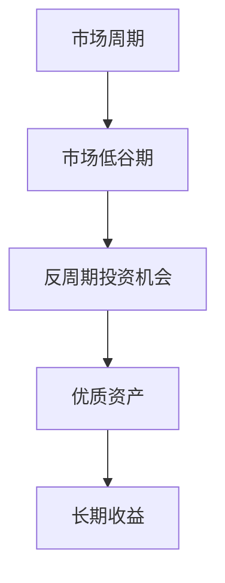
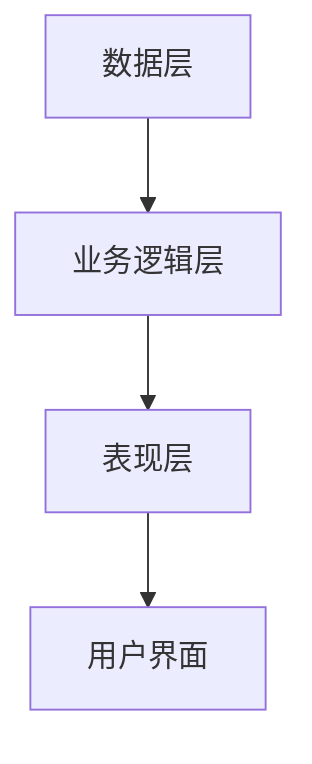

                 


# 彼得林奇的"反周期"投资在新兴金融工具中的应用

> 关键词：反周期投资，彼得林奇，新兴金融工具，ETF，期权，区块链金融

> 摘要：本文探讨了彼得林奇的反周期投资策略在新兴金融工具中的应用。通过分析反周期投资的基本概念、算法原理以及系统架构设计，结合实际案例，展示了如何在新兴金融工具中实施反周期投资策略。文章还提供了最佳实践和风险管理建议。

---

## 第一部分: 反周期投资与新兴金融工具概述

### 第1章: 反周期投资的基本概念

#### 1.1 反周期投资的定义与特点
反周期投资是一种在市场低谷期投资，期望在市场复苏时获得超额收益的投资策略。其核心在于识别市场周期的波动，并在市场低点布局，规避高点风险。

- **反周期投资的定义**：反周期投资是指在市场低迷、资产价格被低估时进行投资，以期在市场回升时获得更高收益的投资策略。
- **反周期投资的核心特点**：
  - **逆向思维**：在市场恐慌时买入，在市场狂热时卖出。
  - **长期视角**：关注长期价值，而非短期波动。
  - **风险管理**：注重资产配置和风险控制，避免过度集中在高波动资产。

#### 1.2 彼得林奇投资理念的概述
彼得林奇是著名的投资专家，其投资理念以价值投资和长期持有为核心，尤其强调在市场低谷时投资优质资产。

- **彼得林奇的投资风格**：
  - 价值投资：寻找被市场低估的优质资产。
  - 长期持有：避免频繁交易，降低交易成本。
  - 分散投资：通过投资多样化资产降低风险。

- **彼得林奇的反周期投资策略**：
  - 在市场恐慌时，寻找被低估的资产进行投资。
  - 关注公司的基本面，而非市场的短期波动。
  - 通过分散投资降低市场周期性风险。

### 第2章: 新兴金融工具的现状与潜力

#### 2.1 新兴金融工具的定义与分类
新兴金融工具是指近年来随着金融市场的发展和技术进步而出现的新型金融产品。

- **定义**：新兴金融工具是指利用新技术、新市场和新金融创新而产生的金融产品，如ETF、期权、区块链金融产品等。
- **分类**：
  - 交易所交易基金（ETF）：一种可以在交易所上市交易的开放式基金。
  - 期权：买方有权在特定时间以特定价格买入或卖出标的资产的协议。
  - 区块链金融产品：基于区块链技术的金融工具，如数字资产、智能合约等。

#### 2.2 新兴金融工具的市场现状
新兴金融工具在全球范围内迅速发展，市场规模不断扩大，市场参与者日益多元化。

- **市场规模**：ETF市场规模已超过数万亿美元，期权市场交易活跃，区块链金融产品也在快速发展。
- **市场参与者**：包括机构投资者、个人投资者、金融科技公司等。
- **市场趋势**：随着技术进步和金融创新，新兴金融工具将继续保持增长态势。

#### 2.3 新兴金融工具的投资机会
新兴金融工具为投资者提供了多样化选择，但也伴随着一定的风险。

- **投资潜力**：ETF提供分散投资和低成本优势，期权提供风险对冲和收益增强工具，区块链金融产品则具有高增长潜力。
- **风险与挑战**：新兴金融工具市场波动较大，存在较高的市场风险和操作风险。
- **未来发展趋势**：随着技术进步和市场发展，新兴金融工具将继续创新，提供更多投资机会。

---

## 第二部分: 反周期投资的核心概念与联系

### 第3章: 反周期投资的原理与策略

#### 3.1 反周期投资的核心原理
反周期投资的核心在于识别市场周期的波动，并在市场低点布局。

- **市场周期波动**：市场会经历繁荣、衰退、复苏、扩张等周期性变化。
- **低谷期投资机会**：在市场低谷期，优质资产价格被低估，为投资者提供了买入机会。
- **长期价值导向**：关注企业的基本面，选择具有长期增长潜力的资产。

#### 3.2 反周期投资与其他投资策略的对比
通过对比分析，明确反周期投资的独特优势。

- **对比表格**：
| 投资策略 | 策略特点 | 适用场景 | 风险特征 |
|----------|----------|----------|----------|
| 价值投资 | 侧重于寻找被低估的资产 | 市场低迷期 | 风险较低 |
| 技术投资 | 侧重于技术分析 | 市场波动期 | 风险较高 |
| 反周期投资 | 侧重于市场周期波动 | 市场低谷期 | 风险可控 |

- **实体关系图**：


---

## 第三部分: 反周期投资的算法原理

### 第4章: 反周期投资的数学模型

#### 4.1 均值回归模型
均值回归模型假设价格会回归其历史平均值。

- **数学公式**：
  $$ R_t = \alpha + \beta R_{t-1} + \epsilon_t $$
  其中，$\alpha$ 是截距，$\beta$ 是回归系数，$\epsilon_t$ 是误差项。

- **应用实例**：当市场价格偏离历史平均值时，投资者可以考虑买入或卖出。

#### 4.2 波动率分析模型
波动率分析用于预测市场波动，帮助投资者识别投资机会。

- **数学公式**：
  $$ \sigma = \sqrt{\frac{1}{n}\sum_{i=1}^{n}(R_i - \mu)^2} $$
  其中，$\sigma$ 是波动率，$R_i$ 是收益率，$\mu$ 是平均收益率。

- **应用实例**：在市场波动率低时，买入资产；在波动率高时，卖出资产。

#### 4.3 算法实现
使用Python代码实现反周期投资的数学模型。

```python
import numpy as np
import pandas as pd

# 假设数据为历史收益率
data = pd.Series([0.05, -0.02, 0.03, -0.01, 0.04], index=range(5))

# 计算平均收益率
mu = data.mean()

# 计算波动率
sigma = np.std(data)

print(f"平均收益率: {mu}")
print(f"波动率: {sigma}")
```

---

## 第四部分: 系统分析与架构设计

### 第5章: 系统功能设计

#### 5.1 系统功能模块
- **数据采集模块**：收集市场数据。
- **分析模块**：应用数学模型进行分析。
- **策略执行模块**：根据分析结果执行投资策略。

#### 5.2 系统架构设计
采用分层架构，包括数据层、业务逻辑层和表现层。



---

## 第五部分: 项目实战

### 第6章: 实战案例分析

#### 6.1 实战环境安装
- **工具安装**：安装Python、pandas、numpy等库。
  ```bash
  pip install pandas numpy
  ```

#### 6.2 核心代码实现
实现反周期投资策略的核心代码。

```python
import pandas as pd
import numpy as np

# 模拟市场数据
data = pd.DataFrame({
    'price': [100, 98, 95, 90, 85, 80, 75, 70, 65, 60]
})

# 计算价格变化率
data['return'] = data['price'].pct_change()

# 应用反周期投资策略
threshold = -0.1  # 设置阈值
data['signal'] = data['return'].apply(lambda x: '买入' if x < threshold else '不操作')

print(data)
```

#### 6.3 案例分析
通过实际案例分析，展示如何应用反周期投资策略。

- **案例分析**：假设市场出现大幅下跌，投资者在价格低点买入，待市场回升时卖出。

---

## 第六部分: 最佳实践与风险管理

### 第7章: 最佳实践

#### 7.1 风险管理
- **分散投资**：避免过度集中于单一资产或市场。
- **风险对冲**：利用期权等工具对冲市场风险。

#### 7.2 分散投资
通过投资多样化资产降低风险。

- **分散投资示例**：投资于不同行业、不同地区的资产。

#### 7.3 持续学习
金融市场变化快，投资者需要持续学习和适应。

---

## 第七部分: 总结

### 第8章: 总结与展望

#### 8.1 全文总结
- 彼得林奇的反周期投资策略在新兴金融工具中具有广泛的应用潜力。
- 投资者应结合市场周期和资产特点，灵活调整投资策略。

#### 8.2 未来展望
- 随着技术进步和市场发展，新兴金融工具将继续创新。
- 反周期投资策略将不断完善，为投资者提供更多机会。

---

## 参考文献

- 彼得林奇的著作
- 相关金融理论书籍
- 新兴金融工具的研究文献

---

**作者：AI天才研究院/AI Genius Institute & 禅与计算机程序设计艺术 /Zen And The Art of Computer Programming**

