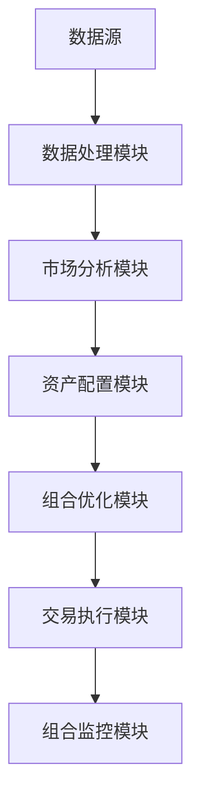

                 


# 彼得林奇的"反周期"投资策略探讨

## 关键词：反周期投资，彼得林奇，投资策略，资产配置，价值投资

## 摘要：  
本文将深入探讨彼得林奇的反周期投资策略，分析其核心概念、数学模型、系统架构，并通过具体案例展示其在实际投资中的应用。文章将从背景介绍、核心概念、算法原理、数学模型、系统架构、项目实战、最佳实践等方面展开，为读者提供全面的理论和实践指导。

---

## 第一部分: 反周期投资策略背景介绍

### 第1章: 反周期投资策略的核心概念

#### 1.1 什么是反周期投资
反周期投资是一种在经济不景气或市场低迷时期寻找被低估资产的投资策略。其核心在于利用市场的非理性下跌，捕捉那些具有长期增长潜力但当前价格被低估的投资标的。

- **反周期投资的定义**：反周期投资是指在经济周期的低谷期，投资那些基本面良好但市场价格被过度打压的资产，以期在市场复苏时获得超额收益。
- **核心要素**：低估值、高质量、逆周期行业。
- **与传统投资的区别**：传统投资注重长期趋势，而反周期投资注重短期市场波动，尤其在市场下跌阶段寻找机会。

#### 1.2 彼得林奇投资策略的背景
彼得·林奇是美国著名投资经理人，以其在富达基金的长期投资业绩而闻名。他的投资理念强调基本面分析和长期持有，尤其擅长在市场低迷时期寻找被低估的股票。

- **彼得林奇的生平简介**：彼得·林奇是富达基金的传奇经理人，以其卓越的投资业绩和对市场的深刻理解而著称。
- **彼得林奇的投资理念**：他主张投资那些具有强大基本面和竞争优势的公司，尤其是在市场低迷时期，这些公司往往被市场低估。
- **反周期投资与彼得林奇的关系**：彼得林奇的策略在市场低迷时尤为有效，他通过基本面分析筛选出那些被市场过度抛售的优质股票。

#### 1.3 反周期投资的市场环境
反周期投资的有效性依赖于对经济周期的准确判断。

- **经济周期的基本概念**：经济周期分为衰退、复苏、过热和滞胀四个阶段，每个阶段的市场表现和投资机会不同。
- **反周期投资的适用场景**：衰退和复苏阶段是反周期投资的最佳时机，尤其是在衰退阶段，市场恐慌导致优质资产价格被低估。
- **反周期投资的边界与外延**：虽然反周期投资在衰退阶段表现最佳，但在其他阶段也可以通过调整策略实现收益。

### 第2章: 反周期投资策略的核心要素

#### 2.1 投资标的的选择标准
选择反周期投资标的时，需要关注以下几个方面：

- **低估值股票的识别**：市盈率（P/E）、市净率（P/B）等估值指标可以帮助识别被低估的股票。
- **高质量公司的判断**：ROE（净资产收益率）、ROA（资产收益率）等指标可以衡量公司的盈利能力。
- **行业周期的分析**：选择在衰退阶段需求稳定的行业，如公用事业、医疗保健等。

#### 2.2 投资组合的构建策略
反周期投资组合的构建需要考虑资产配置和风险控制。

- **资产配置的基本原则**：根据市场周期调整股票、债券等资产的比例，确保在市场低迷时降低波动性。
- **风险控制的实现方法**：通过分散投资、止损设置等方式控制投资组合的风险。
- **组合优化的数学模型**：使用现代投资组合理论（MPT）优化资产配置，以实现收益与风险的最佳平衡。

#### 2.3 反周期投资的决策流程
反周期投资的决策流程包括市场分析、股票筛选和投资决策三个步骤。

- **市场分析的步骤**：分析经济指标、行业趋势和市场情绪，判断当前所处的经济周期阶段。
- **股票筛选的流程**：根据估值指标、财务指标和行业特性筛选出潜在的投资标的。
- **投资决策的机制**：结合市场环境、公司基本面和估值水平，决定是否买入或卖出标的资产。

### 第3章: 反周期投资策略的核心原理

#### 3.1 经济周期与资产价格的关系
经济周期对资产价格的影响是反周期投资的核心理论基础。

- **经济周期对股市的影响**：在衰退阶段，股市通常会大幅下跌，但在复苏阶段，股市会逐渐回升。
- **资产价格波动的规律**：资产价格的波动往往与经济周期密切相关，尤其是在衰退阶段，价格波动更为剧烈。
- **反周期投资的理论基础**：市场非理性下跌导致资产价格被低估，为反周期投资者提供了买入机会。

#### 3.2 价值投资与反周期投资的结合
彼得林奇的反周期投资策略结合了价值投资和周期性分析的优势。

- **价值投资的基本原理**：价值投资强调以合理价格投资于具有强大基本面的公司。
- **反周期投资的独特视角**：反周期投资关注市场周期，寻找在周期低谷时被低估的资产。
- **两者结合的优势**：将价值投资的选股方法与反周期投资的市场时机选择相结合，能够在市场低迷时买入优质资产，市场复苏时获得超额收益。

#### 3.3 投资组合的动态调整
反周期投资需要根据市场变化动态调整投资组合。

- **组合调整的时机选择**：在市场下跌阶段增加股票配置，在市场上涨阶段逐步减少股票头寸。
- **动态再平衡的策略**：定期检查投资组合的资产配置，确保其符合当前市场环境和投资目标。
- **风险控制的动态调整**：根据市场变化调整止损点和风险敞口，确保投资组合的稳定性。

---

## 第二部分: 反周期投资策略的数学模型与系统架构

### 第4章: 反周期投资策略的数学模型

#### 4.1 资产定价模型
资产定价模型是反周期投资的核心工具之一。

- **CAPM模型**：资本资产定价模型（CAPM）用于计算资产的预期收益，公式为：
  $$ E(r) = R_f + \beta (R_m - R_f) $$
  其中，\( R_f \) 是无风险利率，\( R_m \) 是市场预期收益，\( \beta \) 是资产的贝塔系数，反映资产收益的波动性。

- **APT模型**：套利定价理论（APT）是另一个常用的资产定价模型，其基本思想是通过多个因子解释资产收益的波动。

#### 4.2 投资组合优化
投资组合优化是反周期投资的重要组成部分。

- **现代投资组合理论（MPT）**：MPT通过优化资产配置，实现收益与风险的最优平衡。其目标函数为：
  $$ \min \sigma^2 \text{ s.t. } \mu \cdot w = T \text{ 和 } w \cdot \mathbf{1} = 1 $$
  其中，\( \sigma^2 \) 是组合的方差，\( \mu \) 是资产的预期收益向量，\( T \) 是目标收益，\( w \) 是资产权重向量。

- **风险平价策略**：风险平价策略将投资组合的风险在不同资产类别之间平均分配，以减少组合的整体波动性。

#### 4.3 动态资产配置模型
动态资产配置模型根据市场变化调整资产配置。

- **模型描述**：动态资产配置模型通过实时监控市场指标，调整股票、债券等资产的比例。
- **数学模型**：动态资产配置模型通常基于经济周期指标，如工业生产指数、失业率等，调整资产权重。

### 第5章: 反周期投资策略的系统架构

#### 5.1 系统架构设计
反周期投资系统的架构设计包括数据源、分析模块、策略模块和执行模块。

- **数据源**：包括市场数据（股票价格、指数、利率等）、经济指标（GDP、失业率等）和公司财务数据。
- **分析模块**：包括市场分析、股票筛选和风险评估。
- **策略模块**：包括资产配置、组合优化和动态调整。
- **执行模块**：包括订单生成、交易执行和组合监控。

#### 5.2 系统功能设计
系统的功能设计包括数据处理、模型计算和策略执行。

- **数据处理**：清洗、转换和存储数据，确保数据的准确性和可用性。
- **模型计算**：使用数学模型计算资产收益、风险和优化结果。
- **策略执行**：根据模型结果生成交易信号，执行买入或卖出操作。

#### 5.3 系统架构图
以下是反周期投资系统的架构图：



---

## 第三部分: 反周期投资策略的项目实战

### 第6章: 项目实战

#### 6.1 环境配置
项目实战需要配置以下环境：

- **编程语言**：Python
- **数据源**：Yahoo Finance API
- **工具库**：Pandas、NumPy、Matplotlib、Scipy、Plotly
- **框架**：使用QuantLib或Pyfolio进行回测和分析。

#### 6.2 核心实现代码
以下是反周期投资策略的核心实现代码：

```python
import pandas as pd
import numpy as np
import matplotlib.pyplot as plt
import yfinance as yf

# 下载数据
data = yf.download(['AAPL', 'MSFT', 'GOOGL'], start='2010-01-01', end='2023-12-31')

# 计算估值指标
data['PE'] = data['Close'] / data['Earnings'].ffill()
data['PB'] = data['Close'] / data['Book Value'].ffill()

# 筛选低估值股票
low_pe = data[data['PE'] < data['PE'].quantile(0.25)]
low_pb = data[data['PB'] < data['PB'].quantile(0.25)]
undervalued_stocks = low_pe.merge(low_pb, on='Date', how='inner')

# 可视化
undervalued_stocks.plot(kind='scatter', x='PE', y='PB', color='Price')
plt.title('Low Valuation Stocks')
plt.show()
```

#### 6.3 数据处理与分析
数据处理包括清洗、转换和分析。

- **数据清洗**：处理缺失值、异常值和重复值。
- **数据转换**：计算估值指标、财务指标和市场指标。
- **数据分析**：使用统计分析和数据可视化工具，识别被低估的股票。

#### 6.4 回测与分析
回测是验证策略有效性的关键步骤。

- **回测结果**：计算策略的收益、波动性和最大回撤。
- **结果分析**：比较反周期策略与其他策略的收益和风险表现。

#### 6.5 案例分析
通过具体案例分析反周期策略的应用。

- **案例选择**：选择一个衰退阶段的市场环境，分析策略的表现。
- **案例分析**：详细解读策略在该环境下的表现，总结经验教训。

---

## 第四部分: 反周期投资策略的最佳实践

### 第7章: 最佳实践

#### 7.1 小结
反周期投资策略的核心在于识别市场周期，选择被低估的资产，通过动态调整投资组合实现收益最大化。

#### 7.2 注意事项
- **市场判断的准确性**：经济周期的判断是反周期投资的关键，需要结合多种指标和分析方法。
- **风险管理**：反周期投资虽然收益较高，但风险也较大，需要通过分散投资和动态调整控制风险。
- **长期视角**：反周期投资需要长期持有，避免频繁交易导致的成本增加和收益损失。

#### 7.3 拓展阅读
- 推荐书籍：《彼得·林奇的投资哲学》、《反周期投资策略》
- 推荐文章：《经济周期与投资策略》、《价值投资与反周期投资的结合》
- 推荐工具：学习使用量化工具和平台，如QuantLib、Pyfolio等。

---

## 作者：AI天才研究院/AI Genius Institute & 禅与计算机程序设计艺术 /Zen And The Art of Computer Programming

---

以上是关于彼得林奇的反周期投资策略的详细探讨，涵盖了背景介绍、核心概念、数学模型、系统架构和项目实战等多个方面，旨在为读者提供全面的理论和实践指导。

