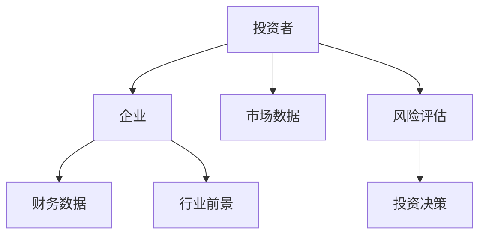
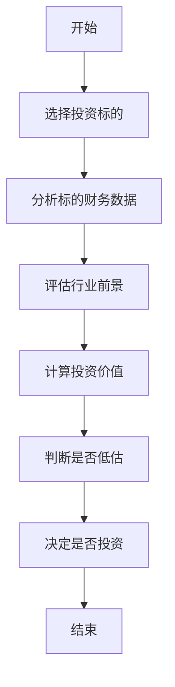
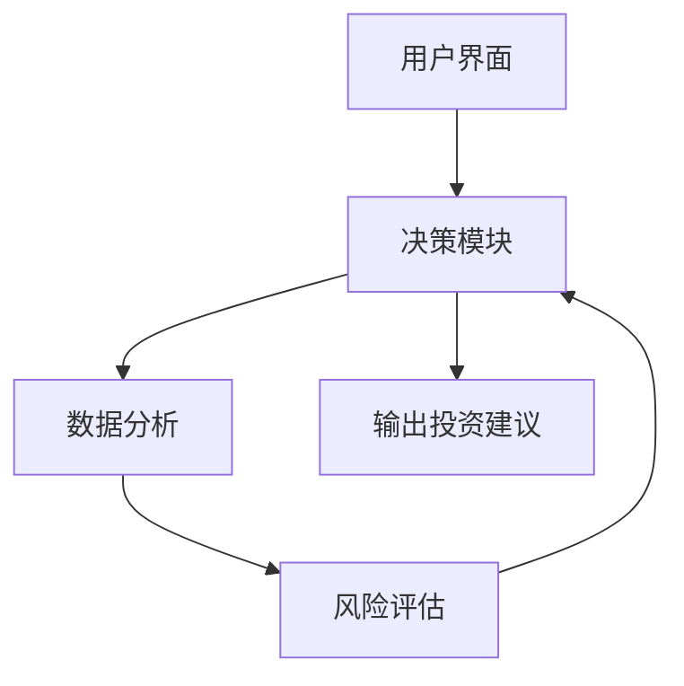

                 


# 彼得林奇的"墓地投资法"

## 关键词：投资策略，彼得林奇，墓地投资法，价值评估，风险管理，投资决策

## 摘要：彼得林奇的"墓地投资法"是一种基于深入研究和熟悉行业背景的投资策略，强调只投资于自己了解的企业，通过严格的价值评估和风险控制来实现长期稳定的收益。本文将从背景、原理、算法、系统架构、项目实战等多个维度详细解读这一投资方法，帮助读者理解其精髓并应用于实际投资中。

---

## 第一部分：背景介绍

### 第1章：彼得林奇的投资理念

#### 1.1 投资的定义与核心要素

- **投资的定义**：投资是将资金投入到能够产生收益的资产或项目中，以实现财富增值。
- **核心要素**：
  - 资产类型：股票、债券、基金等。
  - 风险与收益：高风险通常伴随高收益。
  - 时间因素：投资的长期性与复利效应。
  - 信息优势：基于信息的不对称性进行决策。

#### 1.2 彼得林奇的投资风格

- **价值投资**：寻找被市场低估的企业，长期持有，等待其价值回归。
- **逆向思维**：在市场恐慌时寻找机会，避免盲目跟风。
- **深入研究**：只投资于自己熟悉的企业，确保信息的可靠性。

#### 1.3 墓地投资法的起源与背景

- **起源**：彼得林奇在管理麦哲伦基金期间，总结出的一种投资策略。
- **背景**：强调投资者应只投资于自己了解的企业，避免盲目跟风。

---

## 第二部分：核心概念与联系

### 第2章：墓地投资法的核心概念

#### 2.1 墓地投资法的定义与特点

- **定义**：只投资于自己熟悉的企业，通过深入研究和分析，寻找具有长期增长潜力的优质企业。
- **特点**：
  - 高度依赖于对企业的深入了解。
  - 强调长期持有，避免短期波动。
  - 注重企业的基本面分析。

#### 2.2 墓地投资法的适用场景

- **适用场景**：
  - 投资者具备特定行业的专业知识。
  - 市场处于低迷或震荡期，优质企业被低估。
  - 长期投资策略，追求稳定收益。

#### 2.3 墓地投资法与其他投资方法的对比

- **对比表格**：

| 投资方法       | 核心要素                 | 适用场景                     | 风险管理方式               |
|----------------|--------------------------|------------------------------|---------------------------|
| 墓地投资法     | 熟悉的企业，基本面分析   | 低迷市场，长期持有           | 严格筛选，分散投资       |
| 股票市场中性策略| 市场中性，多空策略       | 市场波动大，短期操作         | 对冲风险，动态调整         |
| 高频交易策略   | 算法交易，高频数据       | 高流动性和低延迟市场         | 程序化风险管理，算法对冲   |

- **实体关系图**：



---

## 第三部分：算法原理

### 第3章：投资决策的流程图



### 第4章：投资价值评估模型

- **Python代码示例**：

```python
def calculate_intrinsic_value(company_data):
    """
    计算企业的内在价值
    Args:
        company_data (dict): 包含企业财务数据的字典
    Returns:
        float: 内在价值
    """
    # 计算市盈率
    pe_ratio = company_data['市盈率']
    # 计算市净率
    pb_ratio = company_data['市净率']
    # 计算ROE
    roe = company_data['ROE']
    
    # 简单评估模型：综合考虑市盈率、市净率和ROE
    intrinsic_value = (pe_ratio + pb_ratio + roe) / 3
    return intrinsic_value

# 示例数据
company_data = {
    '市盈率': 15,
    '市净率': 2,
    'ROE': 12
}

intrinsic_value = calculate_intrinsic_value(company_data)
print(f"内在价值: {intrinsic_value}")
```

- **数学公式**：

$$
\text{内在价值} = \frac{\text{市盈率} + \text{市净率} + \text{ROE}}{3}
$$

---

## 第四部分：系统分析与架构设计

### 第5章：投资决策支持系统的架构

#### 5.1 系统功能设计

- **功能模块**：
  - 数据采集：获取企业财务数据和市场数据。
  - 数据分析：计算市盈率、市净率等指标。
  - 风险评估：评估投资风险。
  - 投资决策：基于模型生成投资建议。

#### 5.2 系统架构图



---

## 第五部分：项目实战

### 第6章：环境安装与代码实现

#### 6.1 环境安装

- **工具安装**：
  - Python 3.8+
  - Jupyter Notebook
  - Pandas, NumPy等库

#### 6.2 核心代码实现

```python
import pandas as pd
import numpy as np

def calculate_intrinsic_value(company_data):
    pe_ratio = company_data['PE']
    pb_ratio = company_data['PB']
    roe = company_data['ROE']
    return (pe_ratio + pb_ratio + roe) / 3

# 示例数据
data = {
    'PE': [15, 20, 18],
    'PB': [2, 3, 2.5],
    'ROE': [12, 8, 10]
}

df = pd.DataFrame(data)
intrinsic_values = df.apply(lambda row: calculate_intrinsic_value(row.to_dict()), axis=1)
print(intrinsic_values)
```

---

## 第六部分：最佳实践与总结

### 第7章：最佳实践

#### 7.1 小结

- 墓地投资法是一种基于深入研究和熟悉行业背景的投资策略。
- 通过严格的价值评估和风险控制，实现长期稳定的收益。

#### 7.2 注意事项

- 投资者需具备足够的行业知识和分析能力。
- 定期复盘和调整投资组合，避免过度集中风险。

#### 7.3 拓展阅读

- 《彼得·林奇的股票投资策略》
- 《价值投资：从格雷厄姆到巴菲特》

---

## 作者：AI天才研究院 & 禅与计算机程序设计艺术

