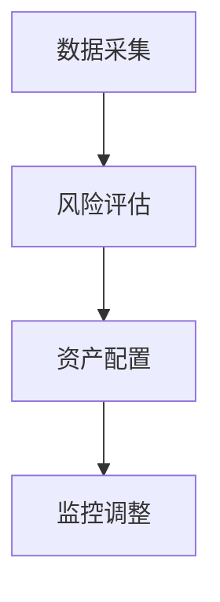
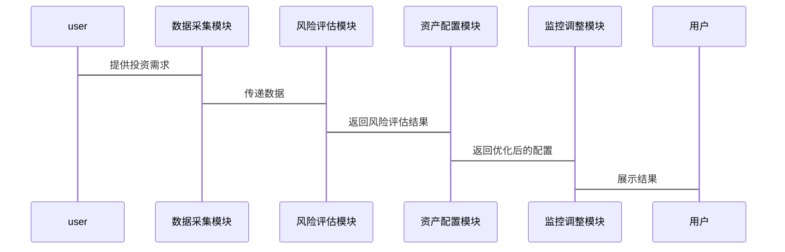

                 


# 彼得林奇的多元化投资组合

## 关键词
- 投资组合
- 多元化投资
- 资产配置
- 风险管理
- 彼得林奇投资策略

## 摘要
本文深入探讨了彼得林奇的多元化投资策略，分析其投资组合构建的核心理念，包括资产配置、风险管理、现代投资组合理论（MPT）等。文章结合技术方法，通过数学模型、算法流程图和系统架构设计，详细解析了投资组合管理的系统化方法，提供实战案例和最佳实践建议，帮助读者理解和应用多元化投资策略。

---

## 目录大纲

### 第1章：投资基础与彼得林奇的背景
- 1.1 投资的基本概念
- 1.2 彼得林奇的背景与成就

### 第2章：多元化投资组合的核心概念
- 2.1 投资组合的基本原理
- 2.2 资产配置与风险管理

### 第3章：资产配置的策略与方法
- 3.1 资产配置的基本策略
- 3.2 风险管理的核心要素

### 第4章：现代投资组合理论（MPT）解析
- 4.1 MPT的基本原理
- 4.2 均值-方差优化的数学模型

### 第5章：投资组合管理系统设计
- 5.1 系统架构与功能设计
- 5.2 系统交互设计

### 第6章：实战案例：构建投资组合
- 6.1 环境安装与数据准备
- 6.2 代码实现与结果分析
- 6.3 案例分析与经验总结

### 第7章：最佳实践与总结
- 7.1 最佳实践建议
- 7.2 总结与展望

---

## 正文

### 第1章：投资基础与彼得林奇的背景

#### 1.1 投资的基本概念
投资是指将资金投入某种资产或项目，以期获得未来收益的行为。投资的目标通常是实现财富增值，同时需要考虑风险与收益的平衡。投资可以分为股票、债券、房地产等多种类型，每种类型的风险和收益特征各不相同。

#### 1.2 彼得林奇的背景与成就
彼得·林奇（Peter Lynch）是美国著名的投资经理人，曾任富达麦哲伦基金的经理，创造了该基金年均29%的收益率。他主张长期投资、分散投资，并注重对公司的基本面分析。林奇的投资策略强调对市场的深刻理解以及对公司财务状况的细致分析，其多元化投资组合理念对现代投资策略影响深远。

---

### 第2章：多元化投资组合的核心概念

#### 2.1 投资组合的基本原理
投资组合是指将资金分配到不同的资产类别中，以分散风险并优化收益。通过将资金分散投资于多种资产，投资者可以降低单一资产带来的风险，同时提高整体收益。

#### 2.2 资产配置与风险管理
资产配置是投资组合的核心，涉及将资金分配到股票、债券、现金等不同资产。风险管理则是通过监控和调整投资组合，确保在市场波动中保持稳定的收益。

---

### 第3章：资产配置的策略与方法

#### 3.1 资产配置的基本策略
资产配置需要考虑投资者的风险承受能力、投资目标和市场环境。常见的策略包括基于风险承受能力的配置、基于投资目标的配置以及基于市场环境的动态调整。

#### 3.2 风险管理的核心要素
风险管理是投资组合管理的重要组成部分，涉及对风险的识别、评估和控制。通过分散投资、设定止损点等方法，可以有效降低投资组合的整体风险。

---

### 第4章：现代投资组合理论（MPT）解析

#### 4.1 MPT的基本原理
现代投资组合理论（MPT）由哈里·马科维茨提出，强调通过分散投资来降低风险。MPT认为，投资组合的最优配置是在有效前沿上，即在给定风险下收益最大，或在给定收益下风险最小。

#### 4.2 均值-方差优化的数学模型
MPT的核心是均值-方差优化，通过数学模型计算最优资产配置。公式如下：

$$
\text{最优权重 } w = \arg \min_w \left( w^T \Sigma w \right) \text{ subject to } w^T \mu = \text{目标收益}
$$

其中，$\Sigma$ 是协方差矩阵，$\mu$ 是收益向量。

---

### 第5章：投资组合管理系统设计

#### 5.1 系统架构与功能设计
投资组合管理系统包括数据采集、风险评估、资产配置和监控调整四个模块。系统架构采用分层设计，功能模块之间通过接口交互。



#### 5.2 系统交互设计
系统交互流程包括用户输入需求、数据处理、算法计算和结果展示。



---

### 第6章：实战案例：构建投资组合

#### 6.1 环境安装与数据准备
使用Python的pandas和numpy库进行数据处理，安装scipy库进行优化计算。

#### 6.2 代码实现与结果分析
以下是均值-方差优化的Python代码示例：

```python
import numpy as np
import pandas as pd
from scipy.optimize import minimize

# 示例数据
returns = pd.DataFrame({
    '股票': [0.1, 0.05, 0.02, 0.07, 0.01],
    '债券': [0.02, 0.03, 0.05, 0.01, 0.04]
})

# 定义优化函数
def portfolio_risk(weights, returns):
    return np.sqrt(np.dot(weights.T, np.dot(returns.cov(), weights)))

# 约束条件
cons = ({'type': 'eq', 'fun': lambda w: sum(w) - 1})

# 优化问题
result = minimize(portfolio_risk, [0.5, 0.5], args=(returns,), constraints=cons)

print(result.x)
```

#### 6.3 案例分析与经验总结
通过优化算法计算得出最优权重，分析不同资产配置下的风险和收益，总结实际操作中的经验教训。

---

### 第7章：最佳实践与总结

#### 7.1 最佳实践建议
- 定期调整投资组合以适应市场变化
- 选择优质资产和公司进行投资
- 理解并接受投资中的波动性

#### 7.2 总结与展望
彼得林奇的多元化投资策略强调长期视角和分散风险，结合现代投资组合理论和系统化管理方法，投资者可以构建稳健的投资组合。未来，随着技术进步，投资管理将更加智能化和数据驱动。

---

## 作者：AI天才研究院 & 禅与计算机程序设计艺术

---

这篇文章通过详细分析彼得林奇的投资策略，结合技术方法和实际案例，为读者提供了全面的投资组合管理指南。希望对您有所帮助！

