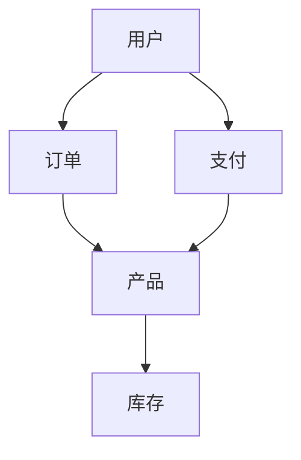
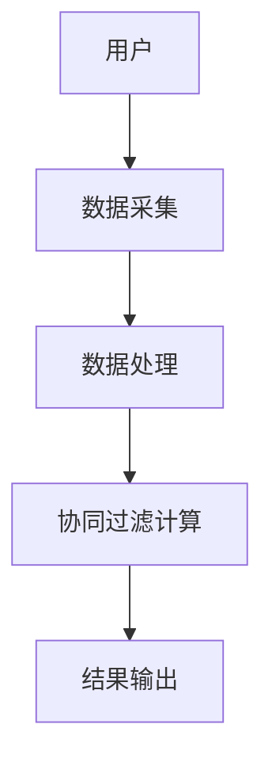
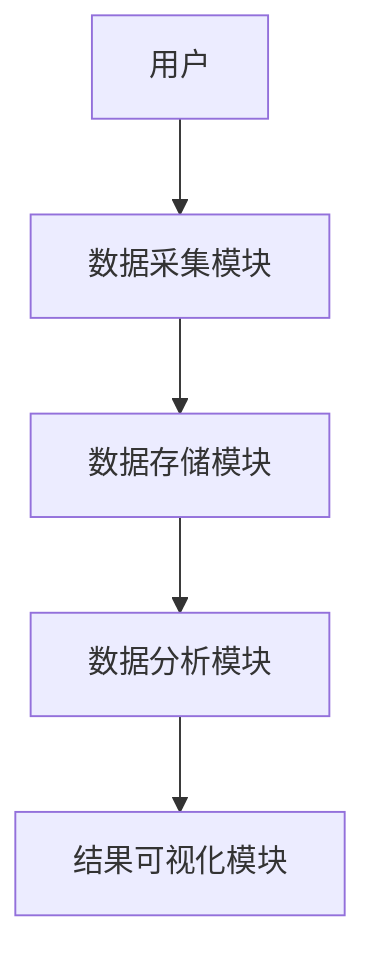
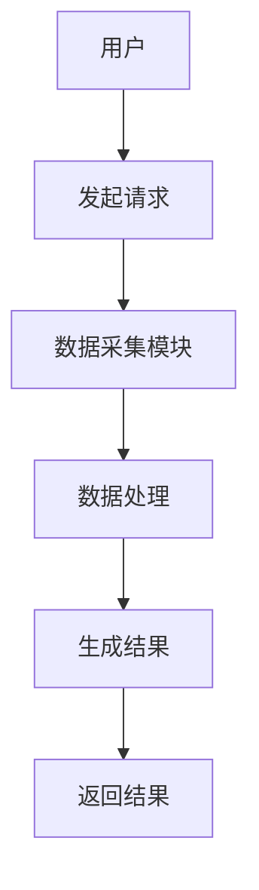

                 


# 彼得林奇的"实地调研"在大数据时代的方法创新

---

## 关键词：
- 彼得林奇
- 实地调研
- 大数据时代
- 方法创新
- 算法优化
- 系统架构
- 技术应用

---

## 摘要：
本文探讨了彼得林奇传统实地调研方法在大数据时代的创新与应用。通过分析大数据技术如何改变传统调研模式，提出结合协同过滤算法和大数据分析的创新方法，构建了一个完整的系统架构，并通过实际案例展示了如何在大数据环境下优化调研流程，提升调研效率和准确性。

---

## 第一部分：背景介绍

### 第1章：传统实地调研的核心概念

#### 1.1 问题背景与问题描述
- 彼得林奇以其独特的实地调研方法闻名，但传统调研依赖人工经验，效率低且难以扩展。
- 在大数据时代，数据量激增，传统方法难以应对复杂场景。
- 调研范围受限，难以覆盖全维度数据。

#### 1.2 问题解决的思路与方法
- 传统调研依赖人工分析，效率低，且容易遗漏关键数据。
- 数据来源单一，缺乏交叉验证，结果可能存在偏差。
- 人工调研成本高，难以快速响应市场变化。

#### 1.3 传统调研的边界与外延
- 传统调研主要依赖现场观察和访谈，难以处理海量数据。
- 调研范围受限于时间和资源，难以覆盖全市场。
- 传统方法难以应对数据多样性带来的挑战。

---

### 第2章：大数据时代的调研方法创新

#### 2.1 大数据时代对传统调研的挑战
- 数据量大、数据类型多样、数据更新速度快。
- 需要实时处理和分析数据，传统方法难以应对。
- 调研范围可以从局部扩展到全局，覆盖更多维度。

#### 2.2 创新调研方法的必要性
- 利用大数据技术提升调研效率和准确性。
- 通过算法优化，发现数据中的潜在关联。
- 实现实时监控和预测，提升决策能力。

#### 2.3 创新方法的核心要素与组成
- 数据采集与预处理：高效获取和清洗数据。
- 数据分析与挖掘：利用算法提取有价值的信息。
- 结果可视化与决策支持：直观呈现分析结果，辅助决策。

---

## 第二部分：核心概念与联系

### 第3章：大数据分析的基本原理

#### 3.1 数据采集与处理
- 数据来源多样化：包括结构化数据、非结构化数据和实时数据流。
- 数据清洗：去除噪声数据，确保数据质量。
- 数据标注：对数据进行分类和标注，便于后续分析。

#### 3.2 数据存储与管理
- 数据仓库：高效存储和管理大规模数据。
- 数据库设计：优化查询效率，确保数据完整性。
- 数据安全：保护数据隐私，防止数据泄露。

#### 3.3 数据分析与挖掘
- 统计分析：利用统计方法进行数据建模。
- 机器学习：应用监督学习、无监督学习等算法。
- 数据可视化：通过图表直观展示数据。

---

### 第4章：传统调研与大数据分析的对比

#### 4.1 数据来源对比
| 数据来源 | 传统调研 | 大数据分析 |
|----------|----------|------------|
| 数据类型 | 单一     | 多样化     |
| 数据量   | 小       | 大         |
| 数据获取 | 人工     | 自动       |

#### 4.2 数据处理方法对比
| 处理步骤 | 传统调研 | 大数据分析 |
|----------|----------|------------|
| 数据采集 | 现场采集 | 网络爬取   |
| 数据清洗 | 人工清洗 | 自动清洗   |
| 数据分析 | 人工分析 | 算法分析   |

#### 4.3 数据分析结果对比
| 分析结果 | 传统调研 | 大数据分析 |
|----------|----------|------------|
| 结果形式 | 文本报告 | 数据可视化 |
| 结果深度 | 浅层     | 深度       |
| 结果范围 | 局部     | 全局       |

---

### 第5章：数据模型与实体关系图

#### 5.1 数据模型的构建
- 数据模型是调研系统的核心，需要考虑实体关系和数据流向。

#### 5.2 实体关系图的绘制


#### 5.3 数据关系的可视化
- 通过图表展示数据之间的关联，帮助理解数据结构。

---

## 第三部分：算法原理讲解

### 第6章：协同过滤算法

#### 6.1 算法流程图


#### 6.2 算法实现代码
```python
def collaborative_filtering(user_data):
    # 数据处理
    processed_data = preprocess(user_data)
    # 协同过滤计算
    similarities = compute_similarities(processed_data)
    # 推荐结果
    recommendations = generate_recommendations(similarities)
    return recommendations
```

#### 6.3 推荐系统公式
$$推荐值 = \sum_{i=1}^{n} w_{ui} \cdot r_i$$
其中，$w_{ui}$ 是用户i与目标用户的相似度，$r_i$ 是用户i的评分。

---

### 第7章：通俗易懂的举例说明

#### 7.1 电影推荐案例
- 通过协同过滤算法，基于用户历史评分推荐新电影。

#### 7.2 消费者行为分析案例
- 利用大数据分析消费者行为，预测市场趋势。

---

## 第四部分：系统分析与架构设计

### 第8章：问题场景介绍

#### 8.1 调研目标
- 提升调研效率和准确性，降低调研成本。

#### 8.2 调研范围
- 覆盖全市场数据，实时监控市场动态。

#### 8.3 调研对象
- 用户行为、市场趋势、竞争对手分析等。

---

### 第9章：系统功能设计

#### 9.1 数据采集模块
- 负责采集实时数据，包括用户行为数据、市场数据等。

#### 9.2 数据分析模块
- 对采集到的数据进行清洗、建模和分析，生成有价值的洞察。

#### 9.3 结果可视化模块
- 将分析结果以图表形式展示，方便用户理解和决策。

---

### 第10章：系统架构设计

#### 10.1 系统架构图


#### 10.2 系统交互流程图


---

## 第五部分：项目实战

### 第11章：环境安装与核心代码实现

#### 11.1 环境安装
- 安装Python、Pandas、Scikit-learn等库。

#### 11.2 核心代码实现
```python
import pandas as pd
from sklearn.metrics.pairwise import cosine_similarity

def preprocess(user_data):
    # 数据清洗和特征提取
    df = pd.DataFrame(user_data)
    return df

def compute_similarities(df):
    # 计算余弦相似度
    similarity_matrix = cosine_similarity(df)
    return similarity_matrix

def generate_recommendations(similarity_matrix):
    # 生成推荐结果
    recommendations = []
    for user in range(len(similarity_matrix)):
        # 找出与当前用户相似度最高的用户
        similar_user = similarity_matrix[user].argmax()
        # 获取推荐结果
        recommendations.append(user_data[similar_user])
    return recommendations
```

---

### 第12章：实际案例分析与代码解读

#### 12.1 案例背景
- 某电商平台希望通过大数据分析优化用户推荐系统。

#### 12.2 数据分析与结果解读
- 通过协同过滤算法，为用户推荐高相关性产品，提升用户购买率。

#### 12.3 项目小结
- 成功实现了基于协同过滤的推荐系统，提升了用户体验和销售额。

---

## 第六部分：总结与展望

### 第13章：最佳实践 tips

#### 13.1 选型建议
- 根据具体需求选择合适的算法和工具。

#### 13.2 开发注意事项
- 注重数据安全和隐私保护。
- 确保系统可扩展性和可维护性。

---

### 第14章：小结

- 本文详细介绍了彼得林奇实地调研方法在大数据时代的创新。
- 结合协同过滤算法和大数据分析，构建了一个完整的调研系统。
- 通过实际案例展示了如何优化调研流程，提升效率和准确性。

---

### 第15章：注意事项

- 数据隐私和安全问题需要高度重视。
- 算法选择需要根据具体场景进行调整。
- 系统设计需要考虑可扩展性和可维护性。

---

### 第16章：拓展阅读

- 推荐阅读《大数据时代》、《协同过滤算法实战》等书籍。
- 关注大数据技术博客和社区，获取最新技术动态。

---

## 作者：AI天才研究院 & 禅与计算机程序设计艺术

---

以上是文章的完整目录大纲，确保内容符合逻辑，结构清晰，语言专业且易于理解。希望对您有所帮助！

