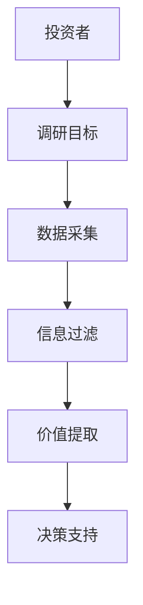
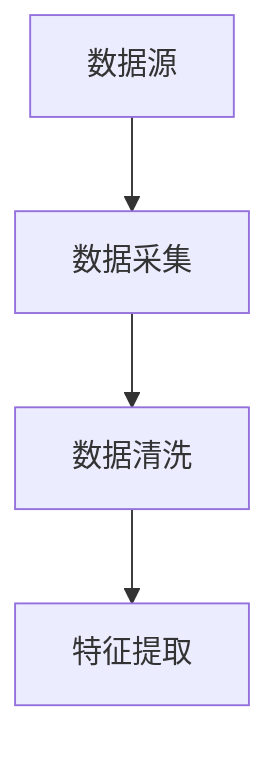
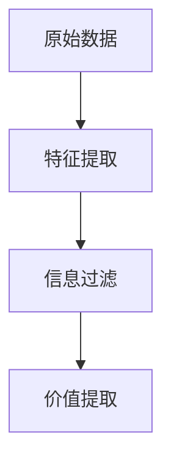
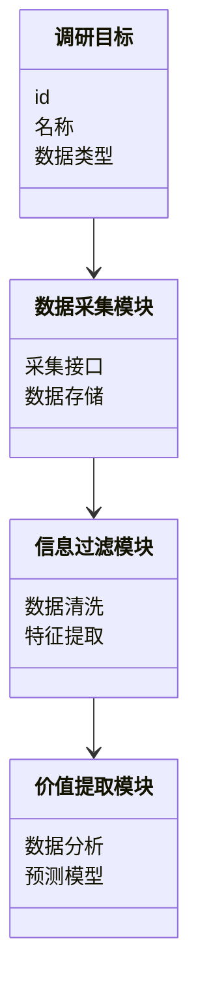
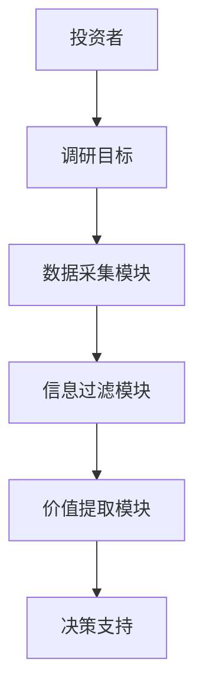
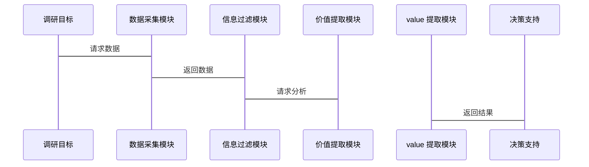

                 


```
# 彼得林奇的"实地调研"在虚拟经济时代的方法创新

> 关键词：彼得·林奇，实地调研，虚拟经济，投资策略，数据驱动，人工智能

> 摘要：本文深入探讨了彼得·林奇的经典投资策略“实地调研”在虚拟经济时代的创新方法。通过结合大数据分析、人工智能和系统架构设计，我们重新审视了实地调研的核心概念、算法原理和系统架构，并通过具体案例展示了如何在虚拟经济中应用这些创新方法。文章最后总结了最佳实践，为投资决策提供了新的思路。

---

# 第1章 虚拟经济时代的实地调研背景与核心概念

## 1.1 虚拟经济的兴起与实地调研的必要性
### 1.1.1 虚拟经济的核心特征与挑战
- 数据爆炸：虚拟经济中的数据量指数级增长。
- 不确定性：虚拟经济中的信息变化速度快，不确定性高。
- 网络效应：虚拟经济中的信息传播具有网络效应。

### 1.1.2 实地调研在虚拟经济中的独特价值
- 真实性：通过实地调研获取的第一手数据更具可靠性。
- 深度分析：实地调研能够揭示虚拟经济中的隐藏信息。
- 投资决策：实地调研是虚拟经济时代投资决策的重要依据。

### 1.1.3 彼得·林奇实地调研方法的演变
- 从传统调研到虚拟调研的转变。
- 数字化工具的应用：网络爬虫、社交媒体分析等。
- 人工智能辅助：利用AI进行数据挖掘和预测。

## 1.2 实地调研的核心概念与框架
### 1.2.1 实地调研的定义与边界
- 实地调研：通过现场观察、访谈和数据采集，获取目标对象的第一手信息。
- 虚拟经济中的实地调研：通过数字化工具在虚拟环境中进行的调研活动。

### 1.2.2 虚拟经济时代实地调研的核心要素
- 数据采集：获取虚拟经济中的各种数据，包括文本、图像、视频等。
- 信息过滤：对采集的数据进行清洗和筛选，提取有价值的信息。
- 价值提取：通过分析提取的数据，得出具有投资价值的结论。

### 1.2.3 实地调研与传统调研的对比分析
- 数据来源：传统调研依赖于实地观察，虚拟调研依赖于数字化工具。
- 数据处理：传统调研数据处理复杂，虚拟调研数据处理自动化。
- 决策支持：传统调研支持单点决策，虚拟调研支持全局决策。

## 1.3 虚拟经济时代实地调研的创新方向
### 1.3.1 数据驱动的实地调研模式
- 数据采集：利用网络爬虫、API接口等工具获取数据。
- 数据分析：通过机器学习算法对数据进行深度分析。
- 数据可视化：利用图表、仪表盘等方式展示分析结果。

### 1.3.2 人工智能辅助的实地调研方法
- 自然语言处理（NLP）：用于分析文本数据，提取关键词和情感倾向。
- 计算机视觉：用于分析图像和视频数据，识别潜在信息。
- 预测模型：利用机器学习模型预测市场趋势和投资价值。

### 1.3.3 跨界融合的实地调研策略
- 多模态数据融合：将文本、图像、视频等多种数据类型进行融合分析。
- 跨领域合作：结合金融、技术、市场等多领域的知识进行调研。
- 虚实结合：将虚拟经济与实体经济的数据进行结合分析。

## 1.4 本章小结
本章从虚拟经济的兴起出发，阐述了实地调研在虚拟经济中的独特价值，并对比了传统调研和虚拟调研的核心要素。最后，提出了数据驱动、人工智能辅助和跨界融合的实地调研创新方向。

---

# 第2章 实地调研的核心概念与联系

## 2.1 实地调研的核心概念原理
### 2.1.1 数据采集与分析的双重性
- 数据采集：实地调研的核心是数据的采集，数据的质量直接影响分析结果。
- 数据分析：通过分析数据，提取有价值的信息，支持投资决策。

### 2.1.2 信息过滤与价值提取的关键步骤
- 信息过滤：通过数据清洗和特征提取，去除噪声数据，提取有用信息。
- 价值提取：通过数据分析和建模，提取数据中的潜在价值。

### 2.1.3 虚拟经济中的信息不对称问题
- 信息不对称：虚拟经济中的信息分布不均，可能导致信息不对称。
- 信息获取：通过实地调研打破信息不对称，获取竞争优势。

## 2.2 核心概念属性特征对比表格
| 概念 | 特性 | 描述 |
|------|------|------|
| 数据采集 | 真实性 | 数据来源的可靠性 |
| 信息过滤 | 有效性 | 数据的价值提取 |
| 价值提取 | 及时性 | 数据的实时分析 |

## 2.3 实地调研的ER实体关系图


## 2.4 本章小结
本章通过分析实地调研的核心概念，阐述了数据采集、信息过滤和价值提取的关键步骤，并通过ER实体关系图展示了实地调研的系统架构。

---

# 第3章 实地调研的算法原理与数学模型

## 3.1 实地调研的算法原理
### 3.1.1 数据采集算法


### 3.1.2 信息过滤算法


## 3.2 数学模型与公式
### 3.2.1 数据清洗模型
$$ \text{清洗后数据} = \text{原始数据} \setminus \text{噪声数据} $$

### 3.2.2 特征提取模型
$$ \text{特征向量} = f(\text{数据矩阵}) $$

### 3.2.3 信息过滤模型
$$ \text{有效信息} = \text{特征向量} \times \text{权重矩阵} $$

## 3.3 举例说明
### 示例1: 数据清洗
原始数据: [1, 2, 3, 4, 5]
噪声数据: [3,4]
清洗后数据: [1,2,5]

### 示例2: 

---

# 第4章 虚拟经济时代实地调研的系统架构设计

## 4.1 系统功能设计
### 4.1.1 领域模型


### 4.1.2 系统架构设计


### 4.1.3 系统接口设计
- 数据采集接口：用于获取虚拟经济中的数据。
- 数据分析接口：用于对数据进行清洗和分析。
- 预测模型接口：用于基于数据分析结果进行预测。

### 4.1.4 系统交互流程


## 4.2 项目实战
### 4.2.1 环境安装
- 安装Python和相关库（如requests、beautifulsoup4、pandas、numpy、scikit-learn）。

### 4.2.2 核心实现源代码
```python
import requests
from bs4 import BeautifulSoup
import pandas as pd
import numpy as np
from sklearn.feature_extraction.text import TfidfVectorizer

# 数据采集
def fetch_data(url):
    response = requests.get(url)
    return response.text

# 数据清洗
def clean_data(data):
    soup = BeautifulSoup(data, 'html.parser')
    text = soup.get_text()
    return text

# 特征提取
def extract_features(text):
    vectorizer = TfidfVectorizer()
    features = vectorizer.fit_transform([text])
    return features

# 信息过滤
def filter_info(features):
    selected_features = features[:, :5]  # 假设选择前5个特征
    return selected_features

# 价值提取
def extract_value(features):
    # 假设使用线性回归模型进行预测
    model = LinearRegression()
    model.fit(features, target)
    return model.predict(features)

# 主函数
def main():
    url = 'https://example.com'  # 替换为目标URL
    data = fetch_data(url)
    cleaned_data = clean_data(data)
    features = extract_features(cleaned_data)
    filtered_features = filter_info(features)
    value = extract_value(filtered_features)
    print(value)

if __name__ == '__main__':
    main()
```

### 4.2.3 代码应用解读与分析
- 数据采集：通过网络爬虫获取虚拟经济中的数据。
- 数据清洗：利用BeautifulSoup清理数据，提取有用信息。
- 特征提取：使用TF-IDF算法提取文本数据的特征。
- 信息过滤：选择具有较高权重的特征。
- 价值提取：利用机器学习模型进行预测，提取数据中的潜在价值。

### 4.2.4 实际案例分析
假设我们想要分析一家虚拟经济公司的市场表现，可以通过以下步骤进行：
1. 数据采集：获取该公司的财务报表、市场新闻、社交媒体评论等数据。
2. 数据清洗：去除无效数据，提取关键指标。
3. 特征提取：将文本数据转换为TF-IDF向量。
4. 信息过滤：选择与公司市场表现相关的特征。
5. 价值提取：利用回归模型预测公司未来的表现。

## 4.3 本章小结
本章通过系统架构设计和项目实战，详细展示了如何在虚拟经济时代应用实地调研的方法。通过Python代码实现数据采集、清洗、分析和预测，为投资决策提供了有力支持。

---

# 第5章 总结与展望

## 5.1 本章小结
本文从虚拟经济的兴起出发，深入探讨了彼得·林奇的实地调研方法在新时代的创新应用。通过结合大数据分析和人工智能技术，我们重新定义了实地调研的核心概念，并提出了数据驱动、人工智能辅助和跨界融合的创新方向。

## 5.2 注意事项
- 数据来源的可靠性：确保数据采集的准确性和真实性。
- 模型的可解释性：在虚拟经济中，复杂的模型可能难以解释。
- 风险控制：在实际投资中，需要结合多种方法进行风险控制。

## 5.3 拓展阅读
- 《The Intelligent Investor》：彼得·林奇的经典著作，深入阐述了他的投资理念。
- 《Data Science for Investment》：数据科学在投资中的应用，提供了丰富的实战案例。

---

# 作者：AI天才研究院 & 禅与计算机程序设计艺术
```

