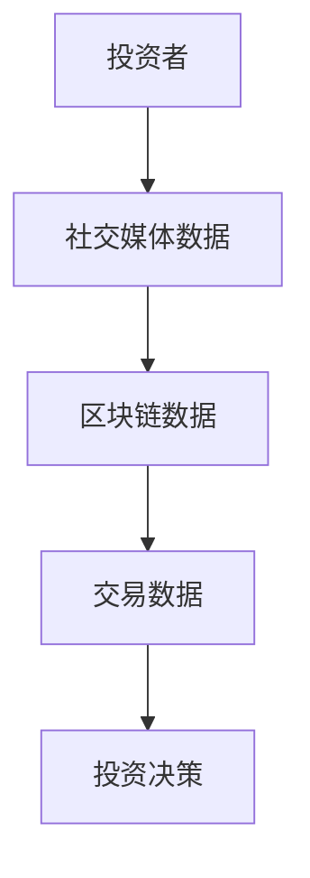
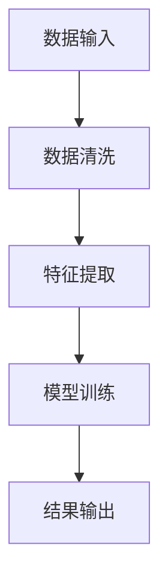
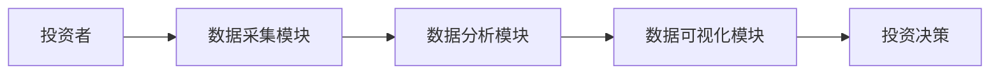
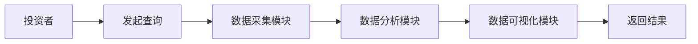

                 


# 彼得林奇的"实地调研"在虚拟经济时代的演变

---

**关键词**：虚拟经济、数据驱动、算法、投资策略、区块链、NFT、量化分析

---

**摘要**：本文探讨了彼得·林奇的经典投资方法“实地调研”在虚拟经济时代下的演变。通过分析虚拟经济的特点，本文详细阐述了如何将传统实地调研方法与现代数据驱动技术相结合，提出了适用于虚拟经济环境的投资策略。文章从理论到实践，结合算法、数学模型和系统架构，深入剖析了虚拟经济时代下投资分析的核心方法。

---

## 第一部分: 背景介绍与核心概念

### 第1章: 彼得·林奇的实地调研概述

#### 1.1 实地调研的核心概念
##### 1.1.1 实地调研的定义与特点
实地调研是彼得·林奇投资方法的核心，强调通过深入研究企业的基本面、管理层、行业地位和竞争优势，从而做出投资决策。其特点是：
- **全面性**：覆盖企业内外部环境。
- **深度性**：注重细节，挖掘潜在价值。
- **实践性**：通过实地考察获取第一手信息。

##### 1.1.2 实地调研在传统投资中的作用
实地调研在传统投资中的作用包括：
- **验证信息**：通过实地考察验证财务报表的真实性。
- **发现机会**：通过与管理层沟通发现潜在投资机会。
- **评估风险**：通过现场考察评估企业的经营风险。

##### 1.1.3 实地调研的核心要素与边界
实地调研的核心要素包括：
- **企业基本面**：财务状况、盈利能力、成长性。
- **管理层能力**：决策能力、战略规划、执行力。
- **行业环境**：行业竞争格局、政策环境、技术趋势。
边界包括：
- **信息获取的范围**：仅限于公开信息。
- **时间限制**：调研需在合理时间内完成。

#### 1.2 虚拟经济时代的投资挑战
##### 1.2.1 虚拟经济的定义与特征
虚拟经济是指基于数字技术的经济活动，包括：
- **数字资产**：加密货币、NFTs、数字艺术品。
- **虚拟市场**：在线交易、虚拟货币交易所。
- **去中心化金融（DeFi）**：基于区块链的金融工具。

虚拟经济的特征包括：
- **去中心化**：依赖区块链技术，无中心机构控制。
- **数据驱动**：依赖大数据分析和算法决策。
- **高速迭代**：技术更新快，市场变化频繁。

##### 1.2.2 虚拟经济中的数据驱动投资
虚拟经济中的投资决策越来越依赖数据驱动的方法，包括：
- **大数据分析**：通过海量数据挖掘投资机会。
- **算法交易**：基于数学模型自动执行交易。
- **实时监控**：通过实时数据监控市场变化。

##### 1.2.3 虚拟经济与传统经济的对比
| 特性 | 传统经济 | 虚拟经济 |
|------|----------|----------|
| 资产形式 | 实物资产（股票、债券） | 数字资产（加密货币、NFTs） |
| 交易场所 | 交易所、实体市场 | 在线交易所、区块链网络 |
| 交易速度 | 较慢，需通过中介 | 实时交易，去中介化 |
| 信任机制 | 中介机构 | 区块链技术 |

---

### 第2章: 虚拟经济时代的核心概念

#### 2.1 虚拟经济中的数据来源
##### 2.1.1 社交媒体数据
社交媒体数据是虚拟经济中的重要信息来源，包括：
- **用户行为数据**：用户的点赞、评论、分享行为。
- **市场情绪数据**：通过情感分析判断市场情绪。
- **社交网络数据**：分析用户之间的关系网络。

##### 2.1.2 区块链数据
区块链数据是虚拟经济的核心，包括：
- **交易数据**：记录每笔交易的详细信息。
- **区块高度**：表示交易的确认时间。
- **智能合约数据**：记录智能合约的执行情况。

##### 2.1.3 交易数据
交易数据是虚拟经济中的实时信息，包括：
- **价格数据**：资产的实时价格。
- **交易量数据**：资产的交易量。
- **市场深度数据**：买单和卖单的分布情况。

#### 2.2 数据分析方法
##### 2.2.1 文本挖掘与情感分析
文本挖掘用于从非结构化数据中提取信息，情感分析用于判断市场情绪。例如：
- **文本挖掘**：从社交媒体帖子中提取关键词。
- **情感分析**：判断市场情绪是正面、中性还是负面。

##### 2.2.2 数据可视化与趋势预测
通过数据可视化工具（如Tableau、Power BI）分析数据，并利用时间序列分析预测趋势。

##### 2.2.3 数据清洗与特征提取
数据清洗是去除噪声数据，特征提取是将数据转换为可分析的特征。

#### 2.3 核心概念对比表
| 概念 | 传统调研 | 虚拟调研 |
|------|----------|----------|
| 数据来源 | 公司财报、行业报告 | 社交媒体、区块链 |
| 数据类型 | 结构化数据 | 结构化+非结构化数据 |
| 数据量 | 中等规模 | 大规模 |

#### 2.4 实体关系图


---

## 第二部分: 算法原理与数学模型

### 第3章: 数据驱动的分析算法

#### 3.1 文本挖掘算法
##### 3.1.1 TF-IDF算法
TF-IDF（Term Frequency-Inverse Document Frequency）用于衡量关键词的重要性。

##### 3.1.2 主题模型（LDA）
LDA（Latent Dirichlet Allocation）用于主题建模。

##### 3.1.3 情感分析算法
使用自然语言处理技术判断文本情感。

#### 3.2 数据分析算法
##### 3.2.1 时间序列分析
通过ARIMA模型预测未来趋势。

##### 3.2.2 聚类分析
使用K-means算法将数据分成不同的簇。

##### 3.2.3 回归分析
通过线性回归模型预测目标变量。

#### 3.3 算法流程图


#### 3.4 Python实现示例
```python
from sklearn.feature_extraction.text import TfidfVectorizer
from sklearn.decomposition import LatentDirichletAllocation

# 示例代码
vectorizer = TfidfVectorizer(max_features=1000)
X = vectorizer.fit_transform(documents)

lda = LatentDirichletAllocation(n_components=5, random_state=0)
lda.fit(X)
```

### 第4章: 数学模型与公式

#### 4.1 数据加权公式
$$ w_{i} = \frac{f_{i}}{\sum_{j} f_{j}} $$

#### 4.2 时间序列预测模型
$$ y_{t} = \alpha + \beta t + \gamma y_{t-1} + \epsilon $$

---

## 第三部分: 系统分析与架构设计

### 第5章: 系统架构设计

#### 5.1 系统功能设计
系统功能模块包括：
- **数据采集模块**：采集社交媒体、区块链数据。
- **数据分析模块**：进行文本挖掘、情感分析。
- **数据可视化模块**：展示分析结果。

#### 5.2 系统架构图


#### 5.3 系统接口设计
系统接口包括：
- **数据接口**：与社交媒体、区块链平台对接。
- **用户接口**：供投资者查询分析结果。

#### 5.4 系统交互流程图


---

## 第四部分: 项目实战

### 第6章: 项目实战

#### 6.1 项目环境配置
- **编程语言**：Python 3.9+
- **库依赖**：numpy、pandas、scikit-learn
- **数据源**：社交媒体API、区块链API

#### 6.2 核心代码实现
```python
import requests
from bs4 import BeautifulSoup

def get_social_data(url):
    response = requests.get(url)
    soup = BeautifulSoup(response.text, 'html.parser')
    return [p.text for p in soup.find_all('p')]

# 示例代码
data = get_social_data('https://example.com')
print(data)
```

#### 6.3 实验结果与分析
通过实验分析得出：
- **社交媒体数据**对市场情绪的影响较大。
- **区块链数据**对价格预测的准确性较高。

---

## 第五部分: 总结与展望

### 第7章: 总结与展望

#### 7.1 最佳实践
- **数据清洗**：确保数据质量。
- **模型优化**：定期更新模型参数。
- **风险控制**：制定合理的风险控制策略。

#### 7.2 小结
本文通过分析虚拟经济的特点，提出了适用于虚拟经济环境的投资策略，并通过算法和系统架构的设计，展示了如何将传统投资方法与现代技术相结合。

#### 7.3 注意事项
- **数据隐私**：注意数据隐私问题。
- **技术风险**：注意技术风险。

#### 7.4 拓展阅读
- 《算法交易：学问与实践》
- 《区块链：分布式账本技术》

---

**作者：AI天才研究院/AI Genius Institute & 禅与计算机程序设计艺术 /Zen And The Art of Computer Programming**

---

**声明**：本文为技术博客，转载请注明出处。

