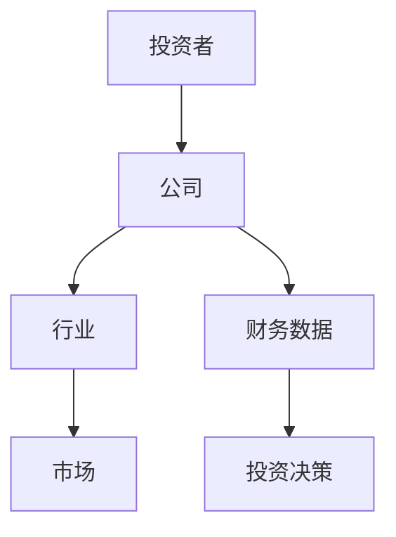
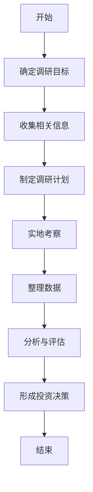
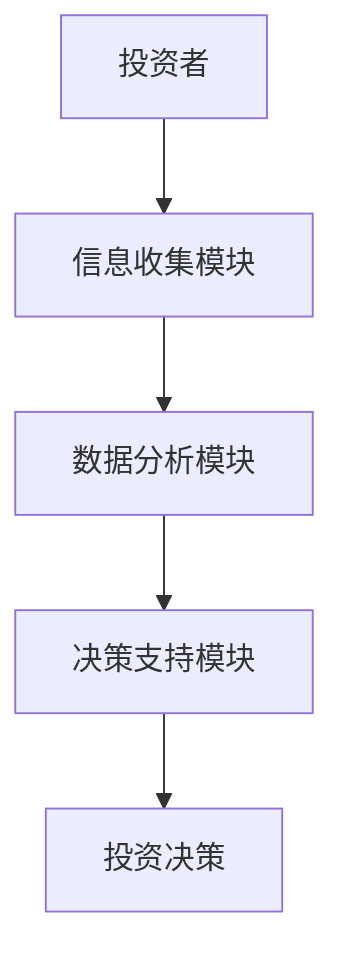

                 


# 彼得林奇的"实地调研"投资方法

## 关键词：
- 投资方法
- 实地调研
- 彼得林奇
- 财务分析
- 投资策略
- 投资决策

## 摘要：
彼得·林奇作为投资界的传奇人物，他的“实地调研”投资方法以其独特性和高效性著称。本文将从背景介绍、核心概念、算法原理、系统架构、项目实战和最佳实践等多个维度，详细分析和解读彼得林奇的实地调研方法。通过本文，读者将能够深入了解实地调研的定义、原理、实施步骤，以及如何将这些方法应用于实际投资决策中。

---

# 第一部分: 实地调研的定义与背景

## 第1章: 实地调研的定义与背景

### 1.1 投资中的实地调研概念

#### 1.1.1 投资中的问题背景
在投资领域，投资者常常面临信息不对称的问题。传统的投资方法，如基于技术分析或简单的财务指标分析，往往难以全面捕捉到企业的潜在价值或风险。许多投资者依赖于市场数据和历史表现，而忽略了对企业实际运营情况的深入了解。

#### 1.1.2 传统投资方法的局限性
传统的投资方法主要依赖于市场数据和技术指标，这些方法在某些情况下表现良好，但在面对市场波动和企业基本面变化时，往往显得力不从心。例如，技术分析无法直接反映企业的盈利能力或管理团队的实力，而简单的财务指标分析也无法全面揭示企业的潜在风险。

#### 1.1.3 实地调研的定义与特点
实地调研是一种通过亲自访问企业、与管理层交流、考察企业运营环境和生产流程，以获取一手信息的投资方法。其特点是信息的准确性和全面性，能够帮助投资者更全面地评估企业的价值和风险。

---

## 第2章: 彼得林奇投资方法的核心要素

### 2.1 投资者与分析师的角色差异
彼得林奇认为，投资者和分析师在投资过程中扮演着不同的角色。分析师主要负责收集和整理数据，而投资者则需要基于这些数据做出最终的决策。实地调研正是将两者结合的桥梁。

### 2.2 实地调研在投资决策中的作用
实地调研能够帮助投资者更准确地评估企业的财务状况、管理团队的能力、行业地位以及市场前景。通过实地调研，投资者可以发现许多报表中无法体现的信息，从而做出更明智的投资决策。

### 2.3 彼得林奇的成功案例分析
彼得林奇在职业生涯中通过实地调研成功投资了许多公司。例如，他在投资麦当劳时，通过实地调研发现该公司具有强大的品牌优势和市场扩展潜力，从而做出了长期持有的决策。

---

# 第二部分: 实地调研的核心概念与联系

## 第3章: 实地调研的核心概念

### 3.1 公司基本面分析
#### 3.1.1 公司的财务状况
实地调研的核心是全面了解企业的财务状况，包括收入、利润、资产负债表等关键指标。通过分析这些数据，投资者可以评估企业的盈利能力、偿债能力和发展潜力。

#### 3.1.2 管理团队的能力
管理团队是企业成功的关键因素之一。实地调研中，投资者通常会与公司高管进行面对面的交流，了解他们的战略规划、管理风格和团队稳定性。

#### 3.1.3 企业核心竞争力
企业的核心竞争力决定了其在市场中的地位。实地调研中，投资者需要关注企业的技术创新、成本优势、市场占有率等因素。

### 3.2 行业分析与竞争格局
#### 3.2.1 行业发展趋势
通过实地调研，投资者可以深入了解行业的整体发展趋势，包括市场规模、增长速度、竞争格局等。

#### 3.2.2 行业政策影响
政策变化对行业的影响至关重要。实地调研中，投资者需要关注相关行业的政策法规，评估其对企业的潜在影响。

#### 3.2.3 竞争对手分析
通过实地调研，投资者可以了解企业的竞争对手情况，包括竞争对手的产品、市场策略和竞争优势。

### 3.3 财务报表分析的关键指标
#### 3.3.1 收入与利润分析
通过分析企业的收入和利润情况，投资者可以评估企业的盈利能力。

#### 3.3.2 资产负债表分析
资产负债表反映了企业的资产、负债和所有者权益。实地调研中，投资者需要关注企业的资产负债结构，评估其财务健康状况。

#### 3.3.3 现金流量分析
现金流量是企业运营的重要指标。通过分析企业的现金流，投资者可以了解企业的资金流动情况，评估其财务灵活性。

---

## 第4章: 实地调研的核心概念对比分析

### 4.1 实地调研与其他投资方法的对比
#### 4.1.1 技术分析 vs. 实地调研
技术分析主要依赖于价格走势和成交量数据，而实地调研则关注企业的基本面信息。两者结合使用，可以提高投资决策的准确性。

#### 4.1.2 基本面分析 vs. 实地调研
基本面分析依赖于财务数据，而实地调研则更进一步，通过实地考察获取更全面的信息。

#### 4.1.3 量化分析 vs. 实地调研
量化分析依赖于数学模型和算法，而实地调研则更注重定性因素。两者结合可以提高投资决策的全面性。

### 4.2 不同行业的实地调研重点对比
#### 4.2.1 高科技行业
高科技行业的实地调研需要关注企业的技术创新能力、研发团队和专利情况。

#### 4.2.2 制造业
制造业的实地调研需要关注企业的生产规模、成本控制和产品质量。

#### 4.2.3 服务业
服务业的实地调研需要关注企业的客户满意度、服务质量和服务能力。

### 4.3 不同阶段公司的调研重点对比
#### 4.3.1 初创企业
初创企业的实地调研需要关注其商业模式、市场前景和团队能力。

#### 4.3.2 成熟企业
成熟企业的实地调研需要关注其盈利能力、市场份额和竞争优势。

#### 4.3.3 处于困境中的企业
处于困境中的企业的实地调研需要关注其财务状况、重组计划和管理团队的应对策略。

---

## 第5章: 实地调研的ER实体关系图

### 5.1 实地调研的ER实体关系图


---

# 第三部分: 实地调研的算法原理

## 第6章: 实地调研流程的mermaid流程图

### 6.1 实地调研流程的mermaid流程图


---

## 第7章: 实地调研的系统架构设计

### 7.1 系统功能设计
#### 7.1.1 信息收集模块
信息收集模块负责收集企业的财务数据、行业信息和市场动态。

#### 7.1.2 数据分析模块
数据分析模块对收集到的数据进行整理和分析，生成初步的投资评估报告。

#### 7.1.3 决策支持模块
决策支持模块基于分析结果，提供投资建议和决策支持。

### 7.2 系统架构设计


---

## 第8章: 实地调研的数学模型

### 8.1 财务指标分析模型
#### 8.1.1 市盈率模型
市盈率 = 股价 / 每股收益

#### 8.1.2 市净率模型
市净率 = 股价 / 每股净资产

### 8.2 投资决策模型
#### 8.2.1 风险评估模型
风险评估 = 财务状况 × 管理能力 × 市场前景

---

## 第9章: 项目实战

### 9.1 环境配置
#### 9.1.1 数据源
- 公司财务报表
- 行业报告
- 市场数据

#### 9.1.2 工具
- 数据分析工具（如Excel、Python）
- 信息收集工具（如网络爬虫）

### 9.2 核心实现源代码
#### 9.2.1 数据处理代码
```python
import pandas as pd
import numpy as np

# 加载财务数据
df = pd.read_csv('financial_data.csv')

# 计算市盈率
df['PE'] = df['股价'] / df['每股收益']

# 计算市净率
df['PB'] = df['股价'] / df['每股净资产']

print(df[['公司名称', 'PE', 'PB']])
```

#### 9.2.2 数据可视化代码
```python
import matplotlib.pyplot as plt

# 绘制行业分布图
plt.bar(df['行业'], df['PE'])
plt.title('行业PE分布图')
plt.show()
```

### 9.3 案例分析与解读
#### 9.3.1 案例选择
选择一家公司进行实地调研，例如某制造企业。

#### 9.3.2 数据分析
通过代码计算该公司的市盈率和市净率，与其他公司进行对比。

#### 9.3.3 投资决策
基于分析结果，形成投资建议。

---

## 第10章: 最佳实践

### 10.1 小结
通过实地调研，投资者可以更全面地了解企业的基本面情况，做出更明智的投资决策。

### 10.2 注意事项
- 实地调研需要耗费大量时间和精力。
- 需要结合其他投资方法，如技术分析和量化分析。

### 10.3 拓展阅读
建议阅读彼得·林奇的相关著作，进一步了解他的投资理念和方法。

---

# 作者：AI天才研究院/AI Genius Institute & 禅与计算机程序设计艺术 /Zen And The Art of Computer Programming

---

通过本文的详细分析和解读，读者可以深入了解彼得·林奇的实地调研投资方法，并将其应用于实际投资决策中。这种方法不仅能够帮助投资者做出更明智的投资决策，还能够提高投资的准确性和效率。

