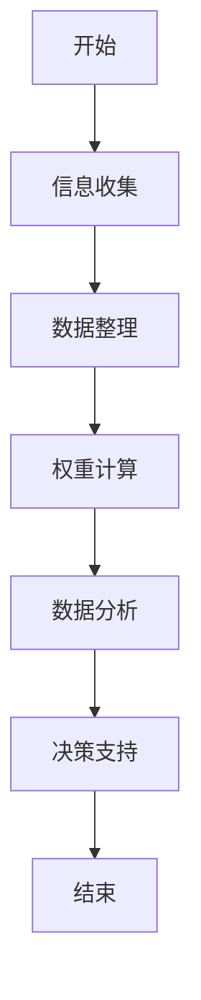
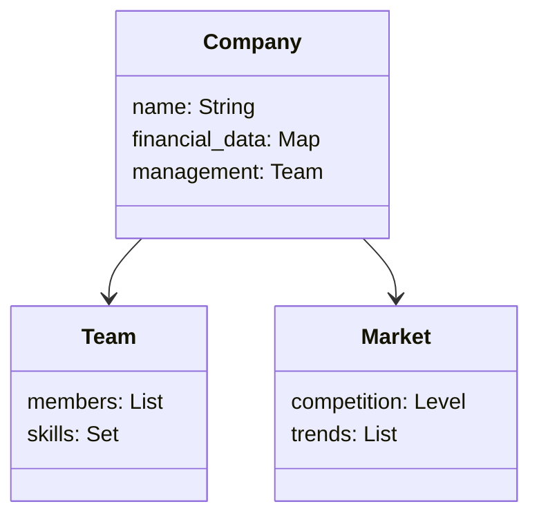
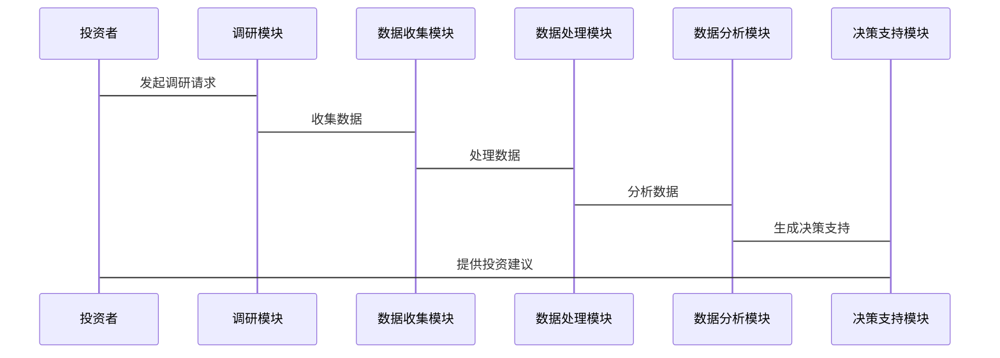

                 


# 彼得林奇的"实地调研"投资方法论

> 关键词：彼得林奇、实地调研、投资方法、价值投资、数据分析、投资策略、投资哲学

> 摘要：彼得林奇的实地调研方法是一种通过深入研究公司和行业来做出投资决策的系统性方法。本文将详细探讨这种方法的核心理念、实施步骤、数学模型、系统架构以及实际案例，帮助读者理解其在投资中的应用价值。

---

## 目录大纲

### 第一部分: 实地调研投资方法的背景与意义

#### 第1章: 实地调研投资方法的背景与意义

##### 1.1 投资方法的演进历程

###### 1.1.1 传统投资方法的局限性

传统投资方法主要依赖于市场趋势和短期波动，忽视了公司基本面的深入研究。这种方法在市场波动剧烈时往往表现不佳，投资者容易受到情绪影响，导致决策失误。

###### 1.1.2 现代投资方法的多样化

现代投资方法强调多元化策略，包括技术分析、基本面分析和行为分析。然而，这些方法往往缺乏对具体公司和行业的深入理解，难以在复杂市场中做出明智决策。

###### 1.1.3 实地调研方法的兴起

实地调研方法以其独特的优势，如信息的准确性、决策的科学性，逐渐成为投资者的重要工具。这种方法通过深入研究公司内部运营、行业竞争格局等，为投资者提供了更可靠的投资依据。

##### 1.2 彼得林奇投资方法的核心理念

###### 1.2.1 价值投资的基本原则

彼得林奇认为，投资的本质是寻找那些被市场低估的优秀公司。他强调长期投资，避免短期波动的干扰，专注于公司内在价值的挖掘。

###### 1.2.2 实地调研在投资中的独特地位

实地调研是彼得林奇方法的核心，通过亲自拜访公司、与管理层交流、考察生产现场等方式，获取第一手信息，帮助投资者更准确地评估公司价值。

###### 1.2.3 投资者心态与决策逻辑

彼得林奇强调投资者的心态管理，避免贪婪和恐惧的干扰。他通过系统化的调研过程，帮助投资者建立理性决策的框架。

##### 1.3 实地调研方法的优势与挑战

###### 1.3.1 信息获取的准确性

实地调研能够直接获取公司的真实运营情况，避免了依赖公开数据可能带来的偏差。

###### 1.3.2 调研成本与时间投入

实地调研需要投入大量时间和资金，对个人投资者来说可能成本较高。此外，如何在有限时间内获取最有价值的信息也是一个挑战。

###### 1.3.3 如何克服调研中的常见误区

彼得林奇提醒投资者，要避免对公司管理层的过度信任，同时要警惕行业周期性带来的风险。他建议投资者在调研中保持独立思考，结合多方面信息进行综合判断。

---

### 第二部分: 实地调研的核心概念与方法论

#### 第2章: 实地调研的核心概念与方法论

##### 2.1 实地调研的基本原理

###### 2.1.1 调研的定义与分类

实地调研是指通过亲自访问公司、观察其运营环境、与管理层和员工交流等方式，获取公司基本面信息的一种研究方法。它可以分为初步调研和深入调研两种类型。

###### 2.1.2 调研的核心要素分析

调研的核心要素包括公司财务状况、行业竞争格局、管理团队能力、市场前景等。这些要素的综合分析能够帮助投资者更全面地评估公司的投资价值。

###### 2.1.3 调研与投资决策的关系

实地调研为投资决策提供了坚实的基础。通过调研，投资者可以更准确地评估公司的内在价值，制定合理的投资策略。

##### 2.2 实地调研的关键步骤

###### 2.2.1 初步研究与目标筛选

投资者在进行实地调研之前，需要对市场进行初步研究，筛选出具有潜在投资价值的公司作为调研目标。

###### 2.2.2 现场调研的具体实施

现场调研包括对公司总部、生产车间、销售网点等进行实地考察，与公司高管、员工以及行业专家进行深入交流。

###### 2.2.3 数据分析与决策支持

通过对调研获取的数据进行整理和分析，投资者可以评估公司的财务健康状况、管理团队能力、市场竞争力等，为投资决策提供支持。

##### 2.3 实地调研的系统性框架

###### 2.3.1 调研前的准备工作

调研前需要制定详细的调研计划，包括调研目标、时间安排、人员分工等。同时，要准备好相关的调研工具和资料。

###### 2.3.2 调研过程中的注意事项

在调研过程中，投资者需要保持客观、中立的态度，避免被公司宣传误导。同时，要注意保护调研信息的 confidentiality.

###### 2.3.3 调研后的总结与反馈

调研结束后，投资者需要对调研结果进行总结，形成调研报告，并根据调研结果调整投资策略。

---

### 第三部分: 实地调研方法的数学模型与算法原理

#### 第3章: 实地调研方法的数学模型与算法原理

##### 3.1 调研信息的权重计算

###### 3.1.1 信息权重的定义

信息权重是指不同信息在投资决策中的重要程度。通过给不同信息赋予不同的权重，投资者可以更合理地进行决策。

###### 3.1.2 信息权重的计算公式

$$
权重 = \frac{信息的重要性}{总信息数}
$$

###### 3.1.3 信息权重的可视化分析

通过信息权重的可视化分析，投资者可以更直观地了解哪些信息对投资决策影响更大。

##### 3.2 数据分析与决策模型

###### 3.2.1 数据分析的基本流程

数据分析的基本流程包括数据清洗、数据整理、数据分析和数据可视化等步骤。

###### 3.2.2 决策模型的构建

$$
决策 = f(数据, 权重, 模型参数)
$$

###### 3.2.3 模型的验证与优化

通过不断验证和优化决策模型，投资者可以提高模型的准确性和可靠性。

##### 3.3 算法实现与流程图

###### 3.3.1 算法流程图



###### 3.3.2 伪代码实现

```python
def research_process():
    collect_data()
    data_cleaning()
    calculate_weights()
    analyze_data()
    generate_recommendations()
    return investment_decision
```

---

### 第四部分: 实地调研系统的架构设计

#### 第4章: 实地调研系统的架构设计

##### 4.1 问题场景介绍

实地调研系统需要解决数据收集、数据处理、数据分析和决策支持等问题。

##### 4.2 项目介绍

本项目旨在构建一个支持实地调研的投资分析系统，帮助投资者更高效地进行投资决策。

##### 4.3 系统功能设计

###### 4.3.1 领域模型设计



###### 4.3.2 系统架构设计


##### 4.4 系统接口设计

###### 4.4.1 系统接口设计

系统接口包括数据输入接口、数据处理接口和决策输出接口。

##### 4.5 系统交互设计

###### 4.5.1 系统交互流程图



---

### 第五部分: 项目实战

#### 第5章: 项目实战

##### 5.1 环境与工具安装

###### 5.1.1 环境配置

需要安装Python、Pandas、Matplotlib等工具。

##### 5.2 核心代码实现

###### 5.2.1 数据清洗与分析

```python
import pandas as pd

def data_cleaning(data):
    # 删除缺失值
    data = data.dropna()
    # 处理异常值
    data = data[~data.isin(['None', 'NaN', 'N/A'])]
    return data

# 示例数据
data = pd.DataFrame({
    '公司名称': ['公司A', '公司B', '公司C'],
    '收入': [100, 200, 150],
    '利润': [20, 30, 25]
})

clean_data = data_cleaning(data)
print(clean_data)
```

###### 5.2.2 数据可视化

```python
import matplotlib.pyplot as plt

clean_data.plot(kind='bar', x='公司名称', y='收入')
plt.title('公司收入对比')
plt.show()
```

##### 5.3 案例分析

###### 5.3.1 某公司调研案例

通过对某公司的实地调研，我们发现其财务状况良好，管理层能力优秀，具有较大的投资价值。

##### 5.4 实战小结

本次实战项目展示了如何利用实地调研方法进行投资决策，帮助投资者更好地理解公司基本面。

---

### 第六部分: 最佳实践与总结

#### 第6章: 最佳实践与总结

##### 6.1 小结

实地调研方法是一种系统性、实践性强的投资方法，能够帮助投资者更准确地评估公司价值。

##### 6.2 注意事项

投资者在进行实地调研时，要注意信息的全面性和客观性，避免被表面现象误导。

##### 6.3 拓展阅读

推荐阅读《彼得林奇的选股方法》等书籍，深入理解实地调研方法的应用。

---

### 作者：AI天才研究院/AI Genius Institute & 禅与计算机程序设计艺术/Zen And The Art of Computer Programming

---

通过以上目录大纲，我们可以清晰地看到彼得林奇的实地调研方法在投资中的应用价值。从背景介绍到系统架构，从算法实现到项目实战，本文为投资者提供了一个全面的视角，帮助他们在复杂多变的市场中做出明智的投资决策。

