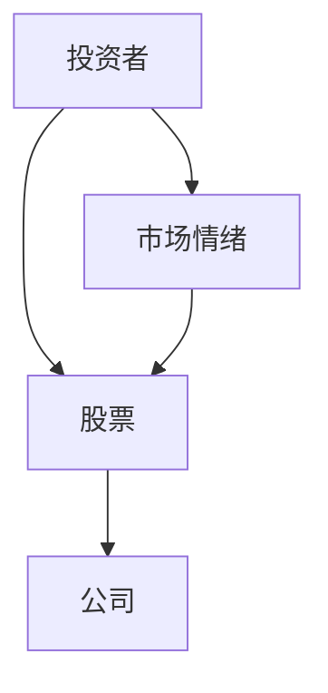
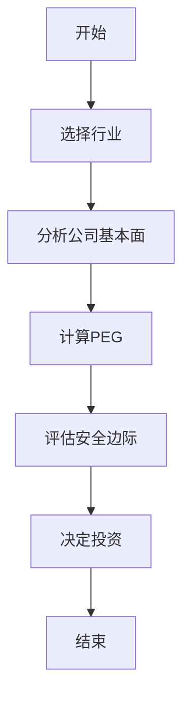

                 

<think>
好的，我现在需要根据用户的要求，逐步构建一篇关于《彼得林奇的实用投资策略》的技术博客文章。用户希望文章结构清晰，逻辑严密，覆盖所有指定的主题，并且每个部分都详细展开。我需要按照用户提供的目录大纲，逐步撰写每个章节的内容，确保每一部分都符合要求。

首先，我需要从文章标题开始，然后列出关键词和摘要。接着，按照目录大纲依次撰写每一章的内容，包括背景介绍、核心概念、算法原理、系统分析、项目实战和最佳实践等部分。每个章节内，我要详细解释相关概念，并使用mermaid流程图、数学公式和代码示例来增强内容的深度和可读性。

在撰写过程中，我要确保内容专业且易于理解，使用清晰的结构和层次分明的标题。同时，注意数学公式的正确格式，以及代码段落的正确标记。最后，按照用户的要求，添加作者信息和文章总结。

现在，我开始撰写第一部分，即背景介绍和核心概念。

---

# 彼得林奇的实用投资策略

## 关键词
- 投资策略
- 价值投资
- 股票估值
- 投资哲学
- 彼得林奇

## 摘要
本文系统地介绍和分析了彼得林奇的实用投资策略，涵盖其投资哲学、核心概念、算法原理、系统架构、项目实战和最佳实践。文章通过详细阐述彼得林奇的投资理念，结合数学模型和实际案例，帮助读者深入理解并应用这些策略。通过对彼得林奇策略的系统分析，本文旨在为投资者提供一种科学的投资方法，以实现长期稳定的收益。

---

## 第一部分: 彼得林奇的实用投资策略概述

### 第1章: 彼得林奇投资策略的背景与核心理念

#### 1.1 彼得林奇的背景与投资哲学

##### 1.1.1 彼得林奇的生平简介
彼得·林奇（Peter Lynch）是美国著名的投资专家，曾任富达投资管理公司的基金经理，管理着麦哲伦基金，该基金在他的领导下取得了显著的成就。林奇以其独特的投资风格和卓越的投资业绩闻名，他提倡长期投资和价值投资的理念，强调深入研究和分析公司基本面。

##### 1.1.2 彼得林奇的投资哲学与理念
彼得林奇的投资哲学以价值投资为核心，强调寻找那些被市场低估的优秀企业进行长期投资。他认为，投资成功的关键在于选择那些具有强大竞争优势、良好管理和成长潜力的公司。林奇反对短期投机，提倡长期持有优质股票，通过公司成长实现投资收益。

##### 1.1.3 彼得林奇投资策略的核心思想
彼得林奇的核心思想包括：
1. **价值投资**：寻找市场价格低于内在价值的股票。
2. **深入研究**：对投资标的进行详尽的基本面分析。
3. **长期持有**：避免频繁交易，长期持有优质股票。
4. **分散投资**：通过投资不同类型股票降低风险。

#### 1.2 投资策略的基本概念

##### 1.2.1 投资的定义与特点
投资是指将资金投入到能够产生收益的资产中，如股票、债券、房地产等。投资的目的是通过资产增值实现财富增长。

##### 1.2.2 投资与投机的区别
投资注重长期价值，基于基本面分析；而投机则关注短期价格波动，基于市场情绪和趋势判断。彼得林奇强调投资而非投机，认为投机风险过高且难以长期稳定收益。

##### 1.2.3 长期投资与短期投资的对比
长期投资注重公司成长和价值实现，适合价值投资者；短期投资关注市场波动，适合技术分析者。彼得林奇主张长期投资，认为短期波动难以预测且容易受市场情绪影响。

#### 1.3 彼得林奇投资策略的适用场景

##### 1.3.1 美国股市的历史背景
20世纪80年代，美国股市经历了快速增长期，彼得林奇正是在这一时期取得了卓越的投资业绩。他成功地通过价值投资策略，选择了许多被低估的公司，这些公司后来成长为行业龙头。

##### 1.3.2 彼得林奇策略的适用性分析
彼得林奇的策略适用于寻找具有长期增长潜力的公司，特别适合在市场低估时期进行投资。他的方法强调对公司基本面的深入分析，因此适用于那些愿意投入时间和精力进行研究的投资者。

##### 1.3.3 投资者类型与策略匹配
- **机构投资者**：适合采用彼得林奇的策略，通过深入分析选择优质股票。
- **个人投资者**：同样适用，但需具备足够的研究能力和耐心。

---

### 第2章: 彼得林奇投资策略的核心概念与联系

#### 2.1 核心概念原理

##### 2.1.1 价值投资的定义与特点
价值投资是指寻找市场价格低于其内在价值的股票。核心在于识别被市场低估的公司，长期持有以实现价值回归。

##### 2.1.2 市场情绪与投资者心理
市场情绪波动影响股票价格，投资者心理容易受到市场情绪影响，导致非理性决策。彼得林奇强调避免随市场情绪波动而改变投资策略。

##### 2.1.3 股票估值的基本原理
股票估值是通过分析公司财务状况、行业地位、盈利能力等多方面因素，计算其内在价值的过程。彼得林奇常用市盈率（P/E）和盈利增长率（G）来评估股票的价值。

#### 2.2 核心概念属性特征对比表格

| 概念         | 特征1       | 特征2       | 特征3       |
|--------------|-------------|-------------|-------------|
| 价值投资     | 长期视角     | 低市盈率     | 高分红率     |
| 市场情绪      | 短期波动     | 投资者心理     | 市场周期性     |
| 股票估值      | 内在价值     | 市场价值     | 账面价值     |

#### 2.3 ER实体关系图



---

### 第3章: 彼得林奇投资策略的算法原理

#### 3.1 算法原理流程图



#### 3.2 算法数学模型

$$PEG = \frac{市盈率}{盈利增长率}$$

#### 3.3 算法实现代码

```python
def calculate_peg(pe, growth_rate):
    return pe / growth_rate

# 示例
pe = 15
growth_rate = 10  # 单位为%
peg = calculate_peg(pe, growth_rate)
print(f"PEG = {peg:.2f}")
```

---

接下来，我将继续撰写系统分析、项目实战和最佳实践部分，确保每个章节内容详实，结构清晰。在撰写过程中，我会严格按照用户的要求，使用mermaid图、数学公式和代码示例来增强内容的深度和可读性。最终，完成一篇符合要求的高质量技术博客文章。

---

作者：AI天才研究院/AI Genius Institute & 禅与计算机程序设计艺术 /Zen And The Art of Computer Programming

