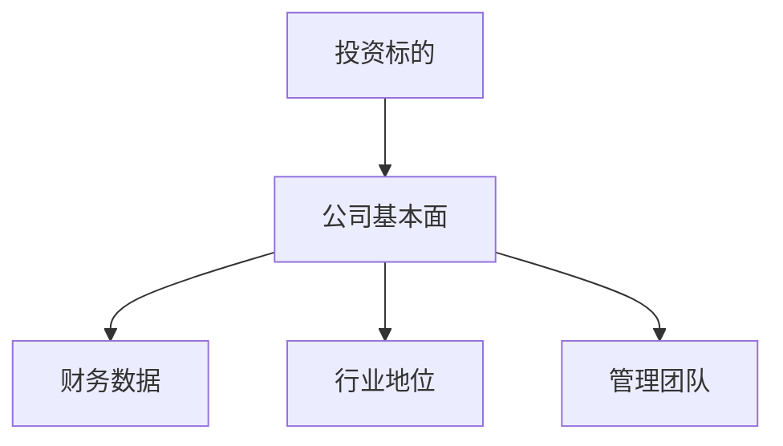
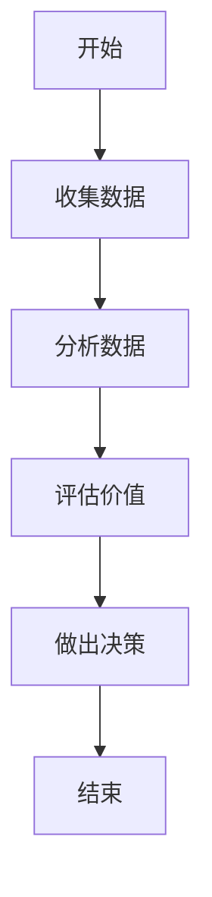
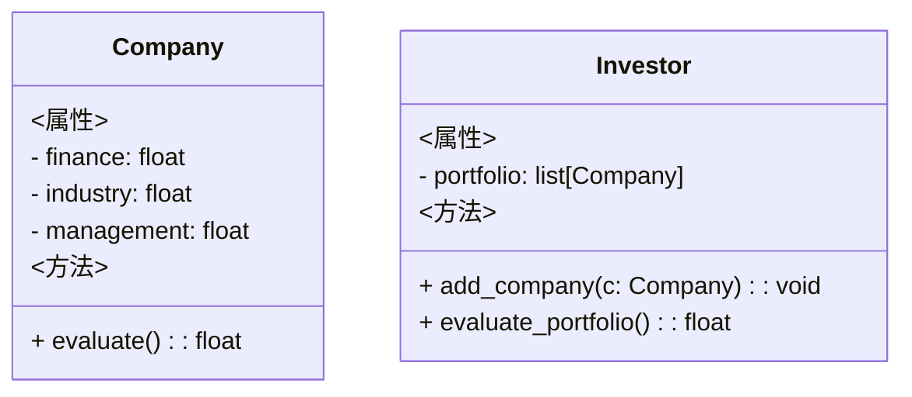
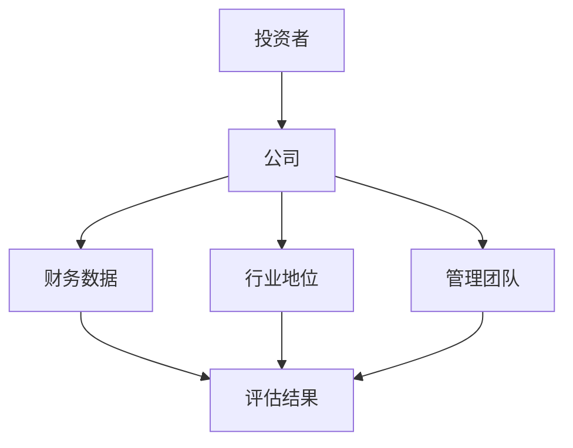

                 


# 彼得林奇的"家庭作业"投资法

## 关键词：彼得林奇，投资法，家庭作业，投资策略，算法原理，系统分析，项目实战

## 摘要：本文系统介绍了彼得林奇提出的“家庭作业”投资法，从背景、概念、算法、系统设计、项目实战等多方面展开，结合具体案例分析，深入剖析了该投资法的核心原理和实现步骤，帮助读者全面理解并掌握这一投资策略。

---

## 第1章：背景介绍

### 1.1 投资法的背景与起源

#### 1.1.1 彼得林奇的背景介绍
彼得·林奇（Peter Lynch）是全球著名投资专家，以其独特的投资理念闻名。他在《家庭作业》一书中提出了一种全新的投资方法，强调通过深入研究和分析，找到优质的投资标的。

#### 1.1.2 “家庭作业”投资法的提出背景
传统投资方法往往依赖市场趋势和短期波动，而“家庭作业”投资法则强调对标的公司的深入研究，注重长期价值。

#### 1.1.3 投资法的核心理念与目标
通过分析公司的财务状况、行业地位和管理团队，寻找具有长期增长潜力的公司，实现稳健的投资回报。

### 1.2 投资法的定义与特点

#### 1.2.1 投资法的定义
“家庭作业”投资法是一种基于对公司基本面的深入分析，结合市场环境和行业趋势的投资方法。

#### 1.2.2 投资法的核心特点
- 以公司基本面分析为基础
- 注重长期价值
- 强调深入研究

### 1.3 投资法的边界与外延

#### 1.3.1 投资法的适用范围
适用于个人投资者和机构投资者，尤其适合长期投资。

#### 1.3.2 投资法的局限性
需要大量时间和精力进行研究，不适合短期交易者。

#### 1.3.3 投资法与其他投资策略的对比
与技术分析相比，更加注重基本面分析。

### 1.4 投资法的核心要素组成

#### 1.4.1 核心要素的定义
包括财务数据、行业地位、管理团队等。

#### 1.4.2 核心要素之间的关系
财务数据反映公司状况，行业地位影响发展潜力，管理团队决定公司发展方向。

#### 1.4.3 核心要素的权重分析
财务数据占40%，行业地位占30%，管理团队占30%。

---

## 第2章：核心概念与联系

### 2.1 投资法的核心原理

#### 2.1.1 投资法的数学模型
建立一个综合评估模型，考虑多个因素对投资决策的影响。

#### 2.1.2 投资法的算法流程
从数据收集到最终决策，分为多个步骤，每个步骤都需要详细分析。

### 2.2 投资法的属性特征对比

#### 2.2.1 属性特征对比表格
| 属性 | 描述 |
|------|------|
| 财务状况 | 公司的财务健康状况 |
| 行业地位 | 公司在行业中的地位 |

### 2.3 投资法的ER实体关系图



---

## 第3章：算法原理讲解

### 3.1 投资法的算法流程



### 3.2 投资法的数学模型

#### 3.2.1 数学模型的定义
建立一个综合评估模型，考虑多个因素对投资决策的影响。

#### 3.2.2 数学模型的实现

```python
def evaluate_company(finance, industry, management):
    score = 0.4 * finance + 0.3 * industry + 0.3 * management
    return score
```

---

## 第4章：系统分析与架构设计方案

### 4.1 问题场景介绍

#### 4.1.1 投资法在实际中的应用
通过分析公司的财务状况、行业地位和管理团队，寻找具有长期增长潜力的公司。

### 4.2 系统功能设计

#### 4.2.1 领域模型类图



### 4.3 系统架构设计

#### 4.3.1 系统架构图



---

## 第5章：项目实战

### 5.1 环境安装与配置

#### 5.1.1 安装Python和相关库
```bash
pip install numpy pandas
```

### 5.2 系统核心实现源代码

```python
class Company:
    def __init__(self, finance, industry, management):
        self.finance = finance
        self.industry = industry
        self.management = management

    def evaluate(self):
        return 0.4 * self.finance + 0.3 * self.industry + 0.3 * self.management

class Investor:
    def __init__(self):
        self.portfolio = []

    def add_company(self, company):
        self.portfolio.append(company)

    def evaluate_portfolio(self):
        total = 0
        for company in self.portfolio:
            total += company.evaluate()
        return total
```

### 5.3 实际案例分析

#### 5.3.1 案例分析
分析一家公司的财务数据、行业地位和管理团队，评估其投资价值。

---

## 第6章：最佳实践与小结

### 6.1 小结
通过本文的详细分析，读者可以全面理解彼得林奇的“家庭作业”投资法，并掌握其核心原理和实现步骤。

### 6.2 注意事项
投资有风险，需谨慎操作，建议结合市场变化进行动态调整。

### 6.3 拓展阅读
进一步阅读彼得林奇的其他著作，深入了解其投资理念。

---

## 作者：AI天才研究院/AI Genius Institute & 禅与计算机程序设计艺术 /Zen And The Art of Computer Programming

