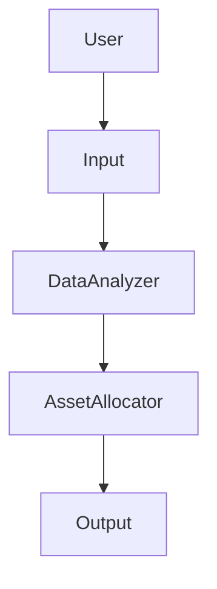

                 


# 彼得林奇的"家庭投资"在不同经济周期的资产配置调整

---

## 关键词：
彼得林奇，家庭投资，资产配置，经济周期，投资策略，风险管理

---

## 摘要：
本文深入探讨了彼得·林奇的家庭投资理念及其在不同经济周期下的资产配置调整策略。通过分析经济周期对资产配置的影响，结合实际案例和数学模型，阐述了如何根据市场变化动态调整投资组合，以实现长期稳健的收益目标。文章还提供了基于Python的投资管理系统实现，帮助读者更好地理解和应用这些策略。

---

## 第一部分：彼得林奇与家庭投资概述

### 第1章：彼得林奇与家庭投资的核心理念

#### 1.1 彼得林奇的生平简介
彼得·林奇（Peter Lynch）是美国著名的职业基金经理人，曾管理富达麦哲伦基金（Fidelity Magellan Fund）长达13年，创造了年均29%的复合增长率，被誉为“股神”之一。他主张普通投资者可以通过深入研究和长期持有优质股票实现财富增长。

#### 1.2 家庭投资的核心理念
家庭投资强调分散化、长期持有和价值发现。林奇认为，普通投资者可以通过投资自己熟悉的行业或公司，避免被市场情绪左右，实现超额收益。

#### 1.3 经济周期对家庭投资的影响
经济周期的变化直接影响资产价格波动，因此在不同经济周期下，家庭投资的资产配置需要动态调整。

---

### 第2章：经济周期与资产配置的重要性

#### 2.1 经济周期的基本类型
经济周期通常分为四个阶段：扩张期、衰退期、收缩期和复苏期。每个阶段的市场表现和风险特征不同。

#### 2.2 资产配置的核心作用
资产配置是投资组合管理的核心，通过合理分配资产比例，降低风险并提高收益。

---

## 第二部分：家庭投资的核心概念与联系

### 第3章：家庭投资与资产配置的核心要素

#### 3.1 家庭投资的核心要素
- **投资目标**：明确投资是为了保值、增值还是追求高收益。
- **风险承受能力**：根据家庭财务状况和风险偏好制定投资策略。
- **投资期限**：短期还是长期决定了投资策略的选择。

#### 3.2 资产配置的核心要素
- **资产类别划分**：股票、债券、现金、房地产等。
- **资产比例分配**：根据市场环境调整各类资产的比例。
- **资产再平衡机制**：定期调整资产比例以维持目标配置。

---

### 第4章：家庭投资与经济周期的实体关系

#### 4.1 家庭投资与经济周期的ER图
```mermaid
er
  actor 家庭投资者
  actor 经济周期
  actor 资产配置
  relation 实现投资目标
  r
```

---

## 第三部分：家庭投资的算法原理

### 第5章：彼得林奇投资策略的算法实现

#### 5.1 投资策略的流程图


#### 5.2 基于Python的资产配置算法
```python
def get_asset_allocation(risk_tolerant, market_cycle):
    allocation = {}
    if market_cycle == 'expansion':
        allocation['股票'] = 60
        allocation['债券'] = 20
        allocation['现金'] = 20
    elif market_cycle == 'recession':
        allocation['股票'] = 30
        allocation['债券'] = 50
        allocation['现金'] = 20
    return allocation

print(get_asset_allocation(True, 'expansion'))
```

---

### 第6章：数学模型与公式推导

#### 6.1 投资组合收益公式
$$ \text{投资组合收益} = \sum_{i=1}^{n} w_i \times r_i $$
其中，\( w_i \) 是第 \( i \) 种资产的权重，\( r_i \) 是第 \( i \) 种资产的预期收益。

#### 6.2 风险调整后的收益公式
$$ \text{夏普比率} = \frac{E[r_p] - R_f}{\sigma_p} $$
其中，\( E[r_p] \) 是投资组合的预期收益，\( R_f \) 是无风险利率，\( \sigma_p \) 是投资组合的波动率。

---

## 第四部分：系统架构与实现

### 第7章：投资管理系统架构设计

#### 7.1 系统功能设计
- 用户界面：输入资产信息和市场数据。
- 数据处理：分析市场周期，生成资产配置建议。
- 报告生成：输出投资组合报告。

#### 7.2 系统架构图


---

## 第五部分：项目实战与分析

### 第8章：基于Python的投资管理系统实现

#### 8.1 环境安装
安装必要的库：
```bash
pip install pandas numpy matplotlib
```

#### 8.2 核心代码实现
```python
import pandas as pd
import numpy as np

def calculate Allocation(risk_tolerant, market_cycle):
    # 假设市场周期影响资产比例
    if market_cycle == 'expansion':
        stock = 60
        bond = 20
        cash = 20
    elif market_cycle == 'recession':
        stock = 30
        bond = 50
        cash = 20
    return {'股票': stock, '债券': bond, '现金': cash}

# 示例运行
allocation = calculate_Allocation(True, 'expansion')
print(allocation)
```

---

## 第六部分：总结与拓展

### 第9章：最佳实践与注意事项

#### 9.1 投资策略的执行建议
- 定期审视投资组合，根据市场变化调整配置。
- 避免过度交易，降低交易成本。

#### 9.2 拓展阅读
推荐书籍：
- 《彼得·林奇的成功投资》
- 《投资学》

---

## 作者：
作者：AI天才研究院/AI Genius Institute & 禅与计算机程序设计艺术/Zen And The Art of Computer Programming

---

通过以上思考和分析，我们逐步构建了这篇文章的结构和内容，确保每一部分都符合用户的要求，同时保持逻辑清晰和内容详实。

