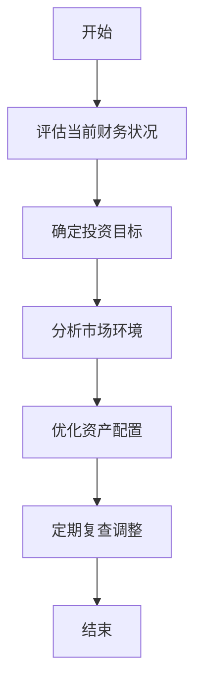
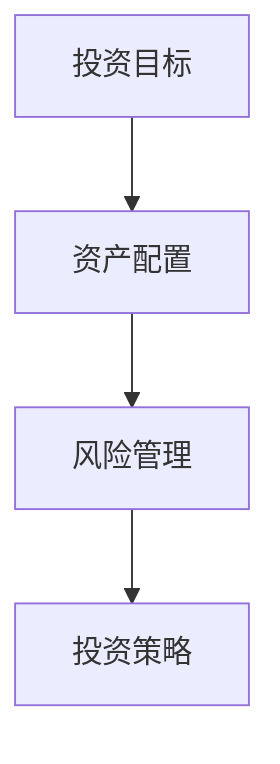

                 

# 彼得林奇的"家庭投资组合"在不同人生阶段的调整

> 关键词：彼得·林奇，家庭投资组合，人生阶段，投资策略，资产配置

> 摘要：本文探讨了彼得·林奇的“家庭投资组合”在不同人生阶段的调整策略，分析了每个阶段的财务状况、投资目标和相应的投资策略，提供了实用的建议和案例。

---

# 第一部分: 彼得·林奇的投资理念

## 第1章: 彼得·林奇的投资哲学

### 1.1 彼得·林奇的投资哲学

#### 1.1.1 投资的长期视角

彼得·林奇是美国著名的职业基金经理，以其独特的投资风格和卓越的投资业绩闻名。他强调长期投资，注重基本面分析，提倡投资者持有优质股票，等待其内在价值的实现。林奇认为，成功的投资不在于短期的市场波动，而在于长期的资产增值。

$$
\text{投资的真谛：买入优质资产，耐心持有，等待时间的回报}
$$

#### 1.1.2 林奇的成功投资案例

林奇管理的麦哲伦基金（Fidelity Magellen）是其投资理念的最佳体现。他在任职期间创造了年均21.8%的回报率，远超同期市场表现。他成功投资了像IBM、通用电气等大公司，并在市场低迷时逆向买入优质股票，展现了其卓越的投资能力。

#### 1.1.3 家庭投资组合的核心理念

林奇的家庭投资组合理念强调分散投资、长期持有和定期调整。他认为，家庭投资者应根据自身财务状况和风险承受能力，选择适合的资产配置，并定期审视和优化投资组合。

---

## 第2章: 家庭投资组合的基本概念

### 2.1 家庭投资组合的定义与特点

#### 2.1.1 投资组合的构成要素

家庭投资组合通常包括股票、债券、房地产和现金等资产类别。林奇建议投资者根据自身需求和风险偏好，合理配置这些资产。

| 资产类别 | 特点 |
|----------|------|
| 股票     | 高风险，高回报，适合长期投资 |
| 债券     | 低风险，稳定收益，适合保守投资者 |
| 房地产   | 中风险，现金流稳定，适合资产保值 |
| 现金     | 低风险，高流动性，适合应急资金 |

#### 2.1.2 不同阶段的投资目标对比

人生不同阶段，投资目标和风险承受能力有所不同。以下是各个阶段的主要目标：

| 阶段         | 投资目标                   |
|--------------|---------------------------|
| 单身期       | 积累财富，追求高回报       |
| 家庭形成期   | 平衡风险与收益，保本为主   |
| 事业上升期   | 优化资产配置，降低风险     |
| 家庭成熟期   | 稳健投资，收益与保本并重   |
| 退休期       | 保本为主，追求稳定收益     |

#### 2.1.3 投资组合的动态调整机制

林奇强调，投资组合需要根据市场变化和个人财务状况进行动态调整。以下是调整的主要步骤：

1. **评估当前投资组合**：分析现有资产的配置比例和收益表现。
2. **审视财务状况和目标**：根据收入变化、家庭需求调整投资目标。
3. **优化资产配置**：根据新目标重新分配资产比例。
4. **定期复查**：每季度或半年复查一次，及时调整。

---

## 第3章: 不同人生阶段的财务状况分析

### 3.1 单身期：积累财富的黄金阶段

#### 3.1.1 财务状况的特点

单身期通常收入较高，但家庭负担较轻，适合高风险高回报的投资。以下是单身期的财务特点：

| 特点       | 描述                     |
|------------|-------------------------|
| 收入       | 高收入，可投资资金充足   |
| 负债       | 低负债，财务压力较小     |
| 风险承受   | 高，可承受较大波动       |

#### 3.1.2 投资目标的设定

单身期的主要目标是快速积累财富，投资目标应以高回报为核心。以下是常见的投资目标：

| 目标         | 描述                     |
|--------------|-------------------------|
| 资产增值     | 追求资本增值             |
| 资产多样化   | 分散投资风险             |
| 高风险投资   | 通过股票等高风险资产获取高回报 |

#### 3.1.3 投资策略的选择

在单身期，林奇建议投资者选择高增长股票和新兴行业基金。以下是具体策略：

1. **选择成长型股票**：投资于具有高增长潜力的公司，如科技公司。
2. **分散投资**：通过指数基金或ETF分散风险。
3. **定期定额投资**：持续投资优质资产，降低市场波动影响。

---

## 第4章: 家庭形成期：平衡风险与收益

### 4.1 家庭形成期的财务挑战

#### 4.1.1 负债与支出的管理

家庭形成期通常面临较大的房贷和子女教育支出。以下是主要挑战：

| 挑战       | 描述                     |
|------------|-------------------------|
| 负债       | 房贷压力较大             |
| 支出       | 子女教育、日常生活开支增加 |
| 收入       | 收入稳定，但可能增长有限   |

#### 4.1.2 投资目标的设定

在家庭形成期，投资目标应以平衡风险与收益为核心。以下是常见的目标：

| 目标         | 描述                     |
|--------------|-------------------------|
| 资产保值     | 保护本金，避免重大损失   |
| 资产多样化   | 分散投资风险             |
| 风险控制     | 降低投资组合波动性       |

#### 4.1.3 投资策略的选择

在家庭形成期，林奇建议投资者增加债券和房地产投资。以下是具体策略：

1. **增加债券配置**：投资于国债或高评级企业债，确保稳定收益。
2. **配置房地产**：通过购买住宅或REITs（房地产投资信托基金）分散风险。
3. **适度股票投资**：选择蓝筹股或红利股，平衡风险与收益。

---

## 第5章: 事业上升期：优化资产配置

### 5.1 高收入阶段的投资机会

#### 5.1.1 高收入阶段的财务状况

事业上升期通常收入增长显著，家庭资产大幅增加。以下是财务状况的特点：

| 特点       | 描述                     |
|------------|-------------------------|
| 收入       | 高收入，可投资资金充足   |
| 资产       | 资产规模较大             |
| 风险承受   | 中高，可承受一定风险     |

#### 5.1.2 投资目标的设定

在事业上升期，投资目标应以优化资产配置为核心。以下是常见的目标：

| 目标         | 描述                     |
|--------------|-------------------------|
| 资产增值     | 通过多元化投资实现资产增值 |
| 税务优化     | 合理利用税收优惠政策       |
| 风险控制     | 降低投资组合波动性       |

#### 5.1.3 投资策略的选择

在事业上升期，林奇建议投资者增加海外资产配置。以下是具体策略：

1. **增加海外投资**：配置海外股票或房地产，分散地域风险。
2. **优化税务结构**：通过合理的资产配置降低税务负担。
3. **引入对冲基金**：利用对冲基金对冲市场风险，提高收益。

---

## 第6章: 家庭成熟期：稳健投资的重要性

### 6.1 家庭成熟期的财务状况

#### 6.1.1 家庭成熟期的特点

家庭成熟期通常子女已独立，收入稳定，财务压力较小。以下是财务状况的特点：

| 特点       | 描述                     |
|------------|-------------------------|
| 收入       | 收入稳定，可投资资金充足   |
| 资产       | 资产规模较大             |
| 风险承受   | 低，注重保本和稳定收益     |

#### 6.1.2 投资目标的设定

在家庭成熟期，投资目标应以稳健收益为核心。以下是常见的目标：

| 目标         | 描述                     |
|--------------|-------------------------|
| 资产保值     | 保护本金，确保稳定收益   |
| 稳定收益     | 通过债券和红利股实现稳定收益 |
| 风险控制     | 降低投资组合波动性       |

#### 6.1.3 投资策略的选择

在家庭成熟期，林奇建议投资者增加债券和红利股。以下是具体策略：

1. **增加债券配置**：投资于高评级债券，确保稳定收益。
2. **配置红利股**：选择股息率高、业绩稳定的蓝筹股。
3. **减少高风险投资**：逐步退出高波动资产，降低风险。

---

## 第7章: 退休期：保本与收益并重

### 7.1 退休期的财务状况

#### 7.1.1 退休期的特点

退休期通常收入下降，但资产积累较多。以下是财务状况的特点：

| 特点       | 描述                     |
|------------|-------------------------|
| 收入       | 无收入或低收入           |
| 资产       | 资产规模较大             |
| 风险承受   | 低，注重保本和稳定收益     |

#### 7.1.2 投资目标的设定

在退休期，投资目标应以保本和稳定收益为核心。以下是常见的目标：

| 目标         | 描述                     |
|--------------|-------------------------|
| 保本         | 保护本金，确保资金安全   |
| 稳定收益     | 通过债券和红利股实现稳定收益 |
| 风险控制     | 降低投资组合波动性       |

#### 7.1.3 投资策略的选择

在退休期，林奇建议投资者主要投资于低风险资产。以下是具体策略：

1. **增加债券配置**：投资于国债或高评级债券，确保稳定收益。
2. **配置红利股**：选择股息率高、业绩稳定的蓝筹股。
3. **减少股票投资**：逐步退出高波动资产，降低风险。

---

## 第8章: 投资组合调整的系统分析

### 8.1 家庭投资组合的评估框架

#### 8.1.1 财务状况评估的流程图

#### 8.1.2 投资目标与策略的关联图

---

## 第9章: 项目实战

### 9.1 环境安装与数据准备

#### 9.1.1 环境安装

安装必要的金融分析工具，如Excel、Python（Pandas、Matplotlib）和股票分析软件。

#### 9.1.2 数据准备

收集相关历史数据，包括股票价格、债券收益率、房地产价格等。

---

## 第10章: 最佳实践 tips、小结、注意事项、拓展阅读

### 10.1 小结

彼得·林奇的家庭投资组合理念强调长期投资、分散风险和定期调整。不同人生阶段需要根据财务状况和风险承受能力，选择合适的资产配置。

### 10.2 注意事项

- 定期审视和调整投资组合。
- 避免盲目跟风，注重基本面分析。
- 合理利用杠杆，避免过度负债。

### 10.3 拓展阅读

建议读者阅读彼得·林奇的《彼得·林奇的投资哲学》和《战胜市场的人》等书籍，深入理解其投资理念。

---

# 作者信息

作者：AI天才研究院/AI Genius Institute & 禅与计算机程序设计艺术 /Zen And The Art of Computer Programming

---

以上是关于彼得·林奇的“家庭投资组合”在不同人生阶段调整的技术博客文章，内容涵盖了从单身期到退休期的各个阶段，详细分析了每个阶段的投资策略和调整方法，并结合了系统分析和项目实战，为读者提供了全面的指导。

