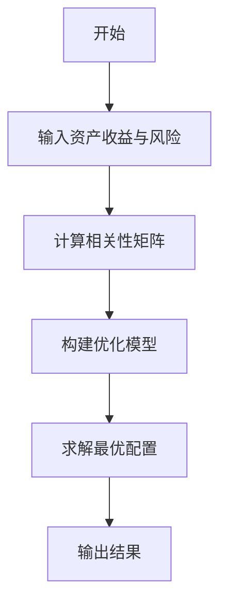
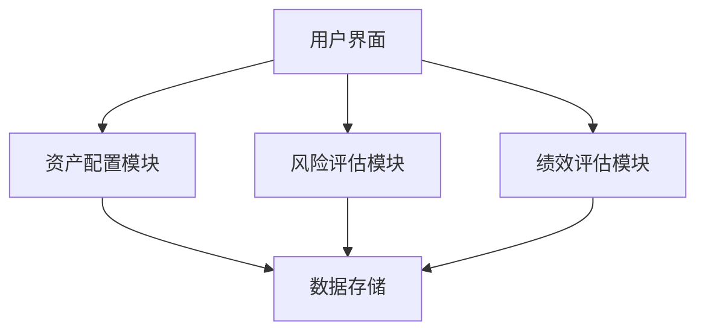
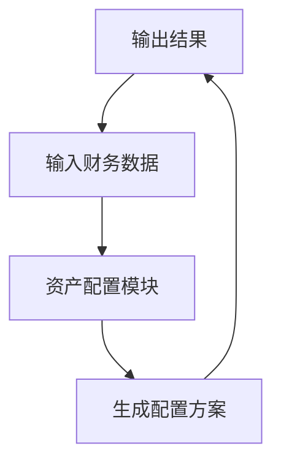

                 

# 彼得林奇的"家庭投资组合"多元化策略

> 关键词：彼得林奇、多元化投资、家庭理财、投资组合、风险管理、资产配置

> 摘要：本文深入探讨了彼得林奇的“家庭投资组合”多元化策略，从理论基础到实际操作，详细分析了如何通过多元化配置实现风险控制和收益最大化。文章结合专业技术语言，通过逻辑推理和实例分析，为读者提供了系统化的投资策略框架。

---

# 第1章: 投资的基本概念与家庭投资的重要性

## 1.1 投资的基本概念

### 1.1.1 什么是投资

投资是将资金投入到能够产生收益的资产中，以实现财富增值的过程。投资的对象包括股票、债券、房地产、黄金等多种资产类别。

### 1.1.2 投资的目的与意义

投资的主要目的是通过资产增值实现财富增长。对于家庭而言，投资不仅是财富增值的手段，更是实现财务自由的重要途径。

### 1.1.3 家庭投资的独特性

家庭投资与机构投资相比，具有以下特点：  
1. 投资目标通常是实现长期稳健的财富增长。  
2. 资金规模相对较小，注重风险控制。  
3. 投资决策往往基于家庭成员的共同需求。

## 1.2 家庭投资组合的定义

### 1.2.1 投资组合的定义

投资组合是指将资金分配到多种资产中，以分散风险并提高收益的组合。

### 1.2.2 家庭投资组合的特点

1. **分散性**：通过投资不同类型的资产降低风险。  
2. **稳健性**：注重长期收益，避免高风险投资。  
3. **灵活性**：根据市场变化及时调整投资组合。

### 1.2.3 投资组合的目标与边界

目标：实现财富稳健增长。  
边界：根据家庭的财务状况和风险承受能力设定投资范围。

## 1.3 多元化投资的基本原理

### 1.3.1 多元化投资的定义

多元化投资是通过将资金分配到不同的资产类别或行业中，以降低投资风险。

### 1.3.2 多元化投资的核心思想

1. **分散风险**：通过投资不同类型资产降低单一资产的风险。  
2. **平衡收益**：通过合理配置资产实现收益最大化。  
3. **动态调整**：根据市场变化及时优化投资组合。

## 1.4 本章小结

本章介绍了投资的基本概念和家庭投资的独特性，强调了多元化投资的重要性，并提出了构建投资组合的目标与边界。

---

# 第2章: 多元化投资的核心概念与联系

## 2.1 多元化投资的核心原理

### 2.1.1 资产配置的原理

资产配置是指将资金分配到不同资产类别中，以实现风险与收益的最佳平衡。

### 2.1.2 风险分散的机制

通过投资相关性较低的资产，降低整体投资组合的风险。

### 2.1.3 投资组合的优化方法

使用现代投资组合理论（MPT）优化投资组合的收益与风险。

## 2.2 多元化投资的资产类别

### 2.2.1 股票、债券、现金等资产的定义与特点

- **股票**：高风险高收益，代表企业所有权。  
- **债券**：相对稳健，代表债务所有权。  
- **现金**：流动性高，风险最低。  

### 2.2.2 不同资产类别的风险与收益对比

| 资产类别 | 风险 | 收益 |
|----------|------|------|
| 股票     | 高   | 高   |
| 债券     | 中   | 中   |
| 现金     | 低   | 低   |

### 2.2.3 资产类别之间的相关性分析

相关性分析是优化资产配置的重要步骤。相关性低的资产可以有效降低整体风险。

## 2.3 多元化投资的数学模型

### 2.3.1 马科维茨投资组合理论

现代投资组合理论（MPT）是多元化投资的重要理论基础。

### 2.3.2 方差与协方差的计算

- 方差：衡量资产收益的波动性。  
- 协方差：衡量两种资产收益的相关性。  

公式：  
$$ \sigma_p^2 = \sum_{i=1}^{n} \sum_{j=1}^{n} w_i w_j \sigma_i \sigma_j \rho_{ij} $$  

### 2.3.3 投资组合的优化算法

优化算法的目标是找到使风险最小化或收益最大化的资产配置。

流程图（使用Mermaid）：

## 2.4 本章小结

本章介绍了多元化投资的核心原理，分析了不同资产类别的风险与收益，并通过数学模型优化了投资组合。

---

# 第3章: 家庭投资组合的系统分析与设计

## 3.1 投资组合管理系统的功能模块

### 3.1.1 资产配置模块

- 根据家庭财务状况推荐资产配置方案。  

### 3.1.2 风险评估模块

- 评估投资组合的整体风险水平。  

### 3.1.3 绩效评估模块

- 分析投资组合的历史表现。  

## 3.2 投资组合管理系统的架构设计

### 3.2.1 系统架构图

### 3.2.2 功能模块之间的关系

- 资产配置模块与数据存储模块交互，获取历史数据。  
- 风险评估模块基于数据存储模块中的资产相关性矩阵进行评估。  

## 3.3 系统接口设计与交互流程

### 3.3.1 系统接口定义

- 输入：家庭财务状况、投资目标。  
- 输出：资产配置建议、风险评估报告。  

### 3.3.2 系统交互流程

---

# 第4章: 家庭投资组合的实战案例与优化

## 4.1 案例分析

### 4.1.1 案例背景

假设一个家庭有50万元可用于投资，希望实现年化收益8%以上，风险承受能力中等。

### 4.1.2 资产配置方案

- 股票：40%（分散投资于不同行业）  
- 债券：30%（配置国债和企业债）  
- 现金：20%（用于应急资金）  
- 其他资产：10%（如房地产信托基金）  

## 4.2 投资组合的优化

### 4.2.1 根据市场变化调整配置

- 如果股市表现不佳，增加债券配置比例。  
- 如果债券收益率下降，减少债券配置，增加股票配置。  

## 4.3 本章小结

本章通过实际案例分析了多元化投资策略的应用，并展示了如何根据市场变化优化投资组合。

---

# 第5章: 投资组合的风险管理与最佳实践

## 5.1 风险管理的核心策略

### 5.1.1 定期评估投资组合

- 每季度评估一次投资组合的风险与收益。  

### 5.1.2 保持适度的分散性

- 避免过度集中于某一种资产。  

## 5.2 投资组合的最佳实践

### 5.2.1 定期再平衡

- 每年调整一次资产配置，以保持目标比例。  

### 5.2.2 避免情绪化决策

- 根据市场变化，避免盲目跟风。  

## 5.3 本章小结

本章强调了风险管理的重要性，并提出了最佳实践建议，帮助家庭投资者稳健投资。

---

# 第6章: 总结与展望

## 6.1 总结

彼得林奇的多元化投资策略为家庭投资提供了重要指导。通过合理配置资产、分散风险，家庭投资者可以在实现财富增长的同时，降低投资风险。

## 6.2 展望

未来，随着金融市场的不断发展，家庭投资组合的多元化策略也将更加多样化和智能化。投资者需要紧跟市场变化，灵活调整投资策略。

---

# 作者：AI天才研究院 & 禅与计算机程序设计艺术

