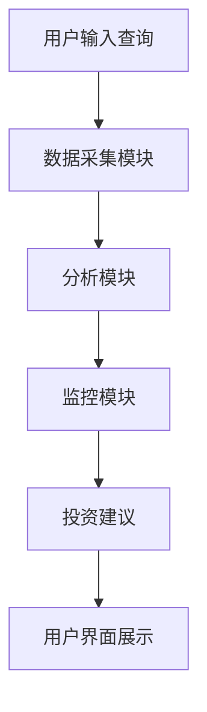

                 


# 彼得林奇的"家庭股票"在财富传承中的角色

## 关键词：
彼得林奇, 家庭股票, 财富传承, 投资策略, 股票管理

## 摘要：
本文探讨了彼得林奇提出的“家庭股票”概念在财富传承中的重要角色。通过分析其核心理念、运作机制及与其他投资策略的对比，结合具体的数学模型和系统架构设计，详细阐述了如何通过长期持有的优质股票实现财富的保值与传承。文章还提供了实际的项目案例和最佳实践建议，帮助读者更好地理解和应用这些投资策略。

---

## 第一部分：背景介绍

### 第1章：彼得·林奇及其投资哲学

#### 1.1 彼得·林奇的生平与成就
- **生平简介**：彼得·林奇（Peter Lynch）是美国著名的投资专家，曾管理富达麦哲伦基金，取得了年均21.9%的复合回报率。
- **投资风格**：他以长期持有优质股票著称，注重基本面分析和市场趋势，避免短期波动。
- **核心理念**：林奇强调“业余投资者的优势”，即通过长期持有优质股票，利用复利效应实现财富增长。

#### 1.2 投资哲学的核心思想
- **长期投资的重要性**：林奇认为，短期市场波动不可预测，而长期趋势则可以通过基本面分析来把握。
- **价值投资与成长投资的结合**：他寻找那些具有强大基本面和成长潜力的公司，同时保持合理的估值。
- **风险管理与心理因素**：林奇强调心理因素对投资决策的影响，提倡避免情绪化交易。

#### 1.3 "家庭股票"的概念与特点
- **定义**：家庭股票指的是那些能够为家庭长期提供稳定收益，同时具备传承性质的优质股票。
- **特点**：
  - 高股息收益率：提供稳定的现金流。
  - 长期增长潜力：具备持续增长的能力。
  - 良好基本面：公司财务健康，管理团队优秀。

---

## 第二部分：核心概念与联系

### 第2章："家庭股票"的运作机制

#### 2.1 家庭股票的核心要素
- **股票选择**：林奇提出的股票筛选标准包括：
  - 市盈率（P/E）：$$P/E = \frac{Price}{Earnings}$$
  - 市净率（P/B）：$$P/B = \frac{Price}{Book\ Value}$$
  - 盈利能力：如ROE（$$ROE = \frac{Net\ Profit}{Equity}$$）。
- **公司基本面分析**：包括收入、利润、负债和现金流等指标。
- **股东价值评估**：通过DCF模型等方法评估公司的内在价值。

#### 2.2 家庭股票在财富传承中的角色
- **财富保值与增值**：通过长期持有优质股票，实现财富的稳定增长。
- **跨代传承的优势**：股票资产可以轻松转移给下一代，无需复杂的过户手续。
- **税务规划的考量**：合理利用税务政策，如遗产税的规避。

#### 2.3 家庭股票与其他投资策略的对比
- **对比表格**：

| 投资策略 | 短期收益 | 长期收益 | 风险 | 管理复杂度 |
|----------|----------|----------|------|------------|
| 家庭股票 | 中等 | 高 | 中等 | 低 |
| 股票基金 | 高 | 中等 | 高 | 高 |
| 债券 | 低 | 中等 | 低 | 低 |

- **图表展示**：使用mermaid图展示不同类型投资的回报率对比。


---

## 第三部分：算法原理讲解

### 第3章：彼得·林奇投资模型的数学解析

#### 3.1 股票筛选的数学模型
- **市盈率分析**：$$P/E = \frac{Price}{Earnings}$$，市盈率低于行业平均水平的股票具有较高的投资价值。
- **市净率分析**：$$P/B = \frac{Price}{Book\ Value}$$，市净率低于1的股票通常被低估。
- **盈利能力分析**：ROE（$$ROE = \frac{Net\ Profit}{Equity}$$）高的公司具有更强的盈利能力。

#### 3.2 投资组合优化的数学模型
- 使用现代投资组合理论（MPT）进行优化，目标是最小化风险（波动率）的同时实现预期收益。
- 数学公式：
  - 优化目标：$$\min \sigma^2$$
  - 约束条件：$$\sum w_i = 1$$，其中$$w_i$$为各股票的权重。

#### 3.3 示例计算
- 假设投资组合由两只股票组成，目标是实现风险最小化。
- 股票A：期望收益10%，标准差15%。
- 股票B：期望收益15%，标准差20%。
- 相关系数：0.5。
- 使用公式计算最优权重：
  $$w_A = \frac{\sigma_B^2 - \rho \sigma_A \sigma_B}{\sigma_A^2 + \sigma_B^2 - 2\rho \sigma_A \sigma_B}$$

---

## 第四部分：系统分析与架构设计方案

### 第4章：构建"家庭股票"投资决策系统

#### 4.1 系统功能设计
- **数据采集模块**：收集股票市场数据，包括价格、收益、股息等。
- **分析模块**：应用上述数学模型进行股票筛选和组合优化。
- **监控模块**：实时跟踪投资组合的表现，及时调整。

#### 4.2 系统架构设计
- 使用分层架构：
  - 数据层：数据存储和处理。
  - 业务逻辑层：模型计算和优化。
  - 用户界面层：直观展示投资组合和决策建议。

#### 4.3 接口设计
- API接口：
  - 数据接口：获取市场数据。
  - 计算接口：返回优化后的投资组合建议。

#### 4.4 交互流程
- 使用mermaid图展示用户从输入查询到获得投资建议的完整流程。



---

## 第五部分：项目实战

### 第5章：构建和管理"家庭股票"投资组合

#### 5.1 环境安装
- 安装Python和必要的库（如numpy, pandas, matplotlib）。
  ```bash
  pip install numpy pandas matplotlib
  ```

#### 5.2 核心代码实现
- 示例代码：

```python
import numpy as np
import pandas as pd

# 示例数据
data = {'股票': ['A', 'B', 'C'],
         '收益': [0.1, 0.15, 0.12],
         '标准差': [0.15, 0.2, 0.18],
         '相关系数': [0.5, 0.5, 0.5]}
df = pd.DataFrame(data)

# 计算最优权重
cov = df['标准差'].apply(lambda x: x**2).values
rho = df['相关系数'].values
inv_cov = np.linalg.inv(cov * rho)
weights = np.dot(inv_cov, np.ones(len(df)))

# 输出结果
print("最优权重:", weights)
```

#### 5.3 案例分析
- 假设一个家庭选择投资三只股票，通过上述代码计算最优权重，构建投资组合，定期调整以应对市场变化。

#### 5.4 项目总结
- 强调定期审查和调整投资组合的重要性，确保其适应市场变化和家庭财务目标。

---

## 第六部分：最佳实践与小结

### 第6章：总结与建议

#### 6.1 小结
- 彼得·林奇的“家庭股票”理念为财富传承提供了有效的策略。
- 通过长期持有优质股票，结合合理的投资组合管理，可以实现财富的保值和增值。

#### 6.2 最佳实践
- **定期审查投资组合**：每年至少一次调整权重。
- **分散投资**：避免过度集中，降低风险。
- **税务规划**：合理利用遗产税政策，减少税务负担。

#### 6.3 注意事项
- **市场风险**：即使优质股票也有波动，需做好心理准备。
- **管理成本**：长期管理费用可能影响收益，需综合考虑。

#### 6.4 拓展阅读
- 推荐书籍：《彼得·林奇的股票投资策略》。
- 推荐博客：深入探讨家庭股票的具体案例和实际操作。

---

## 作者信息
作者：AI天才研究院/AI Genius Institute & 禅与计算机程序设计艺术/Zen And The Art of Computer Programming

---

通过以上内容，我们详细探讨了彼得林奇的“家庭股票”在财富传承中的角色，从理论到实践，为读者提供了全面的指导和建议。

