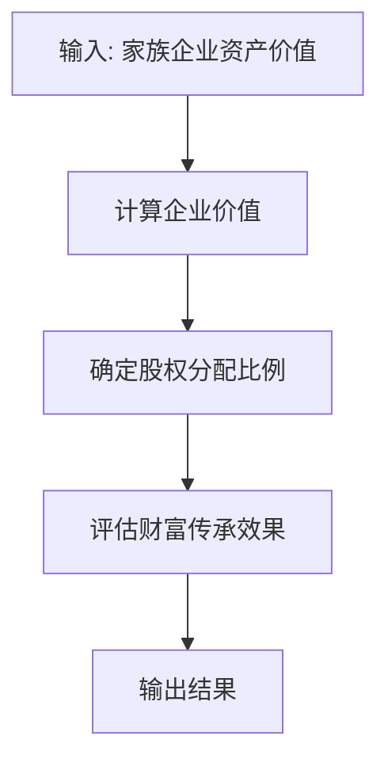
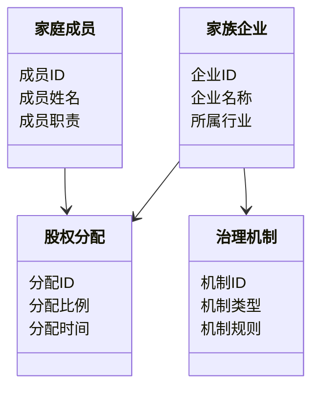
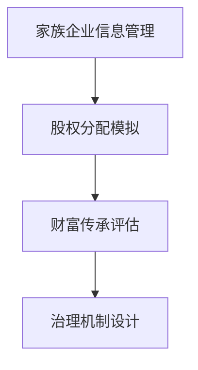
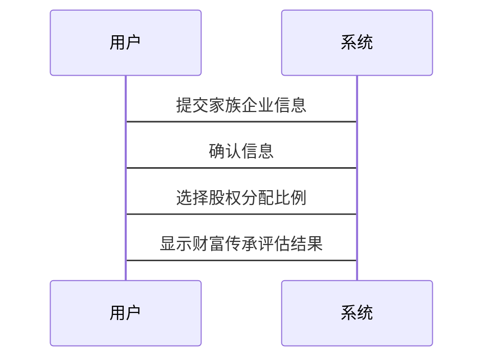

                 


# 彼得林奇的"家庭股票"在跨代财富传承中的作用

## 关键词：财富传承，家庭股票，彼得·林奇，家族企业，投资策略，跨代传承

## 摘要：本文探讨了彼得·林奇提出的"家庭股票"概念在跨代财富传承中的作用。通过分析"家庭股票"的核心概念、算法原理、系统架构以及实际案例，本文展示了如何通过"家庭股票"实现财富的长期保值与增值。文章还提供了系统的架构设计和项目实战，帮助读者理解并应用这一理论。

---

# 第一部分: 引言

## # 第1章: 跨代财富传承的背景与重要性

### 1.1 财富传承的定义与挑战
#### 1.1.1 财富传承的定义
财富传承是指将财富从一代人传递到下一代人的过程，通常涉及资产、股权、知识产权等的转移。

#### 1.1.2 财富传承中的主要挑战
- 财富分配的公平性问题
- 家族企业治理中的权力交接问题
- 经济波动对财富保值的影响

#### 1.1.3 跨代财富传承的全球现状
随着全球化的发展，家族企业在全球经济中的地位日益重要，财富传承的需求也在不断增加。

### 1.2 家族企业在全球财富传承中的角色
#### 1.2.1 家族企业的定义与特点
- 家族企业是由家族成员共同拥有和管理的企业
- 具有长期性和稳定性

#### 1.2.2 家族企业在财富传承中的优势
- 能够保持家族对企业的控制权
- 能够实现财富的长期增值

#### 1.2.3 家族企业面临的主要问题
- 传承过程中的权力交接问题
- 企业治理中的代际冲突

### 1.3 彼得·林奇的"家庭股票"理论
#### 1.3.1 彼得·林奇的简介
彼得·林奇是美国著名的投资专家，以其对家庭股票的研究而闻名。

#### 1.3.2 "家庭股票"的定义与核心理念
- "家庭股票"是指将家族企业的一部分股权作为家庭财富传承的工具
- 强调通过长期投资实现财富的保值与增值

#### 1.3.3 "家庭股票"与财富传承的关系
- 通过股权分配实现财富的传承
- 通过家族企业治理实现财富的长期管理

---

## # 第2章: "家庭股票"的核心概念与联系

### 2.1 "家庭股票"的定义与特点
#### 2.1.1 "家庭股票"的定义
- "家庭股票"是指将家族企业的一部分股权作为财富传承的工具
- 通过股权分配实现财富的传承和管理

#### 2.1.2 "家庭股票"的核心特点
- 长期性：通过长期投资实现财富的保值与增值
- 稳定性：家族企业能够为财富传承提供稳定的平台

#### 2.1.3 "家庭股票"与其他财富传承方式的对比
- 信托：通过法律结构实现财富传承，但灵活性较低
- 基金会：通过专业管理实现财富传承，但管理成本较高
- 家庭股票：结合家族企业的特点，实现财富的长期管理

### 2.2 "家庭股票"的核心要素
#### 2.2.1 家族企业
- 家族企业的定义与特点
- 家族企业在财富传承中的作用

#### 2.2.2 股票结构
- 股票的定义与类型
- 股票在财富传承中的分配方式

#### 2.2.3 治理机制
- 家族企业的治理结构
- 股权分配与治理机制的关系

### 2.3 "家庭股票"的ER实体关系图
```mermaid
er
    entity 家族企业 {
        key: 企业ID
        attribute: 企业名称, 成立时间, 所属行业
    }

    entity 股权分配 {
        key: 分配ID
        attribute: 分配比例, 分配时间, 分配方式
        relationship: 分配给家庭成员
    }

    entity 家庭成员 {
        key: 成员ID
        attribute: 成员姓名, 成员关系, 成员职责
        relationship: 拥有股权分配
    }

    entity 治理机制 {
        key: 机制ID
        attribute: 机制类型, 机制规则, 机制执行人
        relationship: 用于管理股权分配
    }
```

---

## # 第3章: "家庭股票"的算法原理

### 3.1 财富传承评估模型
#### 3.1.1 模型定义
财富传承评估模型用于评估"家庭股票"在财富传承中的效果。

#### 3.1.2 模型输入
- 家族企业的资产价值
- 家族企业的未来收益
- 股权分配比例

#### 3.1.3 模型输出
- 财富传承的可行性分析
- 股权分配的合理性评估

#### 3.1.4 算法流程图


### 3.2 财富传承评估模型的Python实现
```python
def calculate_company_value(assets, future_revenue):
    return assets + future_revenue

def equity_distribution_ratio(value, num_members):
    return value / num_members

def assess财富传承(value, ratio):
    return value * ratio > 0.5 * value

assets = 10000000
future_revenue = 5000000
num_members = 5

value = calculate_company_value(assets, future_revenue)
ratio = equity_distribution_ratio(value, num_members)
result = assess财富传承(value, ratio)

print(f"公司价值: {value}")
print(f"股权分配比例: {ratio}")
print(f"财富传承可行性: {result}")
```

---

## # 第4章: "家庭股票"的数学模型

### 4.1 财富传承的核心公式
财富传承的核心公式为：
$$
\text{股权价值} = \text{企业价值} \times \text{股权比例}
$$

### 4.2 企业价值的计算
企业价值可以通过以下公式计算：
$$
\text{企业价值} = \text{资产价值} + \text{未来收益的现值}
$$

### 4.3 股权分配的数学模型
股权分配的数学模型如下：
$$
\text{股权分配比例} = \frac{\text{股权价值}}{\text{企业价值}}
$$

---

## # 第5章: "家庭股票"的系统分析与架构设计

### 5.1 系统功能设计
#### 5.1.1 领域模型


#### 5.1.2 系统架构


### 5.2 接口设计
- 家族企业信息接口：用于管理家族企业的基本信息
- 股权分配接口：用于实现股权分配的模拟
- 财富传承评估接口：用于评估财富传承的可行性

### 5.3 交互设计


---

## # 第6章: "家庭股票"的项目实战

### 6.1 环境安装
- 安装Python和相关库（如numpy、pandas）

### 6.2 核心代码实现
```python
import numpy as np
import pandas as pd

def calculate_company_value(assets, future_revenue):
    return assets + future_revenue

def equity_distribution_ratio(value, num_members):
    return value / num_members

assets = [10000000, 8000000, 12000000]
future_revenue = [5000000, 4000000, 6000000]
num_members = 5

value = calculate_company_value(assets[0], future_revenue[0])
ratio = equity_distribution_ratio(value, num_members)

print(f"公司价值: {value}")
print(f"股权分配比例: {ratio}")
```

### 6.3 实际案例分析
以一个家族企业为例，分析"家庭股票"的实施过程。

---

## # 第7章: 结论与展望

### 7.1 结论
通过本文的分析，我们可以看出"家庭股票"在跨代财富传承中的重要作用。

### 7.2 未来展望
未来的研究可以进一步探讨数字化工具在"家庭股票"中的应用。

---

## 附录

### A. 参考文献
1. 彼得·林奇的著作
2. 其他相关文献

### B. 工具推荐
- Python编程语言
- Mermaid图表工具

---

作者：AI天才研究院/AI Genius Institute & 禅与计算机程序设计艺术 /Zen And The Art of Computer Programming

