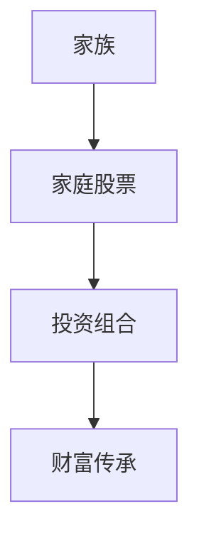
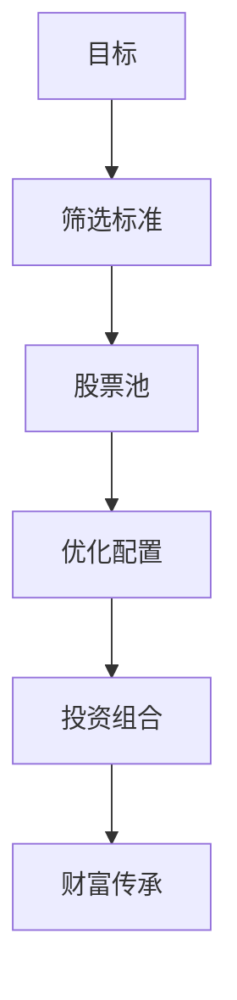

                 

# 彼得林奇的"家庭股票"在跨代财富传承中的投资组合构建

> 关键词：财富传承，家庭股票，投资组合，彼得·林奇，跨代传承

> 摘要：本文详细探讨了彼得·林奇的"家庭股票"概念在跨代财富传承中的应用，分析了其投资组合构建的核心原理、算法模型和实际操作策略，结合案例分析和系统架构设计，为读者提供了一套系统化的跨代财富传承解决方案。

---

# 第一部分: 财富传承与投资组合构建的背景与核心概念

## 第1章: 财富传承的背景与问题背景

### 1.1 财富传承的背景介绍

#### 1.1.1 财富传承的历史演变
财富传承是人类社会永恒的主题，从最初的实物交换到现代的金融资产配置，财富传承的方式和手段经历了深刻的变革。随着全球化和科技的进步，财富传承的需求日益增长，尤其是在高净值家庭中。

#### 1.1.2 当代财富传承的主要挑战
当代财富传承面临多重挑战，包括经济波动、税率变化、家族企业管理复杂性以及代际价值观差异等。这些问题要求我们采用更加系统化和科学化的投资策略。

#### 1.1.3 跨代财富传承的核心问题
核心问题在于如何在保持财富稳定增长的同时，确保财富能够在家族内部长期传承，并实现代际之间的价值延续。

---

### 1.2 财富传承中的投资需求

#### 1.2.1 财富传承的核心目标
财富传承的核心目标包括财富保值、增值、家族企业稳定运行以及代际价值观的延续。

#### 1.2.2 投资在财富传承中的作用
投资不仅是财富增长的手段，更是实现财富保值和代际传承的重要工具。通过科学的投资组合构建，可以有效降低风险，实现长期稳健收益。

#### 1.2.3 财富传承中的风险与机会
财富传承中的风险包括市场波动、政策变化、税务负担等；机会则在于通过多元化投资和长期持有实现财富的稳定增长。

---

## 第2章: 家庭股票与跨代财富传承的核心概念

### 2.1 家庭股票的定义与特点

#### 2.1.1 家庭股票的定义
家庭股票是指那些具有长期增长潜力，能够为家族提供稳定收益，并且适合长期持有的优质股票。

#### 2.1.2 家庭股票的核心属性
- **长期性**：注重长期价值增长，而非短期收益。
- **稳定性**：选择具有稳定收益和良好治理的公司。
- **家族关联性**：与家族企业或家族价值观密切相关。

#### 2.1.3 家庭股票与传统股票的区别

| 属性 | 家庭股票 | 传统股票 |
|------|---------|----------|
| 目标 | 财富传承 | 资本增值 |
| 持股 | 长期     | 短期或中长期 |
| 风险 | 较低     | 较高      |

---

### 2.2 跨代财富传承中的投资组合构建

#### 2.2.1 投资组合构建的基本原理
投资组合构建的核心是通过多元化配置降低风险，同时实现长期收益最大化。

#### 2.2.2 财富传承中的资产配置策略
- **核心资产**：家庭股票、房地产、债券等。
- **卫星资产**：新兴行业股票、另类投资等。

#### 2.2.3 家庭股票在投资组合中的角色
家庭股票作为核心资产的重要组成部分，能够为投资组合提供稳定收益和长期增长潜力。

---

### 2.3 家庭股票与跨代财富传承的核心概念联系

#### 2.3.1 核心概念原理
家庭股票通过其长期性和稳定性，为跨代财富传承提供了可靠的投资工具。

#### 2.3.2 ER实体关系图

---

## 第3章: 家庭股票与跨代财富传承的核心概念联系

### 3.1 核心概念属性对比表格

| 属性 | 家庭股票 | 传统股票 | 其他资产类别 |
|------|---------|----------|-------------|
| 目标 | 财富传承 | 资本增值 | 多样化投资 |
| 持股 | 长期     | 短期或中长期 | 灵活         |
| 风险 | 较低     | 较高     | 中等         |

---

### 3.2 系统架构设计

---

## 第4章: 家庭股票投资组合构建的算法与数学模型

### 4.1 投资组合构建的数学模型

#### 4.1.1 资产配置模型
$$ w_i = \frac{v_i}{\sum v_j} $$
其中，\( w_i \) 是第 \( i \) 个资产的权重，\( v_i \) 是第 \( i \) 个资产的价值。

#### 4.1.2 风险管理模型
$$ \text{总风险} = \sqrt{\sum w_i^2 \sigma_i^2} $$
其中，\( \sigma_i \) 是第 \( i \) 个资产的风险标准差。

---

## 第5章: 家庭股票投资组合的实际操作与案例分析

### 5.1 实际操作步骤

#### 5.1.1 确定投资目标
明确财富传承的目标和风险承受能力。

#### 5.1.2 选择优质家庭股票
筛选具有长期增长潜力和良好治理的企业股票。

#### 5.1.3 构建投资组合
根据资产配置模型，构建多元化投资组合。

#### 5.1.4 定期审查与调整
定期审查投资组合表现，并根据市场变化进行调整。

---

### 5.2 成功案例分析

#### 5.2.1 案例背景
某家族企业通过投资优质家庭股票，实现了财富的稳定增长和跨代传承。

#### 5.2.2 投资组合分析
- 核心资产：家族企业股票、债券。
- 卫星资产：新兴行业股票、房地产信托。

---

## 第6章: 总结与展望

### 6.1 总结
家庭股票在跨代财富传承中的投资组合构建，为家族财富的长期稳定增长提供了重要保障。

### 6.2 未来展望
随着金融市场的不断发展，家庭股票的投资策略将更加多元化和智能化。

---

# 作者：AI天才研究院/AI Genius Institute & 禅与计算机程序设计艺术 /Zen And The Art of Computer Programming

感谢您的阅读！

