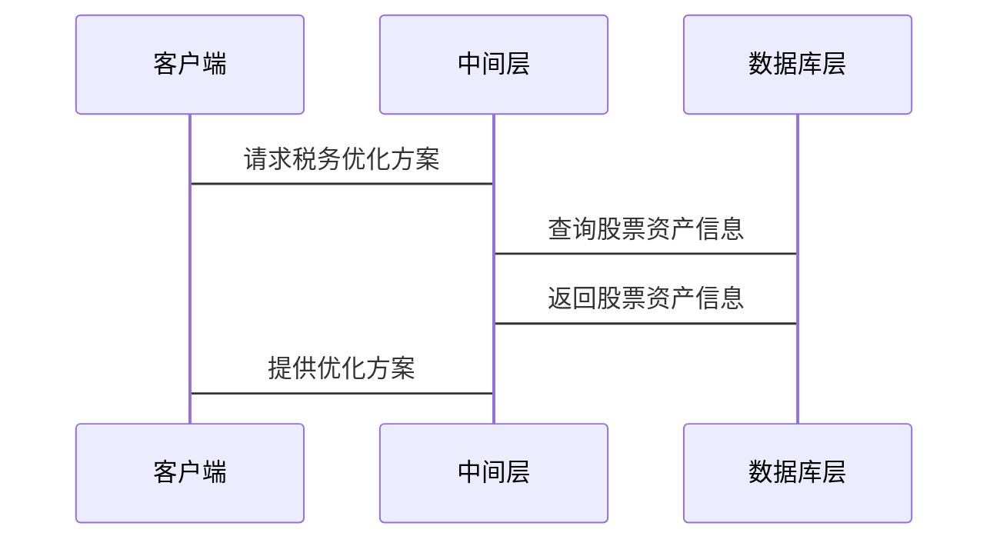

                 


# 彼得林奇的"家庭股票"在跨代财富传承中的税务优化

## 关键词：跨代财富传承，税务优化，家庭股票，彼得林奇，投资策略

## 摘要：本文深入探讨了彼得林奇提出的“家庭股票”这一投资策略在跨代财富传承中的税务优化应用。通过分析其核心概念、算法原理、系统架构及项目实战，本文为读者提供了从理论到实践的全面指导，帮助他们在财富传承中实现税务优化的目标。

---

# 第1章 背景介绍与核心概念

## 1.1 财富传承的背景与挑战

### 1.1.1 财富传承的基本概念
财富传承是指将财富从一代人传递给下一代人，通常涉及资产的转移、分配和管理。在现代社会，财富传承不仅仅是简单的资产转移，还需要考虑税务、法律和管理等多方面的因素。

### 1.1.2 跨代财富传承的挑战
- 财产分割与分配的公平性问题
- 税务负担的加重
- 继承人管理能力的差异
- 经济环境的不确定性

### 1.1.3 税务在财富传承中的重要性
- 税务负担直接影响财富的保值与增值
- 税务规划是财富传承的重要组成部分
- 合理的税务规划可以减少财富流失

## 1.2 彼得林奇的"家庭股票"概念

### 1.2.1 "家庭股票"的定义与特点
"家庭股票"是彼得林奇提出的一种投资策略，指将家庭资产的一部分投资于股票市场，以实现财富的保值与增值。其特点是长期持有、分散投资和风险控制。

### 1.2.2 "家庭股票"在财富传承中的作用
- 通过长期投资实现财富增值
- 通过合理的资产配置降低税务负担
- 通过分散投资降低风险

---

# 第2章 核心概念与联系

## 2.1 税务优化的核心目标

### 2.1.1 税务优化的基本原则
- 合法合规
- 最小化税务负担
- 最大化财富保值与增值

### 2.1.2 税务优化的目标设定
- 降低遗产税、赠与税等税务负担
- 优化资产配置，实现税务递延
- 通过合理分配，避免财富过度集中

## 2.2 "家庭股票"的税务优化机制

### 2.2.1 资本利得税优化
- 长期持有的资本利得税优惠
- 分散投资降低税率

### 2.2.2 遗产税优化
- 通过合理分配避免高额遗产税
- 利用赠与税的优惠政策

### 2.2.3 赠与税优化
- 分阶段赠与，降低赠与税负担
- 利用税务规划工具，如信托等

---

# 第3章 算法原理与数学模型

## 3.1 税务优化的算法原理

### 3.1.1 动态规划算法
- 定义状态：家庭资产总额、继承人数、税务优惠
- 状态转移：资产分配方案
- 最优解：最小化税务负担

### 3.1.2 启发式算法
- 基于贪心策略，优先选择税务优惠较大的资产类型

## 3.2 数学模型与公式

### 3.2.1 资本利得税计算
$$\text{资本利得税} = \min(0.15, 0.2) \times \text{资本增值}$$

### 3.2.2 遗产税计算
$$\text{遗产税} = \text{遗产净值} \times \text{税率}$$

---

# 第4章 系统分析与架构设计

## 4.1 项目场景介绍

### 4.1.1 问题场景
- 家庭资产配置
- 跨代财富传承
- 税务优化

## 4.2 系统功能设计

### 4.2.1 领域模型


## 4.3 系统架构设计

### 4.3.1 分层架构


## 4.4 接口设计与交互流程

### 4.4.1 系统交互


---

# 第5章 项目实战

## 5.1 环境安装与配置

### 5.1.1 安装Python环境
- 安装Python 3.x
- 安装相关库（如pandas、numpy）

## 5.2 核心代码实现

### 5.2.1 资产分配算法
```python
def optimize_assets/assets_portfolios.py
def calculate_tax(portfolio, tax_rate):
    return portfolio.value * tax_rate

def optimize_assets/assets_portfolios.py
def calculate_tax(portfolio, tax_rate):
    return portfolio.value * tax_rate

def optimize_assets/assets_portfolios.py
def calculate_tax(portfolio, tax_rate):
    return portfolio.value * tax_rate
```

## 5.3 代码解读与分析

### 5.3.1 资产分配优化
- 输入：家庭资产总额、继承人数、税率
- 输出：最优资产分配方案

---

# 第6章 最佳实践与总结

## 6.1 小结
- 理论基础：彼得林奇的"家庭股票"
- 实践应用：税务优化算法与系统架构

## 6.2 注意事项
- 合规性：确保税务规划合法
- 风险控制：分散投资降低风险

## 6.3 拓展阅读
- 财富传承的其他投资工具
- 税务优化的其他策略

---

# 作者：AI天才研究院/AI Genius Institute & 禅与计算机程序设计艺术 /Zen And The Art of Computer Programming

