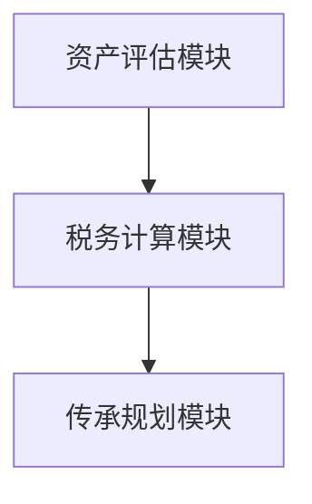
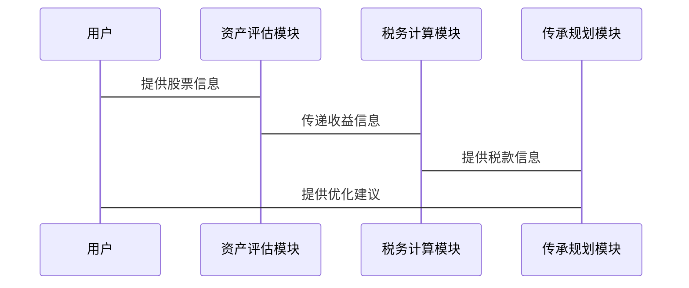

                 


```markdown
# 家庭股票在跨代财富传承中的税务效率最优化

> 关键词：跨代财富传承、税务效率优化、家庭股票、彼得·林奇、资产配置、税务规划、投资策略

> 摘要：本文将详细探讨彼得·林奇提出的“家庭股票”概念在跨代财富传承中的税务效率优化策略。通过分析家庭股票的税务属性、优化算法、系统架构以及实际案例，为读者提供从理论到实践的全面指导，帮助实现财富传承的税务最优化。

---

# 第一部分：跨代财富传承中的税务效率优化背景

## 第1章：跨代财富传承的税务问题

### 1.1 跨代财富传承的定义与挑战

#### 1.1.1 跨代财富传承的定义
跨代财富传承指的是将财富从一代人传递到下一代人，包括资产、股权、不动产等的转移。这一过程需要考虑税务、法律、家庭关系等多方面因素。

#### 1.1.2 跨代财富传承的主要挑战
- 税务负担：遗产税、赠与税等可能对财富传承造成重大影响。
- 资产贬值：在传承过程中，资产可能因市场波动而贬值。
- 家庭关系：传承过程中可能引发家庭内部矛盾。
- 法律风险：不同地区的法律差异可能影响传承效果。

#### 1.1.3 跨代财富传承的边界与外延
- 边界：仅考虑税务优化，不涉及其他如法律、家庭关系等问题。
- 外延：包括多种资产类型，如股票、房地产、现金等。

### 1.2 家庭股票在税务优化中的作用

#### 1.2.1 家庭股票的定义
家庭股票是指以家庭成员名义持有的股票，用于实现财富传承和税务优化。

#### 1.2.2 家庭股票的税务属性
- 税务优惠：某些情况下，家庭股票的税务负担较低。
- 遗产税处理：通过合理配置家庭股票，可以降低遗产税负担。

#### 1.2.3 家庭股票与跨代传承的关系
家庭股票作为一种资产形式，可以在跨代传承中发挥重要作用，尤其是通过合理配置，优化税务负担。

## 1.3 本章小结
本章介绍了跨代财富传承的基本概念、挑战以及家庭股票在其中的作用，为后续章节的深入分析奠定了基础。

---

# 第二部分：家庭股票的税务优化原理

## 第2章：家庭股票的核心概念与联系

### 2.1 家庭股票的核心原理

#### 2.1.1 家庭股票的持有结构
家庭股票通常以家庭成员名义持有，可以是个人或家族信托。

#### 2.1.2 家庭股票的税务处理
- 税务优惠：家庭股票可能享受较低的资本利得税或遗产税。
- 税务风险：需注意税务合规性，避免税务风险。

#### 2.1.3 家庭股票的传承机制
通过家族信托或其他法律结构，确保股票的顺利传承。

### 2.2 家庭股票与其他资产的对比

#### 2.2.1 家庭股票与现金资产的对比
- 税务负担：现金资产在传承中可能面临较高的遗产税。
- 流动性：家庭股票具有较高的流动性。

#### 2.2.2 家庭股票与不动产的对比
- 税务负担：不动产可能面临较高的遗产税和房产税。
- 管理复杂度：不动产管理较为复杂。

#### 2.2.3 家庭股票与信托资产的对比
- 税务优惠：信托资产可能享有税务优惠。
- 灵活性：家庭股票在传承中的灵活性较高。

### 2.3 家庭股票的税务结构设计

#### 2.3.1 家庭股票的税务优惠
- 资本利得税：通过长期持有，降低资本利得税。
- 遗产税：通过家族信托，降低遗产税负担。

#### 2.3.2 家庭股票的税务风险
- 税法变化：需关注税法变化，确保税务合规。
- 资产贬值：需考虑市场波动对股票价值的影响。

#### 2.3.3 家庭股票的税务合规性
- 税务规划：合理配置家庭股票，确保税务合规。
- 专业咨询：建议聘请税务顾问，确保合规性。

## 2.4 本章小结
本章详细分析了家庭股票的核心概念、与其他资产的对比，以及税务结构设计，为后续的优化策略奠定了基础。

---

# 第三部分：家庭股票的税务优化算法

## 第3章：家庭股票税务优化的数学模型

### 3.1 家庭股票税务优化的数学公式

#### 3.1.1 税后收益公式
$$ \text{税后收益} = \text{收益} - \text{税款} $$

#### 3.1.2 税款计算公式
$$ \text{税款} = \text{收益} \times t $$

其中，\( t \) 为税率。

### 3.2 税务优化的数学模型

#### 3.2.1 税务优化目标函数
$$ \max \text{税后收益} = \text{收益} - \text{税款} $$

#### 3.2.2 约束条件
$$ \text{税款} \leq \text{收益} \times t $$

### 3.3 税务优化的算法流程

#### 3.3.1 数据输入
- 收益：家庭股票的投资收益。
- 税率 \( t \)：适用的税率。

#### 3.3.2 税后收益计算
根据公式计算税后收益。

#### 3.3.3 优化策略
调整投资策略，以最大化税后收益。

---

## 第4章：家庭股票税务优化的系统架构

### 4.1 系统功能设计

#### 4.1.1 资产评估模块
- 功能：评估家庭股票的当前价值。
- 实现：使用股票价格数据，计算当前市值。

#### 4.1.2 税务计算模块
- 功能：计算家庭股票的税款。
- 实现：根据税率和收益，计算税款。

#### 4.1.3 传承规划模块
- 功能：制定财富传承计划。
- 实现：通过家族信托或其他法律结构，优化传承过程。

### 4.2 系统架构设计

#### 4.2.1 系统架构图


#### 4.2.2 接口设计
- 资产评估模块接口：
  - 输入：股票代码，持有时间。
  - 输出：当前市值。
- 税务计算模块接口：
  - 输入：收益，税率。
  - 输出：税款。

### 4.3 系统交互流程图



---

## 第5章：家庭股票税务优化的项目实战

### 5.1 环境安装

#### 5.1.1 安装Python
```bash
# 安装Python
sudo apt-get install python3
```

#### 5.1.2 安装相关库
```bash
# 安装pandas、numpy、matplotlib
pip install pandas numpy matplotlib
```

### 5.2 核心代码实现

#### 5.2.1 资产评估函数
```python
import pandas as pd
import numpy as np

def assess_stock_value(stock_data):
    return stock_data['close'].iloc[-1]
```

#### 5.2.2 税务计算函数
```python
def calculate_tax收益, rate):
    return 收益 * rate
```

### 5.3 实际案例分析

#### 5.3.1 案例背景
假设一个家庭持有某公司股票，价值100万元，预期收益为20%，税率15%。

#### 5.3.2 计算税后收益
$$ \text{税后收益} = 200,000 - 30,000 = 170,000 $$

### 5.4 项目小结
通过实际案例分析，验证了家庭股票税务优化算法的有效性。

---

# 第四部分：最佳实践与总结

## 第6章：家庭股票税务优化的最佳实践

### 6.1 小结
本章总结了家庭股票在跨代财富传承中的税务优化策略，强调了税务合规性和专业咨询的重要性。

### 6.2 注意事项
- 定期审查税务计划，以适应税法变化。
- 避免过度集中在某一种资产，分散风险。

### 6.3 拓展阅读
- 彼得·林奇的其他著作。
- 跨代财富传承的法律与税务规划。

---

# 作者：AI天才研究院/AI Genius Institute & 禅与计算机程序设计艺术 /Zen And The Art of Computer Programming
```

