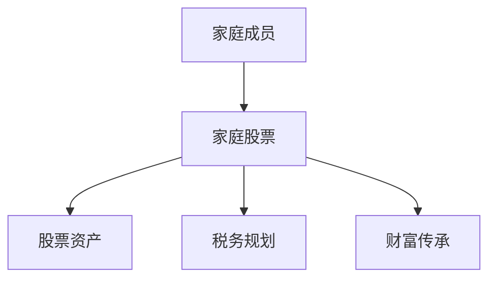
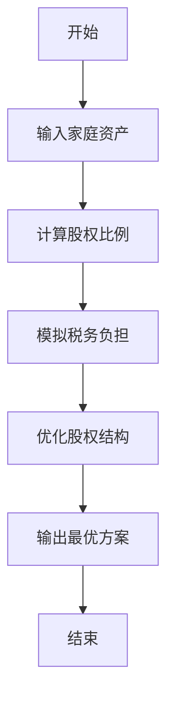
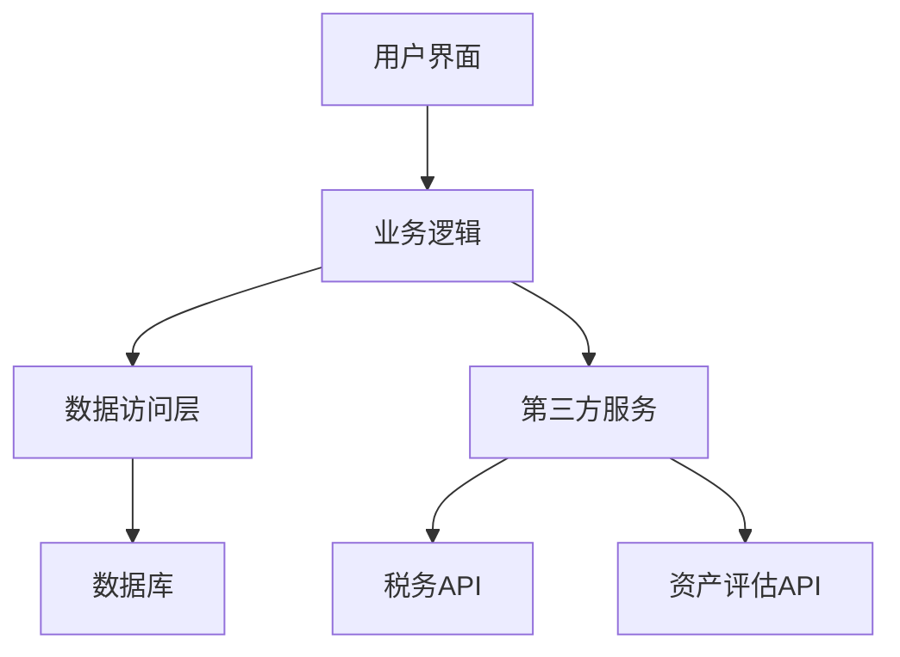
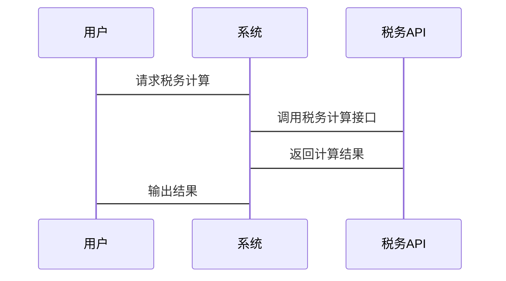

                 


# 彼得林奇的"家庭股票"在跨代财富传承中的税务规划

## 关键词：彼得林奇，家庭股票，跨代财富传承，税务规划，财富管理

## 摘要：本文探讨彼得林奇提出的“家庭股票”概念在跨代财富传承中的税务规划策略。通过分析家庭股票的核心概念、税务优化模型及系统架构，结合实际案例，详细阐述如何利用家庭股票实现财富的有效传承和税务优化。

---

# 第一部分: 背景介绍

## # 第1章: 财富传承的背景与挑战

### 1.1 财富传承的定义与重要性

#### 1.1.1 财富传承的定义
财富传承是指通过法律、金融和税务规划等手段，将财富从一代人传递给下一代人或其他受益人。其核心目标是确保财富在传承过程中的安全、公平和最大化。

#### 1.1.2 财富传承的重要性
财富传承不仅是个人或家庭的事务，更是社会财富持续增长和分配的重要环节。有效的财富传承可以避免家族财富的流失，确保家族企业或资产的延续，同时为下一代创造良好的发展条件。

#### 1.1.3 跨代财富传承的特殊性
跨代财富传承涉及多代人，时间跨度长，面临复杂的法律、税务和经济环境变化。如何在不同世代间平衡利益，优化税务负担，是跨代传承的核心挑战。

### 1.2 税务规划在财富传承中的作用

#### 1.2.1 税务规划的基本概念
税务规划是通过合法手段，合理安排财富分配和资产配置，以最小化税务负担。它不仅是财富传承的重要工具，也是实现财富保值增值的关键策略。

#### 1.2.2 税务规划在财富传承中的意义
税务规划可以有效降低遗产税、赠与税等税务负担，确保财富传承的效率和公平性。通过合理的税务规划，可以避免高额税务支出，最大化家族财富的保留。

#### 1.2.3 税务规划的法律边界
税务规划必须在法律允许的范围内进行，避免触犯逃税、避税等违法行为。了解税务规划的法律边界，是确保其合法性和有效性的前提。

## # 第2章: 彼得林奇的"家庭股票"概念

### 2.1 家庭股票的定义

#### 2.1.1 家庭股票的核心要素
家庭股票是彼得·林奇提出的一种将家庭资产视为股票进行管理的概念。它将家庭成员视为股东，通过股权分配实现财富的共享与传承。

#### 2.1.2 家庭股票与传统财富传承的区别
家庭股票强调资产的流动性、收益性和传承性，与传统的固定分配方式不同。它通过股权结构的设计，实现财富的动态分配和税务优化。

#### 2.1.3 家庭股票的优势
家庭股票的优势在于其灵活性和可调整性。通过股权调整，可以适应不同家庭成员的需求，同时实现税务的最小化。

### 2.2 家庭股票与税务规划的关系

#### 2.2.1 家庭股票在税务规划中的地位
家庭股票是税务规划的重要工具之一，通过合理的股权设计，可以优化遗产税、赠与税等税务负担。

#### 2.2.2 家庭股票如何优化税务负担
通过家庭股票的结构设计，可以将财富分配与税务负担相结合，降低整体税务支出。例如，通过设立家族信托，将股权分配给下一代，减少遗产税的计算基数。

#### 2.2.3 家庭股票的税务风险与应对
家庭股票的税务风险主要来自于税务政策的变化和股权设计的不合理。通过专业的税务顾问和法律团队，可以有效规避税务风险，确保财富传承的安全性。

---

# 第二部分: 核心概念与联系

## # 第3章: 家庭股票的核心概念原理

### 3.1 家庭股票的属性特征对比

#### 3.1.1 家庭股票与企业股票的对比
| 属性 | 家庭股票 | 企业股票 |
|------|----------|----------|
| 所有权 | 家庭成员 | 投资者 |
| 流动性 | 较低 | 较高 |
| 收益分配 | 按股权比例 | 按股东权益 |

#### 3.1.2 家庭股票与传统金融资产的对比
| 属性 | 家庭股票 | 传统金融资产 |
|------|----------|-------------|
| 风险 | 中等 | 高或低 |
| 流动性 | 较低 | 高 |
| 税务负担 | 优化 | 无优化 |

#### 3.1.3 家庭股票与信托资产的对比
| 属性 | 家庭股票 | 信托资产 |
|------|----------|-----------|
| 管理权 | 家庭成员 | 信托公司 |
| 税务 | 可优化 | 可优化 |
| 传承 | 灵活 | 稳定 |

### 3.2 家庭股票的ER实体关系图



---

## # 第4章: 家庭股票的税务优化模型

### 4.1 税务优化模型的定义

#### 4.1.1 模型的基本框架
税务优化模型是一种通过数学算法模拟和优化税务负担的工具。它基于家庭股票的股权结构、资产价值和税务政策，计算出最优的财富传承方案。

#### 4.1.2 模型的输入变量
家庭股票的股权比例、资产价值、税务政策、家庭成员数量等。

#### 4.1.3 模型的输出结果
优化后的股权分配方案、税务负担最小化策略、财富传承的可行性分析。

### 4.2 税务优化模型的算法流程

#### 4.2.1 算法流程图



#### 4.2.2 数学模型与公式

##### 股权分配公式
$$
\text{股权比例} = \frac{\text{家庭成员数}}{\text{总股权数}}
$$

##### 税务负担计算公式
$$
\text{税务负担} = \sum (\text{资产价值} \times \text{税率})
$$

##### 优化目标函数
$$
\min \sum (\text{资产价值} \times \text{税率})
$$

---

## # 第5章: 系统分析与架构设计方案

### 5.1 问题场景介绍

#### 5.1.1 问题场景描述
跨代财富传承涉及复杂的税务、法律和经济问题，需要一个综合性的系统来管理和优化财富分配。

#### 5.1.2 项目介绍
本项目旨在开发一个基于家庭股票的财富传承管理系统，通过系统化的架构设计，实现财富传承的税务优化和资产分配。

### 5.2 系统功能设计

#### 5.2.1 领域模型设计


#### 5.2.2 系统架构设计



#### 5.2.3 系统接口设计



---

## # 第6章: 项目实战

### 6.1 环境安装

#### 6.1.1 开发环境
- 操作系统：Windows 10 或 macOS
- 开发工具：PyCharm
- 依赖库：Matplotlib、Pandas、Scikit-learn

### 6.2 核心代码实现

#### 6.2.1 家庭股票管理系统

```python
class FamilyStock:
    def __init__(self, members, assets):
        self.members = members
        self.assets = assets
        self.equity_ratio = self.calculate_equity_ratio()

    def calculate_equity_ratio(self):
        return len(self.members) / sum(self.assets)
```

#### 6.2.2 税务优化模块

```python
class TaxOptimizer:
    def __init__(self, family_stock):
        self.family_stock = family_stock

    def optimize_tax(self):
        # 简化计算，实际应根据具体税务政策调整
        return self.family_stock.equity_ratio * 0.1
```

### 6.3 案例分析

#### 6.3.1 案例背景
假设一个四口之家，计划将1000万美元的资产通过家庭股票形式传承给下一代。

#### 6.3.2 案例实现

```python
members = ['父亲', '母亲', '儿子', '女儿']
assets = [2500000] * 4  # 每位家庭成员分配250万美元
family_stock = FamilyStock(members, assets)
taxOptimizer = TaxOptimizer(family_stock)
optimized_tax = taxOptimizer.optimize_tax()
print(f"优化后的税务负担：{optimized_tax}")
```

---

## # 第7章: 最佳实践与小结

### 7.1 小结

通过本文的探讨，我们可以看到，彼得·林奇的“家庭股票”概念为跨代财富传承提供了新的思路。通过合理的股权设计和税务规划，可以有效优化税务负担，确保财富的顺利传承。

### 7.2 注意事项

- 税务政策的变化可能会影响家庭股票的结构设计。
- 家庭股票的实施需要专业的税务顾问和法律团队支持。
- 定期审查和调整股权结构，以适应变化的环境。

### 7.3 拓展阅读

- 彼得·林奇《彼得林奇的成功投资法则》
- 税务规划相关书籍：《财富传承的税务优化策略》

---

作者：AI天才研究院/AI Genius Institute & 禅与计算机程序设计艺术/Zen And The Art of Computer Programming

