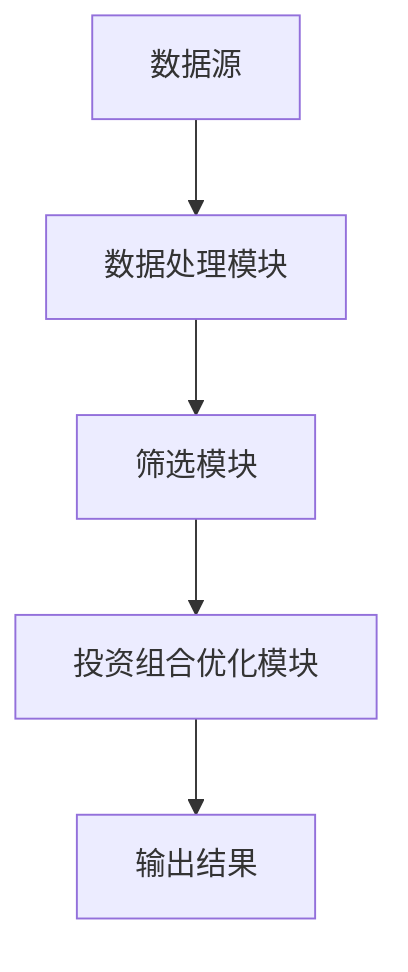

                 


# 彼得林奇的"小盘成长股"筛选策略

## 关键词：彼得·林奇，小盘成长股，投资策略，选股模型，财务指标分析，投资组合优化

## 摘要：本文深入分析了彼得·林奇的“小盘成长股”筛选策略，从背景、筛选标准、模型构建到系统实现，详细阐述了如何通过财务指标、行业分析和市场情绪等多维度筛选具有高增长潜力的小盘股。文章还结合Python代码，展示了如何将策略应用于实际投资中，并提供了最佳实践建议。

---

# 第一部分: 投资背景与核心理念

## 第1章: 投资背景与核心理念

### 1.1 投资背景

#### 1.1.1 美国股市的发展历程

- 20世纪80年代，美国股市经历了 stagflation（停滞膨胀）后的复苏，为小盘股提供了增长机会。
- 小盘股通常指市值在 $3 亿美元到 $20 亿美元之间的公司，具有高增长潜力。
- 成长股是指那些营收和净利润持续增长的公司，通常估值较高，市盈率和市净率可能超过行业平均水平。

#### 1.1.2 小盘股的定义与特点

- **定义**：小盘股通常指市值在 $3 亿美元到 $20 亿美元之间的公司，具有较高的增长潜力。
- **特点**：
  - 市值小，流动性相对较低。
  - 增长速度快，盈利能力强。
  - 风险较高，但潜在回报也高。

#### 1.1.3 成长股的投资逻辑

- 成长股的核心是营收和净利润的持续增长。
- 高成长性的公司通常在新兴行业或朝阳产业中。
- 投资者需要关注公司的成长性指标，如营收增长率、净利润增长率等。

### 1.2 彼得·林奇的投资理念

#### 1.2.1 林奇的投资风格概述

- 林奇是价值投资的代表人物之一，强调通过基本面分析寻找被低估的成长股。
- 他注重对公司基本面的深入研究，尤其是营收和利润的增长情况。
- 林奇认为，长期投资于优质成长股能够带来超额收益。

#### 1.2.2 小盘成长股的核心特征

- **高成长性**：营收和净利润持续增长。
- **低估值**：市盈率和市净率相对合理，具有上涨空间。
- **竞争优势**：公司在行业内具有独特的优势，如技术壁垒、成本优势等。

#### 1.2.3 林奇对投资者的建议

- **长期投资**：避免短期市场波动的干扰，专注于公司的长期增长。
- **深入研究**：对公司基本面进行详细分析，尤其是财务报表。
- **分散投资**：不要将所有资金投入到少数股票中，分散投资可以降低风险。

---

## 第2章: 小盘成长股的筛选标准

### 2.1 财务指标分析

#### 2.1.1 营收与净利润增长率

- **营收增长率**：衡量公司收入的增长能力。
  $$ \text{营收增长率} = \frac{\text{本期营收} - \text{上期营收}}{\text{上期营收}} \times 100\% $$
- **净利润增长率**：衡量公司盈利能力的增长。
  $$ \text{净利润增长率} = \frac{\text{本期净利润} - \text{上期净利润}}{\text{上期净利润}} \times 100\% $$

#### 2.1.2 市盈率与市净率的对比

- **市盈率（P/E）**：
  $$ \text{市盈率} = \frac{\text{股票价格}}{\text{每股净利润}} $$
- **市净率（P/B）**：
  $$ \text{市净率} = \frac{\text{股票价格}}{\text{每股净资产}} $$

#### 2.1.3 负债率与现金流分析

- **负债率**：
  $$ \text{负债率} = \frac{\text{总负债}}{\text{总资产}} \times 100\% $$
- **现金流**：关注经营活动现金流，确保公司有稳定的现金流。

### 2.2 行业分析与竞争优势

#### 2.2.1 行业前景评估

- 行业处于成长期还是成熟期。
- 行业的竞争格局，是否存在进入障碍。

#### 2.2.2 公司竞争优势分析

- 技术优势：公司是否拥有核心技术或专利。
- 成本优势：是否在行业内具有成本优势。
- 市场地位：是否是行业领导者或具有较高的市场份额。

#### 2.2.3 管理层能力评估

- 管理层的稳定性。
- 管理层的决策能力和战略眼光。

### 2.3 市场情绪与估值分析

#### 2.3.1 市场情绪对股价的影响

- 市场情绪可以通过成交量、投资者情绪指数等指标衡量。
- 避免在市场情绪过热时盲目投资。

#### 2.3.2 估值指标的综合运用

- 结合市盈率、市净率、EV/EBITDA等指标进行综合评估。
- 避免单一指标的误判。

#### 2.3.3 林奇对市场恐慌的应对策略

- 在市场恐慌时，寻找被低估的成长股。
- 保持冷静，避免恐慌性抛售。

---

## 第3章: 林奇的选股模型与策略

### 3.1 选股模型的构建

#### 3.1.1 模型的核心要素

- **营收增长率**：≥20%。
- **净利润增长率**：≥15%。
- **市盈率**：合理范围内，通常低于行业平均水平。
- **市净率**：合理范围内，通常低于行业平均水平。
- **负债率**：低于50%。

#### 3.1.2 模型的逻辑架构

1. 筛选营收和净利润持续增长的公司。
2. 计算市盈率和市净率，确保估值合理。
3. 分析公司竞争优势和行业前景。
4. 综合评估，选出符合标准的股票。

#### 3.1.3 模型的优缺点分析

- **优点**：
  - 筛选标准明确，易于操作。
  - 通过多维度分析，降低误判风险。
- **缺点**：
  - 由于小盘股的流动性较低，交易成本可能较高。
  - 市场波动可能对小盘股影响较大。

### 3.2 成长股的长期投资策略

#### 3.2.1 长期投资的逻辑

- 长期投资能够平滑短期波动，获得公司成长的收益。
- 避免频繁交易，降低交易成本和税费。

#### 3.2.2 短期波动的应对策略

- 设置止损位，避免重大损失。
- 在市场恐慌时，考虑加仓。

#### 3.2.3 林奇对市场的看法

- 林奇认为，市场短期是投票机，长期是称重机。
- 长期来看，优质成长股的表现会优于市场平均水平。

---

## 第4章: 林奇投资策略的数学模型

### 4.1 成长股筛选的量化指标

#### 4.1.1 净利润增长率公式

$$ \text{净利润增长率} = \frac{\text{本期净利润} - \text{上期净利润}}{\text{上期净利润}} \times 100\% $$

#### 4.1.2 营收增长率公式

$$ \text{营收增长率} = \frac{\text{本期营收} - \text{上期营收}}{\text{上期营收}} \times 100\% $$

#### 4.1.3 市盈率计算公式

$$ \text{市盈率} = \frac{\text{股票价格}}{\text{每股净利润}} $$

#### 4.1.4 市净率计算公式

$$ \text{市净率} = \frac{\text{股票价格}}{\text{每股净资产}} $$

### 4.2 估值指标的综合评估

#### 4.2.1 综合估值指数

$$ \text{综合估值指数} = 0.4 \times \text{市盈率} + 0.6 \times \text{市净率} $$

---

## 第5章: 系统分析与架构设计

### 5.1 系统功能设计

#### 5.1.1 数据收集模块

- 从股票数据库中获取历史数据。
- 包括营收、净利润、市盈率、市净率等指标。

#### 5.1.2 筛选模块

- 根据量化指标筛选符合条件的股票。
- 输出候选股票列表。

#### 5.1.3 投资组合优化模块

- 根据风险承受能力分配权重。
- 生成投资组合。

### 5.2 系统架构设计



---

## 第6章: 项目实战与代码实现

### 6.1 项目实战

#### 6.1.1 环境安装

- 安装Python和相关库：
  ```bash
  pip install pandas numpy matplotlib
  ```

#### 6.1.2 数据获取

- 使用Yahoo Finance API获取股票数据。

#### 6.1.3 筛选代码

```python
import pandas as pd
import numpy as np

# 假设data是一个包含股票数据的DataFrame
data = pd.read_csv('stock_data.csv')

# 计算营收增长率
data['营收增长率'] = (data['本期营收'] - data['上期营收']) / data['上期营收'] * 100
# 计算净利润增长率
data['净利润增长率'] = (data['本期净利润'] - data['上期净利润']) / data['上期净利润'] * 100
# 计算市盈率
data['市盈率'] = data['股票价格'] / data['每股净利润']
# 计算市净率
data['市净率'] = data['股票价格'] / data['每股净资产']

# 筛选条件：营收增长率 >= 20%，净利润增长率 >= 15%，市盈率 < 行业平均，市净率 < 行业平均
筛选结果 = data[(data['营收增长率'] >= 20) & (data['净利润增长率'] >= 15) & (data['市盈率'] < data['行业平均市盈率']) & (data['市净率'] < data['行业平均市净率'])]
```

---

## 第7章: 最佳实践与总结

### 7.1 最佳实践

- **长期持有**：避免频繁交易，获得公司成长的收益。
- **分散投资**：降低投资风险。
- **持续学习**：关注行业动态和公司基本面。

### 7.2 总结

彼得·林奇的“小盘成长股”筛选策略通过多维度分析，帮助投资者发现具有高增长潜力的公司。虽然小盘股风险较高，但长期投资优质成长股能够带来超额收益。

---

## 作者：AI天才研究院 & 禅与计算机程序设计艺术

---

### 结语

本文通过详细分析彼得·林奇的“小盘成长股”筛选策略，结合理论与实践，为投资者提供了有效的投资方法。希望读者能够通过本文，掌握如何筛选优质成长股，并在实际投资中获得成功。

