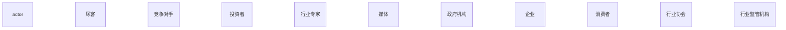
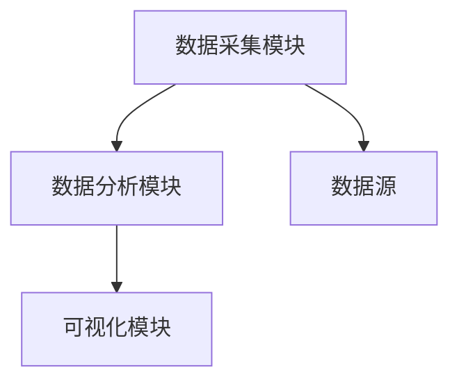
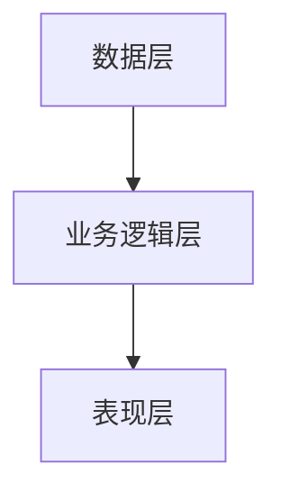
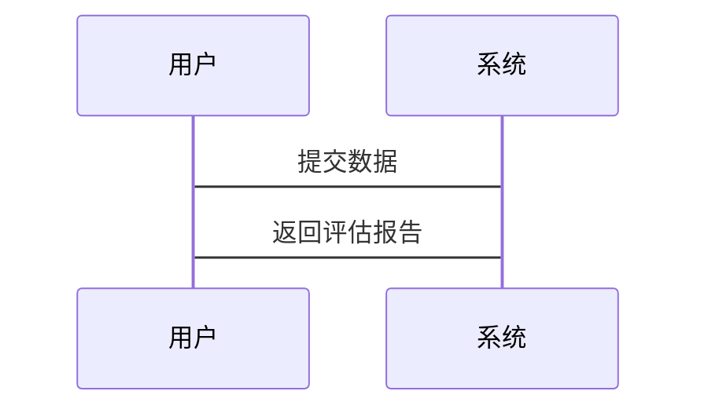

                 


# 彼得林奇的"市场先行者"优势持续性评估方法

## 关键词
- 彼得林奇、市场先行者、优势持续性、评估方法、投资策略

## 摘要
本文详细探讨了彼得林奇提出的“市场先行者”优势的持续性评估方法，分析了其在投资策略中的重要性。通过系统分析与架构设计，结合实际案例和数学模型，本文提供了如何评估和保持市场领先地位的深度见解，为投资者和企业管理者提供了实用的策略和工具。

---

# 第一部分：市场先行者优势的背景与概念

## 第1章：市场先行者优势概述

### 1.1 市场先行者优势的定义

#### 1.1.1 什么是市场先行者
市场先行者是指在某个市场或领域中，最早进入市场并占据领先地位的企业。这些企业通常拥有先发优势，能够快速建立品牌认知和市场占有率。

#### 1.1.2 市场先行者的优势特征
市场先行者的优势特征包括：
1. **先发优势**：能够快速抢占市场，建立品牌和客户基础。
2. **技术创新**：往往引领技术发展，推动行业进步。
3. **市场主导地位**：能够影响市场规则和消费者偏好。

#### 1.1.3 市场先行者与竞争对手的对比
通过对比表格，我们可以清晰地看到市场先行者与竞争对手在市场地位、创新能力和客户忠诚度等方面的差异。

| 对比维度       | 市场先行者优势 | 竞争对手劣势 |
|----------------|----------------|---------------|
| 市场占有率     | 高             | 低             |
| 技术创新       | 引领行业       | 跟踪模仿       |
| 品牌影响力     | 强             | 较弱           |
| 客户忠诚度     | 高             | 低             |

### 1.2 市场先行者优势的重要性

#### 1.2.1 市场先行者对企业发展的战略意义
市场先行者能够通过先发优势，快速扩大市场份额，降低成本，提高利润率。同时，市场先行者能够塑造行业标准，影响消费者行为，从而在竞争中占据主动地位。

#### 1.2.2 市场先行者在投资中的价值
在投资领域，市场先行者通常被视为优质投资标的，因其具有较高的市场占有率和品牌影响力，能够为投资者带来稳定收益和长期增值。

#### 1.2.3 市场先行者优势的长期性分析
市场先行者的优势并非一成不变，随着时间推移和市场竞争加剧，优势可能逐渐减弱。因此，企业需要持续创新和优化，以保持市场领先地位。

---

## 第2章：市场先行者优势的构成要素

### 2.1 核心概念与联系

#### 2.1.1 市场先行者优势的构成要素
市场先行者优势的构成要素主要包括：
1. **产品创新**：持续推出创新产品，满足市场需求。
2. **品牌影响力**：强大的品牌形象和品牌价值。
3. **成本优势**：通过规模经济和效率提升降低成本。
4. **客户忠诚度**：建立稳定的客户群体，提高客户黏性。

#### 2.1.2 各要素之间的关系
各要素之间相互关联，共同构成市场先行者优势。例如，产品创新能够提升品牌影响力，而成本优势则有助于提高市场竞争力。

#### 2.1.3 用Mermaid绘制的ER实体关系图



### 2.2 优势持续性的关键因素

#### 2.2.1 技术创新对持续性的推动作用
技术创新是市场先行者保持优势的核心因素。通过不断推出新产品和改进技术，企业能够巩固其市场地位。

#### 2.2.2 品牌影响力与客户忠诚度
强大的品牌影响力和高客户忠诚度能够帮助企业抵御竞争对手的冲击，保持市场领先地位。

#### 2.2.3 成本优势与市场竞争力
成本优势能够使企业在价格竞争中占据优势，同时也有助于提高利润率和投资回报率。

---

# 第二部分：市场先行者优势的评估方法

## 第3章：市场先行者优势的评估指标

### 3.1 定性评估方法

#### 3.1.1 企业市场地位的评估
企业市场地位的评估包括市场份额、市场影响力、品牌认知度等指标。

#### 3.1.2 市场份额的分析
市场份额是衡量市场先行者优势的重要指标。市场份额越高，企业的市场地位越稳固。

#### 3.1.3 产品差异化程度的评估
产品差异化程度反映了企业在市场中的独特性和创新性。差异化程度越高，竞争优势越明显。

### 3.2 定量评估方法

#### 3.2.1 市场增长率的计算
市场增长率的计算公式如下：

$$市场增长率 = \frac{当前市场份额 - 历史市场份额}{历史市场份额} \times 100\%$$

#### 3.2.2 市场集中度的分析
市场集中度反映了市场中主要企业的市场份额集中程度。常用的市场集中度指标包括CR4（前四大企业市场份额之和）和CR8（前八大企业市场份额之和）。

#### 3.2.3 竞争对手的威胁评估
竞争对手的威胁评估包括分析竞争对手的市场地位、产品创新能力和资源实力。

---

## 第4章：市场先行者优势持续性的数学模型

### 4.1 评估模型的构建

#### 4.1.1 模型的输入变量
- 市场份额
- 市场增长率
- 竞争对手威胁
- 产品创新性
- 品牌影响力

#### 4.1.2 模型的输出结果
- 市场先行者优势持续性指数
- 市场地位评估等级

#### 4.1.3 模型的适用范围
适用于技术领先型企业和创新型企业，尤其适用于技术驱动型市场。

### 4.2 数学公式与模型分析

#### 4.2.1 用Latex表示的市场占有率公式
$$市场占有率 = \frac{企业销售额}{市场总销售额} \times 100\%$$

#### 4.2.2 用Latex表示的竞争优势指数
$$竞争优势指数 = \frac{市场份额}{行业平均市场份额} \times 100\%$$

### 4.3 案例分析与应用

#### 4.3.1 某行业市场先行者的案例分析
以某科技公司为例，计算其市场占有率和竞争优势指数，评估其市场先行者优势的持续性。

#### 4.3.2 模型在实际中的应用效果
通过实际案例分析，验证模型的有效性和准确性，为企业提供可操作的评估方法。

---

# 第三部分：市场先行者优势的系统分析与架构设计

## 第5章：系统分析与架构设计

### 5.1 系统功能设计

#### 5.1.1 系统功能模块划分
- 数据采集模块：收集市场数据和竞争对手信息。
- 数据分析模块：对数据进行处理和分析，生成评估报告。
- 可视化模块：将分析结果以图表形式展示，便于决策者理解。

#### 5.1.2 各模块的功能描述
- 数据采集模块：通过网络爬虫和API接口获取市场数据。
- 数据分析模块：使用统计分析和机器学习算法对数据进行处理。
- 可视化模块：生成市场占有率、竞争优势指数等图表。

#### 5.1.3 用Mermaid绘制的系统功能模块图



### 5.2 系统架构设计

#### 5.2.1 系统架构设计
采用分层架构，包括数据层、业务逻辑层和表现层。

#### 5.2.2 用Mermaid绘制的系统架构图



### 5.3 系统接口设计

#### 5.3.1 数据接口设计
- 数据输入接口：接收市场数据和竞争对手信息。
- 数据输出接口：生成评估报告和可视化图表。

#### 5.3.2 系统交互设计
- 用户通过界面对系统进行操作，包括数据输入、分析请求和结果查看。

### 5.4 系统交互设计

#### 5.4.1 用Mermaid绘制的系统交互序列图



---

## 第6章：项目实战与最佳实践

### 6.1 项目实战

#### 6.1.1 环境安装
- 安装Python和相关库（如Pandas、Matplotlib、Scikit-learn）。
- 安装Mermaid和LaTeX工具。

#### 6.1.2 核心代码实现

```python
import pandas as pd
import matplotlib.pyplot as plt

# 数据采集模块
def collect_data():
    # 示例数据
    data = {'公司': ['A', 'B', 'C'], '市场份额': [30, 25, 45]}
    return pd.DataFrame(data)

# 数据分析模块
def analyze_data(df):
    market_share = df['市场份额'].mean()
    return market_share

# 可视化模块
def visualize_data(df):
    plt.bar(df['公司'], df['市场份额'])
    plt.title('市场份额分布')
    plt.show()

# 主程序
def main():
    df = collect_data()
    market_share = analyze_data(df)
    visualize_data(df)
    print(f'平均市场份额为：{market_share}%')

if __name__ == '__main__':
    main()
```

#### 6.1.3 代码解读与分析
- 数据采集模块：从数据源获取市场数据并存储在DataFrame中。
- 数据分析模块：计算市场份额的平均值。
- 可视化模块：以柱状图形式展示市场份额分布。

#### 6.1.4 案例分析与详细解读
通过具体案例分析，展示如何应用上述代码和模型进行市场先行者优势的评估。

### 6.2 最佳实践

#### 6.2.1 投资策略建议
- 选择市场先行者企业进行投资，关注其技术创新和市场地位。
- 定期评估企业的市场地位和竞争优势指数，及时调整投资策略。

#### 6.2.2 风险管理注意事项
- 评估市场先行者优势的持续性，识别潜在风险。
- 分散投资，降低市场波动带来的风险。

#### 6.2.3 拓展阅读与学习
- 阅读彼得林奇的相关著作，深入了解市场先行者概念。
- 学习更多的市场分析工具和方法，提升评估能力。

---

## 第四部分：总结与展望

### 7.1 总结
彼得林奇的市场先行者优势持续性评估方法为企业提供了重要的战略指导。通过定性与定量分析的结合，企业能够准确评估自身优势，并制定有效的竞争策略。

### 7.2 展望
未来，随着市场竞争的加剧和技术的进步，市场先行者优势的评估方法将更加多元化和智能化。企业需要不断创新，以保持市场领先地位。

---

## 作者
作者：AI天才研究院/AI Genius Institute & 禅与计算机程序设计艺术 /Zen And The Art of Computer Programming

---

以上是完整的博客文章内容，涵盖了市场先行者优势的背景、构成要素、评估方法、系统分析以及实际案例分析。通过本文，读者可以深入了解彼得林奇的市场先行者优势持续性评估方法，并能够将其应用于实际投资和企业管理中。

