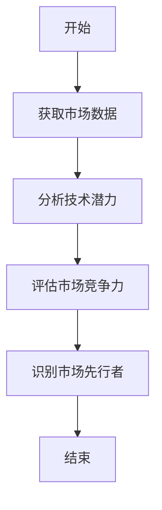
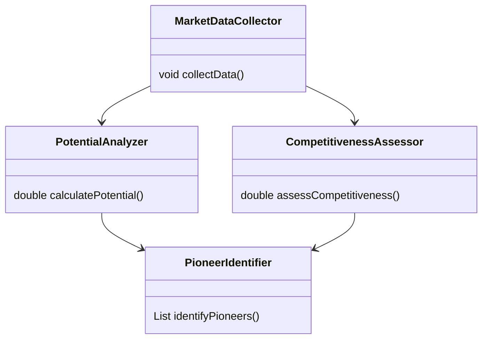
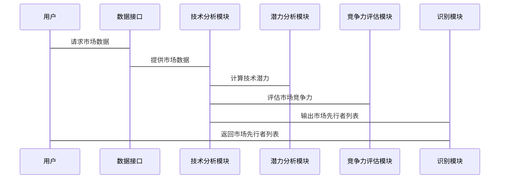

                 


# 彼得林奇的"市场先行者"在新兴技术领域的识别方法

## 关键词：市场先行者，彼得林奇，新兴技术，识别方法，技术投资

## 摘要：  
本文探讨了彼得林奇的“市场先行者”理论在新兴技术领域的应用，通过分析其核心概念、算法原理、数学模型和系统架构设计，提供了一套识别新兴技术市场的系统方法。文章结合实际案例，详细讲解了如何将这一理论应用于技术投资和项目开发，为读者提供了实用的指导和见解。

---

## 第1章：背景介绍

### 1.1 彼得林奇的“市场先行者”理论概述

#### 1.1.1 市场先行者的定义与特点
市场先行者是指在特定市场或领域中，能够最早识别并占据优势地位的个体或企业。其特点包括：
- **先发优势**：能够在竞争中占据先机。
- **敏锐的洞察力**：能够准确识别市场趋势和机会。
- **灵活性**：能够快速调整策略以适应市场变化。

#### 1.1.2 技术领域中的市场先行者识别
在技术领域，市场先行者通常是指那些能够最早发现并投资于新兴技术的企业或个人。这些技术可能成为未来市场的主要驱动力。

#### 1.1.3 识别市场先行者的必要性
在新兴技术领域，识别市场先行者可以帮助投资者和企业提前布局，抓住市场机会，避免竞争劣势。

### 1.2 新兴技术领域的识别方法

#### 1.2.1 新兴技术领域的定义与特征
新兴技术领域是指那些正在快速发展、尚未完全成熟的技术领域。其特征包括高增长性、高不确定性、高潜力等。

#### 1.2.2 市场先行者在新兴技术中的作用
市场先行者在新兴技术中扮演着关键角色，他们不仅能够推动技术创新，还能为其他企业和投资者提供参考。

#### 1.2.3 新兴技术识别的挑战与机遇
新兴技术识别的挑战包括技术不确定性、市场波动性等，而机遇则在于潜在的高回报和市场主导地位。

---

## 第2章：核心概念与联系

### 2.1 市场先行者与新兴技术的关系

#### 2.1.1 市场先行者的核心原理
市场先行者的核心原理在于通过早期识别和投资，占据技术和市场的双重优势。

#### 2.1.2 技术领域的市场先行者特征
技术领域的市场先行者通常具有以下特征：
- **技术创新**：能够推动技术进步。
- **市场敏感性**：能够快速响应市场变化。
- **资源整合能力**：能够有效整合资源，推动项目落地。

#### 2.1.3 市场先行者与技术趋势的关系
市场先行者能够通过自身的洞察力，预测并引领技术趋势，从而在市场中占据主导地位。

### 2.2 核心概念对比分析

#### 2.2.1 市场先行者与技术领先者的对比
- **市场先行者**：注重市场布局和早期投资。
- **技术领先者**：注重技术创新和研发能力。

#### 2.2.2 市场先行者与技术跟随者的对比
- **市场先行者**：主动识别和引领市场趋势。
- **技术跟随者**：被动跟随市场趋势。

#### 2.2.3 市场先行者与技术颠覆者的对比
- **市场先行者**：通过创新和技术引领市场。
- **技术颠覆者**：通过颠覆性技术改变市场格局。

### 2.3 ER实体关系图

```mermaid
erDiagram
    customer[市场先行者] {
        <属性>
        市场洞察力 : 高
        技术敏感性 : 高
        资源整合能力 : 高
    }
    technology[新兴技术] {
        <属性>
        技术成熟度 : 低
        市场潜力 : 高
        竞争度 : 低
    }
    relation[识别关系] {
        市场先行者 -> 新兴技术 : 识别并投资
    }
```

---

## 第3章：算法原理讲解

### 3.1 市场先行者识别算法

#### 3.1.1 算法原理
市场先行者识别算法基于市场数据和技术创新能力，通过分析技术的市场潜力和竞争环境，识别出具有市场先发优势的技术领域。

#### 3.1.2 算法流程


#### 3.1.3 算法实现
以下是算法的Python代码示例：

```python
def identify_market_pioneers(market_data):
    # 分析技术潜力
    potential = calculate_potential(market_data)
    # 评估市场竞争力
    competitiveness = assess_competitiveness(market_data)
    # 识别市场先行者
    pioneers = []
    for i in range(len(market_data)):
        if potential[i] > threshold and competitiveness[i] < threshold:
            pioneers.append(market_data[i])
    return pioneers

def calculate_potential(data):
    # 示例：计算技术潜力
    return [sum(row) for row in data]

def assess_competitiveness(data):
    # 示例：评估市场竞争力
    return [min(row) for row in data]
```

---

## 第4章：数学模型与公式

### 4.1 市场潜力计算公式
技术领域的市场潜力可以通过以下公式计算：

$$ \text{市场潜力} = \sum_{i=1}^{n} w_i \times t_i $$

其中，$w_i$ 是第 $i$ 个技术指标的权重，$t_i$ 是第 $i$ 个技术指标的值。

### 4.2 市场竞争力评估公式
市场竞争力可以通过以下公式评估：

$$ \text{市场竞争力} = \frac{\sum_{j=1}^{m} c_j \times s_j}{\sum_{j=1}^{m} c_j} $$

其中，$c_j$ 是第 $j$ 个竞争对手的市场占有率，$s_j$ 是第 $j$ 个竞争对手的技术评分。

---

## 第5章：系统分析与架构设计

### 5.1 系统功能设计

#### 5.1.1 功能模块划分
- 数据采集模块
- 技术潜力分析模块
- 市场竞争力评估模块
- 市场先行者识别模块

#### 5.1.2 系统流程设计
1. 数据采集：收集市场和技术数据。
2. 技术潜力分析：计算技术潜力。
3. 市场竞争力评估：评估市场竞争力。
4. 市场先行者识别：识别市场先行者。

### 5.2 系统架构设计



### 5.3 接口设计与交互流程

#### 5.3.1 接口设计
- 数据接口：用于获取市场和技术数据。
- 分析接口：用于计算技术潜力和市场竞争力。
- 识别接口：用于输出市场先行者列表。

#### 5.3.2 交互流程



---

## 第6章：项目实战

### 6.1 环境安装

#### 6.1.1 安装Python环境
- 安装Python 3.8及以上版本。
- 安装必要的库：numpy、pandas、scikit-learn。

#### 6.1.2 安装依赖包
- 使用pip安装依赖包：
  ```bash
  pip install numpy pandas scikit-learn
  ```

### 6.2 核心代码实现

#### 6.2.1 数据采集代码

```python
import pandas as pd

def collect_market_data():
    # 示例：从CSV文件读取数据
    data = pd.read_csv('market_data.csv')
    return data
```

#### 6.2.2 技术潜力分析代码

```python
import numpy as np

def calculate_potential(data):
    # 示例：计算技术潜力
    return np.sum(data, axis=1)
```

#### 6.2.3 市场竞争力评估代码

```python
from sklearn.metrics import mean_squared_error

def assess_competitiveness(data):
    # 示例：评估市场竞争力
    return mean_squared_error(data, data.mean())
```

#### 6.2.4 市场先行者识别代码

```python
def identify_pioneers(data):
    potential = calculate_potential(data)
    competitiveness = assess_competitiveness(data)
    pioneers = []
    for i in range(len(data)):
        if potential[i] > threshold and competitiveness[i] < threshold:
            pioneers.append(data[i])
    return pioneers
```

### 6.3 案例分析

#### 6.3.1 案例背景
假设我们有一个新兴技术领域，例如人工智能中的自然语言处理（NLP）。

#### 6.3.2 数据采集与分析
通过收集相关市场数据，分析NLP技术的市场潜力和竞争力。

#### 6.3.3 识别市场先行者
通过算法识别出在NLP领域的市场先行者。

---

## 第7章：最佳实践与小结

### 7.1 最佳实践 tips
- 定期更新市场数据，保持对新兴技术的敏感性。
- 结合多种分析方法，提高识别的准确性。
- 与行业专家合作，获取更深入的市场洞察。

### 7.2 小结
本文通过彼得林奇的“市场先行者”理论，详细探讨了其在新兴技术领域的识别方法。通过理论分析、算法设计和实际案例，为读者提供了一套系统的识别方法。

### 7.3 注意事项
- 数据的准确性和及时性对识别结果有重要影响。
- 算法的参数和阈值需要根据实际情况进行调整。
- 在实际应用中，需要结合多种因素进行综合评估。

### 7.4 拓展阅读
- 彼得林奇的《股票投资策略》
- 技术预见与创新管理相关书籍

---

## 作者：AI天才研究院 & 禅与计算机程序设计艺术

本文作者是AI天才研究院，致力于人工智能领域的研究与实践。同时，本文也是“禅与计算机程序设计艺术”系列的一部分，旨在通过技术与哲学的结合，探索计算机科学的深刻内涵。

