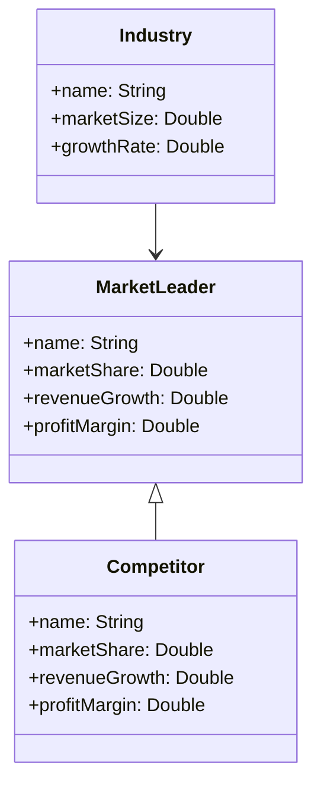
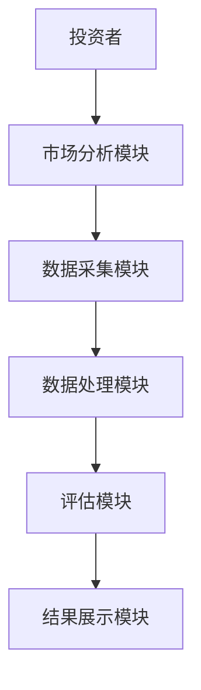

                 


# 彼得林奇的"市场先行者"识别方法

> 关键词：彼得林奇、市场先行者、投资策略、企业分析、识别方法

> 摘要：本文深入探讨了彼得林奇的市场先行者识别方法，分析了其核心概念、识别原理、系统设计和实际应用，结合具体案例和系统架构，帮助投资者有效识别和投资市场先行者企业。

---

## 第1章：彼得林奇与市场先行者概述

### 1.1 彼得林奇及其投资理念

#### 1.1.1 彼得林奇的生平简介
彼得·林奇（Peter Lynch）是美国著名的投资专家，被誉为“最佳基金经理”。他管理麦哲伦基金期间，基金年平均回报率达到29%，远超市场平均水平。林奇的成功源于他对市场的深刻理解及独特的投资策略。

#### 1.1.2 彼得林奇的投资哲学
林奇的投资哲学强调长期投资和深入研究，他认为市场中的机会源于对公司基本面的深入分析。他的投资策略注重挖掘那些在市场中处于领先地位的公司，即“市场先行者”。

#### 1.1.3 市场先行者的定义与核心概念
市场先行者是指在特定行业中占据领先地位，能够引领市场趋势并影响行业发展的公司。这些公司通常具备强大的市场影响力和创新能力，是投资的优质标的。

### 1.2 市场先行者识别方法的背景与意义
#### 1.2.1 投资者面临的挑战
在复杂的市场环境中，投资者需要准确识别市场趋势和潜力股，但传统方法往往依赖市场波动和短期数据，难以长期稳定盈利。

#### 1.2.2 市场先行者识别方法的提出
林奇提出了一套基于市场潜力和公司竞争力的识别方法，帮助投资者筛选出具有长期增长潜力的企业。

#### 1.2.3 方法在投资中的应用价值
该方法通过分析行业趋势和公司基本面，帮助投资者在早期阶段发现具有增长潜力的企业，从而实现超额收益。

---

## 第2章：市场先行者的核心特征分析

### 2.1 市场先行者的定义与属性

#### 2.1.1 市场先行者的定义
市场先行者是指在产品、服务或技术上具有创新性和领先性，能够在市场中占据主导地位的公司。

#### 2.1.2 核心属性特征
- **创新性**：具备独特的产品或技术优势。
- **市场领导地位**：在行业市场份额中占据领先地位。
- **持续增长能力**：具备稳定的收入和利润增长能力。

#### 2.1.3 与非市场先行者的对比分析
| 特征                | 市场先行者           | 非市场先行者        |
|---------------------|---------------------|--------------------|
| 市场份额            | 高                  | 低或中等           |
| 创新能力            | 强                  | 弱                 |
| 增长潜力            | 高                  | 低或无             |

### 2.2 市场先行者的成功要素

#### 2.2.1 创新能力
市场先行者必须具备持续创新能力，能够推出符合市场需求的产品或服务。

#### 2.2.2 执行力
公司需要高效执行战略，将创新转化为实际收益。

#### 2.2.3 行业趋势与时机
选择处于上升期的行业，并在合适时机进入市场，是成为市场先行者的关键。

---

## 第3章：市场先行者识别方法的核心原理

### 3.1 识别方法的逻辑框架

#### 3.1.1 从市场趋势到公司选择的逻辑
通过分析行业趋势，识别具有增长潜力的行业，进而筛选出在该行业中具备竞争优势的公司。

#### 3.1.2 关键步骤
1. 分析行业趋势和市场规模。
2. 评估公司的竞争优势和财务状况。
3. 识别公司的创新能力和执行能力。
4. 综合评估，筛选出市场先行者。

### 3.2 识别方法的数学模型与公式

#### 3.2.1 市场潜力评估模型
$$ \text{市场潜力} = \text{市场规模} \times \text{增长率} $$

#### 3.2.2 公司竞争力评分公式
$$ \text{竞争力评分} = \frac{(\text{收入增长率} + \text{净利润率})}{2} $$

#### 3.2.3 市场先行者指数计算
$$ \text{市场先行者指数} = \text{市场潜力} \times \text{竞争力评分} $$

---

## 第4章：市场先行者识别方法的系统分析

### 4.1 系统分析框架

#### 4.1.1 问题场景描述
投资者需要在众多公司中识别出具备市场领导地位的公司，以实现长期投资收益。

#### 4.1.2 系统功能设计（领域模型）



#### 4.1.3 系统架构设计



---

## 第5章：市场先行者识别方法的项目实战

### 5.1 项目环境与工具安装

#### 5.1.1 环境配置
需要安装Python、Pandas、Matplotlib等工具。

#### 5.1.2 工具安装
```bash
pip install pandas matplotlib numpy
```

### 5.2 核心实现源代码

#### 5.2.1 数据分析代码

```python
import pandas as pd
import numpy as np

# 假设我们有一个公司数据集
companies = pd.DataFrame({
    'name': ['Company A', 'Company B', 'Company C'],
    'market_share': [0.3, 0.2, 0.1],
    'revenue_growth': [0.2, 0.15, 0.1],
    'profit_margin': [0.1, 0.08, 0.05]
})

# 计算竞争力评分
companies['competitiveness_score'] = (companies['revenue_growth'] + companies['profit_margin']) / 2

# 计算市场潜力
market_potential = companies['market_share'] * companies['growth_rate']

print(companies)
```

### 5.3 实际案例分析

#### 5.3.1 案例选择
以科技行业为例，分析苹果公司的市场先行者特征。

#### 5.3.2 分析步骤
1. 分析苹果在科技行业的市场地位。
2. 评估其创新能力和财务状况。
3. 计算市场潜力和竞争力评分。

---

## 第6章：最佳实践与小结

### 6.1 最佳实践 Tips

- **持续学习**：市场环境不断变化，需持续关注行业趋势。
- **分散投资**：避免过度集中，降低风险。
- **长期视角**：投资市场先行者需要耐心和长期持有。

### 6.2 小结
彼得林奇的市场先行者识别方法为投资者提供了一套科学的分析框架，帮助识别具有长期增长潜力的企业。通过系统化的分析和实际案例，投资者可以有效应用这些方法，实现稳健投资回报。

### 6.3 注意事项
- 该方法需结合市场实际情况灵活运用。
- 财务数据需准确可靠，避免分析偏差。
- 投资需谨慎，建议在专业指导下进行。

### 6.4 拓展阅读
- 彼得林奇的《彼得·林奇投资学》
- 其他投资策略书籍

---

## 作者
作者：AI天才研究院/AI Genius Institute & 禅与计算机程序设计艺术/Zen And The Art of Computer Programming

