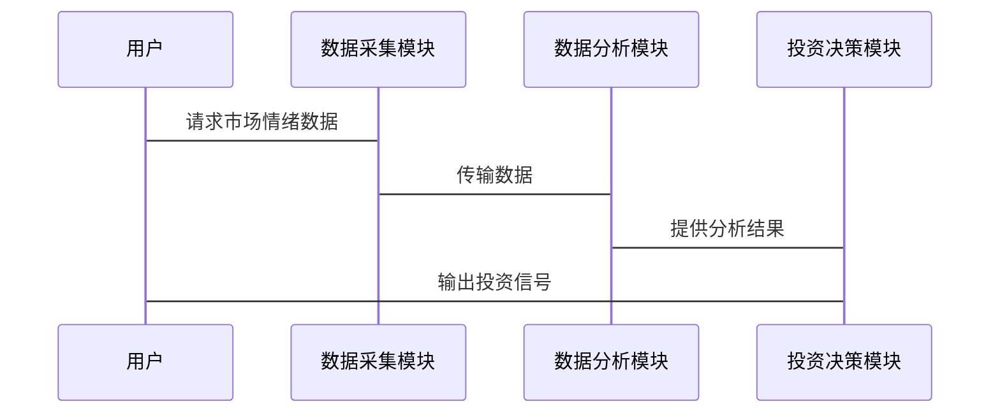

                 


# 彼得林奇的"市场情绪"利用技巧

## 关键词：
彼得林奇，市场情绪，投资策略，量化分析，交易系统，逆向投资

## 摘要：
本文深入探讨了投资大师彼得·林奇如何利用市场情绪进行投资的技巧。通过分析市场情绪的基本概念、彼得林奇的核心策略、量化分析方法、系统架构设计以及实际项目案例，本文详细阐述了如何将市场情绪应用于投资决策中，帮助读者掌握市场情绪的利用技巧，提升投资收益。

---

## 第一部分：引言

## 第1章：彼得林奇与市场情绪概述

### 1.1 彼得林奇的背景与投资理念

- **1.1.1 彼得林奇的生平简介**
  彼得·林奇（Peter Lynch）是美国著名投资经理人，被誉为“共同基金先生”。他在富达投资管理公司的麦哲伦基金任职期间，创造了令人瞩目的投资业绩，管理资产规模高达140亿美元，年均回报率超过29%。

- **1.1.2 彼得林奇的投资哲学**
  彼得林奇主张逆向投资，强调在市场恐慌时买入，在市场疯狂时卖出。他认为市场情绪是投资决策的重要因素，尤其是市场恐慌时往往隐藏着投资机会。

- **1.1.3 市场情绪在投资中的重要性**
  市场情绪影响着投资者的决策，从而影响资产价格。通过分析市场情绪，投资者可以更好地捕捉市场波动中的机会。

### 1.2 市场情绪的基本概念

- **1.2.1 市场情绪的定义与分类**
  市场情绪是指投资者在市场中的心理状态，通常分为乐观、中性、悲观三种状态。乐观情绪导致资产价格上涨，悲观情绪导致资产价格下跌。

- **1.2.2 市场情绪的影响因素**
  市场情绪受多种因素影响，包括经济数据、政策变化、市场新闻等。例如，经济衰退可能导致市场情绪转向悲观，而利好政策可能提振市场情绪。

- **1.2.3 市场情绪与市场周期的关系**
  市场情绪与市场周期密切相关，市场从乐观到恐慌再到乐观的循环中，情绪的变化是推动市场波动的主要动力。

---

## 第二部分：市场情绪的分析与利用

## 第2章：彼得林奇的市场情绪利用技巧

### 2.1 市场情绪分析的核心原则

- **2.1.1 市场情绪的波动性与周期性**
  市场情绪具有周期性，通常经历乐观、狂热、恐慌和低迷四个阶段。投资者需要识别这些阶段，以便做出相应的投资决策。

- **2.1.2 市场情绪与资产价格的关系**
  市场情绪是资产价格波动的重要驱动因素。当市场情绪高涨时，资产价格可能被高估；当市场情绪低落时，资产价格可能被低估。

- **2.1.3 市场情绪的预测与利用**
  通过分析市场情绪的变化，投资者可以提前预测市场走势，从而做出更明智的投资决策。

### 2.2 彼得林奇的逆向投资策略

- **2.2.1 逆向投资的定义与特点**
  逆向投资是指在市场恐慌时买入，在市场狂热时卖出。这种策略要求投资者在市场情绪低落时保持冷静，寻找被市场低估的投资机会。

- **2.2.2 市场恐慌时的投资机会**
  当市场情绪极度悲观时，许多资产价格被低估，此时买入优质资产，往往能在市场情绪回暖时获得超额收益。

- **2.2.3 如何识别市场恐慌情绪**
  识别市场恐慌情绪可以通过观察市场指标，如恐慌指数（VIX）、投资者情绪指数等。当这些指标显示市场情绪极度悲观时，可能是买入的好时机。

### 2.3 市场情绪周期的应用

- **2.3.1 市场情绪周期的四个阶段**
  市场情绪周期通常分为四个阶段：乐观、狂热、恐慌和低迷。每个阶段对应不同的市场表现和投资策略。

- **2.3.2 不同阶段的投资策略**
  - 乐观阶段：适度配置资产，避免过度乐观。
  - 狂热阶段：警惕市场泡沫，考虑逐步减仓。
  - 恐慌阶段：寻找被市场错杀的优质资产，积极布局。
  - �低迷阶段：保持耐心，等待市场情绪回升。

- **2.3.3 市场情绪周期的案例分析**
  以2008年金融危机为例，市场情绪从乐观转向恐慌，彼得林奇建议在恐慌阶段买入优质资产，最终市场回升带来了丰厚的回报。

---

## 第三部分：市场情绪的量化分析

## 第3章：市场情绪指标与量化模型

### 3.1 常见市场情绪指标

- **3.1.1 恐慌指数（VIX）**
  VIX指数是衡量市场波动性的指标，被称为“恐慌指数”。当VIX指数高于30时，市场情绪通常较为悲观；低于20时，市场情绪较为乐观。

- **3.1.2 投资者情绪指数（ISENTIX）**
  ISENTIX指数通过分析投资者的交易行为，反映市场情绪的变化。指数越高，市场情绪越乐观。

- **3.1.3 资金流动指标（AUM）**
  资金流动指标反映投资者对市场的信心。当资金流入增加时，市场情绪通常较为乐观；反之则相反。

### 3.2 市场情绪的量化模型

- **3.2.1 市场情绪波动率的计算**
  市场情绪波动率是衡量市场波动性的指标，可以通过资产价格的波动幅度来计算。

  $$ \text{波动率} = \sqrt{\frac{1}{n}\sum_{i=1}^{n}(r_i - \bar{r})^2} $$

  其中，\( r_i \) 为第i天的收益率，\( \bar{r} \) 为平均收益率，\( n \) 为天数。

- **3.2.2 市场情绪周期的量化分析**
  通过分析市场情绪指标的时间序列，可以识别市场情绪周期的变化。例如，使用移动平均线（MA）和相对强弱指数（RSI）等技术指标。

### 3.3 量化模型的实现

- **3.3.1 数据获取与处理**
  需要获取市场情绪指标的历史数据，如VIX指数、投资者情绪指数等，并进行清洗和预处理。

- **3.3.2 模型训练与验证**
  使用历史数据训练市场情绪预测模型，如ARIMA模型或LSTM模型，并通过回测验证模型的有效性。

- **3.3.3 模型应用与优化**
  将量化模型应用于实际投资决策中，并根据市场变化不断优化模型参数。

---

## 第四部分：系统分析与架构设计

## 第4章：系统架构与实现

### 4.1 系统功能设计

- **4.1.1 数据采集模块**
  采集市场情绪指标数据，如VIX指数、投资者情绪指数等。

- **4.1.2 数据分析模块**
  对市场情绪指标进行分析，识别市场情绪周期和波动率。

- **4.1.3 投资决策模块**
  根据市场情绪分析结果，生成投资策略，如买入或卖出信号。

### 4.2 系统架构设计


### 4.3 系统接口设计

- **API接口**
  提供RESTful API接口，供其他系统调用市场情绪分析结果。

### 4.4 系统交互流程



---

## 第五部分：项目实战

## 第5章：基于市场情绪的交易系统实现

### 5.1 项目背景与目标

- **项目背景**
  本文将通过构建一个基于市场情绪的交易系统，验证彼得林奇市场情绪理论的实际应用效果。

- **项目目标**
  实现一个能够根据市场情绪指标生成投资信号的交易系统，并通过回测验证其有效性。

### 5.2 项目环境与工具

- **开发环境**
  - 操作系统：Linux/Windows
  - 开发语言：Python
  - 数据库：MySQL/SQLite
  - 开发工具：PyCharm

### 5.3 核心代码实现

```python
import pandas as pd
import numpy as np
import requests
import time

def get_market_sentiment(index='VIX'):
    # 获取恐慌指数VIX数据
    url = f'https://api.example.com/sentiment/{index}'
    response = requests.get(url)
    if response.status_code == 200:
        return response.json()['value']
    return None

def calculate_volatility(prices, window=20):
    # 计算波动率
    returns = np.log(prices).diff().dropna()
    volatility = returns.rolling(window).std().dropna()
    return volatility

def generate_signals(volatility, threshold=0.2):
    # 生成交易信号
    signals = []
    for v in volatility:
        if v > threshold:
            signals.append('SELL')
        elif v < -threshold:
            signals.append('BUY')
        else:
            signals.append('HOLD')
    return signals

def backtest(signals, prices):
    # 回测交易策略
    returns = []
    for i in range(1, len(signals)):
        if signals[i] == 'BUY' and prices[i] < prices[i-1]:
            returns.append(prices[i+1] - prices[i])
        elif signals[i] == 'SELL' and prices[i] > prices[i-1]:
            returns.append(- (prices[i+1] - prices[i]))
        else:
            returns.append(0)
    total_return = sum(returns)
    return total_return
```

### 5.4 项目实现步骤

1. **数据采集**
   获取市场情绪指标数据，如VIX指数、投资者情绪指数等。

2. **数据预处理**
   清洗数据，处理缺失值和异常值。

3. **模型训练**
   使用历史数据训练市场情绪预测模型，生成交易信号。

4. **回测与优化**
   对交易策略进行回测，评估其有效性和风险性，并进行参数优化。

5. **系统部署**
   将交易系统部署到生产环境，实时监控市场情绪变化，自动执行交易策略。

### 5.5 项目案例分析

- **案例分析**
  以2020年新冠疫情为例，分析市场情绪变化对资产价格的影响，并验证交易系统的有效性。

---

## 第六部分：总结与展望

## 第6章：总结与展望

### 6.1 总结

- **彼得林奇的市场情绪理论**
  彼得林奇通过分析市场情绪，提出了逆向投资策略，强调在市场恐慌时买入，在市场狂热时卖出。

- **量化分析与交易系统**
  通过量化分析市场情绪指标，构建交易系统，能够更科学地捕捉市场情绪变化，提升投资收益。

### 6.2 未来展望

- **结合人工智能技术**
  随着人工智能技术的发展，未来可以通过机器学习模型更精准地预测市场情绪，优化交易策略。

- **多市场应用**
  将市场情绪分析方法应用于不同的资产类别和市场，扩展其应用场景。

### 6.3 投资建议与注意事项

- **投资者情绪的自我管理**
  投资者需要学会控制自己的情绪，避免被市场情绪左右，做出理性决策。

- **结合基本面分析**
  市场情绪分析应与基本面分析相结合，避免仅依赖市场情绪指标做出投资决策。

### 6.4 最佳实践 Tips

- **定期回顾与调整**
  定期回顾投资组合的表现，根据市场情绪变化调整投资策略。

- **分散投资**
  通过分散投资降低市场情绪波动对投资组合的影响。

---

## 作者：AI天才研究院 & 禅与计算机程序设计艺术

---

以上是《彼得林奇的"市场情绪"利用技巧》的技术博客文章目录大纲和具体内容。

