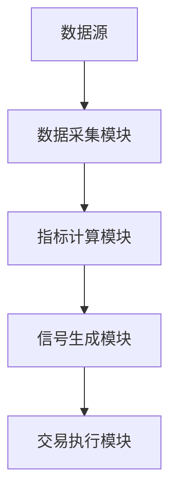

                 


# 彼得林奇的"市场情绪"在技术分析中的应用

> 关键词：市场情绪，技术分析，彼得·林奇，投资策略，VIX指数，RSI，交易系统

> 摘要：本文深入探讨了彼得·林奇的市场情绪理论在技术分析中的应用，分析了常见市场情绪指标及其属性，详细讲解了指标计算的算法原理和数学模型，并设计了一个基于市场情绪的交易系统，结合实际案例分析，为读者提供了从理论到实践的全面指导。

---

## 第一部分：市场情绪与技术分析基础

### 第1章：市场情绪概述

#### 1.1 市场情绪的定义与重要性
市场情绪是投资者在特定市场环境下的心理状态，反映了投资者对市场的乐观或悲观态度。市场情绪指标通过量化这些情绪，帮助投资者理解市场的波动性和趋势。

#### 1.2 彼得·林奇的市场情绪理论
彼得·林奇认为，市场情绪在投资决策中起着关键作用。他提出市场情绪具有周期性，投资者可以通过识别情绪周期来优化投资策略。

---

### 第2章：技术分析基础

#### 2.1 技术分析的核心概念
技术分析通过分析价格和成交量数据，预测未来的市场走势。市场情绪指标是技术分析中的重要工具，帮助投资者识别超买超卖、趋势强度等市场状态。

---

## 第二部分：彼得·林奇的市场情绪理论

### 第3章：彼得·林奇的投资理念

#### 3.1 投资者心理分析
彼得·林奇强调投资者心理在市场中的影响，认为恐慌和贪婪是市场波动的主要驱动因素。

#### 3.2 市场情绪周期
林奇将市场情绪分为几个阶段：乐观、怀疑、恐慌和超跌。投资者应根据情绪阶段调整投资策略。

---

## 第三部分：市场情绪指标分析

### 第4章：常见市场情绪指标

#### 4.1 VIX指数
VIX指数被称为恐慌指数，反映了市场的波动性。VIX值越高，市场情绪越恐慌。

#### 4.2 RSI指标
RSI（相对强度指数）用于衡量资产的超买或超卖状态，通常在0-100之间波动。

#### 4.3 MACD指标
MACD（移动平均收敛散度）用于识别趋势变化，通过短期和长期移动平均线的交叉点判断市场情绪。

---

### 第5章：指标属性对比

#### 5.1 指标敏感性分析
恐慌指数（VIX）对市场波动非常敏感，而RSI对短期价格变化更敏感。

#### 5.2 指标滞后性与领先性
MACD指标具有滞后性，而RSI指标具有一定的领先性。

#### 5.3 指标适用场景
VIX适用于市场波动大的环境，RSI适用于判断超买超卖状态，MACD适用于趋势分析。

---

## 第四部分：市场情绪与技术分析的结合

### 第6章：市场情绪在趋势分析中的应用

#### 6.1 趋势确认与反转信号
市场情绪指标可以帮助确认趋势的存在，并在趋势可能反转时发出信号。

#### 6.2 指标交叉的应用
通过VIX和RSI的交叉点，投资者可以判断市场的买卖信号。

#### 6.3 情绪周期与趋势阶段
根据市场情绪周期，投资者可以判断当前趋势所处的阶段，并调整投资策略。

---

## 第五部分：算法原理与数学模型

### 第7章：VIX指数计算

#### 7.1 计算步骤
1. 收集标普500指数的期权数据。
2. 计算期权的隐含波动率。
3. 平均计算得到VIX指数。

#### 7.2 Python代码实现
```python
import pandas as pd
import numpy as np

def calculate_vix(data):
    log_returns = np.log(data['Close'].pct_change().dropna())
    vix = np.std(log_returns) * np.sqrt(252)
    return vix

# 示例数据加载与计算
data = pd.read_csv('sp500.csv')
vix = calculate_vix(data)
print(vix)
```

---

## 第六部分：系统设计与项目实战

### 第8章：基于市场情绪的交易系统

#### 8.1 系统架构设计
系统包括数据采集模块、指标计算模块、信号生成模块和交易执行模块。

#### 8.2 系统流程图


#### 8.3 系统实现
1. 数据采集：读取股票数据。
2. 指标计算：计算VIX和RSI。
3. 信号生成：根据指标交叉生成买卖信号。
4. 交易执行：根据信号执行交易。

---

## 第七部分：总结与展望

### 第9章：总结
市场情绪是技术分析的重要组成部分，彼得·林奇的理论为投资者提供了独特的视角。结合市场情绪指标和算法，投资者可以制定更有效的投资策略。

### 第10章：展望
未来的研究可以探索更多市场情绪指标，并结合人工智能技术，开发更智能的交易系统。

---

## 作者信息

作者：AI天才研究院/AI Genius Institute & 禅与计算机程序设计艺术 /Zen And The Art of Computer Programming

---

这篇文章系统地介绍了彼得·林奇的市场情绪理论，并将其应用于技术分析中，提供了丰富的理论知识和实际案例，帮助读者更好地理解和应用市场情绪指标。

