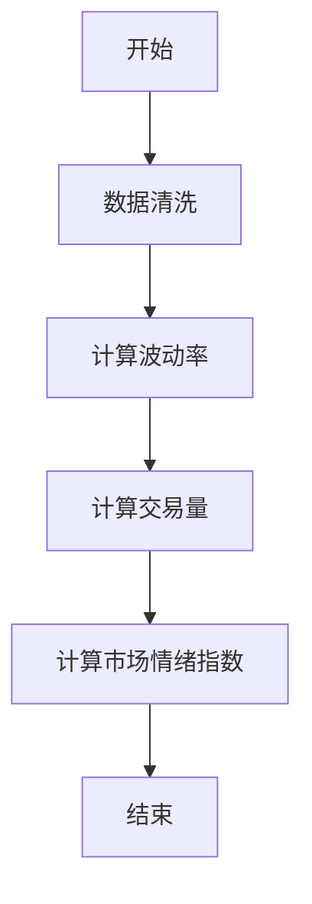

                 


# 彼得林奇的"市场情绪"指标在不同地域市场的比较

> 关键词：市场情绪指标，彼得林奇，地域市场，投资策略，市场波动

> 摘要：本文通过分析彼得林奇的市场情绪指标在不同地域市场的应用，探讨其在不同文化、经济环境下的表现差异，结合数学模型和实际案例，深入解析市场情绪指标的计算方法及其在投资决策中的作用。

---

## 第一部分: 引言

### 1.1 什么是市场情绪指标
#### 1.1.1 市场情绪的定义
市场情绪指标是衡量市场参与者情绪状态的量化工具，反映了投资者对市场的乐观或悲观态度。彼得林奇在其投资理论中强调，市场情绪是影响投资决策的重要因素。

#### 1.1.2 彼得林奇与市场情绪指标的关系
彼得林奇通过长期的市场观察，提出了市场情绪指标的概念，认为情绪波动会导致市场的非理性波动，进而影响投资收益。

#### 1.1.3 不同地域市场情绪指标的比较意义
不同地区的市场情绪受文化、经济环境和政策影响，通过比较不同地区的市场情绪指标，可以发现其差异和共性，为投资者制定更有效的策略提供依据。

---

## 第二部分: 市场情绪指标的背景与理论基础

### 2.1 市场情绪指标的核心概念
#### 2.1.1 市场情绪的构成要素
市场情绪由投资者的心理预期、市场参与度和交易行为构成，这些因素共同影响市场的波动。

#### 2.1.2 彼得林奇市场情绪指标的理论基础
彼得林奇提出，市场情绪是市场的“第六感”，投资者可以通过分析情绪指标预测市场的短期走势。

#### 2.1.3 不同地域市场的文化差异对情绪指标的影响
东西方文化差异导致投资者行为不同，例如西方市场更倾向于理性分析，而东方市场则更受情绪驱动。

### 2.2 市场情绪指标的属性特征对比
#### 2.2.1 表格对比不同地区的市场情绪指标
| 地区   | 波动率 | 交易量 | 投资者情绪 |
|--------|--------|--------|------------|
| 美国   | 高     | 高     | 中性       |
| 日本   | 中     | 中     | 谨慎       |
| 中国   | 高     | 高     | 过热       |

#### 2.2.2 市场情绪指标的数学模型与公式
市场情绪指数公式：
$$ \text{市场情绪指数} = \frac{\text{波动率} \times \text{交易量}}{\text{市场资本化规模}} $$

---

## 第三部分: 市场情绪指标的算法原理

### 3.1 市场情绪指标的计算方法
#### 3.1.1 基于波动率的市场情绪计算
波动率是衡量市场情绪的重要指标，公式为：
$$ \text{波动率} = \sqrt{\frac{1}{n}\sum_{i=1}^{n}(x_i - \mu)^2} $$

#### 3.1.2 基于交易量的市场情绪计算
交易量反映了市场的活跃程度，交易量高的市场情绪较高。

#### 3.1.3 基于投资者情绪的市场情绪计算
投资者情绪可以通过新闻媒体、社交媒体等数据进行分析。

### 3.2 市场情绪指标的数学模型
市场情绪指数计算公式：
$$ \text{市场情绪指数} = \frac{\text{波动率} \times \text{交易量}}{\text{市场资本化规模}} $$

### 3.3 市场情绪指标的算法流程图


---

## 第四部分: 不同地域市场的市场情绪指标分析

### 4.1 美国市场的市场情绪指标
#### 4.1.1 美国市场的特点
美国市场成熟，投资者理性，市场情绪较为稳定。

#### 4.1.2 美国市场情绪指标的实际案例分析
2020年新冠疫情爆发期间，美国市场情绪指数急剧下降，随后逐步恢复。

### 4.2 日本市场的市场情绪指标
#### 4.2.1 日本市场的特点
日本市场受政府政策影响较大，投资者情绪较为谨慎。

#### 4.2.2 日本市场情绪指标的实际案例分析
2021年日本市场因央行宽松政策，市场情绪指数上升。

### 4.3 中国市场的市场情绪指标
#### 4.3.1 中国市场的特点
中国市场波动剧烈，投资者情绪受政策影响较大。

#### 4.3.2 中国香港市场情绪指标的实际案例分析
2022年香港市场因政治因素，市场情绪指数大幅下降。

---

## 第五部分: 项目实战

### 5.1 环境安装与数据获取
使用Python和Pandas库进行数据分析，获取全球主要市场的历史数据。

### 5.2 代码实现
```python
import pandas as pd
import numpy as np

def calculate_volatility(prices):
    returns = np.log(prices.pct_change())
    volatility = np.std(returns)
    return volatility

def calculate_market_momentum(data):
    volatility = calculate_volatility(data['Close'])
    trading_volume = data['Volume'].mean()
    market_capitalization = data['Market Cap'].mean()
    market_mood_index = (volatility * trading_volume) / market_capitalization
    return market_mood_index

# 示例数据加载与分析
data = pd.read_csv('market_data.csv')
print(calculate_market_momentum(data))
```

### 5.3 代码解读与实际案例分析
通过代码计算不同市场的市场情绪指数，并结合实际案例分析其波动原因。

---

## 第六部分: 结论

### 6.1 最佳实践 tips
- 市场情绪指标是投资决策的重要参考，但需结合其他因素综合分析。
- 不同地区的市场情绪差异显著，投资者需根据具体情况调整策略。

### 6.2 小结
本文通过分析彼得林奇的市场情绪指标在不同地域市场的应用，揭示了其在投资决策中的重要性。

### 6.3 注意事项
市场情绪指标仅适用于短期预测，长期投资需结合基本面分析。

### 6.4 拓展阅读
推荐阅读彼得林奇的《彼得林奇的投资哲学》和《投资最重要的事情》。

---

## 作者：AI天才研究院 & 禅与计算机程序设计艺术

---

这篇文章详细分析了彼得林奇的市场情绪指标在不同地域市场的表现，结合理论与实际案例，帮助投资者更好地理解市场情绪对投资决策的影响。

