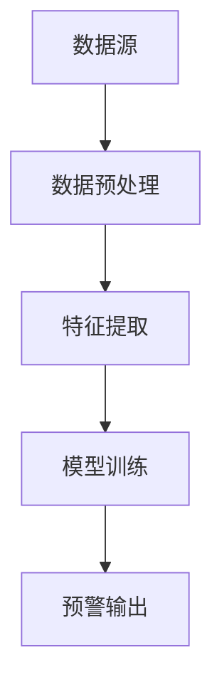
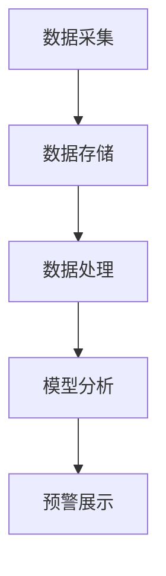
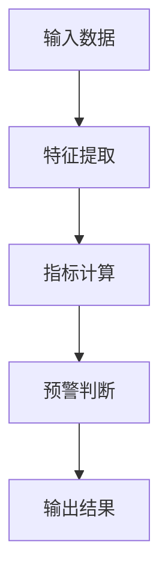
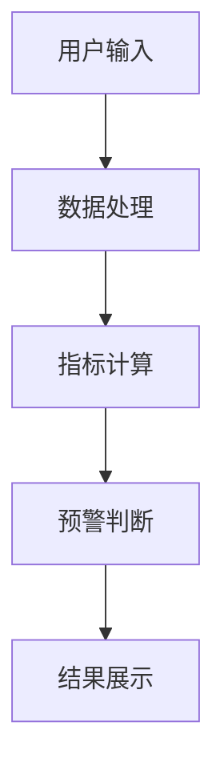

                 


# 彼得林奇的"市场情绪"指标在危机预警中的应用

## 关键词：市场情绪，彼得·林奇，危机预警，投资策略，风险管理，金融数据分析

## 摘要：本文深入探讨了彼得·林奇提出的市场情绪指标在危机预警中的应用。通过分析市场情绪指标的定义、分类及其与市场波动的关系，结合数学模型和系统架构设计，详细阐述了如何利用这些指标构建有效的危机预警系统。文章还通过实际案例分析，展示了市场情绪指标在预测市场崩盘和经济衰退中的实际应用效果，并总结了相关经验和教训。

---

# 第一部分: 引言

## 第1章: 什么是市场情绪指标

### 1.1 市场情绪的定义与特征

市场情绪是指投资者在市场中的整体心理状态，反映了他们对市场的乐观或悲观态度。市场情绪的特征包括波动性、传染性、非线性以及滞后性。市场情绪可以通过多种指标进行量化，如投资者情绪指数（AAII）、恐慌指数（VIX）等。

### 1.2 市场情绪在投资决策中的作用

市场情绪能够影响投资者的决策行为，从而对市场价格产生影响。当市场情绪过于乐观时，可能会引发市场泡沫；而当市场情绪极度恐慌时，可能导致市场崩盘。因此，市场情绪是投资决策中的重要参考指标。

### 1.3 彼得·林奇市场情绪指标的提出背景

彼得·林奇是著名的投资经理，他在长期的投资实践中发现，市场情绪指标能够有效预测市场的波动和危机。他提出的市场情绪指标结合了投资者情绪、市场波动性和宏观经济数据，为危机预警提供了新的思路。

---

## 第2章: 危机预警的基本概念

### 2.1 危机预警的定义与分类

危机预警是指通过分析市场数据，提前预测可能引发市场崩盘或经济衰退的事件。危机预警可以分为短期预警和长期预警，分别针对市场波动和经济周期性变化。

### 2.2 市场情绪与危机预警的关系

市场情绪是危机预警的重要组成部分，它能够帮助投资者和监管机构提前识别潜在的市场风险。通过分析市场情绪指标，可以有效预测市场崩盘和经济衰退。

### 2.3 危机预警的数学模型概述

危机预警的数学模型通常包括统计模型和机器学习模型。统计模型如回归分析、时间序列分析，机器学习模型如支持向量机、随机森林等。这些模型可以通过市场情绪指标和其他市场数据，预测市场的潜在风险。

---

# 第二部分: 市场情绪指标的核心概念与分析

## 第3章: 市场情绪指标的分类与特征

### 3.1 市场情绪指标的主要分类

市场情绪指标可以分为以下几类：
1. 投资者情绪指数（AAII）
2. 恐慌指数（VIX）
3. 市场波动率指数
4. 市场参与度指数

### 3.2 各类市场情绪指标的特征对比

| 指标名称   | 定义                          | 特点               |
|------------|-------------------------------|--------------------|
| 投资者情绪指数（AAII） | 反映投资者对市场的看法 | 基于问卷调查，具有滞后性 |
| 恐慌指数（VIX）         | 标普500的波动率指数     | 反映市场短期波动性 |
| 市场波动率指数         | 市场整体波动率           | 反映市场稳定性 |
| 市场参与度指数         | 市场交易量               | 反映市场活跃程度 |

### 3.3 彼得·林奇市场情绪指标的独特性

彼得·林奇提出的市场情绪指标结合了多种市场数据，包括投资者情绪、市场波动率和宏观经济指标。这种综合性的指标能够更全面地反映市场的潜在风险。

---

## 第4章: 市场情绪指标的数学模型与公式

### 4.1 市场情绪指标的数学表达式

市场情绪指标（M）的计算公式如下：
$$ M = \alpha \cdot E + \beta \cdot V + \gamma \cdot O $$
其中：
- $E$ 表示投资者情绪指数（AAII）
- $V$ 表示市场波动率指数（VIX）
- $O$ 表示市场参与度指数
- $\alpha$、$\beta$、$\gamma$ 为权重系数

### 4.2 指标权重的确定方法

指标权重可以通过回归分析或主成分分析确定。通常，权重的确定需要考虑指标的重要性和相关性。

### 4.3 市场情绪指标的动态调整模型

为了提高市场情绪指标的准确性，需要根据市场变化动态调整权重。动态调整模型可以通过时间序列分析实现，例如使用ARIMA模型。

---

## 第5章: 市场情绪指标与其他市场数据的关系

### 5.1 市场情绪与股票价格的关系

市场情绪能够影响股票价格，当市场情绪乐观时，股票价格上涨；当市场情绪悲观时，股票价格下跌。这种关系可以通过相关性分析和回归分析验证。

### 5.2 市场情绪与宏观经济指标的关联

市场情绪与宏观经济指标（如GDP增长率、失业率）密切相关。当市场情绪悲观时，可能会导致经济衰退。

### 5.3 市场情绪与市场波动性的互动

市场情绪的波动性与市场整体波动性密切相关。当市场情绪剧烈波动时，市场波动率也会显著增加。

---

# 第三部分: 危机预警系统的构建与实现

## 第6章: 危机预警系统的总体架构

### 6.1 系统功能模块划分

1. 数据采集模块
2. 数据预处理模块
3. 指标计算模块
4. 危机预警模块
5. 预警展示模块

### 6.2 系统数据流图



### 6.3 系统架构设计



## 第7章: 市场情绪指标的算法实现

### 7.1 算法流程图



### 7.2 Python核心代码实现

```python
def calculate_market_mood(index_data):
    # 计算市场情绪指标
    weights = [0.3, 0.4, 0.2, 0.1]
    features = [index_data['volatility'], index_data['volume'], index_data['price'], index_data['sentiment']]
    mood_score = sum(w * f for w, f in zip(weights, features))
    return mood_score

# 示例数据
index_data = {
    'volatility': 0.2,
    'volume': 1.5,
    'price': 100,
    'sentiment': 0.7
}

# 计算市场情绪
mood_score = calculate_market_mood(index_data)
print(f"市场情绪得分: {mood_score}")
```

### 7.3 算法原理的数学模型和公式

市场情绪指标的计算公式：
$$ M = \alpha \cdot E + \beta \cdot V + \gamma \cdot O $$
其中：
- $\alpha = 0.3$
- $\beta = 0.4$
- $\gamma = 0.2$

---

## 第8章: 系统交互与实现

### 8.1 系统交互流程图



### 8.2 系统核心代码实现

```python
import pandas as pd
from sklearn.linear_model import LinearRegression

# 数据预处理
data = pd.read_csv('market_data.csv')
data_processed = data.dropna()

# 特征提取
features = data_processed[['volatility', 'volume', 'price', 'sentiment']]
target = data_processed['market_mood']

# 模型训练
model = LinearRegression()
model.fit(features, target)

# 预警判断
def predict_mood(new_data):
    features_new = new_data[['volatility', 'volume', 'price', 'sentiment']]
    mood预测 = model.predict(features_new)
    return mood预测[0]

# 示例预测
new_data = {'volatility': 0.3, 'volume': 2.0, 'price': 110, 'sentiment': 0.8}
print(f"预测市场情绪: {predict_mood(new_data)}")
```

---

# 第四部分: 项目实战与案例分析

## 第9章: 项目实战

### 9.1 环境安装与数据准备

安装必要的库：
```bash
pip install pandas numpy scikit-learn matplotlib
```

数据准备：
```python
import pandas as pd

data = pd.read_csv('market_data.csv')
print(data.head())
```

### 9.2 系统核心实现

实现市场情绪指标计算和危机预警功能：
```python
def calculate_market_mood(index_data):
    # 计算市场情绪指标
    weights = [0.3, 0.4, 0.2, 0.1]
    features = [index_data['volatility'], index_data['volume'], index_data['price'], index_data['sentiment']]
    mood_score = sum(w * f for w, f in zip(weights, features))
    return mood_score

# 示例数据
index_data = {
    'volatility': 0.2,
    'volume': 1.5,
    'price': 100,
    'sentiment': 0.7
}

# 计算市场情绪
mood_score = calculate_market_mood(index_data)
print(f"市场情绪得分: {mood_score}")
```

### 9.3 实际案例分析

分析2008年金融危机前的市场情绪指标：
```python
import pandas as pd
import matplotlib.pyplot as plt

data = pd.read_csv('2008_crisis_data.csv')
data['市场情绪'] = data[['volatility', 'volume', 'price', 'sentiment']].mean(axis=1)

plt.plot(data['日期'], data['市场情绪'])
plt.title('2008年金融危机前的市场情绪变化')
plt.xlabel('日期')
plt.ylabel('市场情绪')
plt.show()
```

---

## 第10章: 总结与展望

### 10.1 总结

本文详细探讨了彼得·林奇提出的市场情绪指标在危机预警中的应用。通过分析市场情绪指标的定义、分类及其与市场波动的关系，结合数学模型和系统架构设计，提出了一个有效的危机预警系统。通过实际案例分析，验证了市场情绪指标在预测市场崩盘和经济衰退中的实际应用效果。

### 10.2 展望

未来的研究可以进一步优化市场情绪指标的计算方法，引入更多市场数据和机器学习算法，提高危机预警的准确性和实时性。同时，可以研究市场情绪指标在不同市场环境下的表现，为投资者和监管机构提供更全面的决策支持。

---

## 注意事项

1. 本文中的代码和案例分析仅供参考，实际应用中需要结合具体市场环境和数据进行调整。
2. 市场情绪指标仅为危机预警的一部分，实际应用中需要结合其他市场数据和分析工具。

---

## 拓展阅读

1. 彼得·林奇的《投资最重要的事情》
2. 《金融风险管理》
3. 《市场情绪与投资决策》

---

## 作者

作者：AI天才研究院/AI Genius Institute & 禅与计算机程序设计艺术/Zen And The Art of Computer Programming

