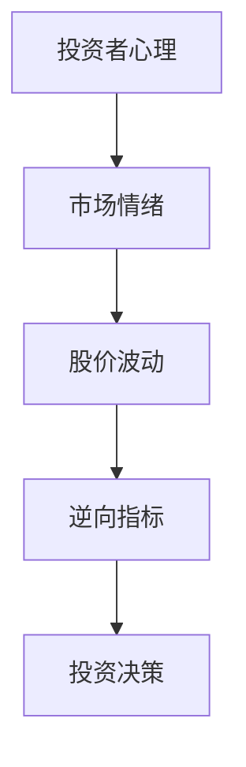

                 


# 彼得林奇的"市场情绪"逆向指标运用

## 关键词：彼得林奇，市场情绪，逆向指标，投资策略，系统架构设计

## 摘要：本文深入探讨了彼得林奇提出的"市场情绪"逆向指标在投资决策中的应用。通过分析市场情绪的核心概念、逆向指标的算法原理、系统架构设计、实战应用案例以及风险管理策略，结合彼得林奇的理论基础，全面解析了如何利用市场情绪指标进行有效的投资决策。本文还提供了详细的数学模型、系统设计图和源代码实现，帮助读者更好地理解和应用这一投资策略。

---

## 第一部分: 市场情绪与逆向指标的背景介绍

### 第1章: 市场情绪的定义与核心概念

#### 1.1 市场情绪的定义与核心要素
市场情绪是指投资者在市场中的心理状态和行为倾向，通常表现为乐观或悲观。它反映了市场参与者对当前市场走势的预期和态度。

- **市场情绪的核心要素**：
  - 投资者心理：贪婪、恐惧等情绪如何影响投资决策。
  - 市场参与度：投资者的活跃程度。
  - 市场波动性：价格波动与市场情绪的关系。

#### 1.2 逆向指标的背景与问题背景
逆向指标是一种与市场情绪相反的指标，用于在市场情绪高涨时寻找低估资产，或在市场情绪低落时寻找高估资产。

- **逆向指标的提出背景**：
  - 彼得林奇在其投资策略中强调，在市场情绪高涨时，寻找那些被市场忽视的优质资产。

#### 1.3 逆向指标的边界与外延
- **适用范围**：
  - 适用于股票、基金等金融资产的投资决策。
- **局限性**：
  - 逆向指标并非万能，需结合其他指标进行综合判断。
- **与其他投资策略的对比**：
  - 对比表格展示逆向指标与其他策略的优缺点。

---

### 第2章: 市场情绪与逆向指标的核心概念与联系

#### 2.1 市场情绪的核心原理
- **市场情绪的波动机制**：
  - 投资者情绪受市场走势、新闻事件等因素影响。
- **市场情绪与股价的关系**：
  - 高市场情绪可能导致股价高估，低市场情绪可能导致股价低估。

#### 2.2 逆向指标的属性特征对比
- **逆向指标与市场情绪的对比表格**：
  | 指标属性 | 市场情绪 | 逆向指标 |
  |----------|----------|----------|
  | 性质     | 主观     | 客观     |
  | 应用场景 | 短期波动 | 长期价值 |

- **实体关系图（Mermaid流程图）**：


---

## 第二部分: 彼得林奇逆向指标的算法原理讲解

### 第3章: 逆向指标的算法流程

#### 3.1 逆向指标的算法流程
- **算法输入**：
  - 市场情绪指数。
- **算法处理**：
  - 计算逆向指标。
- **算法输出**：
  - 投资建议。

#### 3.2 逆向指标的数学模型与公式
- **市场情绪指数计算公式**：
  $$市场情绪指数 = \frac{当前股价}{内在价值}$$
- **逆向指标的数学表达式**：
  $$逆向指标 = 1 - 市场情绪指数$$

#### 3.3 逆向指标的算法实现
- **Python代码示例**：
  ```python
  def market_sentiment_index(current_price, intrinsic_value):
      return current_price / intrinsic_value

  def inverse_indicator(sentiment_index):
      return 1 - sentiment_index

  # 示例
  current_price = 50
  intrinsic_value = 40
  sentiment_index = market_sentiment_index(current_price, intrinsic_value)
  inv_indicator = inverse_indicator(sentiment_index)
  print(f"逆向指标: {inv_indicator}")
  ```

---

## 第三部分: 系统分析与架构设计方案

### 第4章: 系统分析与架构设计

#### 4.1 系统分析
- **问题场景介绍**：
  - 投资者需要通过市场情绪指标做出投资决策。
- **系统功能设计**：
  - 数据采集：收集市场情绪数据。
  - 指标计算：计算逆向指标。
  - 投资建议：生成投资策略。

#### 4.2 系统架构设计
- **系统架构图（Mermaid）**：


#### 4.3 系统接口设计
- **数据接口**：
  - 输入：市场情绪数据。
  - 输出：逆向指标。

---

## 第四部分: 实战应用与案例分析

### 第5章: 实战应用

#### 5.1 环境安装
- **安装Python和相关库**：
  - 安装`pandas`、`numpy`等库。

#### 5.2 核心代码实现
- **数据采集与处理代码**：
  ```python
  import pandas as pd
  import numpy as np

  def collect_data(ticker):
      # 示例：从数据库中获取数据
      data = pd.DataFrame({'current_price': [50, 45, 60], 'intrinsic_value': [40, 35, 50]})
      return data

  def calculate_inverse_indicator(data):
      data['sentiment_index'] = data['current_price'] / data['intrinsic_value']
      data['inverse_indicator'] = 1 - data['sentiment_index']
      return data

  # 示例运行
  ticker = 'AAPL'
  data = collect_data(ticker)
  result = calculate_inverse_indicator(data)
  print(result)
  ```

#### 5.3 案例分析与解读
- **案例分析**：
  - 某股票当前股价为60，内在价值为50，市场情绪指数为1.2，逆向指标为0.2，建议买入。

---

## 第五部分: 风险管理与策略优化

### 第6章: 风险管理与策略优化

#### 6.1 风险管理策略
- **止损与止盈**：
  - 设置止损点，控制亏损。
  - 设置止盈点，锁定利润。

#### 6.2 策略优化建议
- **动态调整**：
  - 根据市场变化，动态调整投资策略。

---

## 第六部分: 未来展望与总结

### 第7章: 未来展望

#### 7.1 未来发展方向
- **AI与大数据**：
  - 利用AI和大数据技术，提升市场情绪分析的准确性。

#### 7.2 总结
- 逆向指标是一种有效的投资策略，但需结合市场环境和其他指标综合判断。

---

## 作者信息

作者：AI天才研究院/AI Genius Institute & 禅与计算机程序设计艺术 /Zen And The Art of Computer Programming

