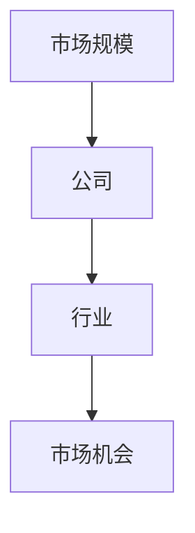
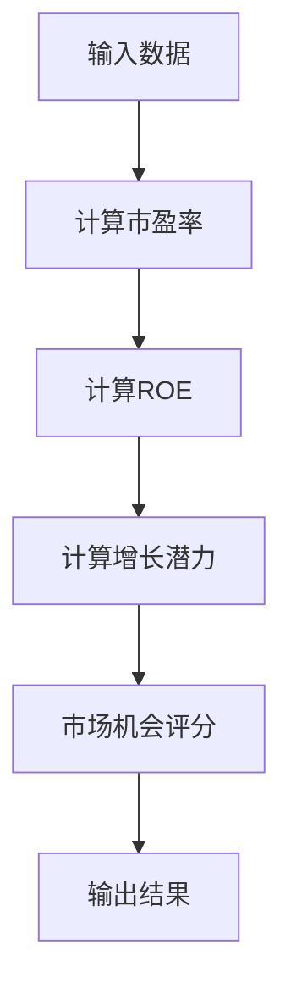
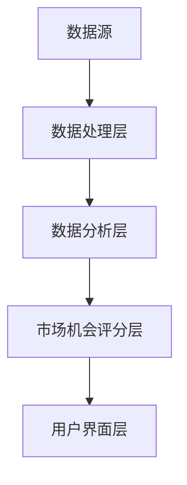
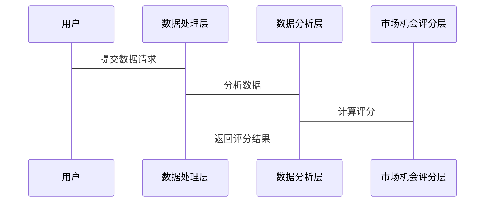

                 


# 彼得林奇的"市场机会"在不同市场规模中的识别

> 关键词：彼得林奇，市场机会识别，市场规模，投资策略，GARP策略

> 摘要：本文深入探讨了彼得·林奇的市场机会识别方法，重点分析了在不同市场规模（如小盘股、中盘股、大盘股）中如何应用这些策略。通过结合投资理念、算法原理、系统架构和实际案例，文章为读者提供了全面的视角，帮助其在不同市场环境中识别和把握投资机会。

---

## 第一部分: 彼得林奇的市场机会识别概述

### 第1章: 彼得·林奇及其投资理念

#### 1.1 彼得·林奇的背景与成就
- **1.1.1 彼得·林奇的背景介绍**
  - 彼得·林奇是美国著名的共同基金管理者，以其在富达投资的卓越表现闻名。
  - 他是《彼得·林奇的成功投资》一书的作者，书中详细阐述了其投资哲学。
- **1.1.2 彼得·林奇的投资哲学**
  - 强调基本面分析和长期投资。
  - 重视公司基本面和行业趋势的结合。
  - 提出“GARP”（Growth at Reasonable Price）策略，即以合理价格投资于成长型公司。

#### 1.2 市场机会识别的核心概念
- **1.2.1 市场机会的定义**
  - 市场机会是指在特定市场中，公司或行业由于其独特的竞争优势、增长潜力或估值优势而产生的投资机会。
- **1.2.2 不同市场规模的分类**
  - 小盘股市场：市值较低，流动性较差，风险较高。
  - 中盘股市场：市值中等，流动性适中，风险和收益介于小盘和大盘之间。
  - 大盘股市场：市值较高，流动性强，风险较低。
- **1.2.3 市场机会识别的边界与外延**
  - 边界：市场规模、行业趋势、公司基本面。
  - 外延：市场周期、宏观经济环境、政策影响。

#### 1.3 市场机会识别的核心要素
- **1.3.1 市场规模与公司价值的关系**
  - 市场规模影响公司的估值和增长潜力。
- **1.3.2 行业趋势与竞争格局**
  - 行业趋势决定市场的长期增长潜力。
  - 竞争格局影响公司的市场份额和盈利能力。
- **1.3.3 公司基本面与财务指标**
  - 财务指标如市盈率、市净率、ROE等是衡量公司价值的重要指标。

### 第2章: 市场机会识别的核心概念与联系

#### 2.1 核心概念原理
- **2.1.1 市场规模与公司价值的关系**
  - 小盘股市场：高增长潜力，但风险较高。
  - 大盘股市场：稳定收益，风险较低。
- **2.1.2 不同市场规模下的投资策略**
  - 小盘股：寻找具有高增长潜力的公司。
  - 中盘股：平衡风险和收益。
  - 大盘股：注重稳定收益和估值。
- **2.1.3 市场机会识别的关键指标**
  - 市盈率（P/E）：衡量公司股价与盈利的关系。
  - 市净率（P/B）：衡量公司股价与资产净值的关系。
  - 股息率：衡量公司派发股息的能力。

#### 2.2 核心概念属性特征对比表
| 属性 | 小盘股市场 | 中盘股市场 | 大盘股市场 |
|------|------------|------------|------------|
| 市场容量 | 小         | 中         | 大         |
| 流动性 | 低         | 中         | 高         |
| 市盈率 | 高         | 中         | 低         |
| 投资风险 | 高         | 中         | 低         |

#### 2.3 ER实体关系图


### 第3章: 市场机会识别的算法原理

#### 3.1 算法原理概述
- **3.1.1 GARP策略**
  - GARP策略结合了成长型投资和价值型投资。
  - 寻找具有合理估值的高成长公司。
- **3.1.2 市场机会评分模型**
  - 通过多个指标（如市盈率、ROE、增长潜力）对市场机会进行评分。
  - 根据评分结果筛选出潜在的投资机会。

#### 3.2 算法实现
- **3.2.1 算法流程图**


- **3.2.2 Python代码实现**
```python
def calculate_market_opportunity_score(company_data):
    # 计算市盈率
    pe_ratio = company_data['市盈率']
    # 计算ROE
    roe = company_data['ROE']
    # 计算增长潜力
    growth_potential = company_data['增长潜力']
    # 计算市场机会评分
    score = (pe_ratio + roe + growth_potential) / 3
    return score

# 示例数据
company_data = {
    '市盈率': 15,
    'ROE': 12,
    '增长潜力': 8
}

score = calculate_market_opportunity_score(company_data)
print(f"市场机会评分: {score}")
```

- **3.2.3 数学模型与公式**
  - 市场机会评分公式：
    $$\text{评分} = \frac{\text{市盈率} + \text{ROE} + \text{增长潜力}}{3}$$

## 第二部分: 系统分析与架构设计

### 第4章: 系统分析与架构设计方案

#### 4.1 问题场景介绍
- **问题背景**
  - 在不同市场规模中识别市场机会，需要一个高效、可靠的系统支持。
- **项目介绍**
  - 开发一个基于彼得·林奇投资理念的市场机会识别系统。
- **系统功能设计**
  - 数据收集：收集公司基本面数据、行业趋势数据等。
  - 数据分析：计算市盈率、ROE等关键指标。
  - 市场机会评分：根据评分模型筛选出潜在投资机会。

#### 4.2 系统架构设计
- **系统架构图**


#### 4.3 系统接口设计
- **数据接口**
  - 数据输入接口：接收公司基本面数据。
  - 数据输出接口：输出市场机会评分结果。

#### 4.4 系统交互流程


## 第三部分: 项目实战

### 第5章: 项目实战

#### 5.1 环境安装
- **Python环境**
  - 安装Python 3.x
  - 安装必要的库：pandas、numpy、matplotlib。

#### 5.2 核心代码实现
```python
import pandas as pd
import numpy as np

def calculate_market_opportunity_score(df):
    # 计算市盈率
    pe_ratio = df['市盈率']
    # 计算ROE
    roe = df['ROE']
    # 计算增长潜力
    growth_potential = df['增长潜力']
    # 计算市场机会评分
    score = (pe_ratio + roe + growth_potential) / 3
    return score

# 示例数据
data = {
    '公司': ['A', 'B', 'C'],
    '市盈率': [15, 20, 12],
    'ROE': [12, 8, 15],
    '增长潜力': [8, 10, 6]
}

df = pd.DataFrame(data)

# 计算市场机会评分
scores = calculate_market_opportunity_score(df)
print(scores)
```

#### 5.3 代码解读与分析
- **代码解读**
  - 读取数据：使用pandas读取数据。
  - 计算市盈率、ROE、增长潜力。
  - 计算市场机会评分。
- **分析**
  - 评分越高的公司，市场机会越大。

#### 5.4 实际案例分析
- **案例1：小盘股市场**
  - 公司A：评分较高，适合投资。
- **案例2：大盘股市场**
  - 公司B：评分较低，需谨慎考虑。

### 第6章: 最佳实践与总结

#### 6.1 最佳实践
- **投资策略**
  - 根据市场规模选择合适的投资策略。
  - 结合行业趋势和公司基本面进行综合判断。
- **风险管理**
  - 设定止损点，控制投资风险。

#### 6.2 小结
- 彼得·林奇的市场机会识别方法在不同市场规模中具有广泛的应用。
- 通过系统的分析和实际案例的分析，可以帮助投资者更好地把握市场机会。

#### 6.3 注意事项
- 市场环境变化会影响投资策略的有效性。
- 投资者需结合实际情况灵活调整策略。

#### 6.4 拓展阅读
- 《彼得·林奇的成功投资》
- 其他投资策略书籍和论文。

---

# 作者：AI天才研究院/AI Genius Institute & 禅与计算机程序设计艺术 /Zen And The Art of Computer Programming

