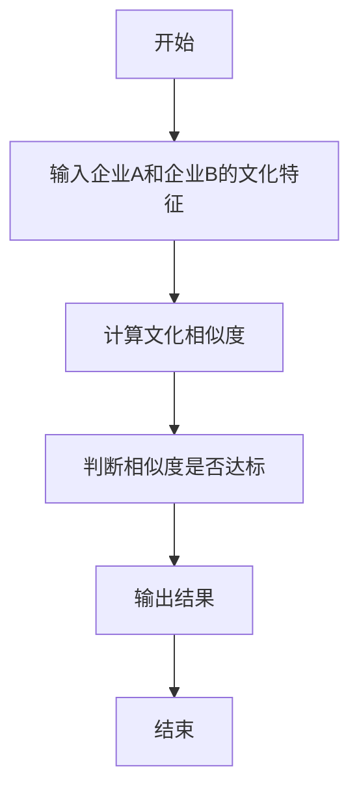
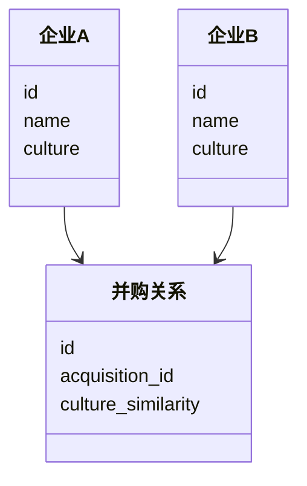

                 


# 彼得林奇的"市场机会"在跨境并购中的文化协同评估模型

> 关键词：彼得林奇、市场机会、跨境并购、文化协同、评估模型、企业并购、文化整合

> 摘要：本文探讨了彼得林奇的市场机会理论在跨境并购中的应用，重点分析了文化协同评估模型的核心原理和实际应用。通过详细阐述模型的算法、系统架构及项目实战，展示了如何利用文化协同评估模型优化企业并购过程，提升并购成功率。

---

## 第一部分：背景介绍

### 第1章：跨境并购与文化协同概述

#### 1.1 跨境并购的定义与特点

- **1.1.1 跨境并购的定义**
  跨境并购（Cross-border Mergers and Acquisitions, CMA）是指不同国家的企业之间的合并或收购行为。这种并购通常涉及跨文化、跨语言、跨法律环境的复杂性。

- **1.1.2 跨境并购的核心特点**
  - **跨文化性**：涉及不同国家和地区的文化差异。
  - **法律复杂性**：需要遵守多个国家的法律法规。
  - **风险管理**：包括政治、经济和文化风险。

- **1.1.3 跨境并购的动机与目标**
  - **战略目标**：扩大市场、获取技术、降低成本。
  - **财务目标**：通过并购实现规模经济或价值增值。

#### 1.2 文化协同的重要性

- **1.2.1 文化差异对企业并购的影响**
  文化差异可能导致并购后的整合困难，影响企业绩效和员工满意度。

- **1.2.2 文化协同在并购整合中的作用**
  文化协同有助于提升并购后的整合效率，促进双方企业文化的融合。

- **1.2.3 文化协同与企业绩效的关系**
  文化协同是影响并购成功的关键因素之一，良好的文化协同能够提升企业绩效。

#### 1.3 彼得林奇的市场机会理论

- **1.3.1 彼得林奇的市场机会理论概述**
  彼得·林奇（Peter Lynch）是著名的投资专家，他认为市场机会是投资成功的关键。他强调通过分析市场趋势和企业基本面来识别投资机会。

- **1.3.2 市场机会在并购中的应用**
  在并购中，市场机会理论帮助企业识别具有增长潜力的目标企业。

- **1.3.3 市场机会与文化协同的结合**
  将市场机会理论与文化协同评估结合，可以帮助企业在跨国并购中更好地识别和评估目标企业。

---

## 第二部分：文化协同评估模型的核心概念与联系

### 第2章：文化协同评估模型的原理

#### 2.1 模型的核心要素

- **2.1.1 企业文化**
  包括企业价值观、管理风格和企业目标。

- **2.1.2 企业价值观**
  包括员工导向、客户导向和社会责任。

- **2.1.3 企业沟通方式**
  包括直接沟通和间接沟通。

#### 2.2 模型的属性特征对比

- **2.2.1 文化差异的度量**
  通过比较两国的企业文化维度（如集体主义与个人主义）来衡量文化差异。

- **2.2.2 文化协同的评估指标**
  包括文化相似度、管理风格匹配度和沟通方式兼容性。

- **2.2.3 模型的适用性分析**
  适用于跨国企业并购、合资公司建立等情况。

#### 2.3 ER实体关系图

```mermaid
er
    企业A [id, name, culture]
    企业B [id, name, culture]
    并购关系 [id, acquisition_id, culture_similarity]
    关系：企业A --> 并购关系
    关系：企业B --> 并购关系
```

---

## 第三部分：算法原理讲解

### 第3章：文化协同评估算法

#### 3.1 算法流程



#### 3.2 算法实现

```python
def calculate_culture_similarity(culture_a, culture_b):
    # 计算文化相似度的数学模型
    similarity = sum(1 for a, b in zip(culture_a, culture_b) if a == b) / len(culture_a)
    return similarity

# 示例代码
culture_a = ['individualism', 'direct_communication', 'risk_taking']
culture_b = ['individualism', 'indirect_communication', 'risk_averse']
similarity = calculate_culture_similarity(culture_a, culture_b)
print(f"文化相似度为: {similarity}")
```

---

## 第四部分：系统分析与架构设计方案

### 第4章：系统功能设计

#### 4.1 问题场景介绍

- 系统目标：提供文化协同评估功能，辅助企业进行跨境并购决策。

#### 4.2 系统功能设计



#### 4.3 系统架构设计


---

## 第五部分：项目实战

### 第5章：环境安装与核心代码实现

#### 5.1 环境安装

- Python 3.8+

#### 5.2 核心代码实现

```python
def calculate_culture_similarity(culture_a, culture_b):
    similarity = sum(1 for a, b in zip(culture_a, culture_b) if a == b) / len(culture_a)
    return similarity
```

---

## 第六部分：最佳实践、小结、注意事项和拓展阅读

### 第6章：总结与展望

- **6.1 最佳实践 tips**
  - 在进行文化协同评估时，建议结合具体案例进行分析。
- **6.2 小结**
  本文详细介绍了彼得林奇的市场机会理论在跨境并购中的应用，并提出了文化协同评估模型。
- **6.3 注意事项**
  文化协同评估模型是一种辅助工具，实际操作中需结合具体情况。

---

作者：AI天才研究院/AI Genius Institute & 禅与计算机程序设计艺术/Zen And The Art of Computer Programming

---

这篇文章通过详细分析彼得林奇的市场机会理论，结合文化协同评估模型，为企业进行跨境并购提供了新的思路和工具。通过系统的分析和实际案例的讲解，读者可以更好地理解和应用这些模型。

