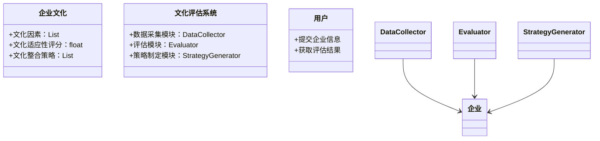
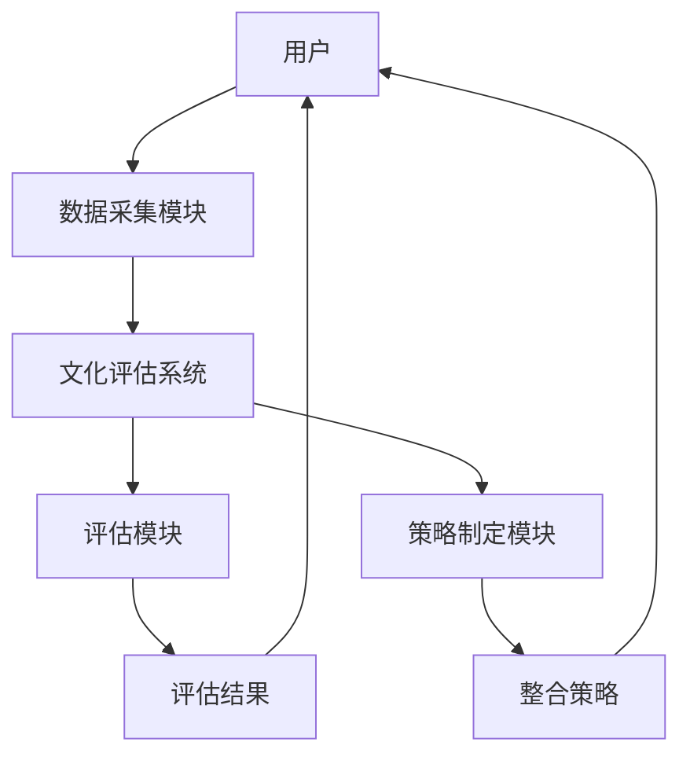

                 


# 彼得林奇的"市场机会"在跨境并购中的文化因素评估

## 关键词：彼得林奇，市场机会，跨境并购，文化因素，文化评估，文化适应度

## 摘要：  
本文探讨了彼得·林奇的市场机会理论在跨境并购中的文化因素评估。通过分析文化差异、企业文化匹配以及文化与市场机会的关系，本文提出了文化因素评估的理论框架，并结合实际案例，展示了如何将文化因素纳入市场机会评估模型中。文章还提供了算法和系统设计，以帮助读者更好地理解和应用这些理论。

---

# 第一部分: 背景与核心概念

## 第1章: 背景介绍

### 1.1 跨境并购的背景与现状

#### 1.1.1 跨境并购的定义与特点
跨境并购（Cross-border Mergers and Acquisitions）是指不同国家的企业之间的合并或收购行为。其特点包括：  
- **全球化**：跨国企业为了扩展市场或获取资源，跨越国界进行并购。  
- **复杂性**：涉及不同国家的法律、税收、监管等差异。  
- **高风险**：文化差异、政治风险、市场不确定性等可能影响并购成功。  

#### 1.1.2 跨境并购的驱动因素
- **市场扩展**：通过并购进入新市场，扩大客户基础。  
- **资源获取**：获取技术、品牌、渠道或原材料。  
- **成本节约**：通过规模经济或协同效应降低成本。  
- **战略防御**：并购竞争对手以防止被收购。  

#### 1.1.3 跨境并购中的文化因素的重要性
文化差异可能导致并购失败，例如：  
- **管理风格冲突**：东家与西家的企业文化不同，导致管理混乱。  
- **员工适应性问题**：员工可能因文化差异而抵触新公司。  
- **客户关系断裂**：文化差异可能影响客户信任。  

### 1.2 彼得·林奇的市场机会理论

#### 1.2.1 彼得·林奇的市场机会定义
彼得·林奇认为，市场机会是指那些被市场低估、具有长期增长潜力的投资标的。他强调：  
- **低估**：市场机会通常存在于被忽视或低估的领域。  
- **长期增长**：企业必须具备持续增长的潜力。  
- **竞争优势**：企业必须具备独特的竞争优势。  

#### 1.2.2 市场机会的识别与评估
林奇的市场机会评估方法包括：  
- **行业分析**：分析行业的增长潜力和竞争格局。  
- **财务分析**：评估企业的财务健康状况和盈利能力。  
- **管理层能力**：考察企业管理层的能力和决策水平。  

#### 1.2.3 林奇理论在跨境并购中的应用
将林奇的市场机会理论应用于跨境并购，需要考虑：  
- **目标企业筛选**：寻找具有长期增长潜力且被低估的目标企业。  
- **文化适应性**：评估目标企业的文化是否与并购方的文化匹配。  
- **风险管理**：识别文化差异带来的风险，并制定应对策略。  

## 第2章: 文化因素的核心概念

### 2.1 文化差异对企业并购的影响

#### 2.1.1 文化差异的定义
文化差异是指不同国家或地区在语言、价值观、行为习惯、沟通方式等方面的差异。例如：  
- **个体主义 vs 集体主义**：西方国家通常强调个体主义，而东方国家则更注重集体主义。  
- **权力距离**：不同国家对权力结构和权威的看法不同。  

#### 2.1.2 文化差异的具体表现
- **沟通方式**：直接 vs 间接沟通。  
- **决策风格**：集中 vs 分权决策。  
- **时间观念**：准时 vs 弹性时间观念。  

#### 2.1.3 文化差异对并购整合的影响
- **整合困难**：文化差异可能导致管理混乱。  
- **员工抵触**：员工可能因文化冲突而抵制并购。  
- **客户关系受损**：文化差异可能影响客户信任。  

### 2.2 企业文化的评估与匹配

#### 2.2.1 企业文化的核心要素
- **愿景与使命**：企业的长期目标和核心价值观。  
- **管理风格**：企业采用的管理方式（如集权 vs 分权）。  
- **员工文化**：员工的工作态度和行为习惯。  

#### 2.2.2 企业文化匹配的重要性
- **协同效应**：文化匹配可以提升并购后的协同效应。  
- **整合效率**：文化匹配可以降低整合难度。  
- **长期成功**：文化匹配是并购长期成功的关键。  

#### 2.2.3 企业文化评估的方法
- **文化评估问卷**：通过问卷调查评估企业的文化特点。  
- **案例分析**：通过分析企业的历史案例了解其文化。  
- **员工访谈**：通过访谈了解员工对企业文化的看法。  

### 2.3 文化因素与市场机会的联系

#### 2.3.1 文化因素对市场机会的影响
- **市场适应性**：文化适应性决定了企业能否在新市场中成功。  
- **竞争优势**：文化因素可能成为企业的竞争优势。  
- **风险控制**：文化因素是并购风险的重要组成部分。  

#### 2.3.2 市场机会中的文化风险
- **文化冲突**：并购后可能出现文化冲突。  
- **文化适应性不足**：目标企业难以适应并购方的文化。  
- **文化敏感性**：忽视文化差异可能导致市场机会流失。  

#### 2.3.3 文化因素在市场机会评估中的权重
- **权重设定**：在市场机会评估中，文化因素的权重应根据具体情况调整。  
- **动态评估**：文化因素的权重可能随时间变化。  

---

# 第二部分: 核心概念与联系

## 第3章: 文化因素评估的理论框架

### 3.1 文化因素评估的理论基础

#### 3.1.1 跨境并购中的文化因素模型
文化因素评估模型包括以下几个核心要素：  
1. **文化差异分析**：分析目标企业与并购方的文化差异。  
2. **文化适应性评估**：评估目标企业对并购方文化的适应能力。  
3. **文化整合策略**：制定文化整合的具体策略。  

#### 3.1.2 文化因素与并购绩效的关系
文化因素对并购绩效的影响可以通过以下方式体现：  
- **正相关**：文化适应性越强，并购绩效越好。  
- **负相关**：文化差异越大，并购绩效越差。  

#### 3.1.3 林奇理论与文化因素的结合
林奇的市场机会理论强调低估和长期增长潜力，而文化因素是决定企业能否实现长期增长的关键因素之一。因此，在跨境并购中，必须将文化因素纳入市场机会评估模型。

### 3.2 文化因素评估的流程与步骤

#### 3.2.1 文化因素评估的流程
1. **目标企业分析**：分析目标企业的文化特点。  
2. **文化差异识别**：识别目标企业与并购方的文化差异。  
3. **文化适应性评估**：评估目标企业对并购方文化的适应能力。  
4. **文化整合策略制定**：制定文化整合的具体策略。  

#### 3.2.2 文化因素评估的关键步骤
- **第一步**：建立文化评估指标体系。  
- **第二步**：收集目标企业的文化数据。  
- **第三步**：分析文化差异并评估适应性。  
- **第四步**：制定文化整合策略。  

---

# 第四章: 文化因素评估的算法与数学模型

## 4.1 文化因素评估的算法

### 4.1.1 文化因素评估算法的步骤
1. **数据收集**：收集目标企业的文化数据。  
2. **数据预处理**：清洗数据并进行特征提取。  
3. **模型训练**：使用机器学习算法训练文化适应性模型。  
4. **结果分析**：分析模型输出并制定文化整合策略。  

### 4.1.2 文化适应性评估模型
文化适应性评估模型可以表示为：  
$$ \text{文化适应性} = \sum_{i=1}^{n} w_i \cdot x_i $$  
其中，\( w_i \) 是第 \( i \) 个文化因素的权重，\( x_i \) 是第 \( i \) 个文化因素的评分。

### 4.1.3 文化适应性评估的代码实现
```python
def cultural_adaptability_assessment(factors, weights):
    return sum(factors[i] * weights[i] for i in range(len(factors)))

# 示例
factors = [4, 3, 5, 2]  # 文化因素评分
weights = [0.4, 0.3, 0.2, 0.1]  # 权重
result = cultural_adaptability_assessment(factors, weights)
print(f"文化适应性评分为：{result}")
```

## 4.2 文化因素评估的数学模型

### 4.2.1 文化因素的数学表示
文化因素可以表示为一个向量：  
$$ \mathbf{C} = [C_1, C_2, \dots, C_n] $$  
其中，\( C_i \) 表示第 \( i \) 个文化因素的评分。

### 4.2.2 文化适应性指数的计算
文化适应性指数 \( A \) 可以表示为：  
$$ A = \sum_{i=1}^{n} w_i \cdot C_i $$  
其中，\( w_i \) 是第 \( i \) 个文化因素的权重。

### 4.2.3 文化适应性指数的解读
- **高指数**：文化适应性较强，适合并购。  
- **中等指数**：文化适应性一般，需要制定整合策略。  
- **低指数**：文化适应性较差，风险较高。  

---

# 第五章: 文化因素评估的系统分析与架构设计

## 5.1 系统分析

### 5.1.1 问题场景介绍
在跨境并购中，文化因素评估系统需要解决以下问题：  
- 如何准确评估目标企业的文化适应性？  
- 如何制定有效的文化整合策略？  

### 5.1.2 项目介绍
本项目旨在开发一个文化因素评估系统，帮助企业在跨境并购中降低文化风险。系统包括以下功能：  
- 数据采集与处理  
- 文化适应性评估  
- 文化整合策略制定  

## 5.2 系统功能设计

### 5.2.1 领域模型设计
领域模型可以通过mermaid类图表示：  


## 5.3 系统架构设计

### 5.3.1 系统架构设计
系统架构可以通过mermaid架构图表示：  


## 5.4 系统接口设计

### 5.4.1 接口描述
- **输入接口**：用户提交目标企业信息。  
- **输出接口**：系统输出文化适应性评分和整合策略。  

### 5.4.2 接口实现
```python
def submit企业文化(enterprise_info):
    # 处理企业信息
    pass

def get_评估结果():
    # 返回评估结果
    pass

def get_整合策略():
    # 返回整合策略
    pass
```

## 5.5 系统交互流程

### 5.5.1 交互流程
1. 用户提交目标企业信息。  
2. 系统采集数据并进行预处理。  
3. 系统评估文化适应性并制定整合策略。  
4. 系统输出评估结果和整合策略。  

---

# 第六章: 项目实战

## 6.1 案例分析

### 6.1.1 案例背景
某跨国企业计划并购一家海外公司，需要评估文化适应性。

### 6.1.2 数据采集与处理
目标企业文化因素包括：  
- 管理风格：集权 vs 分权  
- 员工文化：个体主义 vs 集体主义  
- 时间观念：准时 vs 弹性  

### 6.1.3 文化适应性评估
使用前面的算法计算文化适应性指数：  
$$ A = 0.4 \times 3 + 0.3 \times 4 + 0.2 \times 5 + 0.1 \times 2 = 3.3 $$  

### 6.1.4 文化整合策略
根据评估结果，制定以下策略：  
1. **管理风格调整**：采用混合管理风格。  
2. **员工文化培训**：开展跨文化培训。  
3. **时间管理优化**：制定灵活的时间管理制度。  

---

# 第七章: 最佳实践与未来展望

## 7.1 最佳实践

### 7.1.1 早期评估
在并购前进行文化适应性评估，避免后期整合困难。  

### 7.1.2 文化适应性培训
为员工提供跨文化培训，提升文化适应性。  

### 7.1.3 长期监测
并购后持续监测文化适应性，及时调整整合策略。  

## 7.2 小结

### 7.2.1 项目总结
文化因素评估是跨境并购成功的关键。通过建立文化适应性评估模型和制定文化整合策略，可以有效降低文化风险，提升并购成功率。  

## 7.3 未来展望

### 7.3.1 拓展研究方向
- **动态文化因素模型**：研究文化因素的动态变化对并购的影响。  
- **文化适应性优化算法**：开发更高效的算法优化文化适应性评估。  

### 7.3.2 研究意义
文化因素评估的研究不仅有助于提升跨境并购的成功率，还可以为跨国企业管理提供理论支持。  

---

# 第八章: 总结

## 8.1 作者观点
文化因素是跨境并购中不可忽视的关键因素。通过彼得·林奇的市场机会理论，我们可以更好地识别和评估文化因素，制定有效的文化整合策略，从而提升并购成功率。

## 8.2 结语
本文通过理论分析、算法设计和案例实践，展示了文化因素在跨境并购中的重要性。未来的研究可以进一步探索文化因素的动态变化和优化算法，为跨国企业提供更有力的支持。

---

# 作者信息

作者：AI天才研究院/AI Genius Institute & 禅与计算机程序设计艺术 /Zen And The Art of Computer Programming

