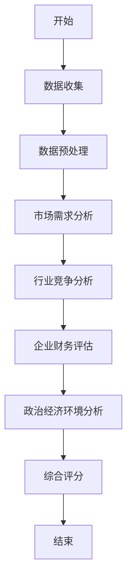

                 


# 彼得林奇的"市场机会"在跨境并购中的识别方法

## 关键词：
彼得林奇、市场机会、跨境并购、投资策略、并购分析、机会识别、风险评估

## 摘要：
本文详细探讨了彼得林奇的市场机会识别方法在跨境并购中的应用。通过分析市场机会的核心要素，构建识别模型，并结合算法原理和系统架构，为读者提供了一套系统化的识别方法。文章还通过实际案例分析和代码实现，展示了如何在实践中应用这些方法，并提供了最佳实践和注意事项。

---

## 第一部分：背景与概述

### 第1章：跨境并购与市场机会概述

#### 1.1 跨境并购的定义与特点
- **1.1.1 跨境并购的定义**
  跨境并购是指一家公司收购另一家位于不同国家或地区的公司，以实现战略目标或扩大业务范围。其核心在于跨越国界的资源整合和价值创造。

- **1.1.2 跨境并购的核心要素**
  - 财务实力：企业的资金实力和财务健康状况是并购的基础。
  - 行业地位：目标公司在行业中的竞争力和市场份额。
  - 政治经济环境：目标国家的政治稳定性、税收政策和贸易壁垒等因素。

- **1.1.3 跨境并购与国内并购的区别**
  - 风险因素：跨国并购涉及更多的不确定性和复杂性，如文化差异、法律差异等。
  - 财务结构：需要考虑汇率波动、税务规划等多方面因素。
  - 管理挑战：跨文化管理和全球资源整合更具挑战性。

#### 1.2 彼得林奇的市场机会理论
- **1.2.1 彼得林奇的市场机会定义**
  彼得林奇认为，市场机会是指在特定市场中，由于某种趋势或变化，导致某类产品或服务的需求激增，从而为企业带来超额利润的机会。

- **1.2.2 彼得林奇的市场机会识别方法**
  彼得林奇通过分析市场需求、行业竞争、企业财务状况和宏观经济环境，识别具有增长潜力的市场机会。

- **1.2.3 市场机会在跨境并购中的重要性**
  跨境并购的核心目标是通过收购目标公司，利用目标市场的市场机会，实现企业价值的最大化。

#### 1.3 跨境并购中的市场机会特点
- **1.3.1 市场机会的动态性**
  市场机会随着市场环境的变化而变化，具有较强的时效性。

- **1.3.2 市场机会的区域性**
  不同国家和地区的市场机会受到当地经济、文化和政策的影响，具有明显的区域性特征。

- **1.3.3 市场机会的行业差异性**
  不同行业中的市场机会受到行业特性和市场发展阶段的影响，具有差异性。

---

## 第二部分：核心概念与模型

### 第2章：彼得林奇市场机会识别模型

#### 2.1 市场机会识别模型的构建
- **2.1.1 模型的构建逻辑**
  彼得林奇的市场机会识别模型基于以下逻辑：
  - 需求增长：目标市场的市场需求正在快速增长。
  - 行业竞争：目标行业的竞争格局相对稳定，企业能够获得超额利润。
  - 企业实力：目标公司具有较强的财务实力和竞争优势。

- **2.1.2 模型的输入与输出**
  - 输入：目标市场的市场规模、增长率、竞争格局、目标公司的财务状况。
  - 输出：市场机会评分（0-10分），其中高分表示高潜力。

- **2.1.3 模型的验证与优化**
  通过历史数据验证模型的有效性，并根据实际并购案例调整模型参数。

#### 2.2 市场机会识别模型的核心要素
- **2.2.1 市场需求分析**
  - 市场规模：目标市场的总需求和潜在客户数量。
  - 市场增长率：目标市场的年增长率。

- **2.2.2 行业竞争分析**
  - 行业集中度：行业内主要竞争对手的数量和市场份额。
  - 进入壁垒：目标行业的新进入壁垒，如技术、资金、政策等。

- **2.2.3 企业财务状况评估**
  - 营业收入：目标公司的年营业收入。
  - 净利润：目标公司的年净利润。
  - 财务健康状况：资产负债率、流动比率等财务指标。

- **2.2.4 政治与经济环境分析**
  - 政治稳定性：目标国家的政治稳定性。
  - 经济政策：目标国家的货币政策、税收政策等。
  - 贸易壁垒：目标国家的关税、非关税壁垒等。

---

## 第三部分：算法原理与数学模型

### 第3章：市场机会识别算法

#### 3.1 算法步骤分解
1. 数据收集与预处理：收集目标市场的市场规模、增长率、竞争格局、目标公司的财务数据和宏观经济数据。
2. 市场需求分析：计算目标市场的市场规模和增长率。
3. 行业竞争分析：计算行业集中度和进入壁垒。
4. 企业财务评估：计算目标公司的财务健康状况。
5. 政治与经济环境分析：评估目标国家的政治和经济环境。
6. 综合评分：根据以上分析结果，计算市场机会评分。

#### 3.2 算法流程图


#### 3.3 数学模型与公式
- 市场机会评分公式：
  $$ \text{市场机会评分} = \frac{(\text{市场规模} \times \text{增长率}) + (\text{行业集中度} \times \text{进入壁垒}) + (\text{财务健康状况} \times \text{政治经济环境})}{3} $$

---

## 第四部分：系统分析与架构设计方案

### 第4章：系统功能设计

#### 4.1 项目介绍
- 系统目标：构建一个基于彼得林奇市场机会识别模型的跨境并购分析系统。
- 项目范围：涵盖数据收集、分析、评分和决策支持功能。

#### 4.2 系统功能设计
- 数据采集模块：收集目标市场的市场规模、增长率、竞争格局等数据。
- 数据分析模块：对目标公司的财务状况和宏观经济环境进行分析。
- 评分计算模块：根据分析结果计算市场机会评分。
- 决策支持模块：提供并购建议和风险评估。

#### 4.3 系统架构设计


---

## 第五部分：项目实战

### 第5章：环境安装与核心实现

#### 5.1 环境安装
- 安装Python：建议使用Python 3.8及以上版本。
- 安装依赖库：`pandas`, `numpy`, `matplotlib`.

#### 5.2 核心代码实现
```python
import pandas as pd
import numpy as np

def market_opportunity_score(target_market_size, market_growth_rate, industry_concentration, entry_barriers, financial_health, political_economy):
    score = (target_market_size * market_growth_rate + 
             industry_concentration * entry_barriers + 
             financial_health * political_economy) / 3
    return score

# 示例数据
target_market_size = 1000
market_growth_rate = 0.15
industry_concentration = 0.6
entry_barriers = 0.2
financial_health = 0.8
political_economy = 0.7

score = market_opportunity_score(target_market_size, market_growth_rate, industry_concentration, entry_barriers, financial_health, political_economy)
print(f"市场机会评分：{score}")
```

---

## 第六部分：最佳实践与小结

### 第6章：总结与建议

#### 6.1 最佳实践
- **数据准确性**：确保数据来源可靠，数据预处理到位。
- **模型优化**：根据实际情况调整模型参数，提高评分准确性。
- **风险评估**：在并购过程中，充分考虑政治、经济和行业风险。

#### 6.2 小结
彼得林奇的市场机会识别方法为跨境并购提供了有力的理论支持和实践指导。通过构建模型和算法，企业可以更科学地识别和利用市场机会，提高并购的成功率。

---

## 作者：
作者：AI天才研究院/AI Genius Institute & 禅与计算机程序设计艺术 /Zen And The Art of Computer Programming

