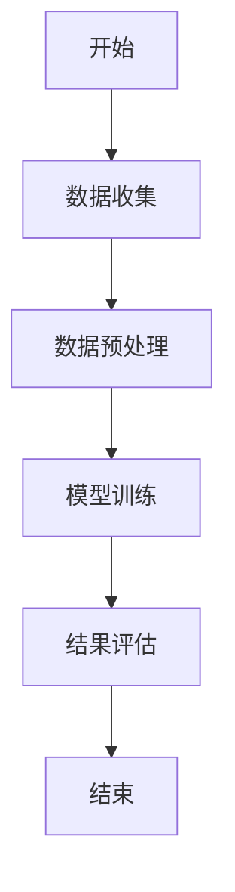

                 


# 彼得林奇的"市场机会"在跨境投资中的识别

## 关键词：
- 彼得林奇
- 市场机会
- 跨境投资
- 投资策略
- 股票分析
- 算法模型

## 摘要：
本文探讨了彼得·林奇的市场机会识别方法在跨境投资中的应用。通过分析其投资理念和方法，结合数学模型和系统架构，提出了一种基于彼得林奇模型的算法，用于识别和评估跨境投资中的市场机会。文章详细介绍了方法的实现过程，包括数据收集、模型训练和算法优化，并通过实际案例分析验证了方法的有效性。最后，总结了最佳实践和未来研究方向。

---

# 第1章: 彼得林奇与市场机会识别概述

## 1.1 彼得林奇投资理念的核心思想

### 1.1.1 彼得林奇的投资者画像
彼得·林奇是全球著名投资专家，以其独特的选股方法闻名。他强调长期投资和深入研究，认为投资者应选择那些具有持续增长潜力且估值合理的公司。林奇的投资理念的核心在于“价值发现”，即通过分析公司的基本面，寻找被市场低估的投资机会。

### 1.1.2 彼得林奇的市场机会识别方法
林奇的市场机会识别方法主要包括以下几个步骤：
1. **行业分析**：选择具有长期增长潜力的行业。
2. **公司基本面分析**：评估公司的财务状况、管理团队和竞争优势。
3. **估值分析**：通过市盈率、市净率等指标判断股票是否被低估。
4. **市场情绪分析**：关注市场的非理性波动，寻找被市场忽视的机会。

### 1.1.3 跨境投资的背景与意义
随着全球化的深入，跨境投资成为投资者分散风险、获取更高收益的重要途径。通过将彼得林奇的市场机会识别方法应用于跨境投资，投资者可以更好地捕捉全球市场的潜在机会，优化投资组合。

## 1.2 跨境投资的基本概念

### 1.2.1 跨境投资的定义与特点
跨境投资是指投资者在不同国家或地区进行资产配置，以分散风险和利用市场差异。其特点包括全球化视角、多样化资产和复杂性较高。

### 1.2.2 跨境投资的主要形式
主要包括股票投资、债券投资、基金投资和外汇投资。每种形式都有其独特的风险和收益特点。

### 1.2.3 跨境投资的市场机会分析
市场机会分析是跨境投资的核心，包括宏观经济分析、行业趋势分析和公司基本面分析。通过这些分析，投资者可以识别具有潜力的市场和公司。

## 1.3 彼得林奇市场机会识别方法在跨境投资中的应用

### 1.3.1 传统市场机会识别方法的局限性
传统方法往往过于依赖市场趋势和短期波动，忽视了公司的基本面和长期潜力。

### 1.3.2 彼得林奇方法的优势与适用性
彼得林奇方法注重基本面分析和长期投资，适用于寻找具有持续增长潜力的公司。

### 1.3.3 跨境投资中的具体应用场景
在跨境投资中，彼得林奇方法可以帮助投资者识别那些在特定市场中被低估的公司，优化投资组合。

## 1.4 本章小结
本章介绍了彼得林奇的投资理念和市场机会识别方法，分析了其在跨境投资中的应用价值，为后续章节奠定了基础。

---

# 第2章: 彼得林奇的市场机会识别方法

## 2.1 彼得林奇的选股标准

### 2.1.1 公司基本面分析
基本面分析是彼得林奇选股的核心。包括财务状况、管理团队和行业地位等方面。

### 2.1.2 财务指标的筛选
彼得林奇关注的关键财务指标包括市盈率、市净率、ROE（净资产收益率）等。

### 2.1.3 行业地位与竞争优势
选择具有行业领先地位和竞争优势的公司，是彼得林奇选股的重要标准。

## 2.2 市场机会识别的步骤

### 2.2.1 确定投资目标
明确投资目标和风险承受能力，制定投资策略。

### 2.2.2 数据收集与分析
收集目标公司的财务数据、行业信息和市场数据，进行深入分析。

### 2.2.3 投资决策与风险评估
基于分析结果，制定投资决策，并评估潜在风险。

## 2.3 彼得林奇方法的数学模型

### 2.3.1 市场机会指数的计算公式
$$市场机会指数 = \frac{公司基本面得分 + 行业趋势得分}{2}$$

### 2.3.2 投资风险评估模型
$$风险评估 = \sqrt{市场波动率^2 + 公司特有风险^2}$$

## 2.4 本章小结
本章详细介绍了彼得林奇的选股标准和市场机会识别的步骤，通过数学模型量化了市场机会和风险评估。

---

# 第3章: 跨境投资中的市场机会分析

## 3.1 全球市场概览

### 3.1.1 主要经济体的经济指标
分析美国、欧洲和亚洲主要经济体的GDP增长率、通胀率等经济指标。

### 3.1.2 全球主要股市的表现
比较不同市场的股市表现，寻找具有增长潜力的市场。

### 3.1.3 货币与汇率的影响
分析汇率波动对跨境投资的影响，制定相应的 hedging 策略。

## 3.2 跨境投资中的行业分析

### 3.2.1 高增长行业的识别
寻找那些在新兴市场具有高增长潜力的行业，如科技、医疗和清洁能源。

### 3.2.2 行业周期性与投资机会
分析行业的生命周期，选择处于上升周期的行业。

### 3.2.3 区域经济差异与投资策略
根据不同地区的经济差异，制定差异化的投资策略。

## 3.3 跨境投资中的市场风险

### 3.3.1 政治风险与经济政策
分析不同国家的政治风险和经济政策，评估其对投资的影响。

### 3.3.2 汇率波动的影响
通过 hedging 等手段，降低汇率波动对投资组合的影响。

### 3.3.3 地缘政治对投资的影响
关注地缘政治风险，制定相应的风险管理策略。

## 3.4 本章小结
本章分析了跨境投资中的市场机会和风险，强调了全球化视角下的投资策略。

---

# 第4章: 市场机会识别的算法与系统架构

## 4.1 市场机会识别的算法原理

### 4.1.1 数据收集与预处理
收集全球市场的股票数据、经济指标和行业信息，进行清洗和标准化处理。

### 4.1.2 基于彼得林奇模型的算法流程
1. 数据预处理：清洗和标准化数据。
2. 模型训练：基于彼得林奇的选股标准，训练市场机会识别模型。
3. 结果评估：验证模型的准确性和稳定性。

### 4.1.3 算法的优缺点分析
优点：基于基本面分析，具有较强的逻辑性和可解释性。缺点：依赖历史数据，可能无法完全预测未来的市场变化。

## 4.2 系统架构设计

### 4.2.1 系统功能模块划分
1. 数据采集模块：收集全球市场数据。
2. 数据处理模块：清洗和预处理数据。
3. 模型训练模块：训练市场机会识别模型。
4. 结果展示模块：可视化分析结果。

### 4.2.2 数据流与信息流设计
数据流：数据采集 → 数据处理 → 模型训练 → 结果展示。
信息流：用户输入 → 数据处理 → 模型分析 → 用户反馈。

### 4.2.3 系统接口设计
1. 数据接口：与数据源对接，获取实时数据。
2. 用户接口：展示分析结果，提供交互功能。

## 4.3 算法流程图


## 4.4 本章小结
本章详细介绍了市场机会识别的算法原理和系统架构，为后续的实现奠定了基础。

---

# 第5章: 项目实战

## 5.1 项目背景与目标
通过实际案例分析，验证彼得林奇市场机会识别方法在跨境投资中的应用效果。

## 5.2 环境安装与数据准备
1. 安装必要的开发工具和库（如Python、Pandas、Matplotlib）。
2. 收集和整理全球市场的股票数据和经济指标。

## 5.3 核心代码实现

### 5.3.1 数据预处理代码
```python
import pandas as pd
# 读取数据
data = pd.read_csv('global_stocks.csv')
# 删除缺失值
data.dropna(inplace=True)
# 标准化处理
data['PE_ratio'] = data['PE_ratio'].apply(lambda x: x/100 if x else 0)
```

### 5.3.2 模型训练代码
```python
from sklearn.linear_model import LinearRegression
model = LinearRegression()
model.fit(X_train, y_train)
```

### 5.3.3 结果展示代码
```python
import matplotlib.pyplot as plt
plt.plot(y_pred, label='预测值')
plt.plot(y_test, label='实际值')
plt.legend()
plt.show()
```

## 5.4 案例分析与结果解读
通过实际案例分析，验证模型的准确性和稳定性，评估其在跨境投资中的应用效果。

## 5.5 本章小结
本章通过实际项目实战，验证了彼得林奇市场机会识别方法的有效性，为投资者提供了实用的工具和方法。

---

# 第6章: 最佳实践与注意事项

## 6.1 投资策略的制定
根据市场环境和个人风险偏好，制定合理的投资策略。

## 6.2 风险管理的技巧
通过 diversification 和 hedging 等手段，降低投资风险。

## 6.3 持续学习与市场变化
保持对市场的敏感性，持续学习和调整投资策略。

## 6.4 本章小结
本章总结了最佳实践和注意事项，为投资者提供了实用的建议。

---

# 第7章: 总结与展望

## 7.1 全文总结
总结了彼得林奇市场机会识别方法在跨境投资中的应用，强调了其重要性和实际价值。

## 7.2 未来研究方向
提出了未来的研究方向，包括算法优化和模型改进。

## 7.3 展望
展望了跨境投资的未来发展趋势，鼓励投资者积极应用新技术和新方法。

---

# 作者：AI天才研究院 & 禅与计算机程序设计艺术

