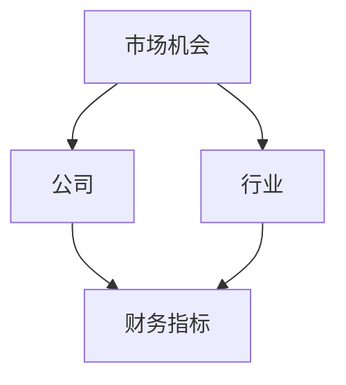
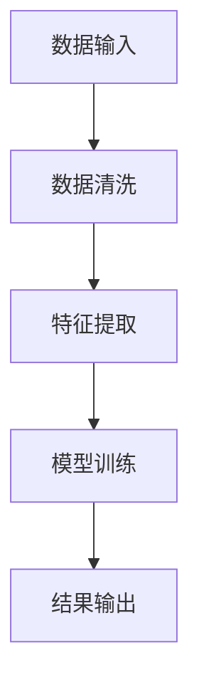
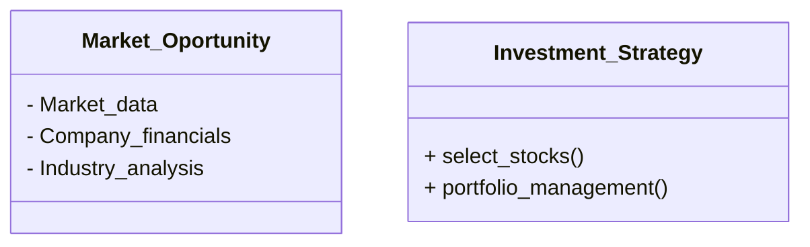
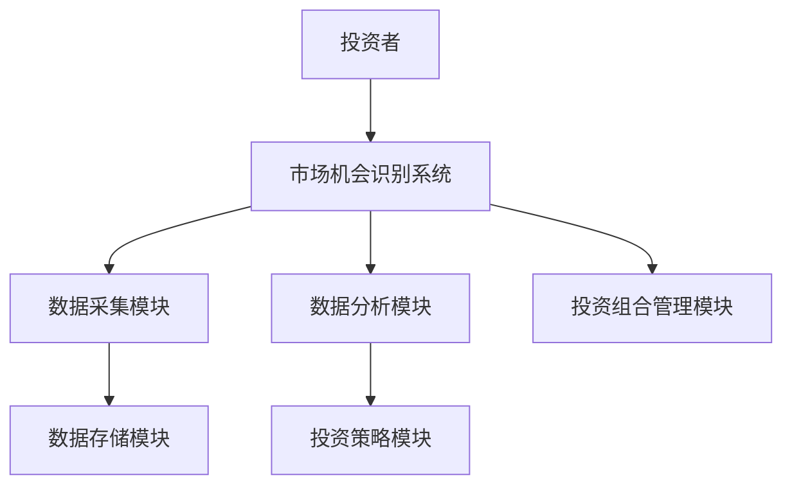
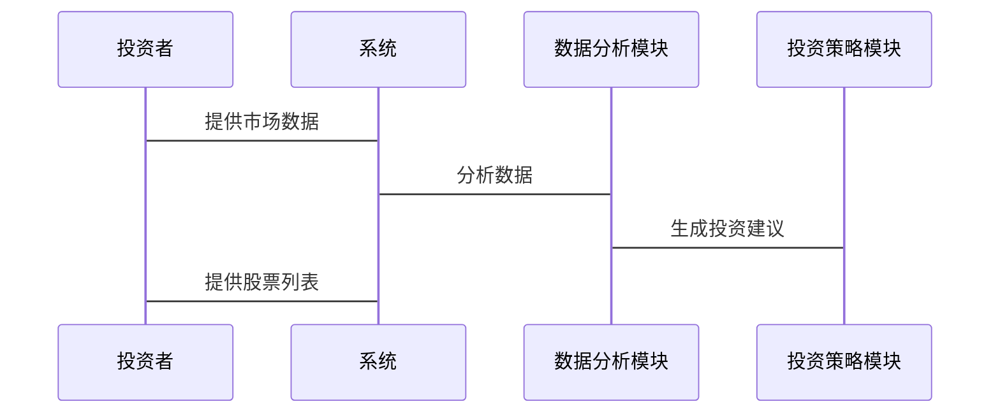

                 


# 彼得林奇的"市场机会"把握技巧

> 关键词：彼得林奇，市场机会，投资策略，选股方法，风险管理

> 摘要：本文深入探讨了彼得林奇的市场机会把握技巧，从投资理念、市场分析、选股策略到风险管理，全面解析其成功投资的方法论。通过详细分析，帮助读者掌握如何识别市场机会，制定有效的投资策略。

---

# 第一部分：彼得林奇的投资理念与哲学

## 第1章：彼得林奇的投资哲学

### 1.1 投资的基本原则

#### 1.1.1 投资的定义与核心要素

投资是一种通过合理配置资源以实现资产增值的活动。彼得林奇认为，投资的核心在于寻找那些具有持续增长潜力的企业，并长期持有其股票。投资的基本要素包括资金、风险、收益和时间。

#### 1.1.2 彼得林奇的投资理念

彼得林奇强调价值投资，认为市场的短期波动是噪音，而企业的内在价值才是关键。他主张投资于那些被市场低估的公司，并长期持有。他的投资理念包括：

1. **长期投资**：避免频繁交易，降低交易成本。
2. **价值投资**：寻找那些市场价格低于内在价值的股票。
3. **分散投资**：通过投资多个行业和公司来降低风险。
4. **深入研究**：在投资前，对公司的财务状况、管理层和行业前景进行详细分析。

#### 1.1.3 长期投资的重要性

彼得林奇认为，长期投资能够帮助投资者避免短期市场波动的影响，同时享受企业长期增长的收益。他强调，投资者应专注于企业的基本面，而非市场的短期波动。

---

## 第2章：市场机会的背景与问题背景

### 2.1 市场机会的定义与核心概念

#### 2.1.1 市场机会的定义

市场机会是指在特定市场中，由于某种原因导致某些股票价格被低估，从而为投资者提供获利的机会。彼得林奇通过分析市场周期、行业趋势和公司基本面来识别这些机会。

#### 2.1.2 问题背景与问题描述

在市场中，股票价格受多种因素影响，包括宏观经济、行业趋势和公司业绩。彼得林奇关注的是那些价格被低估的股票，这些股票通常具有较高的内在价值，但市场价格尚未反映其真实价值。

#### 2.1.3 问题解决的思路与方法

彼得林奇通过以下方法识别市场机会：

1. **市场周期分析**：研究市场的周期性波动，寻找市场低谷时的低估股票。
2. **行业分析**：选择具有增长潜力的行业，投资其中的龙头公司。
3. **财务分析**：通过分析公司的财务报表，评估其盈利能力、成长性和财务健康状况。

#### 2.1.4 边界与外延

市场机会的识别需要考虑市场的整体情况，包括宏观经济指标、行业趋势和公司基本面。彼得林奇的投资策略具有一定的边界，例如他主要关注美国市场，且偏好中型成长股。

#### 2.1.5 核心要素与概念结构

市场机会的核心要素包括：

1. **市场周期**：市场的涨跌周期。
2. **行业趋势**：行业的发展前景。
3. **公司基本面**：公司的财务状况、盈利能力和发展潜力。

---

## 第3章：市场机会识别的核心概念与联系

### 3.1 核心概念原理

#### 3.1.1 市场周期分析

市场周期包括牛市和熊市。彼得林奇认为，在熊市中，许多优质股票会被市场低估，为投资者提供了买入机会。他通过分析市场的估值水平，如市盈率、市净率等指标，判断市场的周期阶段。

#### 3.1.2 行业分析与竞争格局

彼得林奇关注具有增长潜力的行业，如科技、医疗等。他通过分析行业的市场容量、竞争格局和未来发展趋势，选择那些具有竞争优势的公司。

#### 3.1.3 财务指标评估

彼得林奇通过分析公司的财务报表，评估其盈利能力、成长性和财务健康状况。他关注的财务指标包括：

- **市盈率（PE）**：衡量股票价格是否合理。
- **市净率（PB）**：衡量股票价格相对于账面价值的高低。
- **ROE（净资产收益率）**：衡量公司的盈利能力。

#### 3.1.4 公司基本面分析

彼得林奇认为，公司的基本面是决定股票价值的关键因素。他通过分析公司的收入增长、利润水平、管理层能力和竞争优势，选择具有持续增长潜力的公司。

### 3.2 概念属性特征对比表格

| 概念                | 特征                  |
|---------------------|-----------------------|
| 市场周期            | 牛市、熊市            |
| 行业分析            | 增长潜力、竞争格局    |
| 财务指标            | PE、PB、ROE            |
| 公司基本面          | 收入增长、利润、管理层能力 |

### 3.3 ER实体关系图



---

## 第4章：市场机会识别的算法原理

### 4.1 算法原理概述

彼得林奇的市场机会识别方法可以看作是一种基于基本面分析的投资策略。以下是其实现的基本步骤：

1. **数据收集**：收集目标公司的财务数据、行业信息和市场数据。
2. **数据预处理**：清洗数据，去除无效或错误的数据。
3. **特征提取**：提取关键的财务指标和市场指标。
4. **模型训练**：通过分析这些指标，识别具有投资价值的公司。
5. **结果输出**：输出符合投资条件的股票列表。

### 4.2 算法流程图



### 4.3 算法实现代码

以下是基于彼得林奇投资策略的简化代码示例：

```python
import pandas as pd

def identify_market_opportunity(data):
    # 数据清洗
    cleaned_data = data.dropna()
    # 特征提取
    features = cleaned_data[['PE', 'PB', 'ROE']]
    # 筛选条件：PE < 15，PB < 2，ROE > 10%
    opportunity_list = cleaned_data[(cleaned_data['PE'] < 15) & 
                                    (cleaned_data['PB'] < 2) & 
                                    (cleaned_data['ROE'] > 0.1)]
    return opportunity_list

# 示例数据
data = {
    'PE': [12, 18, 10, 25],
    'PB': [1.5, 2.0, 0.8, 3.0],
    'ROE': [0.1, 0.08, 0.12, 0.05]
}
df = pd.DataFrame(data)
result = identify_market_opportunity(df)
print(result)
```

---

## 第5章：彼得林奇的选股策略

### 5.1 选股标准

彼得林奇选股的核心标准是寻找那些具有以下特征的公司：

1. **低市盈率（PE）**：通常低于15。
2. **低市净率（PB）**：通常低于2。
3. **高ROE**：通常高于10%。
4. **收入和利润稳定增长**。
5. **管理层能力强**。

### 5.2 成长股与价值股的平衡

彼得林奇既关注成长股，也关注价值股。他认为，成长股具有较高的增长潜力，而价值股则具有较高的安全边际。

### 5.3 管理层能力评估

彼得林奇认为，管理层的能力是公司成功的关键因素。他通过分析公司的管理团队、战略规划和历史表现来评估管理层的能力。

---

## 第6章：投资组合管理

### 6.1 投资组合的构建

彼得林奇建议投资者将资金分散投资于多个行业和公司，以降低风险。他通常持有10到15只股票，涵盖多个行业。

### 6.2 定期调整策略

彼得林奇定期审视投资组合，根据市场变化和公司基本面调整持仓。他通常每年调整一次投资组合。

### 6.3 长期投资的重要性

彼得林奇强调长期投资的重要性，认为短期波动不应影响长期投资决策。

---

## 第7章：风险管理与心理控制

### 7.1 风险管理策略

彼得林奇认为，风险管理是投资成功的关键。他通过分散投资、设定止损点和避免过度杠杆化来控制风险。

### 7.2 投资者心理控制

彼得林奇提醒投资者，情绪波动是投资的最大敌人。他建议投资者保持冷静，避免被市场情绪左右。

### 7.3 常见错误与注意事项

彼得林奇指出，投资者常见的错误包括：

1. 过度关注短期波动。
2. 试图预测市场走势。
3. 未能进行充分的研究。

---

## 第8章：彼得林奇的市场机会识别实战案例

### 8.1 案例分析：科技行业

假设当前科技行业处于熊市周期，许多科技公司的股票价格被低估。彼得林奇会选择那些具有强大研发能力、市场占有率高且财务健康的公司。

### 8.2 投资组合构建

假设投资者有100万美元可用于投资，彼得林奇可能会选择以下股票：

1. 苹果公司（AAPL）：PE = 12，PB = 1.5，ROE = 15%。
2. 微软公司（MSFT）：PE = 10，PB = 1.2，ROE = 12%。
3. 亚马逊（AMZN）：PE = 20，PB = 2.5，ROE = 8%。

### 8.3 定期调整

每年，彼得林奇会审视投资组合，并根据市场变化和公司基本面进行调整。例如，如果某公司业绩不佳，他可能会卖出该股票并买入新的股票。

---

## 第9章：系统分析与架构设计方案

### 9.1 问题场景介绍

投资者需要一个系统化的工具来识别市场机会，优化投资组合并进行风险控制。

### 9.2 系统功能设计

#### 领域模型



#### 系统架构设计



#### 系统接口设计

- 数据输入接口：接收市场数据和公司财务数据。
- 数据分析接口：提供数据分析和筛选功能。
- 投资策略接口：输出投资建议和股票列表。

#### 系统交互设计



---

## 第10章：项目实战

### 10.1 环境安装

需要安装以下工具：

- Python编程语言
- 数据分析库（如Pandas、NumPy）
- 图形化工具（如Matplotlib、Seaborn）

### 10.2 系统核心实现源代码

以下是基于彼得林奇策略的Python代码示例：

```python
import pandas as pd

def select_stocks(data, pe_threshold=15, pb_threshold=2, roe_threshold=0.1):
    # 数据清洗
    cleaned_data = data.dropna()
    # 筛选条件
    selected = cleaned_data[(cleaned_data['PE'] < pe_threshold) &
                            (cleaned_data['PB'] < pb_threshold) &
                            (cleaned_data['ROE'] > roe_threshold)]
    return selected

# 示例数据
data = {
    'PE': [10, 12, 18, 20],
    'PB': [1.0, 1.5, 2.0, 2.5],
    'ROE': [0.12, 0.1, 0.08, 0.09]
}
df = pd.DataFrame(data)
result = select_stocks(df)
print(result)
```

### 10.3 代码应用解读与分析

上述代码通过筛选PE、PB和ROE等指标，识别出符合彼得林奇选股标准的股票。示例数据中，PE < 15，PB < 2，ROE > 10%的股票是第一行数据，即PE=10，PB=1.0，ROE=12%。

### 10.4 实际案例分析

假设当前市场中某科技公司数据如下：

| 参数 | 值   |
|------|------|
| PE   | 12   |
| PB   | 1.5   |
| ROE  | 15%   |

根据上述代码，该股票符合筛选条件，被视为市场机会。

### 10.5 项目小结

通过代码实现彼得林奇的选股策略，可以帮助投资者快速识别市场机会，优化投资组合。然而，实际投资中需结合更多的因素，如行业趋势和公司基本面。

---

## 第11章：最佳实践、小结与注意事项

### 11.1 最佳实践

1. **深入研究**：在投资前，对公司的基本面和行业趋势进行深入研究。
2. **分散投资**：避免将所有资金投入单一行业或公司。
3. **长期持有**：坚持长期投资，避免频繁交易。

### 11.2 小结

彼得林奇的市场机会识别方法是一种基于基本面分析的投资策略，通过寻找被低估的股票实现长期收益。其核心在于深入研究和长期持有。

### 11.3 注意事项

1. **市场风险**：市场波动可能导致投资损失。
2. **数据质量**：数据的准确性和完整性对投资决策至关重要。
3. **持续学习**：投资环境不断变化，需持续学习和调整策略。

---

## 第12章：拓展阅读与进一步思考

### 12.1 拓展阅读

建议阅读以下书籍和文章：

- 《彼得·林奇的成功投资》
- 《投资学基础》
- 《价值投资入门》

### 12.2 进一步思考

投资者如何在不同的市场环境下应用彼得林奇的策略？如何结合技术分析和基本面分析制定更有效的投资策略？

---

作者：AI天才研究院/AI Genius Institute & 禅与计算机程序设计艺术/Zen And The Art of Computer Programming

