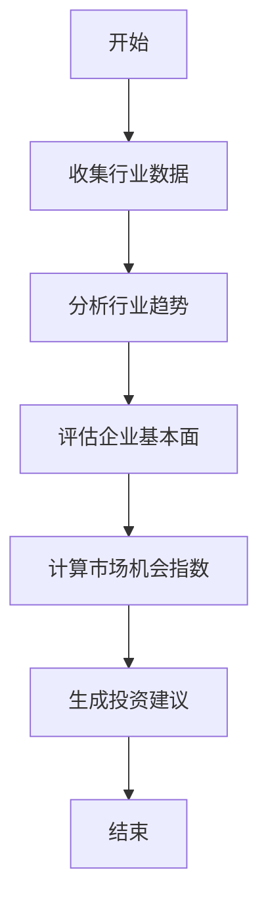
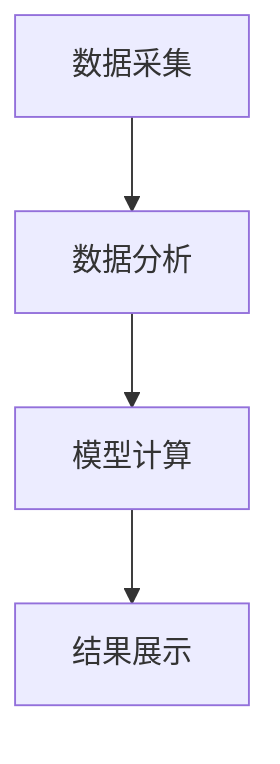
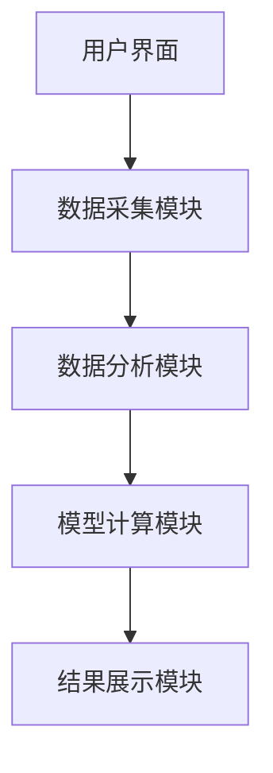
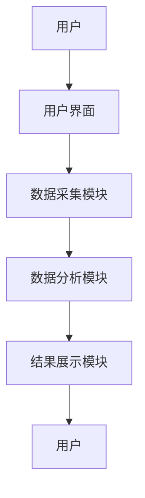

                 


# 彼得林奇的“市场机会”识别技巧

> 关键词：市场机会识别，投资策略，彼得林奇，投资分析，市场趋势

> 摘要：本文深入探讨了彼得林奇的市场机会识别技巧，结合技术背景和实战案例，分析了其核心理念、算法原理、数学模型以及系统架构。通过详细讲解和具体案例，帮助读者掌握如何识别和利用市场机会，提升投资决策能力。

---

## 第一部分：彼得林奇的市场机会识别方法

### 第1章：彼得林奇的市场机会识别方法概述

#### 1.1 彼得林奇的市场机会识别方法

##### 1.1.1 彼得林奇的市场机会识别的核心理念
彼得林奇（Peter Lynch）是全球著名投资家，以其独特的市场机会识别技巧闻名。他强调通过分析市场趋势、行业动态和企业基本面来发现潜在的投资机会。核心理念包括：
- **市场趋势分析**：关注行业周期性变化，识别市场拐点。
- **企业竞争优势**：评估企业的核心竞争力和市场地位。
- **价值评估**：通过财务指标分析企业的真实价值。

##### 1.1.2 彼得林奇的市场机会识别的基本框架
彼得林奇的市场机会识别框架包括以下几个步骤：
1. **行业分析**：研究行业的发展趋势和竞争格局。
2. **企业分析**：评估企业的财务状况、管理团队和市场策略。
3. **市场评估**：综合行业和企业分析，判断市场的潜力和风险。

##### 1.1.3 彼得林奇方法的适用范围与边界
彼得林奇的方法适用于长期投资，尤其适合寻找具有持续增长潜力的企业。其边界包括：
- 不适合短期投机性交易。
- 对于新兴行业和创新企业需要结合其他方法进行分析。

#### 1.2 彼得林奇市场机会识别的成功案例

##### 1.2.1 典型成功案例分析
彼得林奇曾成功投资于多个具有长期增长潜力的企业，例如：
- **可口可乐公司**：通过分析其市场地位和品牌价值，判断其长期增长潜力。
- **家居零售企业**：通过分析行业趋势和企业竞争优势，发现其未被市场充分认识的价值。

##### 1.2.2 案例中的关键识别点
- 行业趋势：选择处于上升期的行业。
- 企业基本面：关注企业的财务健康和管理能力。
- 市场低估：寻找市场未充分估值的企业。

##### 1.2.3 案例的启示与经验总结
彼得林奇的成功案例表明，市场机会识别需要结合行业分析、企业基本面和市场估值，综合判断企业的长期发展潜力。

---

## 第二部分：彼得林奇市场机会识别的核心概念与联系

### 第2章：彼得林奇市场机会识别的核心概念

#### 2.1 核心概念的定义与特征

##### 2.1.1 市场机会的定义
市场机会是指在特定市场中，由于行业趋势、消费者需求或技术进步等因素，导致企业能够获得超额收益的可能性。

##### 2.1.2 市场机会的关键特征
- **增长潜力**：行业或企业未来收入的增长空间。
- **竞争优势**：企业在行业中的独特优势，如成本优势、技术优势等。
- **市场风险**：市场波动对企业价值的影响。

##### 2.1.3 彼得林奇方法的独特性
- 强调长期投资，关注企业的基本面和行业趋势。
- 通过分析企业竞争优势和市场潜力，识别具有持续增长能力的企业。

#### 2.2 核心概念之间的联系

##### 2.2.1 市场机会与投资策略的关系
市场机会是投资策略的核心，通过识别市场机会，投资者可以制定相应的投资策略，优化资产配置。

##### 2.2.2 市场机会与行业趋势的关联
行业趋势直接影响企业的市场机会，处于上升期的行业更容易产生投资机会。

##### 2.2.3 市场机会与企业竞争优势的结合
企业竞争优势是市场机会的决定因素之一，具有独特竞争优势的企业更容易抓住市场机会。

---

### 第3章：彼得林奇市场机会识别的算法原理

#### 3.1 算法概述

##### 3.1.1 算法的基本原理
彼得林奇的市场机会识别算法基于多因素分析，通过量化市场趋势、企业基本面和行业竞争格局，评估市场的潜力和风险。

##### 3.1.2 算法的输入与输出
- **输入**：行业数据、企业财务数据、市场指标。
- **输出**：市场机会指数、投资建议。

##### 3.1.3 算法的优缺点
- **优点**：结合行业趋势和企业基本面，能够较准确地识别市场机会。
- **缺点**：依赖于数据质量和分析模型的准确性，对模型参数敏感。

#### 3.2 算法流程图



---

### 第4章：彼得林奇市场机会识别的数学模型与公式

#### 4.1 关键公式

##### 4.1.1 市场机会指数公式
$$市场机会指数 = \frac{行业增长潜力 \times 企业竞争优势}{市场风险}$$

##### 4.1.2 市场潜力评估公式
$$市场潜力 = \sum_{i=1}^{n} (行业趋势权重_i \times 趋势强度_i) + \sum_{j=1}^{m} (企业竞争优势权重_j \times 竞争优势指标_j)$$

---

## 第三部分：彼得林奇市场机会识别的系统分析与架构设计

### 第5章：系统分析与架构设计

#### 5.1 系统功能设计

##### 5.1.1 系统功能模块
- **数据采集模块**：收集行业数据和企业财务数据。
- **数据分析模块**：分析行业趋势和企业基本面。
- **模型计算模块**：计算市场机会指数。
- **结果展示模块**：生成投资建议。

##### 5.1.2 系统功能流程图



#### 5.2 系统架构设计

##### 5.2.1 系统架构图



#### 5.3 系统接口设计
- **输入接口**：接收行业数据和企业财务数据。
- **输出接口**：输出市场机会指数和投资建议。

#### 5.4 系统交互设计



---

## 第四部分：彼得林奇市场机会识别的项目实战

### 第6章：项目实战

#### 6.1 项目背景
本项目旨在利用彼得林奇的市场机会识别方法，分析某行业市场机会，生成投资建议。

#### 6.2 环境安装
- **Python环境**：安装Python 3.8以上版本。
- **依赖库安装**：安装pandas、numpy、scikit-learn等库。

#### 6.3 核心实现代码

##### 6.3.1 数据采集模块

```python
import pandas as pd

def collect_data():
    # 示例：从CSV文件中读取数据
    data = pd.read_csv('market_data.csv')
    return data
```

##### 6.3.2 数据分析模块

```python
def analyze_data(data):
    # 示例：计算行业增长潜力
    industry_growth = data['收入增长率'].mean()
    return industry_growth
```

##### 6.3.3 模型计算模块

```python
def calculate_opportunity(industry_growth, competitive_edge):
    market_risk = 1.5  # 示例：市场风险系数
    opportunity_index = (industry_growth * competitive_edge) / market_risk
    return opportunity_index
```

##### 6.3.4 结果展示模块

```python
def display_result(opportunity_index):
    print(f"市场机会指数：{opportunity_index}")
    if opportunity_index > 1.2:
        print("投资建议：积极关注")
    else:
        print("投资建议：谨慎投资")
```

#### 6.4 项目实现流程

1. 读取数据文件。
2. 计算行业增长潜力。
3. 计算市场机会指数。
4. 生成投资建议。

#### 6.5 项目小结
通过本项目，读者可以掌握如何利用彼得林奇的市场机会识别方法，进行实际的市场分析和投资决策。

---

## 第五部分：彼得林奇市场机会识别的最佳实践与总结

### 第7章：最佳实践与总结

#### 7.1 最佳实践 tips
- **数据质量**：确保数据来源可靠，数据清洗到位。
- **模型优化**：根据实际数据调整模型参数，优化计算结果。
- **风险控制**：结合市场波动和企业风险，制定合理的投资策略。

#### 7.2 小结
彼得林奇的市场机会识别方法是一种结合行业趋势、企业基本面和市场估值的投资策略，通过系统化的分析和计算，可以帮助投资者发现潜在的市场机会。

#### 7.3 注意事项
- **数据敏感性**：注意数据隐私和合规性。
- **模型局限性**：彼得林奇方法适用于长期投资，短期市场波动可能影响结果。

#### 7.4 拓展阅读
- 《彼得林奇选股术》：深入学习彼得林奇的投资理念。
- 技术分析与市场机会识别：结合技术分析方法，优化市场机会识别模型。

---

## 作者：AI天才研究院/AI Genius Institute & 禅与计算机程序设计艺术/Zen And The Art of Computer Programming

---

本文通过详细分析彼得林奇的市场机会识别技巧，结合技术背景和实战案例，帮助读者掌握市场机会识别的核心方法和实际应用。希望读者能够通过本文，提升自己的投资决策能力。

