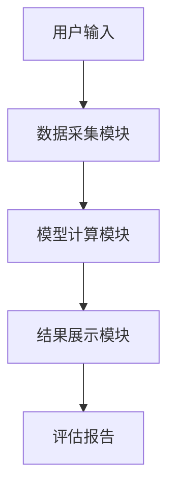

                 


# 彼得林奇的"市场领导者"转型能力评估

---

## 关键词：彼得林奇、市场领导者、转型能力、评估模型、投资理论、战略分析、数据分析

---

## 摘要

本文围绕彼得林奇的市场领导者转型能力评估展开深入分析。通过对市场领导者转型能力的核心概念、评估方法、数学模型和系统架构的全面探讨，结合实际案例和项目实战，详细阐述了如何从理论和实践两个层面进行评估。文章内容涵盖背景介绍、核心概念、算法原理、系统架构设计、项目实战及总结，旨在为企业高管和市场研究人员提供一份全面的指导手册。

---

## 第一部分：背景介绍

### 第1章：市场领导者转型能力评估的背景与意义

#### 1.1 市场领导者转型的必要性

- **问题背景**  
  市场领导者在竞争激烈的商业环境中，面临着来自新兴企业和技术变革的双重压力。转型能力是企业保持领先地位的核心竞争力。

- **问题描述**  
  市场领导者在转型过程中，往往面临战略调整、组织变革和技术创新等多重挑战。如何评估和提升转型能力，成为企业高管和投资者关注的焦点。

- **解决方法**  
  通过彼得林奇的市场领导者理论，结合数学模型和系统架构设计，构建一个全面的转型能力评估体系。

- **边界与外延**  
  本文主要关注企业层面的市场领导者转型能力评估，不涉及个人或团队层面的转型能力评估。

- **概念结构与核心要素组成**  
  转型能力评估的核心要素包括：战略能力、领导力、创新能力和执行力。

---

### 第2章：彼得林奇的市场领导者理论

#### 2.1 彼得林奇的市场领导者特征

- **战略能力**  
  市场领导者需要具备清晰的战略规划能力，能够在竞争中占据先机。

- **领导力**  
  优秀的领导者能够激发团队的潜力，推动企业实现目标。

- **创新能力**  
  市场领导者需要不断推陈出新，保持竞争优势。

- **执行力**  
  转型能力的实现需要高效的执行能力，确保战略目标的落地。

---

## 第二部分：核心概念与联系

### 第3章：市场领导者转型能力的核心概念

#### 3.1 转型能力的定义与特征

- **定义**  
  转型能力是指企业在面对市场变化时，能够快速调整战略、组织和运营模式的能力。

- **特征**  
  - **动态性**：转型能力需要根据市场环境的变化进行调整。
  - **系统性**：转型能力涉及企业的各个层面，是一个系统工程。
  - **可持续性**：转型能力需要长期积累和提升。

#### 3.2 转型能力评估的核心维度

| 维度 | 描述 |
|------|------|
| 战略能力 | 企业制定和执行战略的能力 |
| 领导力 | 领导者的影响力和决策能力 |
| 创新能力 | 企业的创新能力，包括产品、服务和商业模式的创新 |
| 执行力 | 企业执行战略和计划的能力 |

---

## 第三部分：算法原理与数学模型

### 第4章：市场领导者转型能力评估的数学模型

#### 4.1 评估模型的构建

- **输入变量**  
  - 战略能力评分
  - 领导力评分
  - 创新能力评分
  - 执行力评分

- **输出结果**  
  - 转型能力指数（TCE）

- **假设条件**  
  - 评估结果基于定量分析，不考虑定性因素。

#### 4.2 转型能力指数的计算公式

$$
TCE = \sum_{i=1}^{n} w_i \cdot s_i
$$

其中，$w_i$ 是第 $i$ 个评估维度的权重，$s_i$ 是第 $i$ 个维度的评分。

#### 4.3 算法实现

```python
def calculate_tce(weights, scores):
    tce = sum(w * s for w, s in zip(weights, scores))
    return tce

# 示例
weights = [0.4, 0.3, 0.2, 0.1]
scores = [0.8, 0.7, 0.6, 0.5]
tce = calculate_tce(weights, scores)
print(f"转型能力指数 (TCE): {tce}")
```

---

## 第四部分：系统架构设计

### 第5章：市场领导者转型能力评估的系统架构

#### 5.1 系统功能设计

- **数据采集模块**  
  - 收集企业的战略能力、领导力、创新能力和执行力评分。

- **模型计算模块**  
  - 使用数学模型计算转型能力指数。

- **结果展示模块**  
  - 展示评估结果，并提供改进建议。

#### 5.2 系统架构设计



---

## 第五部分：项目实战

### 第6章：市场领导者转型能力评估的项目实战

#### 6.1 项目背景与目标

- **背景**  
  某高科技企业在竞争中面临转型压力，希望通过彼得林奇的理论进行评估。

- **目标**  
  - 评估企业的转型能力。
  - 提供改进建议。

#### 6.2 项目实施步骤

1. **数据收集**  
   - 收集企业的战略能力、领导力、创新能力和执行力评分。

2. **模型计算**  
   - 使用数学模型计算转型能力指数。

3. **结果分析**  
   - 根据评估结果，提出改进建议。

---

## 第六部分：总结与展望

### 第7章：总结与展望

#### 7.1 小结

- 本文通过彼得林奇的市场领导者理论，构建了一个全面的转型能力评估体系。
- 结合数学模型和系统架构设计，为企业提供了理论和实践指导。

#### 7.2 注意事项

- 评估结果需结合企业实际背景进行分析。
- 模型的权重分配需要根据企业特点进行调整。

#### 7.3 拓展阅读

- 彼得林奇的《聪明的投资者》
- 其他相关投资理论和市场分析方法。

---

## 作者：AI天才研究院/AI Genius Institute & 禅与计算机程序设计艺术 /Zen And The Art of Computer Programming

---

**联系方式**：  
- 电子邮箱：contact@aicourse.com  
- 微信公众号：AI课程与技术分享

