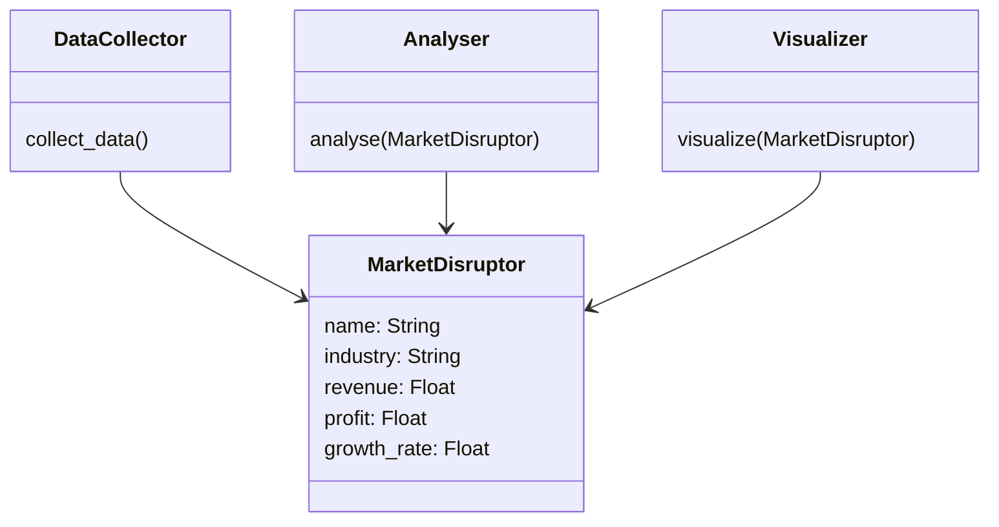

                 


# 彼得林奇的"市场颠覆者"在新兴行业中的识别技巧

> **关键词**: 彼得林奇、市场颠覆者、新兴行业、投资分析、风险管理

> **摘要**: 本文将介绍彼得·林奇的“市场颠覆者”理论，分析如何在新兴行业中识别这些颠覆者，并通过具体案例和系统架构帮助读者掌握识别技巧。文章结合定量和定性分析方法，详细讲解市场颠覆者的特征、识别标准和投资策略，为读者提供实用的指导。

---

## 第一部分: 背景介绍

### 第1章: 市场颠覆者的定义与背景

#### 1.1 市场颠覆者的定义

市场颠覆者是指在某个行业中，通过创新的产品、商业模式或技术手段，打破现有市场格局的企业。彼得·林奇认为，市场颠覆者通常出现在新兴行业，它们通过独特的竞争优势迅速占领市场并实现增长。

**市场颠覆者的概念**  
市场颠覆者不仅仅是市场的新进入者，更是通过创新手段重新定义行业规则的企业。它们的核心竞争力在于能够识别市场空白并迅速填补，从而在竞争中占据优势。

**彼得·林奇的理论基础**  
彼得·林奇强调，市场颠覆者的成功依赖于以下几个因素：  
1. **创新性**：颠覆者通常提供市场上没有的独特产品或服务。  
2. **市场定位**：它们往往选择未被充分竞争的细分市场。  
3. **成长性**：颠覆者具备快速扩张的能力，能够在短期内实现市场份额的大幅提升。  

**新兴行业中的市场颠覆者特点**  
在新兴行业中，市场颠覆者通常具备以下特点：  
- 创新能力强，能够快速迭代产品。  
- 对市场变化敏感，能够及时调整战略。  
- 具备强大的执行力，能够在竞争中迅速占据主导地位。  

#### 1.2 市场颠覆者在新兴行业中的重要性

新兴行业通常是市场颠覆者的温床。这些行业往往存在未被充分满足的需求，市场颠覆者通过填补这些空白，迅速成为行业领导者。彼得·林奇认为，新兴行业的市场颠覆者往往具备以下优势：  

1. **市场需求潜力大**：新兴行业通常处于快速发展阶段，市场需求尚未被充分挖掘。  
2. **竞争格局尚未固化**：新兴行业中的竞争者较少，市场颠覆者有机会通过创新迅速占据主导地位。  
3. **投资回报率高**：市场颠覆者往往能够在新兴行业中实现快速成长，为投资者带来高回报。  

---

## 第二部分: 核心概念与识别方法

### 第2章: 新兴行业中的市场颠覆者识别方法

#### 2.1 定量分析方法

**财务指标分析**  
彼得·林奇强调，财务指标是识别市场颠覆者的的重要工具。以下是常用的财务指标：  

1. **收入增长率**：收入增长率是衡量企业成长性的核心指标。市场颠覆者通常具备较高的收入增长率。  
   $$\text{收入增长率} = \frac{\text{当年收入} - \text{上期收入}}{\text{上期收入}} \times 100\%$$  

2. **净利润率**：净利润率反映了企业的盈利能力。市场颠覆者通常具备较高的净利润率。  
   $$\text{净利润率} = \frac{\text{净利润}}{\text{营业收入}} \times 100\%$$  

3. **研发投入占比**：研发投入占比是衡量企业创新能力的重要指标。市场颠覆者通常在研发方面投入较高。  
   $$\text{研发投入占比} = \frac{\text{研发支出}}{\text{营业收入}} \times 100\%$$  

**估值模型**  
彼得·林奇常用市盈率（P/E）和市净率（P/B）来评估企业的投资价值。  
- **市盈率**：市盈率 = 每股价格 / 每股收益  
  $$\text{P/E} = \frac{\text{股价}}{\text{每股收益}}$$  
- **市净率**：市净率 = 每股价格 / 每股净资产  
  $$\text{P/B} = \frac{\text{股价}}{\text{每股净资产}}$$  

#### 2.2 定性分析方法

**行业趋势分析**  
彼得·林奇认为，新兴行业的市场颠覆者往往能够准确把握行业趋势。以下是行业趋势分析的关键点：  
1. **市场需求**：分析行业需求的增长潜力，判断是否存在未被满足的需求。  
2. **技术发展**：评估行业技术进步的速度，判断是否存在技术突破的可能。  
3. **政策支持**：分析政府政策对行业发展的支持力度，判断是否存在政策红利。  

**竞争优势分析**  
市场颠覆者的核心竞争优势通常体现在以下几个方面：  
1. **产品创新**：市场颠覆者往往能够提供市场上没有的独特产品或服务。  
2. **成本优势**：市场颠覆者通常具备更低的生产成本或更高的运营效率。  
3. **品牌影响力**：市场颠覆者往往能够快速建立品牌影响力，吸引更多的消费者。  

---

## 第三部分: 案例分析与实战技巧

### 第3章: 彼得·林奇理论中的市场颠覆者案例分析

#### 3.1 美国科技行业的市场颠覆者

**苹果公司**  
苹果公司在科技行业中的颠覆性创新体现在其产品设计和用户体验上。通过推出iPod、iPhone和iPad等产品，苹果成功地将消费电子行业带入了一个全新的时代。  
- **创新性**：苹果通过一体化设计和用户体验的提升，重新定义了消费电子产品。  
- **市场定位**：苹果选择高端市场，通过高价格和高质量的产品迅速占领市场。  

**微软公司**  
微软在操作系统领域的颠覆性创新体现在其Windows操作系统。通过将操作系统标准化，微软成功地将计算机操作系统市场从分散的环境统一起来。  
- **竞争优势**：微软通过与硬件厂商的合作，建立了强大的生态系统。  
- **市场定位**：微软选择企业市场，通过提供稳定的软件解决方案，赢得了企业的信任。  

**亚马逊公司**  
亚马逊在电商领域的颠覆性创新体现在其“以客户为中心”的商业模式。通过提供无 storefront 的在线购物体验，亚马逊成功地将电商行业带入了一个全新的时代。  
- **创新性**：亚马逊通过大数据和人工智能技术，提供个性化的购物体验。  
- **市场定位**：亚马逊选择全球市场，通过全球化战略迅速扩展业务。  

#### 3.2 全球新兴市场的颠覆者

**中国科技企业的崛起**  
以阿里巴巴、腾讯和华为为代表的中国科技企业，在全球新兴市场中表现出了强大的竞争力。  
- **阿里巴巴**：阿里巴巴通过淘宝和支付宝，重新定义了电商和支付行业。  
- **腾讯**：腾讯通过微信和腾讯云，成功地将社交媒体和云计算行业带入了一个全新的时代。  
- **华为**：华为通过5G技术和全球化的布局，成为全球通信行业的领导者。  

**印度新兴行业的颠覆者**  
印度新兴行业中的市场颠覆者主要集中在金融科技和移动互联网领域。  
- **Paytm**：Paytm通过移动支付和金融科技服务，重新定义了印度的支付行业。  
- **Ola**：Ola通过共享出行服务，颠覆了印度的出租车行业。  

---

## 第四部分: 系统分析与架构设计方案

### 第4章: 市场颠覆者识别的系统架构设计

#### 4.1 问题场景介绍

市场颠覆者识别系统的目标是通过分析新兴行业的市场数据，识别出具备市场颠覆潜力的企业。该系统需要解决以下问题：  
1. 如何快速获取新兴行业的市场数据？  
2. 如何通过定量和定性分析方法，识别市场颠覆者？  
3. 如何将分析结果可视化，便于投资者进行决策？  

#### 4.2 系统功能设计

**领域模型（Mermaid 类图）**  


**系统架构设计（Mermaid 架构图）**  
```mermaid
container Market Disruptor Identification System {
    Data Collector
    Analyser
    Visualizer
    Database
}
Market DisruptorIdentificationSystem --> DataCollector
Market DisruptorIdentificationSystem --> Analyser
Market DisruptorIdentificationSystem --> Visualizer
Market DisruptorIdentificationSystem --> Database
```

---

## 第五部分: 项目实战

### 第5章: 市场颠覆者识别的实战技巧

#### 5.1 环境安装

为了进行市场颠覆者识别，需要安装以下工具：  
1. **Python**：用于数据分析和可视化。  
2. **Pandas**：用于数据处理。  
3. **Matplotlib**：用于数据可视化。  
4. **Scrapy**：用于数据爬取。  

#### 5.2 核心实现源代码

以下是市场颠覆者识别系统的核心代码示例：  

```python
import pandas as pd
import matplotlib.pyplot as plt

# 数据收集
def collect_data():
    # 从数据库中获取市场数据
    data = pd.read_sql_query(
        "SELECT * FROM market_data",
        "sqlite:///market.db"
    )
    return data

# 数据分析
def analyse_disruptor(data):
    # 计算收入增长率
    data['revenue_growth'] = data['revenue'].pct_change() * 100
    # 计算净利润率
    data['net_margin'] = data['net_profit'] / data['revenue'] * 100
    # 筛选市场颠覆者
    disruptors = data[(data['revenue_growth'] > 20) & (data['net_margin'] > 15)]
    return disruptors

# 数据可视化
def visualize(disruptors):
    disruptors.plot(kind='bar', y='revenue_growth')
    plt.title('Market Disruptors Revenue Growth')
    plt.show()

# 主程序
def main():
    data = collect_data()
    disruptors = analyse_disruptor(data)
    visualize(disruptors)

if __name__ == '__main__':
    main()
```

---

## 第六部分: 小结与注意事项

### 第6章: 小结与最佳实践

**总结**  
彼得·林奇的市场颠覆者识别理论为我们提供了一套在新兴行业中识别市场颠覆者的有效方法。通过定量分析和定性分析相结合的方式，我们可以准确地识别出具备市场颠覆潜力的企业，并通过系统架构设计和实战项目进一步验证我们的分析结果。

**最佳实践**  
1. **持续学习市场变化**：市场颠覆者通常出现在新兴行业，投资者需要保持对市场变化的敏感性。  
2. **关注创新性**：市场颠覆者的核心竞争力在于创新，投资者需要关注企业的创新能力。  
3. **风险管理**：投资市场颠覆者需要承担较高的风险，投资者需要做好风险管理，避免过度集中投资。  

**注意事项**  
1. **数据准确性**：市场颠覆者识别需要依赖准确的市场数据，投资者需要确保数据来源的可靠性。  
2. **行业选择**：市场颠覆者通常出现在新兴行业，投资者需要选择具有发展潜力的行业。  
3. **长期投资**：市场颠覆者的成长需要时间，投资者需要具备长期投资的耐心。  

---

## 结语

通过本文的分析，读者可以掌握彼得·林奇的市场颠覆者识别理论，并在实际投资中应用这些技巧。市场颠覆者识别是一项需要结合定量分析和定性分析的复杂任务，但通过系统的分析和实践，投资者可以提高识别市场颠覆者的能力，从而在新兴行业中获得更高的投资回报。

---

**作者：AI天才研究院/AI Genius Institute & 禅与计算机程序设计艺术 /Zen And The Art of Computer Programming**

