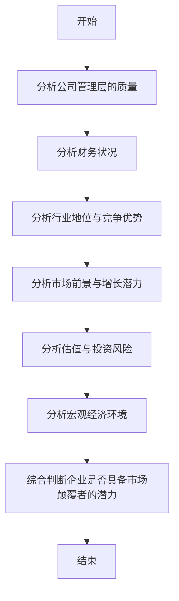
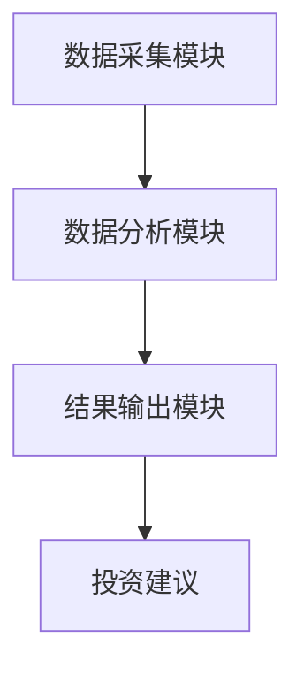

                 


# 彼得林奇的"市场颠覆者"识别方法

## 关键词：彼得·林奇、市场颠覆者、投资分析、六要素分析法、价值投资、投资策略

## 摘要：彼得·林奇的市场颠覆者识别方法是一种通过分析公司管理层、财务状况、行业地位、市场前景、估值和宏观经济环境等六个关键要素，来识别具有潜在颠覆性能力的企业的方法。这种方法结合了价值投资和成长投资的理念，帮助投资者在市场中发现那些能够改变行业格局的公司。本文将详细解析这一方法的核心概念、算法原理、系统架构设计以及实战应用。

---

## 第一章：市场颠覆者的核心概念

### 1.1 什么是市场颠覆者

市场颠覆者是指那些能够通过创新的产品、商业模式或技术手段，彻底改变市场格局的企业。这些企业在市场中通常以非传统的方式进入，通过提供更具竞争力的产品或服务，颠覆现有的市场秩序和竞争规则。

#### 1.1.1 市场颠覆者的定义

市场颠覆者通常是那些在市场中以“后来者”姿态出现的企业，通过创新和差异化策略，打破现有的市场平衡，重新定义行业的竞争规则。例如，亚马逊通过互联网零售模式颠覆了传统的零售行业。

#### 1.1.2 市场颠覆者的特征

市场颠覆者通常具有以下特征：
- **创新性**：颠覆者往往通过创新的产品或服务进入市场。
- **差异化**：它们采用不同于现有竞争者的方式进行竞争。
- **执行力**：颠覆者需要具备强大的执行力，能够迅速扩大市场份额。
- **适应性**：它们能够快速适应市场变化，调整战略。

#### 1.1.3 市场颠覆者的分类

市场颠覆者可以分为以下几类：
- **技术创新型**：通过技术突破进入市场，如特斯拉在电动汽车领域的创新。
- **商业模式创新型**：通过新的商业模式颠覆市场，如优步在共享经济领域的创新。
- **成本优势型**：通过成本优势重新定义市场价格，如亚洲的快时尚品牌ZARA。

---

### 1.2 彼得·林奇的颠覆者识别方法

彼得·林奇是美国著名的基金经理，他通过长期的投资实践总结出一套识别市场颠覆者的方法。这种方法的核心在于通过分析企业的六个关键要素，判断其是否具有成为市场颠覆者的潜力。

#### 1.2.1 方法的背景与来源

彼得·林奇的投资方法源于他对市场的深刻理解。他认为，市场颠覆者往往出现在那些被忽视或低估的行业中，通过持续的创新和卓越的执行力，逐步改变市场的竞争格局。

#### 1.2.2 方法的核心思想

彼得·林奇的颠覆者识别方法的核心思想在于：**关注企业的基本面，尤其是管理层的质量、财务状况、行业地位、市场前景等因素，判断其是否具备成为市场颠覆者的潜力**。

#### 1.2.3 方法的实际应用案例

例如，彼得·林奇曾投资于一些新兴企业，这些企业在当时可能不被市场看好，但通过持续的创新和卓越的执行力，最终成为行业的颠覆者。

---

### 1.3 识别市场颠覆者的必要性

识别市场颠覆者对于投资者来说具有重要意义。通过识别市场颠覆者，投资者可以发现那些能够在未来市场中占据主导地位的企业，从而获得超额收益。

#### 1.3.1 投资者为何需要识别颠覆者

投资者需要识别市场颠覆者的原因包括：
- **发现潜在的高成长企业**：市场颠覆者往往具有较高的成长潜力。
- **获得超额收益**：市场颠覆者通常能够在市场中实现快速成长，为投资者带来超额收益。
- **分散投资风险**：通过投资市场颠覆者，投资者可以分散投资风险，降低对传统企业的依赖。

#### 1.3.2 颠覆者对市场的影响

市场颠覆者能够通过创新的产品、服务或商业模式，重新定义行业的竞争规则，改变市场的供需关系，从而对整个市场产生深远影响。

#### 1.3.3 颠覆者识别与传统投资方法的区别

与传统投资方法相比，识别市场颠覆者的方法更加注重企业的创新能力和成长潜力，而不是仅仅关注企业的财务指标。

---

## 第二章：彼得·林奇的市场颠覆者识别方法的核心概念

彼得·林奇的市场颠覆者识别方法基于六个关键要素的分析，即公司管理层、财务状况、行业地位、市场前景、估值和宏观经济环境。

---

### 第2章：六要素分析法的核心概念

#### 2.1 公司管理层的质量

公司管理层的质量是彼得·林奇分析中的第一个关键要素。一个优秀的管理层能够制定正确的战略，带领企业不断成长。

- **管理层的背景**：分析管理层的行业经验、专业能力和过往业绩。
- **管理层的战略眼光**：判断管理层是否具备长远的战略眼光，能够引领企业在未来市场中占据优势地位。

#### 2.2 财务状况

企业的财务状况是彼得·林奇分析中的第二个关键要素。健康的财务状况是企业成长的基础。

- **财务健康度**：分析企业的盈利能力、资产负债情况和现金流状况。
- **财务风险**：评估企业的财务风险，判断其是否具备持续发展的能力。

#### 2.3 行业地位与竞争优势

企业的行业地位和竞争优势是彼得·林奇分析中的第三个关键要素。强大的行业地位和竞争优势是企业成为市场颠覆者的前提条件。

- **行业地位**：分析企业在行业中的市场份额、竞争对手情况和行业影响力。
- **竞争优势**：判断企业在产品、技术、成本等方面是否具备竞争优势。

#### 2.4 市场前景与增长潜力

市场的前景和企业的增长潜力是彼得·林奇分析中的第四个关键要素。良好的市场前景为企业提供了成长的空间。

- **市场容量**：分析市场的规模和增长潜力，判断企业未来的成长空间。
- **市场需求**：研究市场的消费需求和趋势，判断企业的市场机会。

#### 2.5 估值与投资风险

企业的估值和投资风险是彼得·林奇分析中的第五个关键要素。合理的估值是投资的基础。

- **估值水平**：分析企业的市盈率、市净率等估值指标，判断其是否处于合理区间。
- **投资风险**：评估投资的市场风险、流动性风险和财务风险。

#### 2.6 宏观经济环境

宏观经济环境是彼得·林奇分析中的第六个关键要素。良好的宏观经济环境为企业提供了有利的发展条件。

- **经济周期**：分析当前的经济周期，判断企业的成长是否受到宏观经济环境的影响。
- **政策环境**：研究相关的政策法规，判断政策对企业的影响。

---

### 第3章：六要素分析法的对比与表格

为了更好地理解六要素分析法，我们可以通过对比表格来展示各个要素的特点。

#### 3.1 六要素分析法对比表格

| 要素               | 定义与特点                                                                 |
|--------------------|--------------------------------------------------------------------------|
| 公司管理层         | 分析管理层的背景、能力和战略眼光，判断其能否带领企业成长。                       |
| 财务状况           | 分析企业的财务健康度和风险，判断其是否具备持续发展的能力。                     |
| 行业地位与竞争优势 | 分析企业在行业中的地位和竞争优势，判断其是否具备成为市场颠覆者的潜力。         |
| 市场前景与增长潜力 | 分析市场的容量和需求趋势，判断企业未来的成长空间。                             |
| 估值与投资风险     | 分析企业的估值水平和投资风险，判断其是否具备投资价值。                         |
| 宏观经济环境       | 分析宏观经济环境对企业的影响，判断其是否具备良好的发展条件。                   |

#### 3.2 六要素分析法的ER实体关系图

为了更好地理解六要素分析法的联系，我们可以用ER实体关系图来展示。

```mermaid
er
  actor 管理层
  actor 财务状况
  actor 行业地位与竞争优势
  actor 市场前景与增长潜力
  actor 估值与投资风险
  actor 宏观经济环境
  entity 企业
  管理层 --> 企业
  财务状况 --> 企业
  行业地位与竞争优势 --> 企业
  市场前景与增长潜力 --> 企业
  估值与投资风险 --> 企业
  宏观经济环境 --> 企业
```

---

## 第三章：彼得·林奇的市场颠覆者识别方法的算法原理

彼得·林奇的市场颠覆者识别方法是一种基于六要素分析法的投资策略。通过分析企业的六个关键要素，判断其是否具备成为市场颠覆者的潜力。

---

### 第3章：六要素分析法的算法流程

#### 3.1 六要素分析法的流程图

为了更好地理解六要素分析法的流程，我们可以用mermaid流程图来展示。



#### 3.2 六要素分析法的数学模型

虽然六要素分析法主要依赖于定性分析，但也可以通过一些定量指标来辅助判断。例如，可以使用以下数学模型来评估企业的估值水平：

$$ \text{市盈率} = \frac{\text{股价}}{\text{每股收益}} $$

$$ \text{市净率} = \frac{\text{股价}}{\text{每股净资产}} $$

通过比较企业的市盈率和市净率与行业平均水平的差异，可以判断企业的估值水平是否合理。

---

## 第四章：系统分析与架构设计方案

为了更好地应用彼得·林奇的市场颠覆者识别方法，我们可以构建一个系统化的分析框架。

---

### 第4章：六要素分析法的系统架构设计

#### 4.1 系统功能设计

六要素分析法的系统功能设计包括以下几个模块：
- **数据采集模块**：采集企业的六个要素数据。
- **数据分析模块**：对数据进行分析，判断企业是否具备市场颠覆者的潜力。
- **结果输出模块**：输出分析结果，给出投资建议。

#### 4.2 系统架构设计

六要素分析法的系统架构设计可以用mermaid图来展示。



#### 4.3 系统接口设计

六要素分析法的系统接口设计包括以下几个接口：
- **数据输入接口**：接收企业的六个要素数据。
- **数据处理接口**：对数据进行分析和处理。
- **结果输出接口**：输出分析结果和投资建议。

---

## 第五章：项目实战

### 第5章：六要素分析法的实战应用

#### 5.1 项目环境安装

为了应用六要素分析法，我们需要安装以下工具：
- **数据分析工具**：如Excel、Python等。
- **数据可视化工具**：如Tableau、Power BI等。

#### 5.2 核心代码实现

以下是一个使用Python实现的六要素分析法的示例代码：

```python
import pandas as pd

# 数据采集模块
def collect_data(company_info):
    # 从数据库中采集企业的六个要素数据
    pass

# 数据分析模块
def analyze_company(company_info):
    # 分析企业的六个要素，判断其是否具备市场颠覆者的潜力
    pass

# 结果输出模块
def output_result(result):
    # 输出分析结果和投资建议
    pass
```

#### 5.3 实际案例

以亚马逊为例，我们可以通过六要素分析法来判断其是否具备市场颠覆者的潜力。

- **公司管理层**：亚马逊的管理层以创新能力强、战略眼光远大著称。
- **财务状况**：亚马逊的财务状况健康，具备持续发展的能力。
- **行业地位与竞争优势**：亚马逊在电子商务领域占据领先地位，具有强大的竞争优势。
- **市场前景与增长潜力**：电子商务市场持续增长，亚马逊具有广阔的发展空间。
- **估值与投资风险**：亚马逊的市盈率较高，但其成长潜力巨大，投资风险相对较低。
- **宏观经济环境**：宏观经济环境对亚马逊的发展有利。

通过以上分析，我们可以判断亚马逊具备市场颠覆者的潜力。

---

## 第六章：总结与最佳实践

### 第6章：总结与最佳实践

#### 6.1 总结

彼得·林奇的市场颠覆者识别方法是一种基于六要素分析法的投资策略。通过分析企业的六个关键要素，判断其是否具备成为市场颠覆者的潜力。

#### 6.2 最佳实践 tips

- **持续学习**：市场环境不断变化，投资者需要持续学习，更新自己的知识储备。
- **关注创新**：市场颠覆者往往出现在创新领域，投资者需要关注行业趋势和技术创新。
- **分散投资**：通过分散投资，降低投资风险，避免对单一行业或企业的过度依赖。
- **长期投资**：市场颠覆者往往需要时间来实现其潜力，投资者需要具备长期投资的耐心。

---

## 作者：AI天才研究院 & 禅与计算机程序设计艺术

