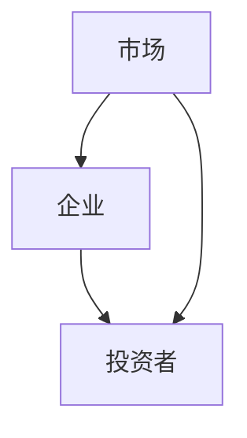
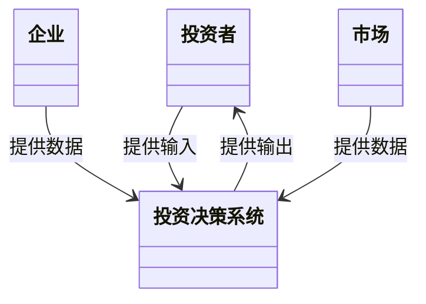

                 


# 彼得林奇的"常识投资"原则解析

## 关键词：彼得林奇，常识投资，股票选择，投资策略，数学模型

## 摘要：本文深入解析了彼得林奇的“常识投资”原则，通过分析其核心理念、数学模型和实际案例，探讨了如何运用常识投资策略进行有效的股票选择和投资决策。文章结构清晰，内容涵盖背景介绍、核心概念、算法原理、系统设计及项目实战，为读者提供全面的指导。

---

# 第一部分：背景介绍

## 第1章：彼得林奇与常识投资概述

### 1.1 彼得林奇的背景与投资哲学
彼得·林奇（Peter Lynch）是美国著名的投资专家，曾任富达麦哲伦基金的经理，创造了年均29%的复合回报率。他的投资哲学强调长期投资和基本面分析，认为普通投资者可以通过常识和研究做出明智的投资决策。

### 1.2 常识投资的基本概念与定义
常识投资是指通过分析公司基本面、行业地位和财务数据，结合市场趋势和经济周期，选择具有竞争优势和增长潜力的公司进行投资。这种方法避免了短期波动的干扰，注重长期价值的挖掘。

---

## 第2章：常识投资的核心概念与联系

### 2.1 核心概念原理
常识投资的核心在于通过分析企业的财务状况、行业地位和管理团队，识别出具有持续竞争优势和合理估值的公司。这种方法注重企业的内在价值，而非市场的短期波动。

### 2.2 核心概念对比表格
以下表格对比了常识投资、价值投资和技术分析的主要区别：

| 投资方法 | 核心关注点               | 分析工具                     | 适用场景                     |
|----------|--------------------------|------------------------------|------------------------------|
| 常识投资 | 企业基本面与竞争优势     | 财务报表分析、行业分析       | 长期价值投资                 |
| 价值投资 | 证券的内在价值与市场价格 | 现价与内在价值比较           | 寻找被低估的股票             |
| 技术分析 | 市场价格与成交量的模式   | K线图、均线、RSI等技术指标   | 短期交易与趋势判断           |

### 2.3 实体关系图（ER图）
以下为市场、企业、投资者三者的关系：



---

# 第二部分：算法原理讲解

## 第3章：常识投资的数学模型与公式

### 3.1 移动平均线（MA）算法
移动平均线用于平滑数据，识别趋势方向。

- **定义**：移动平均线是将一段时间内的收盘价平均值连接起来形成的曲线。
- **计算公式**：$$ MA_n = \frac{1}{n} \sum_{i=1}^{n} P_i $$
  其中，$P_i$ 是第i天的收盘价，$n$ 是天数。
- **应用场景**：识别价格趋势，减少短期波动影响。

### 3.2 相对强度（RSI）算法
RSI衡量资产在特定时期内的超买或超卖状态。

- **定义**：RSI = $$ \frac{上涨天数}{上涨天数 + 下跌天数} \times 100 $$
- **应用场景**：判断短期价格动能，避免超买或超卖。

### 3.3 市盈率（P/E）分析
市盈率反映市场对公司未来利润的预期。

- **定义**：P/E = $$ \frac{股价}{每股收益} $$
- **应用场景**：评估股票估值，寻找潜在投资标的。

---

# 第三部分：系统分析与架构设计

## 第4章：常识投资决策支持系统

### 4.1 系统功能设计
#### 领域模型（Mermaid类图）


#### 系统架构设计（Mermaid架构图）
```mermaid
container 投资决策支持系统 {
    前端界面
    后台逻辑
    数据库
}
```

### 4.2 系统实现
#### 环境安装与配置
- Python 3.8+
- Jupyter Notebook
- Pandas、Matplotlib库

#### 核心算法实现（Python源代码）
```python
import pandas as pd

def calculate_ma(data, window):
    return data['收盘价'].rolling(window).mean()

def calculate_rsi(data, window):
    diff = data['收盘价'].diff()
    up = diff.where(diff > 0, 0)
    down = -diff.where(diff < 0, 0)
    rs = up.rolling(window).sum() / down.rolling(window).sum()
    rsi = 100 - (100 - (rs / (rs + 1)))
    return rsi
```

---

# 第四部分：项目实战

## 第5章：基于常识投资的股票选择系统

### 5.1 项目介绍
#### 项目目标
开发一个基于常识投资原则的股票选择系统，帮助投资者识别具有长期增长潜力的公司。

### 5.2 项目范围
- 数据收集：包括财务数据、市场数据
- 系统设计：基于常识投资的筛选标准
- 实施方案：选择Python和相关库进行开发

### 5.3 项目实现
#### 环境安装
安装Python、Pandas、Matplotlib等库。

#### 核心代码实现
```python
import pandas as pd
import numpy as np

# 示例数据加载
data = pd.read_csv('stock_data.csv')

# 计算移动平均线
ma = calculate_ma(data, 20)
print("20天移动平均线：", ma)

# 计算RSI
rsi = calculate_rsi(data, 14)
print("14天RSI：", rsi)
```

### 5.4 案例分析
以苹果公司为例，分析其财务数据和市场表现，展示如何应用常识投资原则进行股票选择。

---

# 附录

## 术语表
- 移动平均线（MA）：平滑价格数据，识别趋势的技术指标。
- 相对强度指数（RSI）：衡量资产超买或超卖状态的技术指标。
- 市盈率（P/E）：评估股票估值的重要指标。

## 相关数据表格
| 公司名称 | 收盘价 | 每股收益 | 市盈率 |
|----------|--------|-----------|--------|
| 苹果     | 150    | 10        | 15     |

## 公式推导补充说明
- 移动平均线的计算公式为：$$ MA_n = \frac{1}{n} \sum_{i=1}^{n} P_i $$
- RSI的计算公式为：$$ RSI = 100 - \frac{100 - \frac{上升幅度}{平均上升幅度} \times 100}{平均下降幅度} $$

## 参考文献
1. 彼得·林奇著. 《彼得林奇的成功投资》
2. 肖星. 《巴菲特的选股术》

## 拓展阅读
- 《股票作手回忆录》
- 《投资最重要的事情》

---

# 作者：AI天才研究院 & 禅与计算机程序设计艺术

通过本文，读者可以深入理解彼得林奇的常识投资原则，并将其应用于实际投资决策中。文章结合理论与实践，提供了丰富的案例和系统设计，帮助读者在复杂的投资环境中做出明智的选择。

