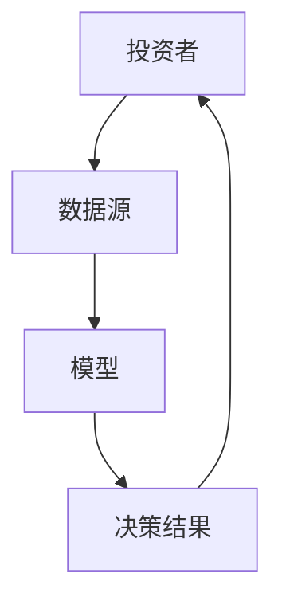
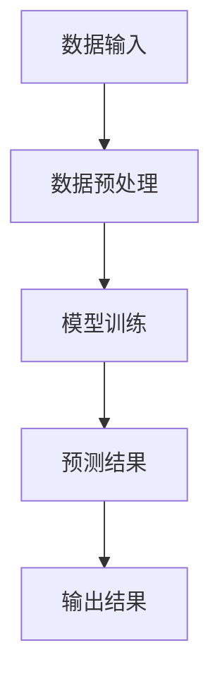
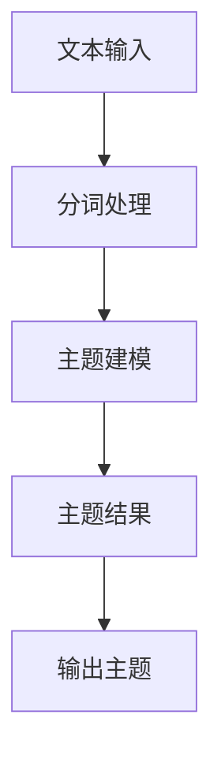
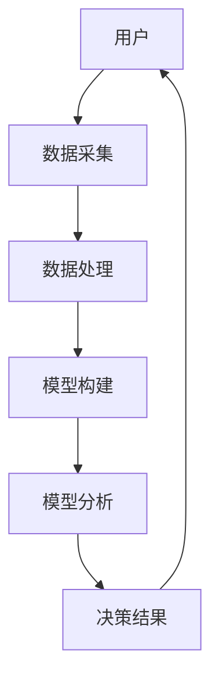

                 


# 彼得林奇的"常识投资"在人工智能决策辅助时代的价值重估

## 关键词
- 彼得·林奇
- 常识投资
- 人工智能
- 投资决策
- 数据驱动

## 摘要
在人工智能快速发展的今天，传统投资策略正面临前所未有的挑战与机遇。本文深入探讨彼得·林奇的“常识投资”理念在人工智能决策辅助时代的价值重估。通过分析传统投资与AI辅助决策的结合，揭示AI如何增强传统投资策略的效率与准确性，同时保留人类投资者的深度理解和判断能力。文章从背景介绍、核心概念、算法原理、系统架构设计、项目实战到最佳实践，系统性地阐述了这一融合过程，为投资者和科技从业者提供了深刻的见解。

---

# 第一部分：背景与核心概念

## 第1章：常识投资与AI决策辅助的背景

### 1.1 常识投资的定义与核心理念
常识投资是一种基于对市场、行业和公司基本面的深入研究的投资策略，强调通过长期持有优质资产来实现财富增值。彼得·林奇作为常识投资的代表人物，提倡投资者关注易于理解的公司和行业，避免跟风投资和短期波动。

#### 1.1.1 常识投资的定义
常识投资的核心在于“简单且可验证”。投资者通过研究公司的财务数据、行业地位、管理团队等因素，选择那些具有持续竞争优势的公司进行投资。这种策略强调长期价值，而非短期市场波动。

#### 1.1.2 彼得·林奇的投资理念
彼得·林奇在其职业生涯中积累了丰富的投资经验，他强调：
- **长期投资**：避免频繁交易，专注于优质资产。
- **基本面分析**：通过研究公司财务报表、行业趋势和管理团队来评估投资价值。
- **分散投资**：通过投资不同类型和行业的资产来降低风险。

#### 1.1.3 常识投资的核心要素
- **公司基本面分析**：关注收入、利润、负债等财务指标。
- **行业趋势分析**：识别具有增长潜力的行业。
- **管理团队评估**：公司管理层的能力和战略决策对投资价值至关重要。

### 1.2 AI决策辅助的背景与发展
人工智能技术的快速发展为投资领域带来了革新。通过机器学习、自然语言处理和大数据分析，AI能够快速处理海量数据，发现传统方法难以察觉的市场机会。

#### 1.2.1 人工智能在投资领域的应用现状
- **量化投资**：通过算法交易实现自动化投资决策。
- **风险控制**：利用AI进行实时市场监控和风险评估。
- **数据驱动的预测**：基于历史数据预测市场走势和资产价格。

#### 1.2.2 AI决策辅助的核心优势
- **高效性**：AI能够快速处理和分析大量数据，提高决策效率。
- **准确性**：通过机器学习模型，AI能够发现复杂的数据模式，提供更精准的预测。
- **实时性**：AI系统能够实时监控市场变化，及时调整投资策略。

#### 1.2.3 传统投资与AI辅助的结合趋势
随着AI技术的成熟，越来越多的投资者开始尝试将传统投资策略与AI辅助决策相结合。这种结合不仅能够提高投资效率，还能通过技术手段弥补人类投资者在信息处理和决策速度上的不足。

---

## 第2章：常识投资与AI决策辅助的核心概念

### 2.1 常识投资与AI决策辅助的关系
常识投资注重基本面分析和长期价值，而AI决策辅助则通过技术手段提高分析效率和准确性。两者结合能够充分发挥各自的优势，形成互补关系。

#### 2.1.1 常识投资的决策过程
1. **市场研究**：分析宏观经济趋势和行业动态。
2. **公司分析**：研究公司的财务报表、管理团队和竞争优势。
3. **投资决策**：基于分析结果，制定投资策略。

#### 2.1.2 AI决策辅助的实现机制
1. **数据采集**：收集市场数据、公司财报、新闻资讯等信息。
2. **模型构建**：利用机器学习算法训练预测模型。
3. **决策支持**：通过模型输出结果辅助投资决策。

#### 2.1.3 两者的协同作用
- **数据整合**：AI能够整合多来源数据，为常识投资提供更全面的分析基础。
- **模型优化**：通过AI技术优化投资模型，提高决策的准确性和效率。
- **实时监控**：AI系统能够实时监控市场变化，及时提醒投资者潜在风险。

### 2.2 常识投资与AI决策辅助的对比分析
传统投资方法和AI辅助决策在多个方面存在差异，但也有互补之处。

#### 2.2.1 传统投资方法的特点
- **依赖经验**：投资者基于过往经验做出决策。
- **主观判断**：分析结果受个人判断影响较大。
- **效率有限**：手动分析数据的效率较低。

#### 2.2.2 AI辅助决策的优势
- **数据处理能力强**：能够快速处理和分析大量数据。
- **模型准确性高**：通过机器学习算法提高预测准确性。
- **实时性**：能够实时监控市场变化，及时调整策略。

#### 2.2.3 两者的优缺点对比
| 特性       | 常识投资          | AI决策辅助         |
|------------|-------------------|--------------------|
| 优点       | 长期价值导向       | 高效性、准确性      |
| 缺点       | 数据处理效率低     | 缺乏人类的直觉判断  |
| 适用场景   | 中长期投资策略     | 短期市场预测、量化交易 |

---

## 第3章：常识投资与AI决策辅助的核心概念与联系

### 3.1 常识投资与AI决策辅助的核心要素
两者结合需要在数据、模型和决策过程中实现深度整合。

#### 3.1.1 数据驱动的决策
AI系统通过分析大量数据，为常识投资提供更全面的分析基础。例如，通过自然语言处理技术分析新闻资讯，识别市场情绪变化。

#### 3.1.2 模型构建与优化
利用机器学习算法构建投资模型，优化传统投资策略。例如，通过回归分析预测股票价格走势。

#### 3.1.3 人机协同的决策模式
人类投资者通过AI系统提供的数据和模型结果，做出更明智的投资决策。AI系统则通过人类的判断和经验进行优化。

### 3.2 常识投资与AI决策辅助的ER实体关系图


### 3.3 常识投资与AI决策辅助的流程图
```mermaid
graph TD
    I[投资者] --> D[数据源]
    D --> P[数据预处理]
    P --> M[模型构建]
    M --> A[模型分析]
    A --> R[决策结果]
    R --> 

---

# 第二部分：算法原理

## 第4章：AI决策辅助的核心算法

### 4.1 机器学习算法在投资决策中的应用

#### 4.1.1 线性回归算法
线性回归是一种简单而强大的回归算法，常用于预测资产价格的变化趋势。

##### 数学模型
$$ y = \beta_0 + \beta_1x_1 + \beta_2x_2 + \dots + \beta_nx_n + \epsilon $$

##### 代码示例
```python
import pandas as pd
from sklearn.linear_model import LinearRegression

# 数据加载
data = pd.read_csv('stock_data.csv')

# 模型训练
model = LinearRegression()
model.fit(data[['feature1', 'feature2']], data['target'])

# 预测结果
predictions = model.predict(data[['feature1', 'feature2']])
```

#### 4.1.2 支持向量机（SVM）
SVM适用于分类问题，常用于判断市场趋势。

##### 算法流程图


### 4.2 自然语言处理在投资决策中的应用

#### 4.2.1 基于词嵌入的市场情绪分析
利用词嵌入技术分析新闻标题和财经评论，判断市场情绪。

##### 代码示例
```python
from transformers import pipeline

sentiment_analyzer = pipeline("sentiment-analysis")
result = sentiment_analyzer("Company Q3 earnings beat expectations.")
```

#### 4.2.2 文本挖掘与主题建模
通过主题建模技术分析财经新闻，识别市场趋势。

##### 算法流程图


---

## 第5章：数学模型与公式解析

### 5.1 回归分析在投资预测中的应用
回归分析用于预测资产价格的变化趋势。

#### 5.1.1 线性回归公式
$$ y = \beta_0 + \beta_1x + \epsilon $$

#### 5.1.2 多元回归公式
$$ y = \beta_0 + \beta_1x_1 + \beta_2x_2 + \dots + \beta_nx_n + \epsilon $$

### 5.2 时间序列分析在投资预测中的应用
时间序列分析用于预测股票价格的未来走势。

#### 5.2.1 ARIMA模型公式
$$ \phi(\theta(B))z_t = \theta(B)\Phi(\theta(B)) $$

#### 5.2.2 LSTM网络公式
$$ h_t = \text{tanh}(W_{hh}h_{t-1} + W_{hx}x_t + b_h) $$
$$ o_t = \sigma(W_{ho}h_t + b_o) $$
$$ a_t = o_t \cdot h_t $$

---

# 第三部分：系统架构设计

## 第6章：投资决策辅助系统的设计与实现

### 6.1 系统功能设计

#### 6.1.1 数据采集模块
- 从多种数据源（股票数据、新闻资讯等）获取数据。
- 数据预处理和清洗。

#### 6.1.2 模型构建模块
- 利用机器学习算法构建投资预测模型。
- 模型训练和优化。

#### 6.1.3 决策支持模块
- 提供基于模型的决策建议。
- 实时监控市场变化。

### 6.2 系统架构设计

#### 6.2.1 系统架构图


#### 6.2.2 系统接口设计
- API接口定义：
  - 数据接口：获取实时数据。
  - 模型接口：进行预测和分析。

### 6.3 系统交互流程

#### 6.3.1 交互流程图


---

# 第四部分：项目实战

## 第7章：基于AI的常识投资实战

### 7.1 项目环境安装

#### 7.1.1 安装依赖
```bash
pip install pandas numpy scikit-learn transformers
```

### 7.2 系统核心实现

#### 7.2.1 数据采集与处理
```python
import pandas as pd
import requests

# 从网页获取数据
def fetch_data(url):
    response = requests.get(url)
    data = response.json()
    df = pd.DataFrame(data)
    return df

# 数据处理
def preprocess_data(df):
    df.dropna(inplace=True)
    df = pd.get_dummies(df)
    return df

data = fetch_data('https://example.com/api')
data = preprocess_data(data)
```

#### 7.2.2 模型训练与预测
```python
from sklearn.model_selection import train_test_split
from sklearn.ensemble import RandomForestClassifier

# 划分训练集和测试集
X_train, X_test, y_train, y_test = train_test_split(data.drop('target', axis=1), data['target'], test_size=0.2)

# 模型训练
model = RandomForestClassifier()
model.fit(X_train, y_train)

# 模型预测
predictions = model.predict(X_test)
```

### 7.3 实际案例分析

#### 7.3.1 案例背景
- 投资标的：某科技公司股票
- 数据来源：过去5年的股票价格和财务数据

#### 7.3.2 模型分析
- 特征重要性分析：收入增长率、净利润率对股价影响较大。
- 预测结果：未来3个月股价有上涨趋势。

### 7.4 项目小结
通过AI技术辅助常识投资，能够显著提高投资决策的效率和准确性。然而，AI模型的结果需要结合人类的判断和经验进行优化。

---

# 第五部分：最佳实践

## 第8章：AI与常识投资结合的最佳实践

### 8.1 小结
- AI技术能够显著提升投资决策的效率和准确性。
- 传统投资策略与AI辅助决策的结合是未来的趋势。

### 8.2 注意事项
- 数据质量对模型准确性至关重要。
- 模型结果需要结合实际情况进行调整。
- 保持对市场的敏感性和对新技术的适应能力。

### 8.3 拓展阅读
- 《彼得·林奇的投资哲学》
- 《机器学习实战》
- 《自然语言处理入门》

---

# 作者

作者：AI天才研究院/AI Genius Institute & 禅与计算机程序设计艺术 /Zen And The Art of Computer Programming

