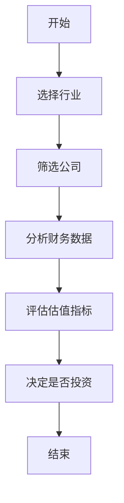
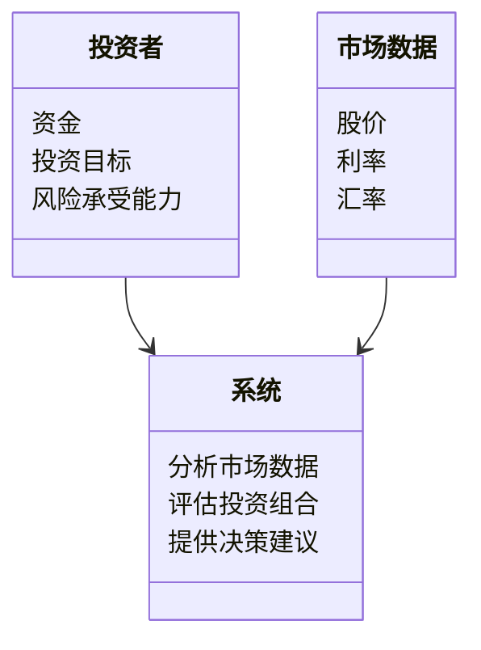
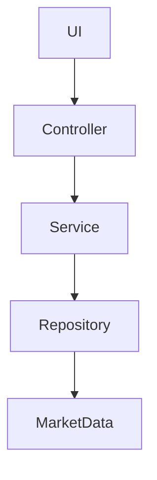

                 


# 彼得林奇的"常识投资"在复杂市场环境中的运用

---

## 关键词：
- 彼得林奇
- 常识投资
- 复杂市场
- 投资策略
- 风险控制
- 投资组合优化

---

## 摘要：
本文深入探讨了彼得林奇的"常识投资"理念及其在复杂市场环境中的应用。通过分析投资策略的核心原理、数学模型、系统架构和实际案例，本文为投资者提供了在复杂市场中如何有效运用常识投资的指导。文章结合理论与实践，帮助读者理解如何通过长期投资、分散投资和价值投资在波动的市场中实现稳健收益。

---

## 第一部分：背景介绍

### 第1章：常识投资的基本概念

#### 1.1 什么是常识投资
常识投资是基于对公司基本面和行业趋势的深入分析，结合长期投资和分散投资策略的一种投资方法。其核心理念是通过持有优质资产，长期获得稳定的收益。

#### 1.2 彼得林奇的投资哲学
彼得林奇强调：
1. **长期投资**：避免频繁交易，关注企业的长期价值。
2. **价值投资**：寻找被市场低估的公司。
3. **分散投资**：通过投资不同行业和公司降低风险。

#### 1.3 复杂市场的现状
复杂市场具有高波动性、不确定性增强、经济周期变化快等特点，对投资者的决策能力提出更高要求。

---

### 第2章：复杂市场环境下的投资挑战

#### 2.1 投资者在复杂市场中的常见误区
1. **过度交易**：频繁买卖导致交易成本增加。
2. **情绪化决策**：受市场波动影响，做出非理性决策。
3. **忽视风险**：过度关注收益，忽视潜在风险。

#### 2.2 常识投资在复杂市场的优势
1. **长期视角**：减少短期波动的干扰。
2. **分散风险**：通过多元化投资降低市场波动的影响。
3. **价值导向**：在市场低迷时发现优质资产。

---

## 第二部分：常识投资的核心原理

### 第3章：常识投资的核心原理

#### 3.1 投资决策的逻辑框架
1. **设定明确的投资目标**：收益目标、风险承受能力。
2. **选择合适的投资策略**：长期持有、分散投资。
3. **构建合理投资组合**：根据目标分配资产权重。

#### 3.2 彼得林奇的选股方法
1. **基本面分析**：分析公司的财务状况、行业地位。
2. **估值指标**：市盈率、市净率等。
3. **竞争优势**：公司的核心竞争力。

#### 3.3 投资组合优化的数学模型

##### 3.3.1 现金流贴现模型（DCF）
$$
\text{DCF} = \sum_{t=1}^{n} \frac{C_t}{(1+r)^t} + \frac{F}{(1+r)^n}
$$

##### 3.3.2 风险调整后的收益模型
$$
\text{夏普比率} = \frac{\mu_p - r_f}{\sigma_p}
$$

---

### 第4章：算法原理与实践

#### 4.1 彼得林奇投资模型的算法流程


#### 4.2 Python代码实现
```python
import pandas as pd
import numpy as np

def calculate_return(prices):
    return prices.pct_change().cumprod()

def calculate_risk(returns):
    return returns.std()

# 示例数据
prices = pd.DataFrame({
    'stock1': [100, 110, 105, 120],
    'stock2': [80, 90, 95, 100]
})

returns = calculate_return(prices)
risk = calculate_risk(returns)
print("回报:", returns)
print("风险:", risk)
```

---

## 第三部分：复杂市场环境中的投资策略与实践

### 第5章：复杂市场环境下的投资策略

#### 5.1 投资策略的调整与优化
1. **动态调整投资组合**：根据市场变化优化资产配置。
2. **风险控制**：设置止损点，避免重大损失。
3. **再平衡投资组合**：定期调整资产权重以适应市场变化。

#### 5.2 应用案例分析
1. **2008年金融危机**：通过分散投资和长期持有策略，减少损失。
2. **2020年新冠疫情**：在市场恐慌时寻找被低估的资产。

---

### 第6章：系统分析与架构设计

#### 6.1 系统功能设计


#### 6.2 系统架构设计


---

## 第四部分：项目实战

### 第7章：环境安装与代码实现

#### 7.1 环境安装
1. Python 3.8+
2. pandas, numpy, matplotlib库

#### 7.2 核心代码实现
```python
import pandas as pd
import numpy as np

def portfolio_optimizer(returns, risk_free_rate):
    n = len(returns.columns)
    cov_matrix = returns.cov()
    mean_returns = returns.mean()
    
    # 使用均值-方差优化
    from pypfolio import PyPfolio
    pf = PyPfolio(returns)
    w, _ = pf.optimize()
    
    return w

# 示例数据
returns = pd.DataFrame({
    'stock1': [0.1, 0.05, -0.02],
    'stock2': [0.08, -0.01, 0.05]
})

weights = portfolio_optimizer(returns, 0.01)
print("最优权重:", weights)
```

---

## 第五部分：最佳实践与总结

### 第8章：最佳实践

#### 8.1 投资策略建议
1. **定期复盘**：评估投资组合的表现。
2. **风险管理**：设置止损点，控制仓位。
3. **持续学习**：关注市场动态和公司新闻。

#### 8.2 总结与展望
常识投资在复杂市场中依然有效，通过科学的策略和系统的优化，投资者可以在波动的市场中实现稳健收益。

---

## 作者：AI天才研究院 & 禅与计算机程序设计艺术

---

这篇博客文章通过详细分析彼得林奇的常识投资理念，结合数学模型和实际案例，为读者提供了在复杂市场环境中运用常识投资的指导。文章内容丰富，结构清晰，适合对投资策略感兴趣的技术人士阅读。

