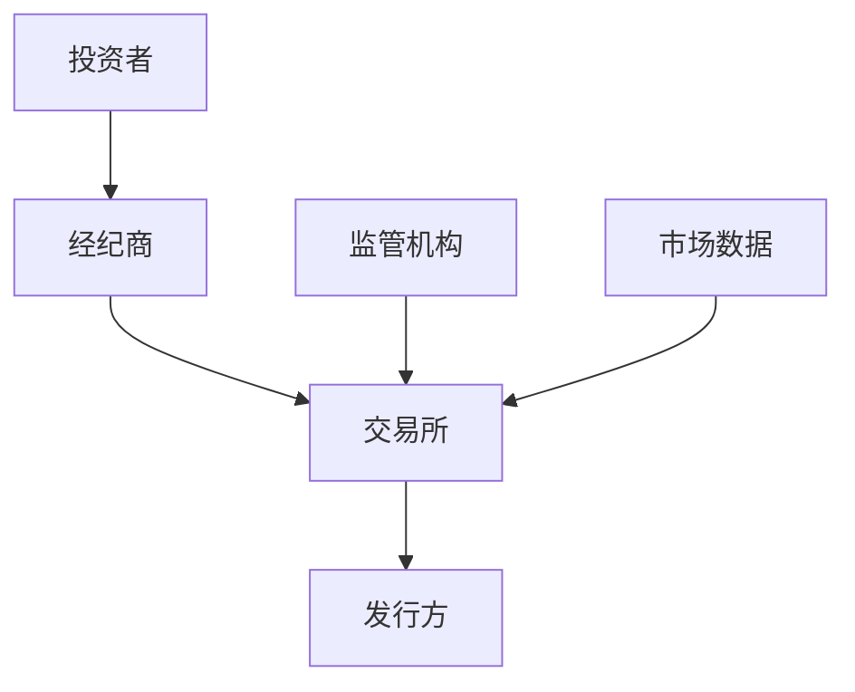
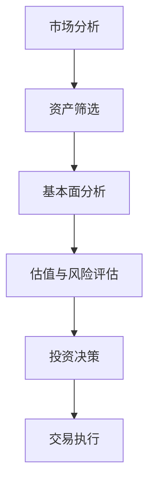

                 


# 彼得林奇的"常识投资"在复杂金融产品中的应用

## 关键词：彼得林奇，常识投资，复杂金融产品，风险管理，投资策略，数学模型，算法实现

## 摘要：  
本文深入探讨了彼得林奇的常识投资理念在复杂金融产品中的应用。通过分析复杂金融产品的特点、风险管理策略、投资组合优化以及数学模型的构建，本文展示了如何将常识投资的核心思想应用于实际投资决策中。文章结合理论与实践，通过具体案例和数学模型，详细阐述了常识投资在复杂金融产品中的应用原理和实际操作方法。

---

# 第一部分: 彼得林奇的"常识投资"概述

## 第1章: 彼得林奇投资理念的核心思想

### 1.1 彼得林奇投资理念的核心思想

#### 1.1.1 投资的定义与核心要素  
投资是一种通过购买资产以期获得未来收益的行为。核心要素包括：  
1. 资产类型（股票、债券、基金等）  
2. 投资期限（短期、中期、长期）  
3. 风险与收益的平衡  
4. 市场环境与经济周期  

#### 1.1.2 彼得林奇投资理念的起源与演变  
彼得林奇是美国著名投资家，曾任富达麦哲伦基金的经理。他的投资理念基于价值投资，强调长期持有优质资产，避免短期市场波动的干扰。其核心思想包括：  
- 选择具有竞争优势的公司。  
- 避免跟风，注重基本面分析。  
- 长期投资，追求复利效应。  

#### 1.1.3 常识投资的核心思想与原则  
常识投资的核心思想是：  
1. **价值投资**：寻找市场价格低于内在价值的资产。  
2. **风险管理**：分散投资，降低风险。  
3. **长期视角**：关注企业的长期盈利能力。  
4. **逆向思维**：在市场恐慌时寻找机会。  

---

## 第2章: 复杂金融产品的基本特征

### 2.1 金融产品的分类与特点

#### 2.1.1 标准化金融产品  
- **定义**：具有明确的市场规则和标准化合约的金融工具。  
- **特点**：流动性高、风险较低、便于交易。  
- **常见类型**：股票、债券、期货、期权等。  

#### 2.1.2 非标准化金融产品  
- **定义**：没有统一的市场规则和标准化合约的金融工具。  
- **特点**：流动性低、风险较高、定制化强。  
- **常见类型**：私募基金、信托产品、结构性金融产品等。  

#### 2.1.3 复杂金融产品的定义与分类  
- **定义**：指具有复杂的结构、高杠杆、嵌入式期权或其他衍生工具的金融产品。  
- **分类**：  
  1. 衍生品（如期权、期货、掉期）。  
  2. 结构化金融产品（如CDO、CDS）。  
  3. 对冲基金、私募基金等。  

---

### 2.2 复杂金融产品的风险与收益

#### 2.2.1 复杂金融产品的收益结构  
- 收益通常与市场波动、利率变化或企业绩效挂钩。  
- 高杠杆可能导致高收益或高亏损。  

#### 2.2.2 复杂金融产品的风险特征  
- **流动性风险**：复杂产品往往难以快速变现。  
- **信用风险**：产品可能嵌入高风险资产或主体。  
- **市场风险**：受宏观经济波动影响较大。  
- **操作风险**：结构复杂，操作失误可能导致损失。  

#### 2.2.3 复杂金融产品的流动性问题  
- **低流动性**：复杂产品往往缺乏活跃的二级市场。  
- **高交易成本**：买卖复杂产品可能涉及较高的佣金和费用。  

---

### 2.3 复杂金融产品的定价与估值

#### 2.3.1 金融产品的定价模型  
- **Black-Scholes模型**：用于期权定价。  
- **CAPM模型**：用于资产定价。  
- **信用评分模型**：用于评估债券信用风险。  

#### 2.3.2 常识投资视角下的估值方法  
- **基本面分析**：分析企业的财务报表、行业地位、竞争优势。  
- **相对估值法**：比较同类资产的市盈率、市净率等指标。  
- **情景分析法**：假设不同市场条件下评估资产价值。  

#### 2.3.3 市场情绪对估值的影响  
- 市场情绪可以通过投资者行为、市场波动率等指标衡量。  
- 市场情绪过度乐观或悲观时，资产价格可能偏离其内在价值。  

---

# 第二部分: 常识投资在复杂金融产品中的应用原理

## 第3章: 常识投资的核心原理与数学模型

### 3.1 常识投资的决策框架

#### 3.1.1 市场分析与趋势判断  
- **宏观经济分析**：关注GDP、利率、通货膨胀等指标。  
- **行业分析**：选择具有增长潜力的行业。  
- **市场情绪分析**：通过技术指标（如RSI、MACD）判断市场趋势。  

#### 3.1.2 个股分析与投资决策  
- **基本面分析**：分析企业的盈利能力、财务状况、竞争优势。  
- **估值分析**：比较资产的市场价格与内在价值。  
- **投资决策**：基于分析结果制定买入、卖出或持有策略。  

#### 3.1.3 投资组合的构建与调整  
- **分散投资**：避免过度集中于单一资产或行业。  
- **动态调整**：根据市场变化定期优化投资组合。  
- **风险管理**：设定止损点，控制最大亏损比例。  

---

### 3.2 常识投资的数学模型

#### 3.2.1 资产定价模型  
- **CAPM模型**：用于评估资产的预期收益率。  
  $$ E(r_i) = r_f + \beta_i (E(r_m) - r_f) $$  
  其中，\( r_f \) 是无风险利率，\( \beta_i \) 是资产的贝塔系数，\( E(r_m) \) 是市场预期收益率。  

#### 3.2.2 风险管理模型  
- **夏普比率**：衡量投资组合的风险调整后收益。  
  $$ \text{夏普比率} = \frac{E(r_p) - r_f}{\sigma_p} $$  
  其中，\( E(r_p) \) 是投资组合的预期收益，\( \sigma_p \) 是投资组合的波动率。  

#### 3.2.3 投资组合优化模型  
- **均值-方差优化**：在给定风险下最大化收益，或在给定收益下最小化风险。  
  $$ \text{目标函数} = \min_w \sigma_p^2 \quad \text{或} \quad \max_w E(r_p) $$  
  约束条件：  
  $$ \sum_{i=1}^n w_i = 1 $$  

---

## 第4章: 复杂金融产品的实体关系与流程图

### 4.1 金融产品实体关系图



### 4.2 投资决策流程图



---

# 第三部分: 复杂金融产品的风险管理与投资策略

## 第5章: 风险管理与投资组合优化

### 5.1 复杂金融产品的风险管理

#### 5.1.1 风险分类  
- **市场风险**：资产价格波动对投资组合的影响。  
- **信用风险**：债务人违约的风险。  
- **流动性风险**：资产难以变现的风险。  
- **操作风险**：投资过程中的失误或欺诈行为。  

#### 5.1.2 风险管理策略  
- **分散投资**：通过投资不同资产类别和行业降低风险。  
- **对冲策略**：利用衍生品对冲市场风险。  
- **情景分析**：模拟极端市场条件下的投资组合表现。  

---

### 5.2 投资组合优化

#### 5.2.1 投资组合的构建  
- **资产配置**：确定不同资产的权重。  
- **再平衡**：定期调整资产权重以维持目标配置。  
- **动态优化**：根据市场变化调整投资组合。  

#### 5.2.2 投资组合的绩效评估  
- **收益评估**：比较投资组合的实际收益与预期收益。  
- **风险评估**：计算投资组合的波动率、夏普比率等指标。  
- **归因分析**：分解投资收益的来源。  

---

## 第6章: 项目实战与案例分析

### 6.1 环境配置与数据准备

#### 6.1.1 环境配置  
- 安装Python、Pandas、NumPy、Matplotlib等库。  
- 安装金融数据分析工具（如Yahoo Finance API）。  

#### 6.1.2 数据准备  
- 下载历史价格数据。  
- 收集宏观经济指标（如GDP、利率）。  
- 获取市场情绪指标（如VIX指数）。  

---

### 6.2 核心代码实现

#### 6.2.1 数据清洗与预处理  
```python
import pandas as pd
import numpy as np

# 下载数据
data = pd.read_csv('financial_data.csv')

# 删除缺失值
data.dropna(inplace=True)

# 标准化数据
data_scaled = (data - data.mean()) / data.std()
```

#### 6.2.2 投资组合优化  
```python
import numpy as np

def portfolio_optimization(returns, weights):
    # 计算投资组合的预期收益和波动率
    expected_return = np.sum(returns * weights)
    portfolio_variance = np.dot(weights.T, np.dot(returns.cov(), weights))
    portfolio_std = np.sqrt(portfolio_variance)
    return expected_return, portfolio_std

# 示例权重
weights = np.array([0.6, 0.4])
returns = np.array([0.1, 0.2])

er, std = portfolio_optimization(returns, weights)
print(f"预期收益：{er:.2f}%，波动率：{std:.2f}%")
```

---

### 6.3 案例分析与结果解读

#### 6.3.1 案例分析  
假设我们选择两只股票A和B，其历史收益率分别为10%和15%，波动率分别为15%和20%。通过投资组合优化，我们发现当权重分配为60%的A和40%的B时，预期收益为11%，波动率为17%。  

#### 6.3.2 结果解读  
- 该投资组合在风险较低的情况下提供了稳定的收益。  
- 与单独投资A或B相比，组合投资的风险-收益比更优。  

---

## 第7章: 总结与展望

### 7.1 总结  
本文通过分析彼得林奇的常识投资理念，结合复杂金融产品的特点，展示了如何将常识投资应用于实际投资决策。通过数学模型和案例分析，我们证明了常识投资在复杂金融产品中的有效性和实用性。

### 7.2 展望  
未来的研究可以进一步探索人工智能技术在投资决策中的应用，结合常识投资理念，开发更智能的投资策略和风险管理系统。  

---

## 作者：AI天才研究院 & 禅与计算机程序设计艺术

