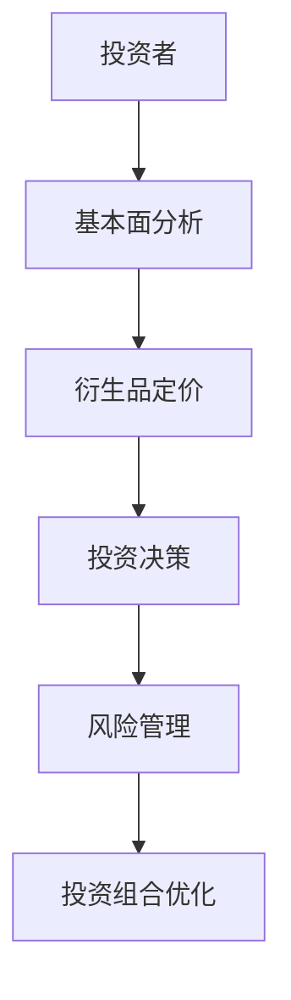
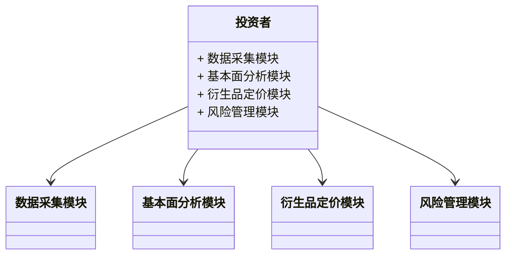

                 


# 彼得林奇的"常识投资"在复杂金融衍生品时代的重要性

---

## 关键词
常识投资、彼得林奇、复杂金融衍生品、风险管理、金融策略

---

## 摘要
本文探讨了彼得·林奇的常识投资理念在复杂金融衍生品时代的重要性。在传统投资与复杂金融工具并存的背景下，分析了常识投资的核心原理、其在复杂金融衍生品中的应用，以及如何通过系统架构和实战案例来实现投资策略的优化。通过结合数学模型、算法原理和实际案例，本文展示了常识投资在复杂金融衍生品中的独特价值和实际应用。

---

## 第一部分：常识投资与复杂金融衍生品的背景介绍

### 第1章：常识投资与复杂金融衍生品概述

#### 1.1 常识投资的定义与核心理念

##### 1.1.1 常识投资的起源与背景
常识投资（Common Sense Investing）是由彼得·林奇（Peter Lynch）提出的投资理念，强调基于基本面分析和长期视角的投资策略。林奇认为，投资者应该投资于自己了解的公司，并在市场波动中保持理性。

##### 1.1.2 常识投资的核心理念与原则
- **基本面分析**：关注公司的财务状况、盈利能力、行业地位等因素。
- **长期投资**：避免短期波动，注重长期价值。
- **分散投资**：通过投资多个行业和公司降低风险。

##### 1.1.3 常识投资在现代金融体系中的地位
常识投资作为价值投资的重要流派，强调理性分析和长期持有，是金融投资领域的重要理论基础。

##### 核心概念对比表格
| **概念**       | **常识投资**                   | **传统投资**                   |
|----------------|--------------------------------|--------------------------------|
| 核心理念       | 基于基本面分析，长期持有       | 短期波动，高频交易             |
| 风险管理       | 分散投资，降低系统性风险       | 集中投资，风险较高             |
| 适用场景       | 适合个人投资者和长期资金配置   | 适合机构投资者和短期操作       |

##### 实体关系图（ER图）
```mermaid
erDiagram
    investor ->[投资] company
    company ->[被投资] investor
    company ->[发行] financial_derivative
    financial_derivative ->[影响] investor
```

#### 1.2 复杂金融衍生品的定义与特点

##### 1.2.1 金融衍生品的基本概念
金融衍生品（Financial Derivatives）是基于基础资产（如股票、债券、商品等）的金融工具，其价值来源于基础资产的价格波动。

##### 1.2.2 复杂金融衍生品的分类与特性
- **分类**：包括期权、期货、掉期、 warrants等。
- **特性**：高杠杆、高风险、复杂性高。

##### 1.2.3 复杂金融衍生品对投资策略的影响
复杂金融衍生品的引入增加了市场的波动性和不确定性，同时也为投资者提供了更多的对冲和套利机会。

---

### 第2章：常识投资与复杂金融衍生品的关系

#### 2.1 常识投资在复杂金融衍生品中的应用背景

##### 2.1.1 复杂金融衍生品市场的现状与挑战
- **现状**：市场规模庞大，品种繁多。
- **挑战**：高风险、高杠杆、信息不对称。

##### 2.1.2 常识投资在复杂金融衍生品中的适应性
常识投资强调长期价值和基本面分析，适用于复杂金融衍生品的长期风险管理。

##### 2.1.3 常识投资与复杂金融衍生品的结合趋势
随着复杂金融衍生品市场的扩展，常识投资的理念逐渐被整合到衍生品投资中，成为风险管理的重要工具。

#### 2.2 常识投资在复杂金融衍生品中的核心作用

##### 2.2.1 常识投资在风险管理中的作用
- **分散风险**：通过投资多样化降低风险。
- **长期视角**：避免短期波动带来的损失。

##### 2.2.2 常识投资在市场波动中的应对策略
- **逆周期投资**：在市场低迷时寻找被低估的投资标的。
- **动态调整**：根据市场变化及时调整投资组合。

##### 2.2.3 常识投资在复杂金融衍生品中的长期价值
常识投资通过基本面分析和长期持有，帮助投资者在复杂市场中实现稳定收益。

---

## 第二部分：常识投资的核心概念与原理

### 第3章：常识投资的核心原理

#### 3.1 常识投资的原理与方法

##### 3.1.1 常识投资的原理
- **价值发现**：寻找被市场低估的公司。
- **长期持有**：避免频繁交易带来的成本和风险。

##### 3.1.2 常识投资的主要方法与技巧
- **基本面分析**：分析公司的财务报表、行业地位、竞争优势。
- **分散投资**：通过投资多个行业和公司降低风险。

##### 3.1.3 常识投资的数学模型与公式
常识投资的数学模型主要基于基本面分析，常用的指标包括市盈率（P/E）、市净率（P/B）、股息率等。

##### 公式示例
$$ \text{市盈率} = \frac{\text{股价}}{\text{每股收益}} $$

#### 3.2 常识投资与复杂金融衍生品的结合

##### 3.2.1 复杂金融衍生品的数学模型与公式
复杂金融衍生品的定价通常使用Black-Scholes模型，用于计算期权的理论价格。

##### 公式示例
$$ C = S_0 \Phi(d_1) - K e^{-rT} \Phi(d_2) $$
其中，$C$ 是看涨期权的价格，$S_0$ 是标的资产价格，$K$ 是行权价，$r$ 是无风险利率，$T$ 是到期时间，$\Phi$ 是标准正态分布的累积分布函数。

##### 3.2.2 常识投资在复杂金融衍生品中的数学分析
通过基本面分析和衍生品定价模型的结合，投资者可以在复杂市场中做出更明智的投资决策。

##### 3.2.3 常识投资与复杂金融衍生品的系统架构设计


### 第4章：复杂金融衍生品的系统分析与架构设计

#### 4.1 问题场景介绍

##### 4.1.1 问题背景
复杂金融衍生品市场的波动性和不确定性对投资者提出了更高的要求。

##### 4.1.2 问题描述
投资者需要在复杂市场中找到稳定的投资策略，降低风险，实现长期收益。

##### 4.1.3 系统设计的目标与范围
- **目标**：构建一个基于常识投资的复杂金融衍生品投资系统。
- **范围**：包括基本面分析、衍生品定价、风险管理等功能。

#### 4.2 系统功能设计

##### 4.2.1 功能模块划分
- **数据采集**：收集基础资产和衍生品的数据。
- **基本面分析**：分析公司的财务状况。
- **衍生品定价**：计算衍生品的理论价格。
- **风险管理**：评估和管理投资风险。

##### 4.2.2 功能实现
- **数据采集**：使用API获取实时数据。
- **基本面分析**：利用财务指标进行公司评估。
- **衍生品定价**：应用Black-Scholes模型计算期权价格。
- **风险管理**：通过VaR模型评估投资组合风险。

##### 4.2.3 功能实现代码
```python
import numpy as np
from scipy.stats import norm

def black_scholes(S, K, r, T, sigma):
    d1 = (np.log(S/K) + (r + sigma**2/2)*T) / (sigma*np.sqrt(T))
    d2 = d1 - sigma*np.sqrt(T)
    c = S * norm.cdf(d1) - K * np.exp(-r*T) * norm.cdf(d2)
    return c

# 示例
S = 100
K = 105
r = 0.05
T = 1
sigma = 0.2

price = black_scholes(S, K, r, T, sigma)
print(f"期权价格为：{price}")
```

#### 4.3 系统架构设计

##### 4.3.1 总体设计


##### 4.3.2 详细设计


---

## 第三部分：复杂金融衍生品的实战应用

### 第6章：复杂金融衍生品的实战案例分析

#### 6.1 实战案例介绍

##### 6.1.1 案例背景与目标
假设某投资者在2020年新冠疫情爆发期间，选择投资一只被市场低估的医药公司股票，并利用期权进行对冲。

##### 6.1.2 案例的主要内容
- **投资标的**：某医药公司股票。
- **投资策略**：长期持有股票，同时买入认沽期权对冲下行风险。

##### 6.1.3 案例的实现方法
- **股票投资**：基于基本面分析，选择财务状况良好的医药公司。
- **期权对冲**：买入认沽期权，保护投资组合在市场下跌时的价值。

##### 6.1.4 案例的实现代码
```python
import pandas as pd
import numpy as np

# 假设股票价格数据
data = {'日期': ['2020-01-01', '2020-02-01', '2020-03-01', '2020-04-01'],
        '股价': [100, 90, 110, 120]
        }
df = pd.DataFrame(data)

# 基本面分析
# 假设公司财务状况良好，选择长期持有
# 同时买入认沽期权
# 计算期权价格（示例）
S = 100
K = 90
r = 0.05
T = 1
sigma = 0.3

price = black_scholes(S, K, r, T, sigma)
print(f"认沽期权价格为：{price}")
```

#### 6.2 实战案例的详细分析

##### 6.2.1 案例的分析过程
- **基本面分析**：选择财务状况良好、行业地位稳固的医药公司。
- **期权定价**：使用Black-Scholes模型计算认沽期权的理论价格。
- **风险管理**：通过期权对冲投资组合的下行风险。

##### 6.2.2 案例的实现过程
- **数据采集**：收集医药公司的股价和期权数据。
- **基本面分析**：评估公司的盈利能力、行业地位等因素。
- **期权定价**：计算认沽期权的理论价格。
- **风险管理**：通过期权对冲投资组合的风险。

##### 6.2.3 案例的总结与反思
通过基本面分析和期权对冲，投资者在复杂市场中实现了风险控制和长期收益。

---

## 第7章：常识投资在复杂金融衍生品中的最佳实践

### 7.1 最佳实践的总结

#### 7.1.1 成功经验
- **长期持有**：通过长期持有优质资产实现稳定收益。
- **风险管理**：通过分散投资和期权对冲降低风险。

#### 7.1.2 失败教训
- **过度杠杆**：高杠杆可能导致投资失败。
- **信息不对称**：缺乏信息可能导致投资失误。

#### 7.1.3 未来展望
随着复杂金融衍生品市场的不断发展，常识投资的理念将更加重要，投资者需要结合新的工具和方法，实现更高效的投资策略。

### 7.2 实践中的注意事项

#### 7.2.1 风险管理
- 避免过度杠杆。
- 定期评估投资组合的风险。

#### 7.2.2 信息收集
- 及时获取市场信息。
- 关注宏观经济和行业动态。

#### 7.2.3 投资纪律
- 遵循投资计划，避免情绪化决策。
- 定期复盘和调整投资策略。

---

## 作者：AI天才研究院/AI Genius Institute & 禅与计算机程序设计艺术 /Zen And The Art of Computer Programming

---

本文通过详细分析彼得·林奇的常识投资理念在复杂金融衍生品中的应用，结合数学模型、系统架构和实战案例，展示了常识投资在复杂市场中的独特价值和实际应用。希望本文能为投资者在复杂金融衍生品时代提供有益的参考和指导。

