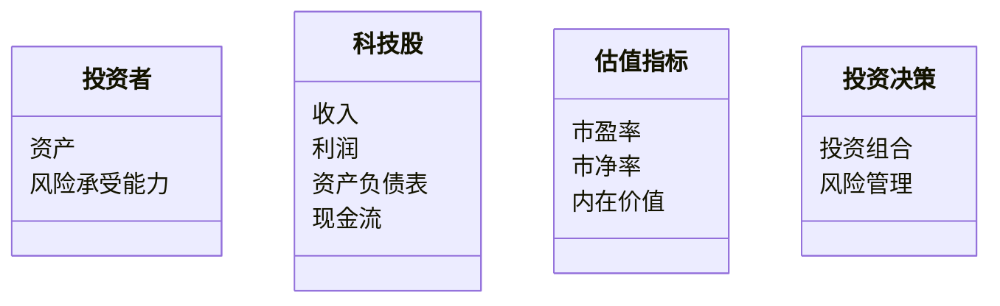
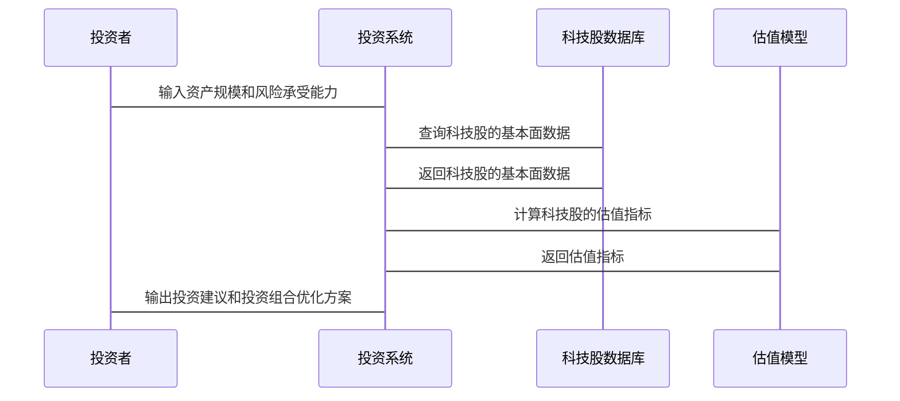

                 


# 彼得林奇的"常识投资"在科技股中的应用

> 关键词：彼得·林奇，常识投资，科技股，基本面分析，投资策略，风险管理

> 摘要：本文深入探讨了彼得·林奇提出的“常识投资”方法在科技股投资中的应用。通过分析科技股的特点、投资策略以及具体的投资方法，本文为投资者提供了一套基于常识和基本面分析的科技股投资框架。文章结合了理论与实践，通过案例分析和系统设计，帮助投资者更好地理解和应用“常识投资”理念。

---

## 第一部分: 投资基础知识与彼得·林奇的常识投资

### 第1章: 投资的基本概念与彼得·林奇的投资理念

#### 1.1 投资的基本概念

##### 1.1.1 什么是投资
投资是指将资金投入到某个资产或项目中，以期望在未来获得收益或资本增值的行为。投资的核心目标是通过合理配置资产，实现财富的保值和增值。

##### 1.1.2 投资的基本原则
- **分散投资**：不要将所有资金投入到单一资产或行业，以降低风险。
- **长期视角**：投资不是短期的交易，而是长期的资产配置和价值挖掘。
- **风险管理**：在追求收益的同时，必须重视潜在风险的控制。

##### 1.1.3 投资的分类与特点
投资可以分为股票、债券、基金等多种形式。科技股作为一种特殊的股票类别，具有高增长性、高波动性和技术依赖性的特点。

#### 1.2 彼得·林奇的投资理念

##### 1.2.1 彼得·林奇的简介
彼得·林奇是美国著名的投资专家，曾管理富达麦哲伦基金，创造了辉煌的投资业绩。他提倡“常识投资”，即通过基本的常识和基本面分析来选择投资标的。

##### 1.2.2 常识投资的核心思想
常识投资的核心在于：投资者不需要复杂的数学模型或高深的金融知识，而是通过简单的逻辑分析和常识判断，找到那些具有持续增长潜力的公司。

##### 1.2.3 常识投资与非专业投资者的关系
常识投资强调非专业投资者也可以通过学习基本的财务知识和行业分析，做出明智的投资决策。

---

### 第2章: 科技股的特点与投资机会

#### 2.1 科技股的基本特点

##### 2.1.1 科技股的高增长性
科技行业通常具有较高的增长率，尤其是在人工智能、云计算、区块链等领域，科技股的增长潜力远高于传统行业。

##### 2.1.2 科技股的高波动性
科技股的市场价格波动较大，受到市场情绪、技术创新和政策变化的影响。

##### 2.1.3 科技股的技术依赖性
科技股的核心竞争力往往依赖于技术优势，因此技术更新和创新能力是评估科技股的重要指标。

#### 2.2 科技股的投资机会

##### 2.2.1 科技行业的周期性分析
科技行业具有明显的周期性，通常在经济衰退期表现不佳，而在经济复苏期表现优异。

##### 2.2.2 科技股的市场地位与竞争格局
通过分析科技行业的市场地位和竞争格局，投资者可以更好地判断科技股的长期增长潜力。

##### 2.2.3 科技股的未来发展趋势
随着科技的不断进步，人工智能、5G、物联网等领域将为科技股带来巨大的投资机会。

---

## 第二部分: 彼得·林奇常识投资法的核心原理

### 第3章: 常识投资的核心原理

#### 3.1 常识投资的基本原理

##### 3.1.1 常识投资的定义
常识投资是一种基于基本面分析的投资方法，强调通过简单的逻辑和常识来判断公司的内在价值和投资潜力。

##### 3.1.2 常识投资的核心要素
- **公司基本面**：收入、利润、资产负债表、现金流等财务指标。
- **行业地位**：公司在行业中的竞争力和市场份额。
- **估值**：市盈率、市净率等估值指标。

##### 3.1.3 常识投资与专业投资的区别
常识投资注重简单易懂的分析方法，而专业投资则依赖复杂的金融模型和数据。

#### 3.2 常识投资的关键步骤

##### 3.2.1 确定投资目标
投资者需要明确自己的投资目标和风险承受能力。

##### 3.2.2 市场分析与行业选择
通过分析宏观经济和行业趋势，选择具有增长潜力的行业。

##### 3.2.3 公司基本面分析
通过财务报表和公司公告，评估公司的盈利能力、财务健康状况和成长潜力。

##### 3.2.4 估值与风险评估
根据公司的基本面和行业地位，评估其合理估值，并进行风险分析。

---

### 第4章: 常识投资法在科技股中的应用

#### 4.1 科技股的基本面分析

##### 4.1.1 收入与利润分析
- 收入增长率：科技公司的收入是否持续增长。
- 利润率：科技公司的盈利能力是否稳定。

##### 4.1.2 资产负债表分析
- 资产结构：科技公司是否拥有足够的资产支持其业务发展。
- 负债水平：公司的负债是否合理，是否存在财务风险。

##### 4.1.3 现金流分析
- 现金流状况：科技公司是否有稳定的现金流支持其运营和发展。

#### 4.2 科技股的估值方法

##### 4.2.1 市盈率法
市盈率（P/E）= 股价 / 每股净利润。通过比较市盈率，投资者可以判断科技股是否被高估或低估。

##### 4.2.2 市净率法
市净率（P/B）= 股价 / 每股净资产。市净率适用于那些资产密集型的科技公司。

##### 4.2.3 贴现现金流法
贴现现金流法（DCF）通过将未来现金流折现，评估公司的内在价值。

#### 4.3 常识投资法在科技股中的具体应用

##### 4.3.1 选择优质科技股的策略
- 选择具有强大技术优势和市场地位的公司。
- 重点关注那些收入和利润持续增长的公司。

##### 4.3.2 风险管理与投资组合优化
- 通过分散投资降低风险。
- 根据市场变化动态调整投资组合。

##### 4.3.3 常识投资法的优缺点分析
- 优点：简单易懂，适合非专业投资者。
- 缺点：在科技股的高波动性下，可能会面临较大的短期波动风险。

---

## 第三部分: 投资实战与案例分析

### 第5章: 科技股投资实战

#### 5.1 投资前的准备工作

##### 5.1.1 确定投资目标与预算
投资者需要明确自己的投资目标和预算，制定合理的投资计划。

##### 5.1.2 学习科技股的基本知识
通过阅读书籍、参加培训等方式，学习科技股的基本知识和投资技巧。

##### 5.1.3 建立投资分析系统
使用Excel、Python等工具建立投资分析系统，帮助进行数据整理和分析。

#### 5.2 投资过程中的具体操作

##### 5.2.1 市场分析与行业选择
通过宏观经济分析和行业趋势分析，选择具有增长潜力的科技行业。

##### 5.2.2 公司基本面分析
通过财务报表和公司公告，分析公司的收入、利润、资产和现金流等基本面指标。

##### 5.2.3 估值与风险评估
根据公司的基本面和行业地位，评估其合理估值，并进行风险分析。

#### 5.3 投资后的监控与调整

##### 5.3.1 定期监控投资组合
定期检查投资组合的收益和风险，确保投资目标的实现。

##### 5.3.2 根据市场变化进行调整
根据市场变化和公司基本面的变化，动态调整投资组合。

##### 5.3.3 风险管理与心理调整
在市场波动中保持冷静，避免情绪化决策。

---

### 第6章: 案例分析：苹果公司

#### 6.1 苹果公司的基本情况
苹果公司是全球最具价值的科技公司之一，其产品和技术具有强大的市场竞争力。

#### 6.2 苹果公司的财务分析
- 收入和利润：苹果公司的收入和利润持续增长。
- 资产负债表：苹果公司具有强大的资产和较低的负债。
- 现金流：苹果公司具有稳定的现金流。

#### 6.3 苹果公司的估值与投资决策
- 市盈率：苹果公司的市盈率低于行业平均水平，具有投资价值。
- 市净率：苹果公司的市净率也低于行业平均水平。

#### 6.4 投资小结
苹果公司是一个典型的优质科技股，适合采用常识投资法进行投资。

---

## 第四部分: 投资系统与架构设计

### 第7章: 投资系统的设计与实现

#### 7.1 投资系统的功能设计

##### 7.1.1 领域模型设计
使用Mermaid绘制领域模型类图，展示投资系统的核心功能模块。



#### 7.2 系统架构设计

##### 7.2.1 系统架构图
使用Mermaid绘制系统架构图，展示投资系统的整体架构。


#### 7.3 系统接口设计

##### 7.3.1 系统接口设计
- 投资者输入：资产规模、风险承受能力。
- 系统输出：科技股的投资建议、投资组合优化方案。

#### 7.4 系统交互设计

##### 7.4.1 系统交互图
使用Mermaid绘制系统交互图，展示投资者与投资系统之间的交互流程。



---

## 第五部分: 项目实战与代码实现

### 第8章: 项目实战

#### 8.1 环境安装

##### 8.1.1 安装Python
安装Python编程语言，用于数据处理和分析。

##### 8.1.2 安装相关库
安装Pandas、NumPy等数据分析库。

#### 8.2 系统核心实现源代码

##### 8.2.1 科技股基本面分析代码
```python
import pandas as pd

def analyze_financials(company_financials):
    # 计算收入增长率
    revenue_growth = (company_financials['收入'][-1] / company_financials['收入'][0]) - 1
    # 计算净利润率
    net_profit_margin = (company_financials['净利润'][-1] / company_financials['收入'][-1]) * 100
    return revenue_growth, net_profit_margin

# 示例数据
data = {
    '收入': [100, 120, 150],
    '净利润': [20, 30, 45]
}
df = pd.DataFrame(data)
revenue_growth, net_profit_margin = analyze_financials(df)
print(f"收入增长率: {revenue_growth:.2f}")
print(f"净利润率: {net_profit_margin:.2f}%")
```

##### 8.2.2 估值模型代码
```python
import numpy as np

def calculate_intrinsic_value(enterprise_value, free_cash_flow):
    # 贴现现金流法
    discount_rate = 0.1
    present_value = enterprise_value / (1 + discount_rate)
    return present_value

enterprise_value = 1000000000
free_cash_flow = 200000000
intrinsic_value = calculate_intrinsic_value(enterprise_value, free_cash_flow)
print(f"内在价值: {intrinsic_value}")
```

#### 8.3 代码应用解读与分析
通过上述代码，投资者可以快速计算科技股的收入增长率、净利润率以及内在价值，从而做出明智的投资决策。

---

## 第六部分: 总结与展望

### 第9章: 总结与展望

#### 9.1 本文小结
本文通过分析科技股的特点和投资机会，详细探讨了彼得·林奇的常识投资方法在科技股中的应用。通过案例分析和系统设计，为投资者提供了一套实用的投资框架。

#### 9.2 投资注意事项
- 保持对市场的敏感性，及时调整投资策略。
- 注重风险管理，避免过度集中投资。
- 持续学习，提升自己的投资能力。

#### 9.3 拓展阅读
推荐投资者阅读彼得·林奇的《投资任何股票的智慧》和《巴菲特的投资组合》，深入理解常识投资的核心思想。

---

## 作者信息

作者：AI天才研究院/AI Genius Institute & 禅与计算机程序设计艺术 /Zen And The Art of Computer Programming

