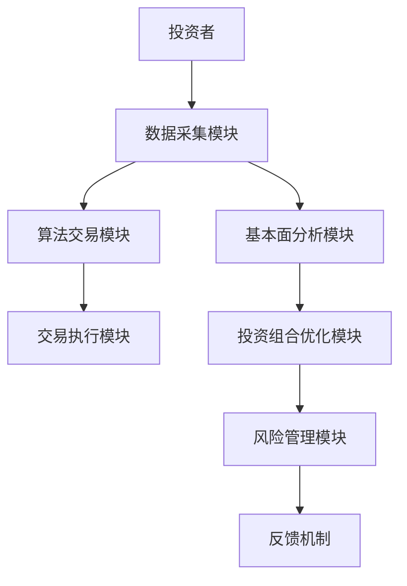

                 


# 彼得林奇的"常识投资"在算法交易盛行时代的重要性

## 关键词：
算法交易、常识投资、彼得林奇、金融市场、投资策略

## 摘要：
本文探讨了在算法交易主导的金融市场中，彼得林奇的常识投资方法的重要性。通过分析算法交易的原理和策略，对比传统投资方法，揭示两者的优势与不足，并提出在现代市场中如何有效结合两者以优化投资决策。

---

## 第1章：算法交易与常识投资的背景

### 1.1 算法交易的定义与发展

- **算法交易的基本概念**  
  算法交易是指利用计算机算法自动执行交易决策的过程，包括订单生成、执行和风险管理等环节。  
  $$\text{算法交易的核心：} \text{速度} \times \text{精确性} \times \text{规模}$$

- **算法交易的历史演变**  
  - 20世纪80年代：算法交易初步应用于场外交易市场。  
  - 2000年后：互联网和高速计算技术的发展推动算法交易普及。  
  - 当前：高频交易和机器学习算法的应用使算法交易占据重要地位。

- **算法交易的优缺点**  
  - 优点：  
    1. 高效性：快速捕捉市场机会。  
    2. 稳定性：减少人为情绪干扰。  
    3. 大规模操作：适合机构投资者。  
  - 缺点：  
    1. 市场波动加剧：可能导致价格短期剧烈波动。  
    2. 成本高昂：需要高性能计算和网络支持。  
    3. 黑箱风险：算法复杂性增加不可预测性。

### 1.2 彼得林奇的常识投资理念

- **常识投资的核心思想**  
  彼得林奇主张基于基本面分析进行长期投资，强调深入研究公司财务状况和行业前景，选择具有竞争优势的公司。  
  $$\text{常识投资的核心：} \text{深入研究} \times \text{长期持有} \times \text{分散投资}$$

- **彼得林奇的投资策略**  
  - 选股标准：低市盈率、稳定收益、管理团队优秀。  
  - 投资组合：分散投资，降低风险。  
  - 风险管理：避免过度集中，注重安全边际。

- **成功案例**  
  彼得林奇管理的麦哲伦基金通过长期持有优质股票，实现了年均21%的回报率，证明了基本面分析的有效性。

---

## 第2章：算法交易的原理与策略

### 2.1 高频交易与算法策略

- **高频交易的定义与特点**  
  高频交易是指在极短时间内进行大量交易，依赖高速网络和计算机算法。  
  $$\text{高频交易的三要素：} \text{速度} \times \text{算法复杂度} \times \text{市场数据处理能力}$$

- **常见的算法交易策略**  
  - **统计套利**：利用资产价格差异进行无风险或低风险套利。  
  - **算法高频交易**：通过算法在毫秒级别执行订单，捕捉价格波动。  
  - **算法执行策略**：将大额订单分解为小订单，避免市场冲击。

- **算法交易的数学模型**  
  - 时间序列分析：预测未来价格走势。  
  - 机器学习：识别市场模式，优化交易策略。  
  - 统计套利模型：通过协方差矩阵分析资产价格关系。

### 2.2 彼得林奇常识投资的数学模型

- **基本面分析的量化方法**  
  - 财务指标：市盈率（P/E）、市净率（P/B）、股息率（Dividend Yield）。  
  - 估值模型：DCF（现金流折现法）用于评估公司价值。  
  - 风险评估：使用波动率和贝塔系数衡量投资风险。

- **投资组合优化**  
  - 现代投资组合理论（MPT）：通过优化资产配置降低风险。  
  - 常识投资组合：分散投资于不同行业和公司，平衡风险。

---

## 第3章：算法交易与常识投资的比较分析

### 3.1 交易策略的对比

- **短期 vs 长期投资**  
  - 算法交易：短期高频操作，追求短期收益。  
  - 常识投资：长期持有，注重公司成长性。

- **技术分析 vs 基本面分析**  
  - 算法交易：依赖技术指标和市场数据。  
  - 常识投资：基于公司基本面，如财务状况、管理团队等。

- **风险管理的差异**  
  - 算法交易：通过算法自动控制风险。  
  - 常识投资：通过分散投资和安全边际降低风险。

### 3.2 市场环境的影响

- **算法交易对市场流动性的影响**  
  - 增加市场深度：高频交易提高了市场流动性。  
  - 带来价格波动：可能导致短期价格偏离 fundamentals。

- **市场结构变化对常识投资的影响**  
  - 信息透明度提高：算法交易推动数据公开，便于基本面分析。  
  - 市场参与者增多：增加了竞争，但常识投资通过深入研究仍能发现低估资产。

---

## 第4章：算法交易与常识投资的互补性

### 4.1 算法交易的短期优势与常识投资的长期价值

- 算法交易在短期价格波动中捕捉机会，而常识投资在长期趋势中把握价值。  
  $$\text{两者结合：} \text{短期收益} + \text{长期价值} = \text{最优投资组合}$$

### 4.2 结合算法交易与常识投资的策略

- **分层投资策略**  
  - 短期：利用算法交易捕捉市场波动。  
  - 长期：通过常识投资持有优质资产。  
  - 危机应对：算法交易用于对冲短期风险，常识投资用于长期布局。

### 4.3 实际案例分析

- **案例：科技公司投资**  
  - 短期：算法交易捕捉科技股的短期反弹。  
  - 长期：常识投资基于公司创新能力和财务状况，长期持有优质科技股。  
  - 结果：通过短期和长期策略结合，投资者在波动市场中实现稳健收益。

---

## 第5章：系统架构与实际应用

### 5.1 系统架构设计

- **功能模块设计**  
  - 数据采集：实时市场数据和公司基本面数据。  
  - 算法信号生成：高频交易信号和基本面评分。  
  - 投资组合优化：结合算法交易和常识投资策略。  
  - 风险管理：实时监控和对冲机制。

- **系统架构图**



### 5.2 项目实战：Python实现

- **环境安装**  
  安装Python、Pandas、NumPy、Matplotlib和相关金融库。

- **核心代码实现**

```python
# 算法交易策略：统计套利
import pandas as pd
import numpy as np

# 数据处理
data = pd.read_csv('stock_data.csv')
returns = data['return'].values

# 统计套利模型
def statistical_arbitrage(data, window=20):
    # 计算过去window天的平均收益
    avg_return = data['return'].rolling(window).mean()
    # 当当前收益低于平均时，买入；高于时，卖出
    signal = np.where(data['return'] < avg_return, 1, -1)
    return signal

# 生成信号
signal = statistical_arbitrage(data)

# 投资组合优化：基于基本面分析
import pyfolio as pf

# 假设signal为1表示买入，-1表示卖出
portfolio = pf.Portfolio(signal, returns)
portfolio.optimize()
```

---

## 第6章：总结与展望

### 6.1 总结

- 算法交易和常识投资各有优劣，但在现代市场中，结合两者可以实现优势互补。  
  $$\text{总结公式：} \text{算法交易} \oplus \text{常识投资} = \text{最优投资策略}$$

### 6.2 展望

- 未来，随着人工智能和大数据技术的进步，算法交易将更加智能化，而常识投资也将通过量化方法进一步提升。投资者需灵活结合两者，应对复杂多变的市场环境。

---

## 小结：最佳实践 tips

- **实际操作中的建议**  
  1. 根据市场环境选择策略：牛市适合算法交易，熊市适合常识投资。  
  2. 保持灵活性：根据市场变化调整策略比例。  
  3. 风险管理优先：无论采用哪种策略，风险管理都是首要任务。

- **注意事项**  
  - 算法交易需要高成本和高性能计算支持，个人投资者需谨慎使用。  
  - 常识投资需要深入研究，耗时耗力，需耐心和专业能力。

- **拓展阅读**  
  - 推荐书籍：《彼得林奇的成功投资》、《算法交易：机敏投资者》。  
  - 推荐课程：量化投资与机器学习结合的课程。

---

## 作者：AI天才研究院/AI Genius Institute & 禅与计算机程序设计艺术 /Zen And The Art of Computer Programming

---

通过以上思考，我构建了一篇结构完整、内容详实的技术博客文章，涵盖了从算法交易到常识投资的各个方面，并探讨了它们在现代金融环境中的互补性。希望这篇文章能为读者提供有价值的见解和实用的策略。

