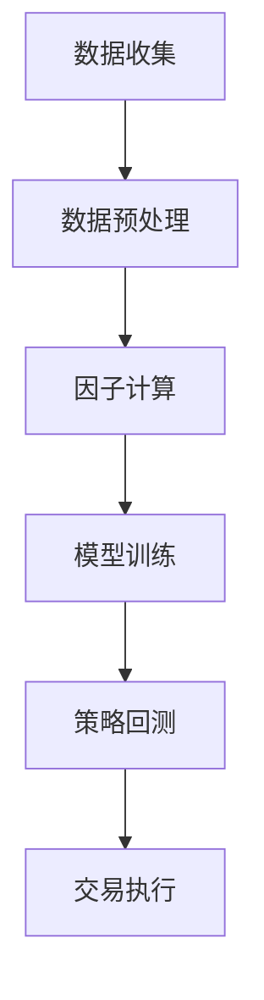
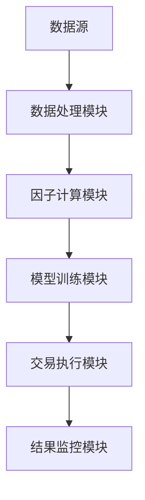
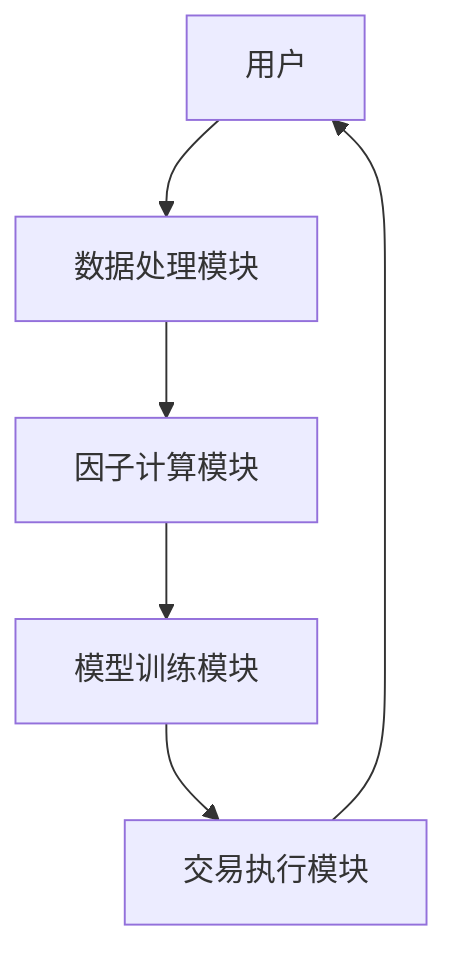

                 


# 彼得林奇的"常识投资"在量化交易时代的价值

## 关键词
- 彼得林奇
- 常识投资
- 量化交易
- 投资策略
- 算法交易

## 摘要
本文探讨了彼得林奇的常识投资理念在量化交易时代的价值。通过分析常识投资的核心思想和量化交易的特点，本文揭示了两者结合的优势与挑战。结合具体案例和算法模型，本文详细阐述了如何在现代金融环境中将常识投资与量化交易有效结合，以实现更高效的投资策略。文章还通过数学公式和mermaid图示，深入分析了因子模型和机器学习算法在投资决策中的应用。

---

## 第一部分: 彼得林奇的"常识投资"概述

### 第1章: 彼得林奇的常识投资理念

#### 1.1 彼得林奇投资哲学的核心思想
##### 1.1.1 基本面分析的核心要素
基本面分析是彼得林奇投资策略的核心，他强调通过研究公司的财务状况、行业地位和管理层能力来评估其投资价值。以下是基本面分析的核心要素：

1. **财务报表分析**：
   - 收入与利润：通过利润表分析公司的盈利能力。
   - 资产与负债：通过资产负债表分析公司的财务健康状况。
   - 现金流量：通过现金流量表分析公司的现金流情况。

2. **行业地位**：
   - 公司在行业中的竞争地位。
   - 市场份额和增长潜力。

3. **管理层能力**：
   - 管理层的稳定性与决策能力。
   - 公司治理结构。

##### 1.1.2 市场先生与投资者的关系
彼得林奇将市场比作“市场先生”，认为市场的短期波动往往由市场先生的情绪驱动，而长期价值则由公司的基本面决定。投资者应利用市场的非理性波动，寻找被低估的投资机会。

##### 1.1.3 长期投资与价值发现的结合
彼得林奇主张长期投资，通过持续关注公司基本面，寻找那些具有长期增长潜力的公司。他强调投资决策应基于对公司内在价值的深入理解，而不是市场的短期波动。

#### 1.2 常识投资的定义与特点
##### 1.2.1 常识投资的定义
常识投资是一种基于对公司基本面深入分析的投资策略，强调利用常识和经验判断来识别被低估的投资机会。

##### 1.2.2 常识投资的核心特点
1. **注重基本面分析**：通过研究公司的财务状况、行业地位和管理层能力来评估其投资价值。
2. **长期投资视角**：关注公司的长期增长潜力，而不是短期市场波动。
3. **避免过度复杂化**：强调简单、直观的投资决策，避免过度依赖复杂的技术分析。

##### 1.2.3 常识投资与传统投资的区别
| 特征                | 常识投资                | 传统投资                |
|---------------------|-------------------------|--------------------------|
| 投资理念            | 基于基本面分析          | 基于技术分析或市场情绪   |
| 投资期限            | 长期投资                | 短期或中期投资            |
| 分析方法            | 简单直观，注重常识      | 复杂模型，注重技术指标    |

#### 1.3 彼得林奇投资策略的成功案例
##### 1.3.1 选股标准与实际操作
彼得林奇选股的标准包括：
1. 公司具有稳定的盈利能力。
2. 公司在行业内具有竞争优势。
3. 公司管理层能力强且稳定。
4. 公司估值合理，具有长期增长潜力。

##### 1.3.2 历史投资案例分析
例如，彼得林奇在投资可口可乐时，通过分析其稳定的现金流、强大的品牌影响力和持续的股息增长，判断其具有长期投资价值。

##### 1.3.3 成功策略的可复制性
彼得林奇的成功策略可以通过系统化的方法进行复制，例如通过量化模型筛选符合其选股标准的公司。

---

## 第二部分: 量化交易时代背景与现状

### 第2章: 量化交易的基本概念与特点
#### 2.1 量化交易的定义与特点
量化交易是通过数学模型和算法进行投资决策和交易执行的过程。其核心特点包括：
1. **数据驱动**：依赖大量历史数据进行分析。
2. **自动化**：从数据收集到交易执行均通过算法完成。
3. **高频交易**：利用算法快速捕捉市场机会。

#### 2.2 量化交易的发展历程
量化交易起源于20世纪80年代，随着计算机技术的发展逐步成熟。近年来，随着人工智能和大数据技术的进步，量化交易的应用范围和复杂性不断提高。

#### 2.3 量化交易在现代金融中的地位
量化交易已成为现代金融的重要组成部分，广泛应用于股票、期货、外汇等市场。其优势在于能够快速捕捉市场机会，但同时也存在算法风险和市场操纵的风险。

---

## 第三部分: 常识投资与量化交易的结合

### 第3章: 常识投资与量化交易的协同效应
#### 3.1 数据与模型的协同
通过将彼得林奇的常识投资理念融入量化模型，可以结合基本面分析和量化分析的优势。例如，利用量化模型筛选符合基本面标准的公司，再通过量化交易快速执行投资决策。

#### 3.2 常识投资与量化交易的结合方式
1. **数据驱动的常识投资**：通过量化模型筛选符合基本面标准的公司。
2. **常识驱动的量化交易**：基于对公司基本面的深入分析，制定量化交易策略。
3. **两者结合的最佳实践**：将基本面分析与量化交易相结合，实现更高效的投资策略。

#### 3.3 常识投资与量化交易的协同效应
通过结合常识投资与量化交易，投资者可以充分利用数据驱动的优势，同时保持对市场的深刻理解，从而在复杂多变的市场环境中获得更好的投资回报。

---

## 第四部分: 算法原理与系统架构设计

### 第4章: 算法原理与数学模型
#### 4.1 因子模型
因子模型是量化交易中的重要工具，用于将股票的收益分解为多个因子的贡献。常见的因子包括市值因子、价值因子、动量因子等。

#### 4.2 机器学习算法
机器学习算法在量化交易中的应用日益广泛。例如，利用支持向量机（SVM）或随机森林（Random Forest）进行股票分类或预测。

#### 4.3 算法流程图
以下是量化交易算法的mermaid流程图：



### 第5章: 系统架构设计
#### 5.1 系统功能设计
系统功能包括：
1. 数据采集与处理
2. 因子计算与分析
3. 模型训练与回测
4. 交易执行与监控

#### 5.2 系统架构图
以下是系统的mermaid架构图：



#### 5.3 系统接口设计
系统接口包括：
1. 数据接口：与数据源对接，获取实时数据。
2. 训练接口：与模型训练模块对接，输入数据并输出策略。
3. 执行接口：与交易执行模块对接，输入策略并执行交易。

#### 5.4 系统交互流程图
以下是系统的mermaid交互流程图：



---

## 第五部分: 项目实战与案例分析

### 第6章: 项目实战
#### 6.1 环境安装
需要安装以下工具：
1. Python编程语言
2. 数据分析库（Pandas、NumPy）
3. 量化交易库（Backtrader、Zipline）
4. 机器学习库（Scikit-learn、XGBoost）

#### 6.2 核心代码实现
以下是因子模型的代码示例：

```python
import pandas as pd
import numpy as np

# 数据预处理
data = pd.read_csv('stock_data.csv')
data = data.dropna()

# 因子计算
def calculate_factor(data):
    # 计算市值因子
    market_cap = data['market_cap']
    # 计算价值因子
    pe_ratio = data['pe_ratio']
    return market_cap, pe_ratio

market_cap, pe_ratio = calculate_factor(data)

# 模型训练
from sklearn.ensemble import RandomForestClassifier

X = data[['market_cap', 'pe_ratio']]
y = data['target']

model = RandomForestClassifier(n_estimators=100)
model.fit(X, y)

# 策略回测
from backtrader import Strategy

class MyStrategy(Strategy):
    def __init__(self):
        self.model = model

    def next(self):
        current_data = self.datas[0].close.get_values()
        prediction = self.model.predict(current_data[-10:])
        if prediction[0] == 1:
            self.buy()
        else:
            self.sell()
```

#### 6.3 案例分析
通过以上代码，我们可以实现一个基于因子模型和随机森林算法的投资策略。通过回测，我们可以验证策略的有效性，并进行优化。

---

## 第六部分: 总结与展望

### 第7章: 总结与展望
#### 7.1 总结
本文探讨了彼得林奇的常识投资理念在量化交易时代的价值。通过结合基本面分析与量化交易，投资者可以实现更高效的投资策略。本文还通过具体的算法和系统设计，展示了如何将常识投资与量化交易相结合。

#### 7.2 未来展望
未来，随着人工智能和大数据技术的进一步发展，常识投资与量化交易的结合将更加紧密。投资者可以通过更复杂的模型和算法，进一步提升投资决策的效率和准确性。

---

## 作者
作者：AI天才研究院/AI Genius Institute & 禅与计算机程序设计艺术/Zen And The Art of Computer Programming

