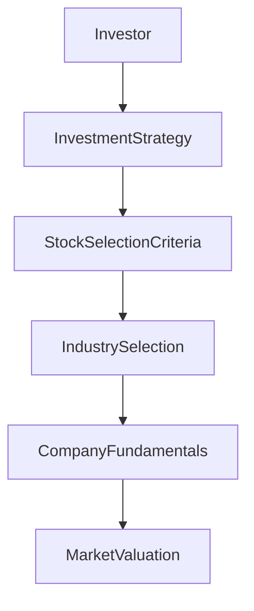
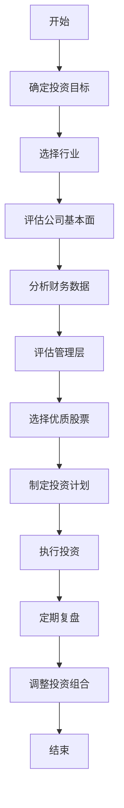
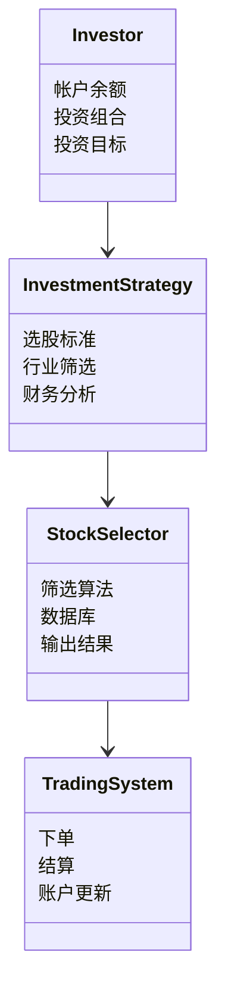
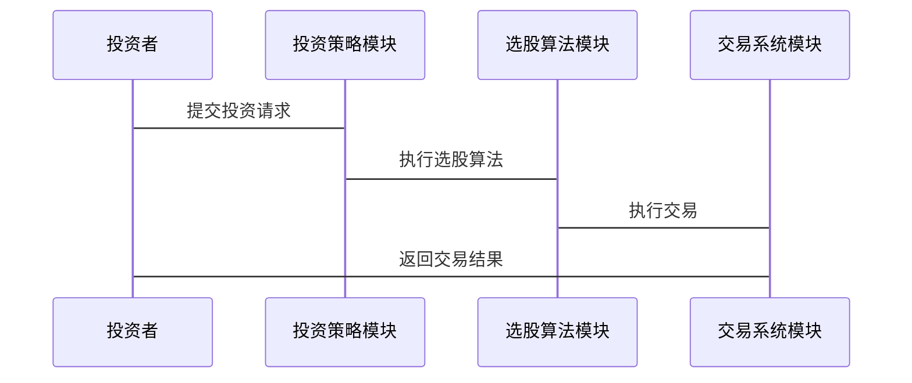

                 


# 彼得林奇的"常识投资"实践指南

> 关键词：彼得林奇，常识投资，投资策略，投资指南，投资分析

> 摘要：本文深入探讨了彼得·林奇的“常识投资”理念，分析了其核心概念、算法原理、系统架构及实际应用，提供了详细的实战指导和最佳实践建议，帮助投资者掌握长期、分散、价值投资的策略。

---

# 第一部分: 彼得林奇的"常识投资"背景介绍

## 第1章: 彼得林奇与常识投资概述

### 1.1 彼得林奇的生平与投资理念

#### 1.1.1 彼得林奇的生平简介
彼得·林奇（Peter Lynch）是美国著名的投资专家，曾任富达投资管理公司的基金经理，管理着麦哲伦基金，创造了年均29%的回报率。他的投资理念以长期、分散和价值投资为核心，强调通过常识和基本面分析选择优质股票。

#### 1.1.2 彼得林奇的投资理念
林奇的投资理念强调：
- 长期投资：避免短期波动，关注企业的长期价值。
- 分散投资：通过投资不同类型的企业分散风险。
- 价值投资：寻找被市场低估的优质企业。

#### 1.1.3 彼得林奇的代表作与思想影响
林奇的代表作《彼得林奇的成功投资》和《击败市场的人》深刻影响了投资者，其理念被广泛应用于个人和机构投资。

### 1.2 常识投资的基本概念

#### 1.2.1 常识投资的定义
常识投资是指通过基本的常识和基本面分析，选择具有持续增长潜力的企业进行长期投资。

#### 1.2.2 常识投资的核心要素
- 行业选择：选择增长稳定的行业。
- 公司基本面：关注盈利能力、财务健康和管理层能力。
- 市场估值：寻找被低估的股票。

#### 1.2.3 常识投资与其他投资策略的对比
与技术分析和高频交易不同，常识投资注重企业的内在价值，强调长期持有。

### 1.3 常识投资的背景与现状

#### 1.3.1 常识投资的历史背景
起源于20世纪70年代，林奇将其发扬光大，成为价值投资的重要流派。

#### 1.3.2 常识投资在现代投资中的地位
在机构和个人投资中，常识投资因其稳健性而备受推崇。

#### 1.3.3 常识投资的现状与发展趋势
随着市场变化，常识投资不断优化，结合现代技术进行分析。

---

## 第2章: 常识投资的核心概念与联系

### 2.1 常识投资的核心概念

#### 2.1.1 投资标的的选择标准
选择具有持续增长潜力、财务健康和优秀管理层的企业。

#### 2.1.2 长期投资与价值投资
长期投资避免短期波动，价值投资寻找被低估的企业。

#### 2.1.3 分散投资与风险管理
分散投资降低风险，避免过度集中在单一行业或股票。

### 2.2 常识投资的核心要素对比

#### 2.2.1 不同投资策略的核心要素对比
| 投资策略 | 核心要素 |
|----------|----------|
| 常识投资 | 长期、分散、价值 |
| 技术分析 | 价格、成交量 |
| 高频交易 | 短期、算法 |

#### 2.2.2 常识投资的ER实体关系图


### 2.3 常识投资的流程图


---

## 第3章: 常识投资的算法原理讲解

### 3.1 常识投资的筛选算法

#### 3.1.1 常识投资的筛选标准
- 行业：选择增长稳定的行业。
- 公司基本面：关注ROE、负债率等指标。
- 市场估值：寻找PE、PB低于行业平均的股票。

#### 3.1.2 筛选算法的流程
1. 确定投资目标和行业。
2. 评估公司基本面，分析财务数据。
3. 评估管理层和企业竞争力。
4. 筛选出符合标准的股票。

#### 3.1.3 筛选算法的Python实现
```python
import pandas as pd

def screen_stocks(industry, df):
    # 筛选指定行业的股票
    industry_df = df[df['行业'] == industry]
    # 计算市盈率和市净率
    industry_df['PE'] = industry_df['市盈率']
    industry_df['PB'] = industry_df['市净率']
    # 筛选PE和PB低于行业平均的股票
    pe_avg = industry_df['PE'].mean()
    pb_avg = industry_df['PB'].mean()
    filtered = industry_df[(industry_df['PE'] < pe_avg) & (industry_df['PB'] < pb_avg)]
    return filtered

# 示例数据
data = {
    '行业': ['科技', '金融', '科技', '金融'],
    '市盈率': [15, 12, 16, 10],
    '市净率': [2.5, 1.8, 2.8, 1.5]
}
df = pd.DataFrame(data)
selected = screen_stocks('科技', df)
print(selected)
```

#### 3.1.4 算法原理的数学模型和公式
市盈率（PE）= 股价 / 每股净利润  
市净率（PB）= 股价 / 每股净资产  
通过比较PE和PB与行业平均值，筛选出低估股票。

---

## 第4章: 常识投资的系统分析与架构设计方案

### 4.1 系统功能设计

#### 4.1.1 领域模型类图


### 4.2 系统架构设计

#### 4.2.1 系统架构图


### 4.3 系统接口设计

#### 4.3.1 系统交互序列图


---

## 第5章: 项目实战

### 5.1 环境安装与配置

#### 5.1.1 安装Python和相关库
```bash
pip install pandas numpy matplotlib
```

#### 5.1.2 数据库安装与配置
使用MySQL或MongoDB存储股票数据。

### 5.2 核心代码实现

#### 5.2.1 数据获取与预处理
```python
import pandas as pd
import numpy as np

# 获取股票数据
def get_stock_data(tickers):
    data = {}
    for ticker in tickers:
        # 获取数据
        df = pd.read_csv(f'data/{ticker}.csv')
        data[ticker] = df
    return data

# 数据清洗
def preprocess_data(data):
    cleaned_data = {}
    for ticker, df in data.items():
        df['收盘价'] = df['收盘价'].fillna(method='ffill')
        cleaned_data[ticker] = df
    return cleaned_data
```

#### 5.2.2 策略实现与回测
```python
def backtest(strategy, data):
    returns = []
    for i in range(len(data)):
        # 执行策略
        position = strategy.select_stock(data[i])
        returns.append(position['收益'])
    return returns

# 示例策略
class SimpleStrategy:
    def select_stock(self, portfolio):
        # 简单选择收益最高的股票
        max_return = max(portfolio['收益'])
        return portfolio[portfolio['收益'] == max_return]
```

#### 5.2.3 策略优化与改进
通过回测结果优化选股标准，调整财务指标的权重。

### 5.3 案例分析与解读

#### 5.3.1 案例分析
分析某行业内的优质股票，应用常识投资策略筛选并制定投资计划。

#### 5.3.2 实战总结
总结实战经验，优化投资策略，提升投资收益。

---

## 第6章: 最佳实践与小结

### 6.1 小结

### 6.2 注意事项
- 定期复盘，调整投资组合。
- 风险管理，避免过度集中。
- 保持学习，更新投资知识。

### 6.3 拓展阅读
推荐书籍：《彼得林奇的成功投资》、《价值投资实战》。

---

# 作者
作者：AI天才研究院 & 禅与计算机程序设计艺术

---

通过以上内容，读者可以系统地学习彼得·林奇的常识投资理念，从理论到实践，逐步掌握投资技巧，实现稳健的投资收益。

