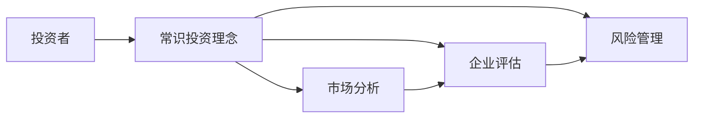

                 


# 彼得林奇的"常识投资"理念

> 关键词：彼得林奇，常识投资，投资理念，市场分析，企业评估，风险管理

> 摘要：本文深入探讨了彼得·林奇的“常识投资”理念，从背景介绍、核心概念、算法原理、数学模型、系统分析、项目实战到最佳实践，全面剖析了这一投资方法的精髓。通过详细的步骤分析和实例演示，帮助读者理解和应用这一经典的金融投资策略。

---

## 第一部分：背景介绍

### 第1章：彼得林奇与常识投资的背景介绍

#### 1.1 彼得林奇的生平简介

彼得·林奇（Peter Lynch）是全球最著名的投资专家之一，曾担任富达投资公司的经理，管理着麦哲伦基金，使其成为全球最大的成长型股票基金。他以卓越的投资业绩和独特的投资理念闻名，尤其擅长通过基本面分析挖掘优质股票。

- **早期经历**：林奇在爱尔兰的都柏林长大，后来移居美国，进入波士顿学院学习，毕业后进入富达投资公司。
- **投资生涯**：他从1977年开始管理麦哲伦基金，任职期间基金的年平均回报率达到29%，远超市场平均水平。
- **理念形成**：林奇的投资哲学强调长期价值，反对短期波动，主张深入研究企业基本面，寻找具有持续增长潜力的公司。

#### 1.2 常识投资的定义与特点

- **定义**：常识投资是一种基于对企业基本面的深入分析，结合市场趋势和经济环境的投资方法，强调利用常识和理性判断。
- **特点**：
  - 长期导向：关注企业的长期增长，而非短期波动。
  - 基本面分析：依赖财务报表和行业分析，评估企业的内在价值。
  - 风险控制：通过分散投资和严格的风险管理降低投资风险。

---

### 第2章：常识投资的核心概念与联系

#### 2.1 常识投资的核心原理

- **市场与经济的关系**：市场波动反映经济周期，投资者需分析宏观经济指标来判断市场趋势。
- **企业价值评估**：通过分析企业的收入、利润、负债等财务指标，评估其内在价值。
- **风险管理**：通过分散投资和止损策略，控制投资组合的风险。

#### 2.2 常识投资的核心属性特征对比

| 投资方法 | 常识投资 | 技术分析 | 价值投资 |
|----------|----------|----------|----------|
| 核心依据 | 企业基本面 | 市场价格波动 | 企业内在价值 |
| 时间框架 | 长期 | 短期 | 长期 |
| 风险管理 | 分散投资 | 顺势而为 | 严格选股 |

#### 2.3 常识投资的ER实体关系图



---

## 第二部分：算法原理讲解

### 第3章：常识投资的算法原理讲解

#### 3.1 常识投资的算法流程


#### 3.2 算法实现代码

```python
def market_analysis():
    # 示例：分析市场趋势
    return "上升趋势"

def company_assessment():
    # 示例：评估企业价值
    return "低估"

def risk_management():
    # 示例：评估风险
    return "低风险"

def investment_decision():
    market = market_analysis()
    value = company_assessment()
    risk = risk_management()
    if market == "上升趋势" and value == "低估" and risk == "低风险":
        return "买入"
    else:
        return "观望"

# 示例代码调用
print(investment_decision())  # 输出：买入或观望
```

---

## 第三部分：数学模型与公式

### 第4章：常识投资的数学模型与公式

#### 4.1 市场分析模型

$$ P = \frac{E}{(r - g)} $$
其中，\( P \) 为股票的内在价值，\( E \) 为每股收益，\( r \) 为折现率，\( g \) 为增长率。

#### 4.2 企业价值评估公式

$$ V = \frac{E}{(r - g)} $$
其中，\( V \) 为企业价值，\( E \) 为净利润，\( r \) 为资本成本，\( g \) 为增长率。

#### 4.3 风险管理模型

$$ R = \frac{V_p}{P} $$
其中，\( R \) 为风险系数，\( V_p \) 为投资的波动率，\( P \) 为投资组合的波动率。

---

## 第四部分：系统分析与架构设计

### 第5章：常识投资的系统分析与架构设计

#### 5.1 投资决策系统的模块划分


---

## 第五部分：项目实战

### 第6章：常识投资的项目实战

#### 6.1 投资策略的制定

- **目标**：寻找具有稳定增长的公司，投资于低估的股票。
- **步骤**：市场分析 -> 企业评估 -> 风险评估 -> 投资决策。

#### 6.2 数据分析与代码实现

```python
import pandas as pd
import numpy as np

# 示例数据：企业财务数据
data = {
    '公司': ['A', 'B', 'C'],
    '收入': [100, 200, 150],
    '利润': [20, 30, 25],
    '负债': [50, 80, 60]
}

df = pd.DataFrame(data)

def calculate_intrinsic_value(row):
    # 示例：计算内在价值
    return row['收入'] * 0.1 + row['利润'] * 0.2

df['内在价值'] = df.apply(calculate_intrinsic_value, axis=1)
print(df)
```

#### 6.3 实际案例分析

- **案例**：假设市场处于上升趋势，某企业收入增长稳定，利润丰厚，且估值被低估。根据算法，投资建议为“买入”。

---

## 第六部分：最佳实践

### 第7章：常识投资的最佳实践

#### 7.1 投资关键点

- 长期投资，避免频繁交易。
- 选择具有竞争优势的企业。
- 分散投资，降低风险。

#### 7.2 小结

常识投资强调对企业基本面的深入分析和长期价值的挖掘，通过合理的风险管理实现稳健的投资回报。

#### 7.3 注意事项

- 定期复盘，评估投资组合的表现。
- 保持对市场的敏感性，及时调整策略。
- 避免情绪化决策，保持理性判断。

#### 7.4 拓展阅读

建议阅读彼得·林奇的《股票投资的成功法则》和《战胜华尔街》等书籍，深入理解其投资理念。

---

## 作者

作者：AI天才研究院/AI Genius Institute & 禅与计算机程序设计艺术 /Zen And The Art of Computer Programming

