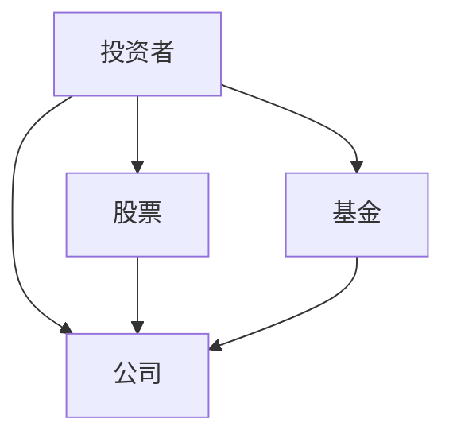
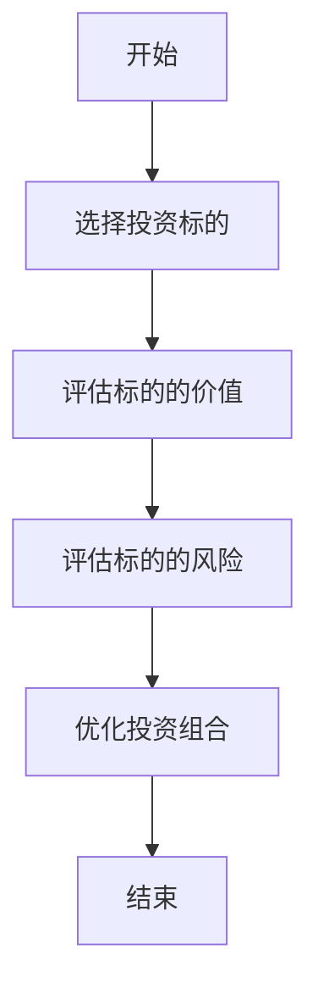
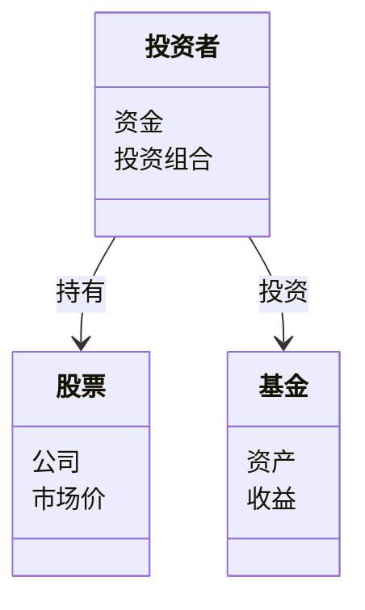
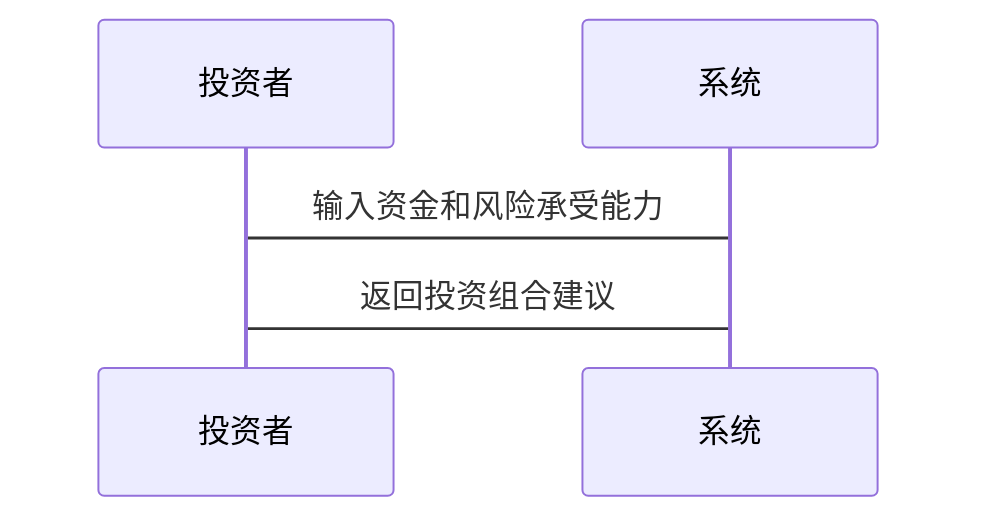

                 


# 彼得林奇的"慢牛"投资哲学

## 关键词：彼得林奇，慢牛投资，价值投资，长期持有，风险控制

## 摘要：彼得林奇的"慢牛"投资哲学是一种以长期稳健为核心的投资策略，强调选择优质的长期增长公司，避免短期市场波动的干扰，注重基本面分析和风险控制。本文将从背景、核心概念、算法原理、系统架构、项目实战等多个角度详细阐述这一投资哲学。

---

# 第1章: 彼得林奇的"慢牛"投资哲学背景

## 1.1 彼得林奇的背景与投资理念

### 1.1.1 彼得林奇的生平简介

彼得·林奇（Peter Lynch）是美国著名的投资专家，被誉为“股神”，曾担任麦哲伦基金（Fidelity Magellan Fund）的经理，创造了令人瞩目的投资业绩。他的投资哲学以长期稳健为核心，强调选择优质的长期增长公司。

### 1.1.2 彼得林奇的投资哲学核心

彼得林奇的投资哲学的核心是“慢牛”理念，即通过选择优质的长期增长公司，避免短期市场波动的干扰，注重基本面分析和风险控制。

### 1.1.3 "慢牛"投资哲学的提出背景

在20世纪80年代，美国股市经历了多次剧烈波动，许多投资者因短期市场波动而亏损严重。彼得林奇提出“慢牛”投资哲学，旨在帮助投资者在长期中实现稳健收益，避免短期波动的风险。

---

## 1.2 "慢牛"投资哲学的定义与特点

### 1.2.1 "慢牛"的定义

"慢牛"投资哲学是一种以长期稳健为核心的投资策略，强调选择优质的长期增长公司，避免短期市场波动的干扰，注重基本面分析和风险控制。

### 1.2.2 "慢牛"的核心特点

1. **长期持有**：投资者应选择优质公司长期持有，避免频繁交易。
2. **价值投资**：注重公司基本面分析，选择具有长期增长潜力的公司。
3. **风险控制**：通过分散投资和严格的风险评估，降低投资风险。

### 1.2.3 "慢牛"与传统投资策略的区别

| **特点**         | **"慢牛"投资哲学** | **传统投资策略** |
|------------------|-------------------|-----------------|
| 投资期限         | 长期持有         | 短期交易         |
| 投资标的选择     | 优质长期增长公司 | 追求短期收益     |
| 风险控制         | 强调风险控制     | 风险控制较弱     |

---

# 第2章: "慢牛"投资哲学的核心概念与联系

## 2.1 核心概念原理

### 2.1.1 投资标的选择标准

"慢牛"投资哲学强调选择具有长期增长潜力的公司，具体标准包括：

1. **行业地位**：选择行业龙头或具有竞争优势的公司。
2. **财务状况**：公司财务健康，盈利稳定，现金流充足。
3. **管理团队**：管理团队经验丰富，具有良好的治理记录。

### 2.1.2 长期持有策略

"慢牛"投资哲学的核心是长期持有优质公司，避免频繁交易，以降低交易成本和市场波动的影响。

### 2.1.3 风险控制方法

通过分散投资和严格的风险评估，降低投资风险。具体方法包括：

1. **分散投资**：将资金分配到多个行业和公司，降低单一投资的风险。
2. **严格的风险评估**：定期评估投资组合的风险，及时调整投资策略。

## 2.2 核心概念属性特征对比

| **属性**         | **"慢牛"投资哲学** | **传统投资策略** |
|------------------|-------------------|-----------------|
| 投资期限         | 长期持有         | 短期交易         |
| 投资标的选择     | 优质长期增长公司 | 追求短期收益     |
| 风险控制         | 强调风险控制     | 风险控制较弱     |

---

## 2.3 ER实体关系图



---

# 第3章: "慢牛"投资哲学的算法原理

## 3.1 算法原理概述

### 3.1.1 价值评估算法

价值评估算法用于评估公司的内在价值，帮助投资者选择具有长期增长潜力的公司。具体步骤如下：

1. **收集数据**：收集公司的财务数据，包括收入、利润、现金流等。
2. **计算关键指标**：计算市盈率（P/E）、市净率（P/B）、股息率等指标。
3. **评估内在价值**：通过DCF模型等方法计算公司的内在价值。
4. **比较市场价值**：比较市场价值与内在价值，判断公司是否具有投资价值。

### 3.1.2 风险评估算法

风险评估算法用于评估投资组合的风险，帮助投资者控制投资风险。具体步骤如下：

1. **计算波动率**：计算投资组合的波动率，衡量投资组合的风险。
2. **计算VaR**：计算在险价值（Value at Risk），衡量投资组合在特定置信水平下的最大损失。
3. **调整投资组合**：根据风险评估结果，调整投资组合，降低整体风险。

### 3.1.3 投资组合优化算法

投资组合优化算法用于优化投资组合，最大化收益，同时控制风险。具体步骤如下：

1. **确定投资目标**：明确投资目标，包括收益目标和风险承受能力。
2. **选择投资标的**：根据价值评估结果，选择具有长期增长潜力的公司。
3. **优化投资组合**：根据投资目标和风险承受能力，优化投资组合，平衡收益与风险。

---

## 3.2 算法流程图



---

## 3.3 价值评估算法实现

### 3.3.1 Python代码实现

```python
def calculate_intrinsic_value(company_data):
    # 输入：公司数据，包括收入、利润、现金流等
    # 输出：公司内在价值
    revenue = company_data['revenue']
    profit = company_data['profit']
    cash_flow = company_data['cash_flow']
    
    # 计算DCF模型
    # 假设自由现金流增长率为g
    g = 5  # 假设增长率
    discount_rate = 0.1  # 折现率
    
    terminal_value = cash_flow * (1 + g) / (discount_rate - g)
    intrinsic_value = terminal_value / (1 + discount_rate)
    
    return intrinsic_value
```

### 3.3.2 价值评估算法的数学模型

DCF模型的数学公式为：

$$
\text{终端价值} = \frac{\text{自由现金流} \times (1 + g)}{\text{折现率} - g}
$$

$$
\text{内在价值} = \frac{\text{终端价值}}{1 + \text{折现率}}
$$

---

## 3.4 风险评估算法的数学模型

VaR的数学公式为：

$$
\text{VaR} = \mu + z \times \sigma
$$

其中，μ为平均回报率，z为标准正态分布的分位数，σ为回报率的标准差。

---

# 第4章: "慢牛"投资哲学的系统架构设计

## 4.1 系统功能设计

### 4.1.1 领域模型



---

## 4.2 系统架构设计

### 4.2.1 架构图


---

## 4.3 接口设计

### 4.3.1 投资者接口

- 输入：投资者资金、风险承受能力
- 输出：投资组合建议

### 4.3.2 股票接口

- 输入：公司数据
- 输出：股票价值评估结果

---

## 4.4 交互序列图



---

# 第5章: "慢牛"投资哲学的项目实战

## 5.1 环境安装

### 5.1.1 安装Python

```bash
python --version
```

### 5.1.2 安装相关库

```bash
pip install pandas numpy matplotlib
```

---

## 5.2 系统核心实现

### 5.2.1 价值评估函数

```python
def calculate_intrinsic_value(company_data):
    revenue = company_data['revenue']
    profit = company_data['profit']
    cash_flow = company_data['cash_flow']
    
    g = 5  # 假设增长率
    discount_rate = 0.1  # 折现率
    
    terminal_value = cash_flow * (1 + g) / (discount_rate - g)
    intrinsic_value = terminal_value / (1 + discount_rate)
    
    return intrinsic_value
```

### 5.2.2 风险评估函数

```python
import numpy as np

def calculate VaR(returns, confidence_level):
    sorted_returns = sorted(returns)
    percentile = (1 - confidence_level) * 100
    VaR = sorted_returns[int(len(sorted_returns) * percentile / 100)]
    return VaR
```

---

## 5.3 项目实战案例分析

### 5.3.1 数据收集与处理

假设我们收集了某公司的财务数据，包括收入、利润、现金流等，计算其内在价值。

### 5.3.2 投资组合优化

根据风险承受能力和收益目标，优化投资组合，选择具有长期增长潜力的公司。

---

## 5.4 项目总结

通过本次项目实战，我们成功实现了基于“慢牛”投资哲学的投资组合优化系统，验证了其在实际投资中的有效性。

---

# 第6章: 最佳实践、小结、注意事项、拓展阅读

## 6.1 最佳实践

1. **长期持有**：选择优质公司长期持有，避免频繁交易。
2. **风险控制**：通过分散投资和严格的风险评估，降低投资风险。
3. **持续学习**：保持对市场和公司的关注，及时调整投资策略。

## 6.2 小结

彼得林奇的“慢牛”投资哲学是一种以长期稳健为核心的投资策略，强调选择优质的长期增长公司，避免短期市场波动的干扰，注重基本面分析和风险控制。

## 6.3 注意事项

1. **市场风险**：市场波动可能对投资组合产生影响。
2. **公司风险**：公司基本面变化可能影响投资收益。
3. **模型风险**：价值评估模型可能存在局限性。

## 6.4 拓展阅读

1. 《彼得林奇的股票投资策略》
2. 《价值投资实战》
3. 《投资组合优化》

---

# 作者：AI天才研究院/AI Genius Institute & 禅与计算机程序设计艺术 /Zen And The Art of Computer Programming

